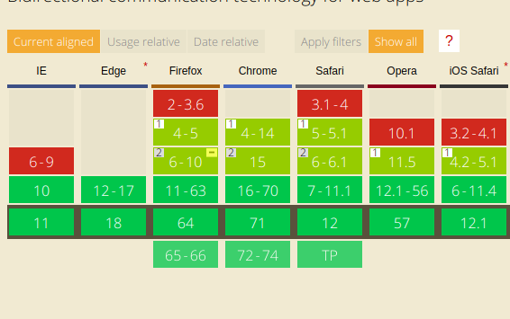

# 有关实时通讯协议的资料

目前的实时传输页面的技术手段主要时两种:

* 长轮询(以socketio为代表)
* WebSocket

下面分别从前端和后端的技术栈进行说明

## 后端

对于实现框架而言, 在python下面主要有2类:

### WebSocket类框架

这一类框架主要是依赖WebSocket协议通讯.由于WebSocket现在已成为浏览器标准.所以主流的浏览器对WebSocket基本不存在兼容性问题(除了 Opera mini 浏览器).这类的框架的代表是:

* Tornado  [官网](http://www.tornadoweb.org/en/stable/)
* Sanic  [官网](https://sanic.readthedocs.io/en/latest/)
* AioHttp [官网](https://aiohttp.readthedocs.io/en/stable/)

### 基于SocketIO的扩展

SocketIO在 WebSocket协议未出现之前,就依靠长轮询技术实现了页面间的实时通讯.在WebSocket出现以后. 也加入了对WebSocket的支持,在主流的python Web框架上,基本都实现了SocketIO的扩展,比如:

* 基于django框架的django-socketio [文档](https://django-socketio.readthedocs.io/en/latest/)
* 基于flask框架的flask-socketio  [文档](https://flask-socketio.readthedocs.io/en/latest/)

基于SocketIO的扩展一般支持websocket和长轮询两种方式进行通讯.在使用长轮询时,老的xp系统上都可以运行的很好.但通讯效率上不如websocket,而且资源消耗较高.

## 前端

针对长轮询和websocket,前端支持的方式也略有不同.

### 标准WebSocket前端支持

现代的浏览器都支持websocket协议. 



如果不依赖任何插件和扩展. 使用websocket的方法如下:

```javascript

// 新建一个websocket客户端
var ws = new WebSocket("ws://localhost:9998/echo");
ws.onmessage = function (evt) 
               { 
                   // 当接收到消息的时候,会触发此函数
                  var received_msg = evt.data;
                  alert("数据已接收...");
               };

ws_client_price.onerror = function (evt) {console.log("ws客户端连接出错");};

ws_client_price.onopen = function (evt) {console.log("welcome");};

var message = {"hello": "world"};
ws.send(JSON.stringify(message));  // 发送消息
```

上述方案的缺点就是断线的时候需要重新连接.网上有一个自动重连的脚本. 下载下来后在页面引入

```javascript
var ws = new ReconnectingWebSocket("ws://localhost:9998/echo");
// 这个ws对象会在断线的时候自动连接
```

### socketio的js客户端

socketio的客户端需要额外引入一个脚本.然后方法和上面的类似:

```javascript
var socket = io.connect('ws://' + document.domain + ':' + location.port);
```

两个脚本的下载地址:
[reconnecting-websocket.min.js + socket.io.js](https://pan.baidu.com/s/1RYvpImNRVK-O6SWTC2r-cw)

