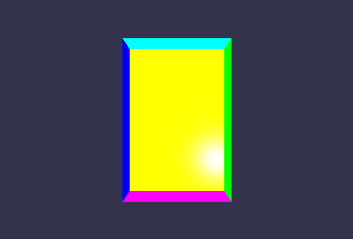

# babylon.js入门日记系列

Babylon是左手坐标系. x, y, z应该这样判断: 把左手的拇指和食指比成L的形状.中指和食指垂直指向自己. 这样拇指,食指和中指指向的方向就分别是x, y, z.

## 第二篇 形状(初级)

这一章,我们来了解一下Babylon创建形状的基本方法

### 抽象工厂

class **BABYLON.MeshBuilder**

创建形状的工厂类,可以看出这个类使用的是抽象工厂的设计方法. 这个类可以创建的形状如下:

* CreateBox  盒子
* CreateCylinder 圆柱
* CreateDashedLines 虚线
* CreateDecal
* CreateDisc 盘子
* CreateGround (平的)地面
* CreateGroundFromHeightMap 起伏不平的地面
* CreateIcoSphere
* CreateLathe
* CreateLineSystem
* CreateLines
* CreatePlane
* CreatePolygon
* CreatePolyhedron
* CreateRibbon
* CreateSphere 球
* CreateTiledGround
* CreateTorus
* CreateTorusKnot
* CreateTube
* ExtrudePolygon
* ExtrudeShape
* ExtrudeShapeCustom

我们创建形状的工具就是上面这个类. 调用的方法就是

> var shape = BABYLON.MeshBuilder.Create Shape（名称，选项，场景）

### CreateBox 盒子

```javascript
var box = BABYLON.MeshBuilder.CreateBox("box", opts, scene);
```

创建一个形状需要三个参数:

1. 名称 一个字符串对象,用来标识一个形状对象
2. 选项 一个键值对对象.每一个键值对的值都是用来调整/设置形状的参数.
3. 场景 一个场景(BABYLON.Scene)对象.也就是你创建的形状是处于哪个场景中的?

其中,选项中可以定义的参数很多, 下面举例说明,注意不一定只有这么多,有些形状有特殊的参数.

|选项名|说明|默认值|
|:-:|:-:|:-:|
|size(尺寸)|数字类型,相当于同时设置长宽高|1|
|height(高)|数字类型,设置高度|默认值就是size的值|
|width(宽)|数字类型,设置宽度|默认值就是size的值|
|depth(深)|数字类型,设置深度|默认值就是size的值|
|faceColors(面的颜色)|Color4的实例对象的数组,用来设置每个面的颜色,我们目前介绍的是一个盒子的面的颜色,盒子是溜面体,所以需要6个Color4对象来组成这个数组|默认值每个面都是Color4（1,1,1,1）<br>*后面会介绍Color4类*|
|faceUV(面的UV)|Vector4的数组,同上,也是每个面一个.|默认值每个面都是Vs(0, 0, 1, 1)|
|updatable(能否更新)|布尔类型,创建后是否还能修改这个形状|false|
|sideOrientation(边的方向)|数字类型,设置哪个面朝外|默认值默认的边值|

class **Color4**

颜色对象,有四个参数.分别是红(red),绿(green),蓝(blue)和透明度(alpha). 类似于RGBA.*我们在CSS和HTML中定义的RGB三原色的分量的值是0到255, A的值是0到1;Color4这里,RGBA四个参数的值都是0到1.*,注意,上面斜体字是引用官方文档的,实测和我们平时的RGBA没有区别.估计可能是文档工作人员拷贝复制顺了.

```javascript
var color = new Color4(red, green, blue, alpha);
```

class **Vector4**

矢量对象.有四个参数: x, y, z和w.

```javascript
var v = new Vector(x, y, z, w);
```

**faceColors**的顺序

faceColors分别对应6个面. 默认情况下(不设值sideOrientation的值)这六个面的顺序是这样的.

* 左手坐标系.中指(z)垂直画布指向外. 盒子就摆放在和z垂直的平面上
* 面的顺序是这样的,朝向我们的是第一面,背向我们的是第二面,正上方的是第三面, 从第三面开始,顺时针旋转,依次是第四面,第五面和第六面.
* [+z, -z, +y, -x, -y, +x]

****的值

简单的说,就是哪一面朝外,有3个值可选

* BABYLON.Mesh.FRONTSIDE (default 正面(默认序号为1的面)朝外)  
* BABYLON.Mesh.BACKSIDE (背面(默认序号为2的面)朝外)
* BABYLON.Mesh.DOUBLESIDE  (这个选项不知道什么含义)

例子(部分,场景相关的代码在前面的例子用有)

```javascript
        var c1 = new BABYLON.Color4(255, 0, 0, 0.5);  // 红
        var c2 = new BABYLON.Color4(255,255,0, 1);  // 黄
        var c3 = new BABYLON.Color4(0, 0, 255, 1);  // 蓝
        var c4 = new BABYLON.Color4(0, 255, 0, 1);  // 绿
        var c5 = new BABYLON.Color4(0, 255, 255, 1);  // 青
        var c6 = new BABYLON.Color4(255, 0, 255, 1);  // 洋红
        var v1 = new BABYLON.Vector4(1, 1, 1, 1);
        var opts = {
            height: 3, width: 2, depth: 1,
            faceColors: [c1, c2, c3, c4, c5, c6],
            faceUV:[v1, v1, v1, v1, v1, v1],
            sideOrientation: BABYLON.Mesh.BACKSIDE
            };
        var box = BABYLON.MeshBuilder.CreateBox("myBox", opts, scene);
```



### CreateSphere 球

|选项名|说明|默认值|
|:-:|:-:|:-:|
|segments(段)|数字类型,水平段的数量|32|
|diameter(直径)|数字类型,相当于同时设置XYZ|1|
|diameterX(X)|数字类型,设置X轴直径|diameter|
|diameterY(Y)|数字类型,设置Y轴直径|diameter|
|diameterZ(Z)|数字类型,设置Z轴直径|diameter|
|arc(弧)|数字类型,圆周比,0到1之间的浮点数|1|
|slice(切片)|数字类型,高度比,0到1之间的浮点数|1|
|updatable(能否更新)|布尔类型,创建后是否还能修改这个形状|false|
|sideOrientation(边的方向)|数字类型,设置哪个面朝外|默认值默认的边值|