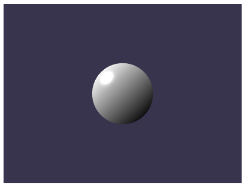

# babylon.js入门日记系列

一直就有一个给宝宝写游戏的念头.百度一番.选了这个babylon.js(巴比伦).先说好,游戏开发方面我是啥也不会, 要是把你带沟里去了,你也别介意.好了,说干就干,开始.........

## 第一篇 介绍,安装和hello world

### babylon.js是什么?

babylon.js是一个完整的JavaScript框架，用于构建HTML5，WebGL，WebVR和Web Audio的3D游戏和体验. 除了游戏用来在页面实现一些3D场景也是没问题的.[官网](https://www.babylonjs.com) 

### 环境搭建

Babylon 环境相对简单,只需要引入三个脚本文件即可

* babylon.js  主程序脚本
* babylonjs.loaders   扩展对GILF等3D文件的支持(方便你把3D软件中建立的模型导入)
* pep.js   统一不同浏览器上指针操作

#### 下载脚本

babylon是可以定制的,从最简单的实现基本的功能到具备完善的材质和碰撞检测.你可以在bablon的官方网站自定义的下载他们. 如果你选择了一些组建,那么你下载下来的名字很可能就是babylon.custom.js 注意,全功能的版本超过1m的大小.

#### 辅助脚本

除了主程序之外,你还需要2个辅助的脚本.他们也都很有用处

##### babylonjs.loaders

babylonjs.loaders用于增加对3D文件的支持.也就是支持像GLTF(GL TransmissionFormat/图形语言交换格式)这样的文件. 以便于支持3D模型的数据交换.作为GLTF的入门了解,你可以看一篇国内的文章[GLTF——3D图形界的JPEG](https://cloud.tencent.com/developer/news/204942)

```html
<link rel="stylesheet" href="/xxx.min.css">
<script src="https://preview.babylonjs.com/babylon.js"></script>
<script src="https://preview.babylonjs.com/loaders/babylonjs.loaders.min.js"></script>
<script src="https://code.jquery.com/pep/0.4.3/pep.js"></script>
```

##### pep.js

pep.js是一个管理指针事件的脚本,用途是统一指针事件在不同浏览器上的表现,要知道,这是个吃力不讨好,而且维护工作量巨大的事情.你应该尽早让这个脚本载入, 一般把这个脚本放在头部头部,css区域的下面.[pep.js的仓库](https://github.com/jquery/PEP#readme)

```html
<link rel="stylesheet" href="/xxx.min.css">
<script src="https://code.jquery.com/pep/0.4.3/pep.js"></script>
```

pep脚本也可以和jQuery一起使用, 你应当把pep脚本放在jquery脚本之前

```html
<link rel="stylesheet" href="/xxx.min.css">
<script src="https://code.jquery.com/pep/0.4.3/pep.js"></script>
<script src="jquery.js"></script>
```

说实话,这几个脚本的网站的链接速度都不太好.所以我还是强烈建立你下载到本地会比较好.就像这样:

```html
<link rel="stylesheet" href="/xxx.min.css">
<script src="js/babylon.custom.js"></script>
<script src="js/babylonjs.loaders.min.js"></script>
<script src="js/pep.js"></script>
```

### hello world

程序员的开场白. hello world
下面是一demo程序.为了方便演示.代码我都写在html中了.注意看注释. 建议你使用遵守W3C规范的浏览器.(chrome,firefox等)

```html
<!DOCTYPE html>
<html lang="zh-cn">
<head>
    <meta charset="UTF-8">
    <meta name="viewport" content="width=device-width, initial-scale=1.0">
    <meta http-equiv="X-UA-Compatible" content="ie=edge">
    <link rel="stylesheet" href="css//index.css">
    <script src="js/babylon.custom.js"></script>
    <script src="js/babylonjs.loaders.min.js"></script>
    <script src="js/pep.js"></script>
    <title>Document</title>
</head>
<style>
body{
    display: flex;
    flex-direction: flex-star;
    justify-content: center;
    align-items: center;
}
#show1{
    width: 400px;
    height: 300px;
}
</style>
<body>
    <!--必须是canvas元素,不能是div之类的其他元素-->
    <canvas id="show1" touch-action="none"></canvas>
</body>
<script>
    var canvas = document.getElementById("show1");  // 创建画布
    var engine = new BABYLON.Engine(canvas, true);  // 创建渲染引擎

    var create_scene = function(){
        // 创建一个场景并返回
        var scene = new BABYLON.Scene(engine);     // 创建场景
        /* 创建一个弧形旋转摄像机. 参数说明如下:
         * "Camera":  摄像机名称
         * 第一个 Math.PI / 2 : alpha, 可以理解为水平角度.具体请看文档 
         * 第二个 Math.PI / 2 : beta, 可以理解为垂直角度.具体请看文档 
         * 2: radius, 这个是半径的意思.
         * new BABYLON.Vector3(0, 0, 5) : target position.目标点的三维位置,可以理解为中心.这是一个向量类的实例
         * scene: scene,场景变量.
         * 详细文档请看这里: 看着图比较好理解的.https://doc.babylonjs.com/babylon101/cameras#arc-rotate-camera
        */
        var camera = new BABYLON.ArcRotateCamera("Camera", Math.PI / 2, Math.PI / 2, 2, new BABYLON.Vector3(0, 0, 5), scene);
        /* 让摄像机控制画布.
         * canvas: element 是一个dom对象.
         * true: noPreventDefault 是否阻止元素的默认事件.
         * api: https://doc.babylonjs.com/api/classes/babylon.targetcamera
        */
        camera.attachControl(canvas, true);
        /* 创建2个光源. HemisphericLight是半球形光源.PointLight是点光源.
         * 第一个参数: name. 名字.
         * 第二个参数: direction, 方向,是一个向量的实例.
         * 第三个参数: scene, 场景.
         * api: https://doc.babylonjs.com/api/classes/babylon.hemisphericlight#constructor
        */
        var light1 = new BABYLON.HemisphericLight("light1", new BABYLON.Vector3(1, 1, 0), scene);
        var light2 = new BABYLON.PointLight("light3", new BABYLON.Vector3(0, 1, -1), scene);
        /* 创建一个球形的控制网格. options参数,请看api
         * 第一个参数 name: 字符串, 名字
         * 第二个参数 options: object, 参数对象.
         * 第三个参数 scene: 场景
         * api: https://doc.babylonjs.com/api/classes/babylon.meshbuilder#createsphere
        */
        var sphere = BABYLON.MeshBuilder.CreateSphere("sphere", {diameter: 2}, scene);
        return scene;
    };
    
    var scene = create_scene();
    /* 不停的渲染场景.
     * runRenderLoop 是一个渲染循环.
     * api: https://doc.babylonjs.com/api/classes/babylon.engine#runrenderloop
    */
    engine.runRenderLoop(function(){
        scene.render();  // 渲染场景
    });

    window.addEventListener("resize", function(){
        engine.resize();
    });

</script>
</html>
```

如果不出问题的话,会出现以下和谐画面:



如果没有,请打开你的控制台(一般是按F12),查看出错原因.