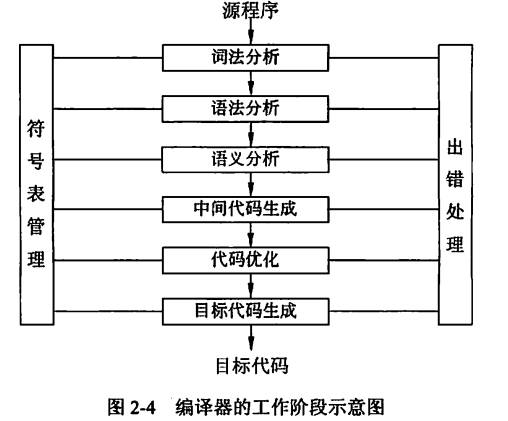
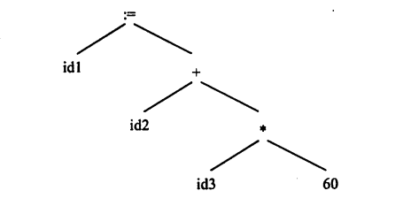

# 第二章 程序设计语言基础知识

## 程序设计与呀概述

### 程序设计语言基本概念

#### 低级语言和高级语言

##### 低级语言

> 机器语言和汇编语言称为低级语言

##### 高级语言

> 除低级语言之外的，功能更强，抽象级别更高的语言，称为高级语言


###### 要点

* 计算机只能识别由0和1组成的**指令**序列．（机器指令的序列称为机器指令程序）
* 机器指令是最基本的语言
* 用助记符表示的指令称为汇编指令，汇编指令的集合称为汇编语言
* 如果某一种语言不依赖于计算机的硬件,则称为高级语言.
* 高级语言接近于人类语言
  
#### 编译和解释

由于计算机只能识别机器指令序列，所以高级语言需要一个翻译．翻译语言的方式主要分为：

* 汇编
* 解释
* 编译

三种

在翻译的过程中，主要涉及以下几个概念：

* 源程序　*用某种高级语言书写的程序称为源程序，由于计算机只能识别机器指令序列，因此源程序无法直接执行*
* 汇编（这里指的是翻译方式而不是汇编语言）　*把汇编语言的源程序翻译成机器指令的过程称为汇编*
* 解释器　*把源程序翻译成机器指令的程序成为解释器，解释器有２种只要的工作方式：　１．翻译　２．编译*
* 编译　*解释器把源程序翻译成和源程序等价的可独立保存的目标程序，然后交由计算机执行．源程序和解释器<span style='color: red'>不参与程序的执行过程</span>*
* 翻译　*解释器把源程序一段一段翻译成等价的目标代码，然后交由计算机执行，程序运行的控制权在解释器，源程序和解释器<span style='color: red'>全程参与程序的执行过程</span>*

##### 第二小节会详细讲解汇编程序,编译程序和解释程序

#### 程序设计语言的定义

一般来说程序设计语言的定义涉及**语法，语义**,**语用**,**语境**等多个方法

* **语法** 语言中的基本符号，关键词及相关的规则称为语法
* **语义**按照语法构成的句子和段落所表达的含义称为语义．语义分为　*静态语义*和*动态语义*
> * 编译时可确定的含义称为静态语义
> * 运行时才能确定的含义成为动态语义

* 语用表示特定语境(上下文中)符号和使用者之间的关系,包括符号的来源,使用的方式和真实意图.
* 语境是指语言的理解和实现的环境,包含编译环境和运行环境.

#### 程序设计语言的分类

程序设计语言有交流算法和计算机实现的双重目的.

* 如果某一种语言不依赖于计算机的硬件,则称为高级语言.
* 如果某一种语言能够用范围广泛的问题求解过程中,则称为**通用**程序设计语言

程序设计语言没有统一的分类标准,一般根据程序语言设计程序的方法把程序语言分为:

* **命令式程序设计语言/结构化程序设计语言**.典型代表:Fortran, Pascal, C等,在这种语言中:.计算被看成是动作的序列./结构化程序设计语言页属于命令式程序设计语言. 其结构化特性表现为: 
> * 自顶至下逐步精化的方法编程
> * 按模块组装的方法编程
> * 程序只包含顺序,判断和循环构造.而且每种构造只允许单入口和单出口.
> * 结构简单清晰,模块化强
* **面向对象的程序设计语言** (比命令式程序设计语言)抽象化机制更高的语言.典型代表:C++, Java,SmalTalk等.典型的面向对象的程序设计语言的技术包括: 数据隐藏,数据抽象, 用户定义类型, 类, 继承和多态等.
* **函数式程序设计语言** 以λ(lambda)演算为基础的语言.典型代表:LISP, Haskell等, 特点是对于表达式中出现的任何函数豆可以用其他函数来代替,只要这些函数调用产生相同的值.(比如LISP中,程序和数据是等价的:数据结构可以作为程序执行,程序也可以作为数据被修改,LISP中大量的使用递归)
* **逻辑型程序设计语言** 以形式逻辑为基础的语言.典型代表:Prolog.Prolog有很强的推理功能,适合数学自动定理证明,专家系统和自然语言理解等方面的程序.

### 程序语言的基本成分

程序语言的基本成分包含:**数据,运算,控制**和**传输**等

#### 数据

程序的数据成分表示了程序中值的组织形式,数据是程序的操作对象,具有**存储类别,类型,名称,作用域,生存期**等属性.使用时需要未它**分配内存空间**.

* **存储类别**说明数据在内存中的位置和生存期
* **类型**说明数据占用内存的大小和存放形式
* **名称**用于标识数据
* **作用域**说明了可以使用数据的代码范围
* **生存期**说明了数据占用内存的时间范围

常量和变量

* 程序运行时,数据的值能改变的叫变量,不能改变的叫常量
* 变量既有左值又有右值,常量只有右值.

全局变量和局部变量

按照作用域范围,数据可分为全局变量和局部变量,系统为全局变量分配的存储空间在程序运行中一般不改变,二为局部变量分配的存储单元是动态改变的.

数据按照组织形式可分为: **基本类型,用户定义类型,构造类型, 其他类型**

#### 运算

程序的运算成分指明语言允许使用的运算符号和运算规则. 大多数语言的基本运算可以分为:**算术运算,关系运算,逻辑运算, 位运算**等. 运算符号的使用和**数据类型**密切相关, 为了明确运算结果,运算符号需要规定**优先级**和**结合性**,必要的时候使用圆括号.

#### 控制

程序的控制成分指明语言允许表述的控制结构.程序员使用控制成分来构造程序中的控制逻辑.可计算问题的程序都可以用**顺序,选择,循环**这三种控制结构来描述.

#### 传输

程序的传输成分指明语言允许的数据传输方式,比如**赋值处理,数据的输入和输出**等.

### 函数

C语言的程序由函数组成,每个函数都有自己的名字,有且仅有一个main函数作为程序运行的起点.函数是于端具有独立功能的程序. 函数的使用涉及三个概念:**函数定义,函数声明,函数调用**

#### 函数的定义

函数的定义包含:**函数首部**和**函数体**.函数的定义描述了函数做什么和怎么做.函数定义的一般格式如下:

```C
返回值的类型 函数名(形式参数的列表)   // 函数的首部
{
    函数体;
    ....
}
```

>C和C++的函数都必须独立定义,不允许嵌套定义函数

#### 函数的声明

函数应该先声明后引用.如果程序中,对一个函数的调用在该函数的定义之前,那么应该在调用之前对被调用的函数进行声明.函数原型用于声明函数.函数声明的一般形式:

```C
返回值的类型 函数名(参数类型列表);

```
> 使用函数原型的目的在于告诉编译器传递给函数的参数的个数,类型,以及函数本身返回值的类型.参数列表中仅需要一次列出函数定义是参数的类型.函数原型可以让编译器更彻底的检查源程序中对函数的调用是否正确

#### 函数的调用

函数调用的一般形式为:

```C
函数名(实际参数列表);
```
> C和C++通过传值的方式将实际参数传递给形式参数.函数和调用者之间交换信息的主要方法有2种: 
> 1. **函数通过返回值把运行结果返回给调用者**
> 2. **函数把运行结果附加在参数之上,调用者通过参数取回运行结果**

*函数调用自己的过程称为递归调用*

##### 值调用和引用调用

**值调用**: 如果向函数传递的是参数的值(副本),这称为传值调用.这种方式下,实际参数无法带回函数运行的信息

**引用调用**: 如果向函数传递的是参数的引用(引用是C++的新类型.C语言定义函数的时候形参必须是指针)) 这种情况下, 形参实际上是实参的别名.函数对于形参的访问和修改实际上就是对这个形参对应的实参所做的访问和修改.举例说明:

```C
// C语言
# include <stdio.h>

// 函数定义: 定义一个函数,目的是交换x和y两个参数 *为指针类型
void swap(int *x, int *y)
{
    int temp;
    temp = *x;
    *x = *y;
    *y = temp;
}

// main函数
void main(){
    int X = 5;
    int Y = 6;
    printf("X is %d\n", X);
    printf("Y is %d\n", Y);
    swap(&X,&Y);    // &用于给指针赋值
    printf("X is %d\n", X);
    printf("Y is %d\n", Y);
}
```

## 语言处理程序基础

语言处理程序用来把高级语言或者汇编语言编写的源程序翻译成某种及其语言程序.以便可以在计算机上运行.语言处理程序主要分为**汇编程序,编译程序,翻译程序**三种.

### 汇编程序基本原理

#### 汇编语言

* **汇编语言定义**: 为特定的计算机或**特定计算机系统**设计的,**面向机器**的,**符号化**的程序设计语言.
* **汇编语言源程序**: 用汇编语言写成的程序叫做汇编语言源程序.
* **汇编程序**: 用于把汇编语言**源程序**翻译成机器能直接执行的机器指令的**翻译程序**叫汇编程序.

汇编语言由若干条语句组成.汇编语言有三类语句: **指令语句, 伪指令语句, 宏指令语句**

* **指令语句**: 又称**机器指令语句**.对指令语句进行汇编后,**能生成相应的机器代码**,这些代码能够被CPU**直接识别**并执行相应的操作.基本的指令包括:**ADD,SUB,AND**等.指令语句的数学必须遵循指令的格式要求.指令语句主要包含: *传送指令,算术运算指令,逻辑运算指令,移位指令,处理机控制指令*等.
* **伪指令语句**: 伪指令语句用于指示汇编程序(翻译源程序的程序)在汇编的过程中进行某些操作(比如分配地址存储单元地址给变量, 给某个变量赋值等),但**伪指令并不会生成机器代码**.伪指令的操作是在**汇编的过程中**完成的,而指令的操作必须在**程序运行时**完成.
* **宏指令语句**: 用户可以**将一段程序定义为宏多此重复使用**.宏必须有响应的宏名. 宏指令语句就是宏的引用.

#### 汇编程序

汇编程序用于把汇编语言**源程序**翻译成机器能直接执行的机器指令.由于汇编语言指令中形成操作数地址的部分可能出现后面才有定义的符号,所以汇编程序一般需要**两次**扫描源程序才能完成翻译过程.

##### 第一次扫描源程序

主要任务是记录所有的符号和地址.

###### 特殊概念

* **标号**： 汇编语言中的标号是值一段地址的快捷入口，当你需要读取一个标号代表的地址的时候，只需要调用这个标号的名字即可。同样，在汇编的时候，看到一个标号，你就需要给他赋予一个专用的地址的值

###### 准备

* **机器指令表１(MOT1)**: 一个针对硬件的的表格．上面记录了该种硬件的计算机的每条机器指令的*助记码和指令长度*．
* **创建符号表ST(Symbol table)**：用来记录定义符号的值.ST记录了汇编操作时遇到的所有符号的值.
* **设立伪指令表POT1(Pseudo instruction Operation Table)**: 表中每一个元素有两个值域.分别是伪指令的助记符和对应的子程序的入口地址.
* **设立位置/单元地址计数器LC(Location Counter))**, 为了计算和记录各汇编语句标号(程序需要跳转的地址的标识)的地址。其初始值一般为0, 在扫描源程序时,每处理完一条**机器指令**（借助MOT1）或**与存储分配有关的伪指令**(例如定义常数语句,定义存储语句),LC的值就增加了相应的长度,这样,在汇编的过程中,LC的内容就是下一条被汇编的指令的*偏移地址*.若正在汇编的语句是有标号的, 则该标号的值就取当前LC的值

###### 工作过程

```python3
"""使用python语言,以伪代码的形式演示汇编过程中,第一次扫描源文件的过程"""

mot1 = MOT1()                                       # 初始化机器指令表MOT1,可以看成是以指令的助记码为key,指令长度为val的字典.
st = dict()                                         # 初始化符号表ST
pot1 = POST1()                                      # 初始化伪指令表POST1,伪指令表可以看作是一个伪指令助记符为key,地址入口为val的dict
lc = 0                                              # 1. 重置单元计数器LC.
with open(file_path) as f:                          # 2. open源程序文件.
    for line in f:                                  # 3. 从源程序读一行语句.
        if line is not End:                         # 4. 开始处理
            """如果当前语句不是END语句"""
            if 标号 in line:
                """
                如果当前语句有标号,就将标号和
                LC的当前值写入ST
                """
                st[标号] = lc
            if line isIn:
                """
                如果当前的语句是可执行的汇编指令,(isIn就是is instruction的意思),
                那就使用从mot1中查找对应的指令长度k,和lc相加.
                """
                k = mot1[指令助记码]
                lc += k
            if line isPI:
                """
                如果当前的语句是伪指令,(isPI就是is pseudo instruction的意思),
                则查找pos1伪指令表并调用对应的伪指令
                """
                pi = pot1[伪指令助记码]
                pi()  # 运行伪指令
            if line is Error:
                """如果这是一条错误的语句,那就调用错误处理程序"""
                try:
                    line
                except Error as e:
                    ....
                finally:
                    pass
            else:
                pass

        else:
            """如果当前语句是END语句,关闭源程序"""
            break()  # 实际上,python在with下不需要手动close文件,只需要跳出循环即可.
```

##### 第二次扫描源程序

主要任务是产生目标程序

###### 准备

* **创建符号表ST(Symbol table)**：第一次扫描时生成的符号表
* **机器指令表2(MOT2)**: 一个针对硬件的表格．上面记录了该种硬件的计算机的每条机器指令的*助记码, 指令长度,指令的二进制操作码, 指令格式*(注意和mot1相比多了操作码和指令格式)
* **伪指令表POT2(Pseudo instruction Operation Table)**: 表中每一个元素有两个值域.分别是伪指令的助记符和对应的子程序的入口地址.(和pot1的区别只是对伪指令的处理方式不同)

###### 工作过程

```python3
"""使用python语言,以伪代码的形式演示汇编过程中,第二次扫描源文件的过程"""

mot2 = MOT2()                                       # 初始化机器指令表MOT2,内含指令的二进制操作码
st                                                  # 第一次扫描时的符号表ST
pot2 = POST2()                                      # 初始化伪指令表POST2
object_program = list()                             # 初始化目标程序为空
with open(file_path) as f:                          # 2. open源程序文件.
    for line in f:                                  # 3. 从源程序读一行语句.
        if line is not End:                         # 4. 开始处理
            """如果当前语句不是END语句"""
            if line isIn:
                """
                如果当前的语句是可执行的汇编指令,(isIn就是is instruction的意思),
                那就使用从mot2中查找对应的二进制操作码.
                """
                o_code = mot2[指令助记码]                           # o_code就是operation code(操作码)的意思
                args = calculate_args()                           # 计算指令所需的参数
                machine_instruction = o_code(*args)               # 使用指令操作码和计算出的参数装配出机器指令
                object_program.append(machine_instruction)        # 组装目标程序
            if line isPI:
                """
                如果当前的语句是伪指令,(isPI就是is pseudo instruction的意思),
                第二次扫描中,伪指令的主要目的赋值和预留空间
                比如DS伪指令是预留存储空间.
                DC是向输出取送出转换得到的常量
                等等
                """
                ....  # 伪指令的操作较复杂,这里略过
            else:
                pass

        else:
            """如果当前语句是END语句,关闭源程序"""
            break()  # 实际上,python在with下不需要手动close文件,只需要跳出循环即可.
```

### 编译程序基本原理

#### 编译过程概述

编译是把某种高级语言书写的源程序翻译成等价的目标程序(汇编/机器语言)的过程. 编译器的工作过程一般可以分为:**词法分析,语法分析,语义分析,中间代码生成,代码优化,目标代码生成**6个阶段.



##### 1.词法分析

对源程序进行从上到下,从左到右逐个字符进行扫描.依据语言的**词法规则**从中分析出'单词'符号.这些'单词'包括: **关键字/保留字,标识符,常数,运算符,分隔符, 修饰符**等基本语法单位.词法分析过程输出的'单词'常以二元组方式输出.包括'单词'的种类和其自身的值.例如:

 var x, y, z: real; 
 经过词法分析就是 var id1, id2, id3: real; 
 x:=y+z\*60就表示为了id1=id2 id3*60


##### 2.语法分析

语法分析是**在词法分析的基础上**,根据语言的**语法规则**(各类语法单位的构成规则称为语法规则)将**单词符号序列**分解成各种类型的**语法单位**(例如:表达式,赋值语句等).

* 如果没有语法错误, 那就构造出**语法树**
* 如果有语法错误,那就指出语法错误并给出诊断信息.
  
*词法分析和语法分析都是对**源程序的结构**进行分析*

##### 3.语义分析

语义分析阶段主要有2大任务:

1. 检查**源程序**是否包含**静态语义错误**.因为只有**语法**和**语义**都正确的**源程序**才能被翻译成正确的目标代码
2. 进行**类型分析和检查**,收集**类型信息**供将来的代码生成阶段使用.

###### 类型分析和检查

数据类型一般包含两方面的内容:类型的载体以及其上的运算,例如: 除法不能应用在字符串类型上；取余运算只能针对整形数据.

在确认语法和语义之后,就可以对源程序进行返回并给出源程序的内部表示:

* 对于**声明语句**, 需要进行**符号表**的填查工作.详细记录符号的代号,类型和分配地址的长度.
* 对于**可执行语句**,检查其语法树,对其进行默认的类型转换等工作,所谓的语法树就是, id1:=id2+id3*60可以表示为 .
  
##### 4.中间代码生成

本阶段主要任务是根据语义分析的结果.生成一种与具体的机器无关的中间代码.比如常见的三地址码(四元形式),四元式三地址码的常见形式是:(运算符, 运算对象1, 运算对象2, 运算结果),典型的中间代码的生成如下: 
对语句 X = Y + Z * 60 可生成以下四元式子(id1=X, id2=Y, id3=Z是词法分析过程中产生的)

```python
(inttoreal, 60, -, t1)   # 运算符是类型转换,对整形60进行浮点转换,t1作为临时变量保存本步骤结果60.0
(*, id3, t1, t2)         # 运算符是乘,id3就是Z,t1就是上一步的结果60.0,t2保存id3*60.0的结果
(+, id2, t2, t3)         # 运算符是加,id2就是Y,t2是上一步的结果,t3保存id2*t2的结果
(:=, t3, -, id1)         # 运算符是赋值,,id1就是X, 把上一步的结果t3赋值给id1
```

*语义分析和中间代码生成都是依据语言的**语义规则**的.*

##### 5.代码优化

优化的过程可以在中间代码的生成阶段进行,页可以在目标代码的生成阶段进行.优化一般是建立在对程序的**控制流和数据流**分析的基础之上,**于具体的机器无关**. 优化的**依据是等价变换**规则

##### 6.目标代码生成

本阶段是编译器工作的最后一个阶段,任务是把中间代码变换成**特定机器**上的**绝对指令代码,可重定位的指令代码**或者**汇编指令代码**.

##### 符号表管理

符号表用于记录**源程序**中,各个符号的必要信息,以辅助**语义的正确性检查**和**代码生成**.在整个编译过程,需要对此表进行快读的**查找,插入,修改和删除**.
符号表的建立可以开始于**词法分析**阶段,页可以开始于**语法分析**或**语义分析**阶段.但符号表的使用有可能会延续到**目标代码运行**阶段.

##### 错误处理

用户编写的源程序出现的错误分为:**静态错误**和**动态错误**.
**动态错误**也称为动态语义错误,**发生在程序运行时**,常见的比如: *以零做除数(分母), 数组索引越界*等等.
**静态错误**是指**编译阶段**发现的程序错误.分为**语法错误**和**静态语义错误**.比如:*拼写错误, 括号不匹配, 缺少标点符号, 函数和表达式缺少变量*等语言结构上的错误称为**语法错误**.一般来说**语义分析**时发现的运算符和运算对象类型不匹配的错误术属于**静态语义错误**.
编译程序总是期望在一次编译的过程中找出更多的错误.

在逻辑上,编译器的各个阶段可以划分为**前端**和**后端**两个部分.

* **前端**包含从**词法分析至中间代码生成**阶段.也称为**与机器无关**部分.
* **后端**包括从**中间代码优化到目标代码的生成,优化**等阶段.称为**与机器有关**部分.

*前端针对不同语言,后端针对不同硬件,前后端分离.*

#### 文法和语言的形式描述

##### 字母表,字符串,字符串集合和字符串集合的运算

> 正则表达式的四种运算
> * 并
> * 连接
> * 闭包(克林闭包)
> * 正则闭包(正闭包)

* **字母表和字符**: **字母表$\sum$**是字符的非空有穷集合,**字符**是字母表$\sum$中的一个元素,即:$\sum=\{a, b, \dots\}$,a和b都是字符
* **字符串**: 字符串是字母表$\sum$中的字符组成的**有穷的序列**(字符串的长度大于等于0)
* **字符串的长度**: 字符串中字符的个数,例如: $ \mid{abc}\mid = 3$
* **空串**: 长度为零的字符串.$\mid{\epsilon}\mid=0$  ($\epsilon{}$在计算机中代表空字符串)
* **连接**: 字符串S和字符串T的链接是指将字符串T接在字符串S之后,表示为S$\cdot$T,链接符$\cdot$可以省略,写作ST.$S={S}\cdot\epsilon=\epsilon\cdot{S}$
* **$\sum^*$**: **闭包**(也称*星闭包,克林闭包,Kleene星号*)是指包含空字符串$\epsilon$在内的所有字符串的集合.
* **字符串的方幂**: 把字符串$\alpha$自身连接n次得到的字符串,称为$\alpha$的n次**方幂**,计为:$\alpha^n$,其中: $\alpha^0=\epsilon,  \alpha^{n}={\alpha^{(n-1)}*\alpha }$

###### 字符串集合的运算

A和B都是字母表$\sum$上的两个**字符串集合**

* **或(合并)**: ${A}\bigcup{B} = \{\alpha\mid\alpha\in{A}\text{或}\alpha\in{B}\}$
* **积(连接)**: ${AB}=\{\alpha\beta\mid\alpha\in{A}\text{且}\beta\in{B}\}$
* **幂**: ${A}^{n}={A}\cdot{A}^{n-1}={A}^{n-1}\cdot{A}\:(n>0), \text{并规定} A^0=\{\epsilon\}$
* **正则闭包$A^+$**: 也称*正闭包*,由闭包的概念衍生而来.$A^+=A^1\bigcup{A}^2\bigcup{A}^{3}\dots$
* **闭包$A^*$**: 也称*星闭包,克林闭包*,$A^*=A^0\bigcup{A}^+$

##### 文法和语言的形式描述

###### 预备知识

1. 图灵机
> 图灵机是一种抽象计算模型:
> 1. 一根无限长度的纸带,纸带被分为一个个小的方格,每个方格代表着一个值或者一个存储值的空间.
> 2. 

**语言的定义**: 语言L是有限字母表$\sum$上有限长度字符串的集合. 这个集合(指的是语言L)中的每个字符串都是按照一定的规则生成的.
**产生语言**: 产生语言是指制定出有限个规则,借助这些规则产生出此语言的全部句子.

**文法**: 描述语言的**语法结构的形式规则**称为文法.文法G是一个四元组 $G=(V_N, V_T, P, S)$,其中:

* **$V_N$**: 非终结符(这里的N指的是not null/非空).$\varnothing={V}_{N}\bigcap{V}_{T}$
* **$V_T$**: 终结符(这里的T指的是 treminal/终端).$\varnothing={V}_{N}\bigcap{V}_{T}$
* **$V$**: 文法G的词汇表,包含文法G的所有词汇.${V}={V}_{N}\bigcup{V}_{T}$
* **$P$**: 产生式(这里的P指的是 produce/产生)的有限集合.产生式形如$\alpha\rightarrow\beta$,其中$\alpha$称为产生式的左部,$\alpha\in{V}^+ $并且$\alpha$中至少包含一个非终结符,$\beta$称为产生式的右部.且$\beta\in{V}^*$
* **候选式**: 如果若干个产生式$\alpha\rightarrow\beta_1, \  \alpha\rightarrow\beta_2 \ \alpha\rightarrow\beta_3 \dots \ \alpha\rightarrow\beta_n $的左部如果相同,可以简写为$\alpha\rightarrow\beta_{1}\mid\beta_{2}\mid\beta_{3}\mid\dots\mid\beta_{n}$,这时候我们把$\beta_i(1\le{i}\le{n})$称为$\alpha$的一个**候选式**
* **$S$**: 开始符号(这里的S指的是 start/开始),S至少要在一条产生式中作为**左部**出现.${S}\in{V}_{N}$

##### 文法的分类

对于语言的产生式施加不同的限制,就形成了不同的文法,文法共: *0型,1型,2型,3型*四种.