# 第二章 程序设计语言基础知识

## 程序设计与呀概述

### 程序设计语言基本概念

#### 低级语言和高级语言

##### 低级语言

> 机器语言和汇编语言称为低级语言

##### 高级语言

> 除低级语言之外的，功能更强，抽象级别更高的语言，称为高级语言


###### 要点

* 计算机只能识别由0和1组成的**指令**序列．（机器指令的序列称为机器指令程序）
* 机器指令是最基本的语言
* 用助记符表示的指令称为汇编指令，汇编指令的集合称为汇编语言
* 如果某一种语言不依赖于计算机的硬件,则称为高级语言.
* 高级语言接近于人类语言
  
#### 编译和解释

由于计算机只能识别机器指令序列，所以高级语言需要一个翻译．翻译语言的方式主要分为：

* 汇编
* 解释
* 编译

三种

在翻译的过程中，主要涉及以下几个概念：

* 源程序　*用某种高级语言书写的程序称为源程序，由于计算机只能识别机器指令序列，因此源程序无法直接执行*
* 汇编（这里指的是翻译方式而不是汇编语言）　*把汇编语言的源程序翻译成机器指令的过程称为汇编*
* 解释器　*把源程序翻译成机器指令的程序成为解释器，解释器有２种只要的工作方式：　１．翻译　２．编译*
* 编译　*解释器把源程序翻译成和源程序等价的可独立保存的目标程序，然后交由计算机执行．源程序和解释器<span style='color: red'>不参与程序的执行过程</span>*
* 翻译　*解释器把源程序一段一段翻译成等价的目标代码，然后交由计算机执行，程序运行的控制权在解释器，源程序和解释器<span style='color: red'>全程参与程序的执行过程</span>*

##### 第二小节会详细讲解汇编程序,编译程序和解释程序

#### 程序设计语言的定义

一般来说程序设计语言的定义涉及**语法，语义**,**语用**,**语境**等多个方法

* **语法** 语言中的基本符号，关键词及相关的规则称为语法
* **语义**按照语法构成的句子和段落所表达的含义称为语义．语义分为　*静态语义*和*动态语义*
> * 编译时可确定的含义称为静态语义
> * 运行时才能确定的含义成为动态语义

* 语用表示特定语境(上下文中)符号和使用者之间的关系,包括符号的来源,使用的方式和真实意图.
* 语境是指语言的理解和实现的环境,包含编译环境和运行环境.

#### 程序设计语言的分类

程序设计语言有交流算法和计算机实现的双重目的.

* 如果某一种语言不依赖于计算机的硬件,则称为高级语言.
* 如果某一种语言能够用范围广泛的问题求解过程中,则称为**通用**程序设计语言

程序设计语言没有统一的分类标准,一般根据程序语言设计程序的方法把程序语言分为:

* **命令式程序设计语言/结构化程序设计语言**.典型代表:Fortran, Pascal, C等,在这种语言中:.计算被看成是动作的序列./结构化程序设计语言页属于命令式程序设计语言. 其结构化特性表现为: 
> * 自顶至下逐步精化的方法编程
> * 按模块组装的方法编程
> * 程序只包含顺序,判断和循环构造.而且每种构造只允许单入口和单出口.
> * 结构简单清晰,模块化强
* **面向对象的程序设计语言** (比命令式程序设计语言)抽象化机制更高的语言.典型代表:C++, Java,SmalTalk等.典型的面向对象的程序设计语言的技术包括: 数据隐藏,数据抽象, 用户定义类型, 类, 继承和多态等.
* **函数式程序设计语言** 以λ(lambda)演算为基础的语言.典型代表:LISP, Haskell等, 特点是对于表达式中出现的任何函数豆可以用其他函数来代替,只要这些函数调用产生相同的值.(比如LISP中,程序和数据是等价的:数据结构可以作为程序执行,程序也可以作为数据被修改,LISP中大量的使用递归)
* **逻辑型程序设计语言** 以形式逻辑为基础的语言.典型代表:Prolog.Prolog有很强的推理功能,适合数学自动定理证明,专家系统和自然语言理解等方面的程序.

### 程序语言的基本成分

程序语言的基本成分包含:**数据,运算,控制**和**传输**等

#### 数据

程序的数据成分表示了程序中值的组织形式,数据是程序的操作对象,具有**存储类别,类型,名称,作用域,生存期**等属性.使用时需要未它**分配内存空间**.

* **存储类别**说明数据在内存中的位置和生存期
* **类型**说明数据占用内存的大小和存放形式
* **名称**用于标识数据
* **作用域**说明了可以使用数据的代码范围
* **生存期**说明了数据占用内存的时间范围

常量和变量

* 程序运行时,数据的值能改变的叫变量,不能改变的叫常量
* 变量既有左值又有右值,常量只有右值.

全局变量和局部变量

按照作用域范围,数据可分为全局变量和局部变量,系统为全局变量分配的存储空间在程序运行中一般不改变,二为局部变量分配的存储单元是动态改变的.

数据按照组织形式可分为: **基本类型,用户定义类型,构造类型, 其他类型**

#### 运算

程序的运算成分指明语言允许使用的运算符号和运算规则. 大多数语言的基本运算可以分为:**算术运算,关系运算,逻辑运算, 位运算**等. 运算符号的使用和**数据类型**密切相关, 为了明确运算结果,运算符号需要规定**优先级**和**结合性**,必要的时候使用圆括号.

#### 控制

程序的控制成分指明语言允许表述的控制结构.程序员使用控制成分来构造程序中的控制逻辑.可计算问题的程序都可以用**顺序,选择,循环**这三种控制结构来描述.

#### 传输

程序的传输成分指明语言允许的数据传输方式,比如**赋值处理,数据的输入和输出**等.

### 函数

C语言的程序由函数组成,每个函数都有自己的名字,有且仅有一个main函数作为程序运行的起点.函数是于端具有独立功能的程序. 函数的使用涉及三个概念:**函数定义,函数声明,函数调用**

#### 函数的定义

函数的定义包含:**函数首部**和**函数体**.函数的定义描述了函数做什么和怎么做.函数定义的一般格式如下:

```C
返回值的类型 函数名(形式参数的列表)   // 函数的首部
{
    函数体;
    ....
}
```

>C和C++的函数都必须独立定义,不允许嵌套定义函数

#### 函数的声明

函数应该先声明后引用.如果程序中,对一个函数的调用在该函数的定义之前,那么应该在调用之前对被调用的函数进行声明.函数原型用于声明函数.函数声明的一般形式:

```C
返回值的类型 函数名(参数类型列表);

```
> 使用函数原型的目的在于告诉编译器传递给函数的参数的个数,类型,以及函数本身返回值的类型.参数列表中仅需要一次列出函数定义是参数的类型.函数原型可以让编译器更彻底的检查源程序中对函数的调用是否正确

#### 函数的调用

函数调用的一般形式为:

```C
函数名(实际参数列表);
```
> C和C++通过传值的方式将实际参数传递给形式参数.函数和调用者之间交换信息的主要方法有2种: 
> 1. **函数通过返回值把运行结果返回给调用者**
> 2. **函数把运行结果附加在参数之上,调用者通过参数取回运行结果**

*函数调用自己的过程称为递归调用*

##### 值调用和引用调用

**值调用**: 如果向函数传递的是参数的值(副本),这称为传值调用.这种方式下,实际参数无法带回函数运行的信息

**引用调用**: 如果向函数传递的是参数的引用(引用是C++的新类型.C语言定义函数的时候形参必须是指针)) 这种情况下, 形参实际上是实参的别名.函数对于形参的访问和修改实际上就是对这个形参对应的实参所做的访问和修改.举例说明:

```C
// C语言
# include <stdio.h>

// 函数定义: 定义一个函数,目的是交换x和y两个参数 *为指针类型
void swap(int *x, int *y)
{
    int temp;
    temp = *x;
    *x = *y;
    *y = temp;
}

// main函数
void main(){
    int X = 5;
    int Y = 6;
    printf("X is %d\n", X);
    printf("Y is %d\n", Y);
    swap(&X,&Y);    // &用于给指针赋值
    printf("X is %d\n", X);
    printf("Y is %d\n", Y);
}
```

## 语言处理程序基础

语言处理程序用来把高级语言或者汇编语言编写的源程序翻译成某种及其语言程序.以便可以在计算机上运行.语言处理程序主要分为**汇编程序,编译程序,翻译程序**三种.

### 汇编程序基本原理

#### 汇编语言

* **汇编语言定义**: 为特定的计算机或**特定计算机系统**设计的,**面向机器**的,**符号化**的程序设计语言.
* **汇编语言源程序**: 用汇编语言写成的程序叫做汇编语言源程序.
* **汇编程序**: 用于把汇编语言**源程序**翻译成机器能直接执行的机器指令的**翻译程序**叫汇编程序.

汇编语言由若干条语句组成.汇编语言有三类语句: **指令语句, 伪指令语句, 宏指令语句**

* **指令语句**: 又称**机器指令语句**.对指令语句进行汇编后,**能生成相应的机器代码**,这些代码能够被CPU**直接识别**并执行相应的操作.基本的指令包括:**ADD,SUB,AND**等.指令语句的数学必须遵循指令的格式要求.指令语句主要包含: *传送指令,算术运算指令,逻辑运算指令,移位指令,处理机控制指令*等.
* **伪指令语句**: 伪指令语句用于指示汇编程序(翻译源程序的程序)在汇编的过程中进行某些操作(比如分配地址存储单元地址给变量, 给某个变量赋值等),但**伪指令并不会生成机器代码**.伪指令的操作是在**汇编的过程中**完成的,而指令的操作必须在**程序运行时**完成.
* **宏指令语句**: 用户可以**将一段程序定义为宏多此重复使用**.宏必须有响应的宏名. 宏指令语句就是宏的引用.

#### 汇编程序

汇编程序用于把汇编语言**源程序**翻译成机器能直接执行的机器指令.由于汇编语言指令中形成操作数地址的部分可能出现后面才有定义的符号,所以汇编程序一般需要**两次**扫描源程序才能完成翻译过程.

##### 第一次扫描源程序

主要任务是记录所有的符号和地址.

###### 特殊概念

* **标号**： 汇编语言中的标号是值一段地址的快捷入口，当你需要读取一个标号代表的地址的时候，只需要调用这个标号的名字即可。同样，在汇编的时候，看到一个标号，你就需要给他赋予一个专用的地址的值

###### 准备

* **机器指令表１(MOT1)**: 一个针对硬件的的表格．上面记录了该种硬件的计算机的每条机器指令的*助记码和指令长度*．
* **创建符号表ST(Symbol table)**：用来记录定义符号的值.ST记录了汇编操作时遇到的所有符号的值.
* **设立伪指令表POT1(Pseudo instruction Operation Table)**: 表中每一个元素有两个值域.分别是伪指令的助记符和对应的子程序的入口地址.
* **设立位置/单元地址计数器LC(Location Counter))**, 为了计算和记录各汇编语句标号(程序需要跳转的地址的标识)的地址。其初始值一般为0, 在扫描源程序时,每处理完一条**机器指令**（借助MOT1）或**与存储分配有关的伪指令**(例如定义常数语句,定义存储语句),LC的值就增加了相应的长度,这样,在汇编的过程中,LC的内容就是下一条被汇编的指令的*偏移地址*.若正在汇编的语句是有标号的, 则该标号的值就取当前LC的值

###### 工作过程

```python3
"""使用python语言,以伪代码的形式演示汇编过程中,第一次扫描源文件的过程"""

mot1 = MOT1()                                       # 初始化机器指令表MOT1,可以看成是以指令的助记码为key,指令长度为val的字典.
st = dict()                                         # 初始化符号表ST
pot1 = POST1()                                      # 初始化伪指令表POST1,伪指令表可以看作是一个伪指令助记符为key,地址入口为val的dict
lc = 0                                              # 1. 重置单元计数器LC.
with open(file_path) as f:                          # 2. open源程序文件.
    for line in f:                                  # 3. 从源程序读一行语句.
        if line is not End:                         # 4. 开始处理
            """如果当前语句不是END语句"""
            if 标号 in line:
                """
                如果当前语句有标号,就将标号和
                LC的当前值写入ST
                """
                st[标号] = lc
            if line isIn:
                """
                如果当前的语句是可执行的汇编指令,(isIn就是is instruction的意思),
                那就使用从mot1中查找对应的指令长度k,和lc相加.
                """
                k = mot1[指令助记码]
                lc += k
            if line isPI:
                """
                如果当前的语句是伪指令,(isPI就是is pseudo instruction的意思),
                则查找pos1伪指令表并调用对应的伪指令
                """
                pi = pot1[伪指令助记码]
                pi()  # 运行伪指令
            if line is Error:
                """如果这是一条错误的语句,那就调用错误处理程序"""
                try:
                    line
                except Error as e:
                    ....
                finally:
                    pass
            else:
                pass

        else:
            """如果当前语句是END语句,关闭源程序"""
            break()  # 实际上,python在with下不需要手动close文件,只需要跳出循环即可.
```

##### 第二次扫描源程序

主要任务是产生目标程序

###### 准备

* **创建符号表ST(Symbol table)**：第一次扫描时生成的符号表
* **机器指令表2(MOT2)**: 一个针对硬件的表格．上面记录了该种硬件的计算机的每条机器指令的*助记码, 指令长度,指令的二进制操作码, 指令格式*(注意和mot1相比多了操作码和指令格式)
* **伪指令表POT2(Pseudo instruction Operation Table)**: 表中每一个元素有两个值域.分别是伪指令的助记符和对应的子程序的入口地址.(和pot1的区别只是对伪指令的处理方式不同)

###### 工作过程

```python3
"""使用python语言,以伪代码的形式演示汇编过程中,第二次扫描源文件的过程"""

mot2 = MOT2()                                       # 初始化机器指令表MOT2,内含指令的二进制操作码
st                                                  # 第一次扫描时的符号表ST
pot2 = POST2()                                      # 初始化伪指令表POST2
object_program = list()                             # 初始化目标程序为空
with open(file_path) as f:                          # 2. open源程序文件.
    for line in f:                                  # 3. 从源程序读一行语句.
        if line is not End:                         # 4. 开始处理
            """如果当前语句不是END语句"""
            if line isIn:
                """
                如果当前的语句是可执行的汇编指令,(isIn就是is instruction的意思),
                那就使用从mot2中查找对应的二进制操作码.
                """
                o_code = mot2[指令助记码]                           # o_code就是operation code(操作码)的意思
                args = calculate_args()                           # 计算指令所需的参数
                machine_instruction = o_code(*args)               # 使用指令操作码和计算出的参数装配出机器指令
                object_program.append(machine_instruction)        # 组装目标程序
            if line isPI:
                """
                如果当前的语句是伪指令,(isPI就是is pseudo instruction的意思),
                第二次扫描中,伪指令的主要目的赋值和预留空间
                比如DS伪指令是预留存储空间.
                DC是向输出取送出转换得到的常量
                等等
                """
                ....  # 伪指令的操作较复杂,这里略过
            else:
                pass

        else:
            """如果当前语句是END语句,关闭源程序"""
            break()  # 实际上,python在with下不需要手动close文件,只需要跳出循环即可.
```

### 编译程序基本原理

#### 编译过程概述

编译是把某种高级语言书写的源程序翻译成等价的目标程序(汇编/机器语言)的过程. 编译器的工作过程一般可以分为:**词法分析,语法分析,语义分析,中间代码生成,代码优化,目标代码生成**6个阶段.


##### 1.词法分析

对源程序进行从上到下,从左到右逐个字符进行扫描.依据语言的**词法规则**从中分析出'单词'符号.这些'单词'包括: **关键字/保留字,标识符,常数,运算符,分隔符, 修饰符**等基本语法单位.词法分析过程输出的'单词'常以二元组方式输出.包括'单词'的种类和其自身的值.例如:

 var x, y, z: real; 
 经过词法分析就是 var id1, id2, id3: real; 
 x:=y+z\*60就表示为了id1=id2 id3*60


##### 2.语法分析

语法分析是**在词法分析的基础上**,根据语言的**语法规则**(各类语法单位的构成规则称为语法规则)将**单词符号序列**分解成各种类型的**语法单位**(例如:表达式,赋值语句等).

* 如果没有语法错误, 那就构造出**语法树**
* 如果有语法错误,那就指出语法错误并给出诊断信息.
  
*词法分析和语法分析都是对**源程序的结构**进行分析*

##### 3.语义分析

语义分析阶段主要有2大任务:

1. 检查**源程序**是否包含**静态语义错误**.因为只有**语法**和**语义**都正确的**源程序**才能被翻译成正确的目标代码
2. 进行**类型分析和检查**,收集**类型信息**供将来的代码生成阶段使用.

###### 类型分析和检查

数据类型一般包含两方面的内容:类型的载体以及其上的运算,例如: 除法不能应用在字符串类型上；取余运算只能针对整形数据.

在确认语法和语义之后,就可以对源程序进行返回并给出源程序的内部表示:

* 对于**声明语句**, 需要进行**符号表**的填查工作.详细记录符号的代号,类型和分配地址的长度.
* 对于**可执行语句**,检查其语法树,对其进行默认的类型转换等工作,所谓的语法树就是, id1:=id2+id3*60可以表示为 .

###### 补充知识: 中缀表达式, 波兰式和逆波兰式

**中缀表达式**: 二元运算符在2个操作数之间,这也是我们常用的书写方法.但计算的时候,并非按照运算符出现的自然顺序来执行运算.而是根据运算符之间的优先顺序来确定运算的次序的.另外还要考率括号的因素.中缀表达式只适合书写,从中缀表达式中生成目标代码比较麻烦.例子: (a+b)*(c-d)
**波兰式**: 波兰式也称前缀表达式.二元运算符总是置于与之相关的两个运算对象之前,*+ab-bc
**逆波兰式**: 逆波兰式也称后缀表达式.二元运算符总是置于与之相关的两个运算对象之后.由于表达式中各个运算是按照运算符出现的顺序进行的,所以无需使用括号来指示运算的顺序.因此也称无括号式.例子: ab+cd-*
  
##### 4.中间代码生成

本阶段主要任务是根据语义分析的结果.生成一种与具体的机器无关的中间代码.比如常见的三地址码(四元形式),四元式三地址码的常见形式是:(运算符, 运算对象1, 运算对象2, 运算结果),典型的中间代码的生成如下: 
对语句 X = Y + Z * 60 可生成以下四元式子(id1=X, id2=Y, id3=Z是词法分析过程中产生的)

```python
(inttoreal, 60, -, t1)   # 运算符是类型转换,对整形60进行浮点转换,t1作为临时变量保存本步骤结果60.0
(*, id3, t1, t2)         # 运算符是乘,id3就是Z,t1就是上一步的结果60.0,t2保存id3*60.0的结果
(+, id2, t2, t3)         # 运算符是加,id2就是Y,t2是上一步的结果,t3保存id2*t2的结果
(:=, t3, -, id1)         # 运算符是赋值,,id1就是X, 把上一步的结果t3赋值给id1
```

*语义分析和中间代码生成都是依据语言的**语义规则**的.*

##### 5.代码优化

优化的过程可以在中间代码的生成阶段进行,页可以在目标代码的生成阶段进行.优化一般是建立在对程序的**控制流和数据流**分析的基础之上,**于具体的机器无关**. 优化的**依据是等价变换**规则

##### 6.目标代码生成

本阶段是编译器工作的最后一个阶段,任务是把中间代码变换成**特定机器**上的**绝对指令代码,可重定位的指令代码**或者**汇编指令代码**.

##### 符号表管理

符号表用于记录**源程序**中,各个符号的必要信息,以辅助**语义的正确性检查**和**代码生成**.在整个编译过程,需要对此表进行快读的**查找,插入,修改和删除**.
符号表的建立可以开始于**词法分析**阶段,页可以开始于**语法分析**或**语义分析**阶段.但符号表的使用有可能会延续到**目标代码运行**阶段.

##### 错误处理

用户编写的源程序出现的错误分为:**静态错误**和**动态错误**.
**动态错误**也称为动态语义错误,**发生在程序运行时**,常见的比如: *以零做除数(分母), 数组索引越界*等等.
**静态错误**是指**编译阶段**发现的程序错误.分为**语法错误**和**静态语义错误**.比如:*拼写错误, 括号不匹配, 缺少标点符号, 函数和表达式缺少变量*等语言结构上的错误称为**语法错误**.一般来说**语义分析**时发现的运算符和运算对象类型不匹配的错误术属于**静态语义错误**.
编译程序总是期望在一次编译的过程中找出更多的错误.

在逻辑上,编译器的各个阶段可以划分为**前端**和**后端**两个部分.

* **前端**包含从**词法分析至中间代码生成**阶段.也称为**与机器无关**部分.
* **后端**包括从**中间代码优化到目标代码的生成,优化**等阶段.称为**与机器有关**部分.

*前端针对不同语言,后端针对不同硬件,前后端分离.*

#### 文法和语言的形式描述

##### 字母表,字符串,字符串集合和字符串集合的运算

###### 正则表达式的四种运算

> * 并
> * 连接
> * 闭包(克林闭包)
> * 正则闭包(正闭包)

* **字母表和字符**: **字母表$\sum$**是字符的非空有穷集合,**字符**是字母表$\sum$中的一个元素,即:$\sum=\{a, b, \dots\}$,a和b都是字符
* **字符串**: 字符串是字母表$\sum$中的字符组成的**有穷的序列**(字符串的长度大于等于0)
* **字符串的长度**: 字符串中字符的个数,例如: $ \mid{abc}\mid = 3$
* **空串**: 长度为零的字符串.$\mid{\epsilon}\mid=0$  ($\epsilon{}$在计算机中代表空字符串)
* **连接**: 字符串S和字符串T的链接是指将字符串T接在字符串S之后,表示为S$\cdot$T,链接符$\cdot$可以省略,写作ST.$S={S}\cdot\epsilon=\epsilon\cdot{S}$
* **$\sum^*$**: **闭包**(也称*星闭包,克林闭包,Kleene星号*)是指包含空字符串$\epsilon$在内的所有字符串的集合.
* **字符串的方幂**: 把字符串$\alpha$自身连接n次得到的字符串,称为$\alpha$的n次**方幂**,计为:$\alpha^n$,其中: $\alpha^0=\epsilon,  \alpha^{n}={\alpha^{(n-1)}*\alpha }$

###### 字符串集合的运算

A和B都是字母表$\sum$上的两个**字符串集合**

* **或(并)**: ${A}\bigcup{B} = \{\alpha\mid\alpha\in{A}\text{或}\alpha\in{B}\}$
* **积(连接)**: ${AB}=\{\alpha\beta\mid\alpha\in{A}\text{且}\beta\in{B}\}$
* **幂**: ${A}^{n}={A}\cdot{A}^{n-1}={A}^{n-1}\cdot{A}\:(n>0), \text{并规定} A^0=\{\epsilon\}$
* **正则闭包$A^+$**: 也称*正闭包*,由闭包的概念衍生而来.$A^+=A^1\bigcup{A}^2\bigcup{A}^{3}\dots$
* **闭包$A^*$**: 也称*星闭包,克林闭包*,$A^*=A^0\bigcup{A}^+$

###### 举例说明字符串的运算

设: *$L = \{A,B,C,\dots,Z,a,b,c,\dots,z\}; D=\{0,1,2,\dots,9\}$,L和D都是字母表/语言.*

1. $L\bigcup{D}$是字母和数字的集合,共有$len(L) + len(D) = 62$个
2. $LD$是520个长度为2的字符串的集合,每个串都是一个字母和一个数字组成 $52*10=520\text{种组合}$
3. $L^{4}$是由4个字母组成的串的集合
4. $L^*$是由所有字母组成的串的集合,包含空串$\epsilon$
5. ${L}({L}\bigcup{D})^{*}$是所有以字母开头的,由字母和数字组成的串(可以是空串$\epsilon$)的集合.
6. {D^+}是由至少一个数字组成的串的集合

##### 文法和语言的形式描述

###### 预备知识

>形式文法,百度百科中有关于形式文法的描述.有助于对四型文法的理解.[形式文法的链接在这里](https://baike.baidu.com/item/%E5%BD%A2%E5%BC%8F%E6%96%87%E6%B3%95)


**语言的定义**: 语言L是有限字母表$\sum$上有限长度字符串的集合. 这个集合(指的是语言L)中的每个字符串都是按照一定的规则生成的.空集$\emptyset$和空串构成的集合$\{\epsilon\}$都算语言.这个定义并没有要求语言中的串一定要具备某种含义.
**产生语言**: 产生语言是指制定出有限个规则,借助这些规则产生出此语言的全部句子.

**文法**: 描述语言的**语法结构的形式规则**称为文法.文法G是一个四元组 $G=(V_N, V_T, P, S)$,其中:

* **$V_N$**: 非终结符的集合(这里的N指的是not null/非空).$\varnothing={V}_{N}\bigcap{V}_{T}$
* **$V_T$**: 终结符的集合(这里的T指的是 treminal/终端).$\varnothing={V}_{N}\bigcap{V}_{T}$
* **$V$**: 文法G的词汇表,包含文法G的所有词汇.${V}={V}_{N}\bigcup{V}_{T}$
* **$P$**: 产生式(这里的P指的是 produce/产生)的有限集合.产生式形如$\alpha\rightarrow\beta$,其中$\alpha$称为产生式的左部,$\alpha\in{V}^+ $并且$\alpha$中至少包含一个非终结符,$\beta$称为产生式的右部.且$\beta\in{V}^*$
* **候选式**: 如果若干个产生式$\alpha\rightarrow\beta_1, \  \alpha\rightarrow\beta_2 \ \alpha\rightarrow\beta_3 \dots \ \alpha\rightarrow\beta_n $的左部如果相同,可以简写为$\alpha\rightarrow\beta_{1}\mid\beta_{2}\mid\beta_{3}\mid\dots\mid\beta_{n}$,这时候我们把$\beta_i(1\le{i}\le{n})$称为$\alpha$的一个**候选式**
* **$S$**: 开始符号(这里的S指的是 start/开始),S至少要在一条产生式中作为**左部**出现.${S}\in{V}_{N}$

> 注意: 文法定义中的终结符和非终结符中的**终结的意思是终结推导,而不是终结句子**.换句话说,就是单独出现在生产式的左部,可以再被替换的符号,称为非终结符, 无法再被替换的符号,称为终结符.举例说明,生产式如下:$$\{A\rightarrow{A}\mid{B}; {B}\rightarrow{B}\mid{id}\}$$ 这中间,A和B是非终结符,id为终结符

##### 文法的分类

对于语言的产生式施加不同的限制,就形成了不同的文法,文法共: *0型,1型,2型,3型*四种.

一些关键词的通俗讲解:

* **$({V}_{N}\bigcup{V}_{T})^*$**: 非终结符和终结符的闭包(闭包是包含空字符串的),比如$V_N=(a), \: V_T=(b)$,那么$({V}_{N}\bigcup{V}_{T})^*=(,a,b,aa,ab, bb,aaa,aab,abb,bbb,\dots) \: \text{注意a前面有个空字符串}$
* **产生式**: 可以看作是一个函数,给定一个输入(产生式的左部$\alpha$),返回($\rightarrow$可替换为)输出(产生式的右部$\beta$),文法G的四元组中的P是有限个产生式的集合
* **图灵机**: 图灵机是一种抽象计算模型,它有一条无限长的纸带，纸带分成了一个一个的小方格，每个方格有不同的颜色。有一个机器头在纸带上移来移去。机器头有一组内部状态，还有一些固定的程序。在每个时刻，机器头都要从当前纸带上读入一个方格信息，然后结合自己的内部状态查找程序表，根据程序输出信息到纸带方格上，并转换自己的内部状态，然后进行移动。[图灵机的百度词条点这里](https://baike.baidu.com/item/%E5%9B%BE%E7%81%B5%E6%9C%BA/2112989?fr=aladdin)
* **正规式**: 正规式是一种表示正规集的工具,[正轨式的百度词条](https://baike.baidu.com/item/%E6%AD%A3%E8%A7%84%E5%BC%8F)

为了便于理解,我们**假设**:

* $V_N=(a,s)$  所有的子元素都是单个字符
* $S=s$   单个字符
* $V_T=(b)$ 所有的子元素都是单个字符
* $({V}_{N}\bigcup{V}_{T})^*=(,a,s,b,ss,aa,bb,sa,sb,sa,sb,bs,ba\dots)$注意元素a前面有个空字符串,所有的子元素都是字符串(包含空串和一个字符的字符串)

产生式分为左部和右部,左部是给定的部分,右部是可被替换为的目标.**不同文法的差别只是对产生式的限制不同**.

四种文法从0到3型文法是一种特例化的趋势:

* 1是0型的施加一定限制后的特例,
* 2是在1型的基础上施加限制的特例
* 3是在2型文法基础上施加限制的特例
  
$$\text{3型文法}\subset\text{2型文法}\subset\text{1型文法}\subset\text{0型文法}$$

约定:

1. $\rightarrow$的意思为**定义为**,$\alpha\rightarrow\beta$是$\alpha$定义为$\beta$的意思
2. $\Rightarrow$的意思为**直接推导出**,$\alpha\Rightarrow\beta$是$\alpha$可以直接推导出$\beta$的意思

对于0型文法的限制

引用

>若文法${G}=({V}_{N}, {V}_{T}, {P}, {S})$的每个产生式$\alpha\rightarrow\beta$都有$\alpha\in({V}_{N}\bigcup{V}_{T})^*$,$\alpha$至少包含一个非终结符,且$\beta\in({V}_{N}\bigcup{V}_{T})^*$,则称G为0型文法.
>0型文法也称为短语文法,其能力相当于图灵机,任何0型语言都是递归可枚举的,反之.递归可枚举集也必定是一个0型语言.

限制的通俗解释

>1.产生式左部只要不全是终结符
>2.产生式的右部可以是任意长度字符串(包括空串) 

对于1型文法的限制是在0型文法的基础上

引用

>**除$S\rightarrow\epsilon$这条产生式外.其他的任何产生式,必须满足$\mid\alpha\mid\le\mid\beta\mid$的限制**,也就是说:**除了"开始字符能被替换成空字符"这条产生式外,其他的任何产生式,左部$\alpha$只能被替换成比自己长度大或者等于自己字符串长度的字符串,也就是$\beta$的长度不能小于$\alpha$的长度**
>为因为这类产生式一般的形式是$\alpha_{1}{A}\alpha_{2}\rightarrow\alpha_{1}\beta\alpha_{2}$这种形式.所以1型文法也称为上下文有关文法,非终结符替换要考虑上下文(A替换成$\beta$需要考虑上下文),并且一般不允许被替换成空串(那样会让$\beta$的长度小于$\alpha$的长度)

限制的通俗解释

>1.产生式左部只要不全是终结符
>2.产生式的右部的长度不能小于左部
>3.产生式不包含空串产生式

对于2型文法的限制是在1型文法的基础上

引用

>文法G的任何产生式的形式比如是**形如$A\rightarrow\beta$**,其中:**$A\in{V}_{N}, \: \beta\in({V}_{N}\bigcup{V}_{T})^*$**,也就是:**产生式左部必须是单个非终结符,右部没有限制**
>2型文法也称为上下文无关文法,非终结符替换无需考虑上下文

限制的通俗解释

>1.产生式左部只要不全是终结符
>2.产生式的右部可以是任意长度字符串(包括空串)
>3.产生式的右部的长度不能小于左部
>4.左部必须是单个字符,而且不能是终结符

对于3型文法的限制是在2型文法的基础上

引用

>文法G的任何产生式的形式比如是**形如$A\rightarrow\alpha$或$A\rightarrow\alpha{B}$或${A}\rightarrow{B}\alpha$,其中:$A,{B}\in{V}_{N}$,$\alpha\in{V}_{T} $**, 也就是:**产生式左部必须是单个非终结符,右部长度只能是2或者1,右部如果只有一个字符,那这个字符必须是终结符, 产生式两个字符的顺序是固定的,要么是所有产生式都是终结符在前,要么所有的产生式都是终结符在后,终结符+非终结符 称为右线性, 非终结符+终结符 称为左线性**
>3型文法等价于正规式,也称为正规文法或者线性文法

限制的通俗解释

>1.产生式左部只要不全是终结符
>2.产生式的右部可以是任意长度字符串(包括空串)
>3.产生式的右部的长度不能小于左部
>4.左部必须是单个字符,而且不能是终结符
>5.右部只能有1-2个字符,如果只有一个字符,那么这个字符必然是终结符
>6.所有产生式的右部2个字符的位置是固定的,要么是终结符+非终结符,要么是非终结符+终结符

由于文法之间的关系我们可知,3型文法是2型文法的一种,2型文法是1型文法的一种,所有的文法都属于0型文法,所以我们判断的时候是**以产生式的左边和右边符合的规则,从最复杂的3型进行判断，依次向下判断.**

##### 句子和语言

推导和归约是互逆的

**推导和直接推导**: 从文法的开始符号S出发,反复使用产生式进行替换,直到将产生式**左部的非终结符全部替换为右部的文法符号序列**为止.如果在文法G中有一个产生式$\alpha\rightarrow\beta$($\alpha$可以定义为出来$\beta$), $\gamma, \sigma \in {V}^*$($\gamma, \sigma$可以是任意字符),则$\gamma\alpha\sigma\Rightarrow\gamma\beta\sigma$($\Rightarrow$是直接推导的意思)就是文法G中的一个直接推导.(这种产生式的展开称为直接推导).如果在文法中有一个直接推导的序列$\alpha_0\Rightarrow\alpha_1\Rightarrow\alpha_2\Rightarrow\alpha_3\Rightarrow\dots\alpha_n$(n>0),则称$\alpha_0$可推导出$\alpha_n$,$\alpha_n$是$\alpha_0$的一个推导.写作$\alpha_{0}\Rightarrow^{n}\alpha_{n}$,意思是$\alpha_{0}$经过n步推导出$\alpha_{n}$

**0步推导就是本身**: $\alpha_{0}\Rightarrow^{0}\alpha_{0}$
**克林闭包**: $\alpha_{0}\Rightarrow^{*}\alpha_{n}$
**正则闭包**: $\alpha_{0}\Rightarrow^{+}\alpha_{n}$
**最左推导**: 每步推导中只改写最左边的那个非终结符 
**最右推导**: 每步推导中只改写最右边的那个非终结符，又称规范推导

**归约和直接归约**: 若文法G中有一个直接推导$\alpha\Rightarrow\beta$,则称$\beta$可直接归约成$\alpha$,或者说$\alpha$是$\beta$的一个直接归约.若文法中有一个推导$\gamma\Rightarrow_{G}^{*}\sigma$则成$\sigma$可归约成$\gamma$,或者说$\gamma$是$\sigma$的一个归约.

**句型和句子**
若文法G的开始符号为S.

1. 从生成语言的角度: 如果从开始符号S能推导出一个(包含终结符和非终结符的)文法符号串$\alpha$称$\alpha$为文法的一个句型.
2. 从识别语言的角度: 如果从一个(包含终结符和非终结符的)文法符号串$\alpha$能够归约出开始符号S则称$\alpha$为文法的一个句型.
3. 句子是句型的特例,仅包含终结符的句型是一个句子.举例说明.生产式如下:$$A\rightarrow{A}\mid{id1}$$ $$B\rightarrow{B}\mid{id2}$$ $$ C\rightarrow{C}\mid{id3}$$ ABC,Aid2C,ABid3都是句型,id1id2id3是句子(也是句型).

**换句话说**:
如果以一个开始符号作为语法树的根,能够构造成一个语法树,并且语法树的所有叶子节点从上到下,从左到右是一个合法的符号串.那么这个符号串就成为这个符号的一个句型 

**对句型进行举例说明**:
文法G(S)有如下产生式
$$ S\rightarrow{aAbc}\mid{aB}$$
$$A\rightarrow{ba}$$
$$B\rightarrow{beB}\mid{d}$$
使用不确定的自上而下的分析方法,其产生的语法树如下图所示:

> 不确定是因为对产生式没有限制,对符号串进行匹配分析的时候导致容易产生回溯

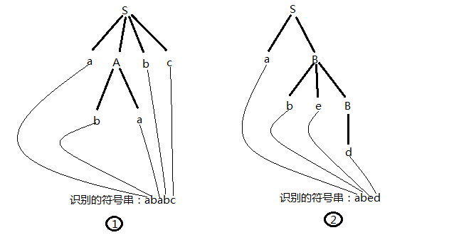
其中左树能识别的符号串是str1="ababc",右树能识的符号串是str2="abed",str1和str2,都是文法符号S的句型(*注意最后一个产生式中的B在右树中的递归表示方式*)

**语言**: 从文法G的开始符号出发,能推导出的句子的全体称为文法G产生的语言.计为L(G)

**文法等价**: 若两个文法产生的语言相同,那就认为这2个文法是等价的

#### 词法分析

语言中,具有独立含义的最小语法单位是符号(单词),包括标识符,常数,界限符等.词法分析的任务就是把构成源程序的字符串转换成单词序列.**词法规则可用3型文法(正规文法)或正规表达式描述**.它产生的集合是语言基本字符集$\sum$(字母表)上的字符串的一个子集.称为**正规集**

##### **正规表达式和正规集**

字母表$\sum$上正规式和其表示的正规集由以下三步递归的定义:

**1**.$\epsilon$是一个正规式,它表示的集合:$L(\epsilon)=\{\epsilon\}$
**2**.若$\alpha$是$\sum$上的字符.则$\alpha$是一个正规式,它所表示的正规集为$\{\alpha\}$
**3**.若正规式$\gamma$,s分别表示正规集$L(\Gamma)$和L(s),则:

* $\gamma\mid{s}$是正规式,表示集合$L(\gamma)\bigcup{L}(s)$
* $\gamma\cdot{s}$是正规式,表示集合$L(\gamma){L}(s)$
* $\gamma^{*}$是正规式,表示集合$(L(\gamma))^{*}$
* $(\gamma)$是正规式,表示集合$L(\gamma)$

运算符的优先顺序是$*\gt\cdot\gt\mid$(闭包>积>并)

**示范**:
$ab = \{ab\}$
$a\mid{b}=\{a, b, aa, bb, ab, ba, \dots\}$
$a^*=\{,a,aa,aaa,\dots\}$ (有一个空串)

**正则表达式的代数定律**:

* $r\mid{s}=s\mid{r}$  *并交换律*
* $r\mid({t}\mid{s})=(r\mid{t})\mid{s}$ *并的结合律*
* $r(st)=(rs)t$  *连接的结合律*
* $r(s|t)=rs|{rt; \: (s|t)r=sr|tr}$ *连接分配律*
* $\epsilon{r}=r\epsilon=r$ *空串是连接的单位元*
* ${r}^{*}=(r|\epsilon)^{*}$  *闭包一定包含空串*
* $r^{**}=r^{*}$  **具有幂等性*

##### 有限自动机

有限自动机是一种识别装置的抽象概念,用于识别正规集. 有限自动机分2类:**确定的有限自动机和不确定的有限自动机**.2者的区别是**确定的有限自动机**对于每一个可能的输入**只有一个状态的转移**,而**不确定的有限自动机**对于每一个可能的输入可以有**多个状态转移**.

**1. 确定的有限自动机**(Deterministic[确定性的] Finite[有限的] Automata[自动机] DFA)由5元组(S, $\sum$, f, $s_0$,Z)组成.其中:

* S是一个有限集,其中每一个元素称为一个**状态**.
* $\sum$是一个有穷字母表.其中每一个元素称为一个**输入**字符.约定$\Sigma$不包含空串$\epsilon$
* **转换函数集**$f$是${S}\times\sum\rightarrow{S}$上的**单值部分的映射**,${f}({A},\alpha)={Q}$表示自动机当前的状态为A,当输入为$\alpha$的时候,自动机急将转换到下一个状态$Q$.我们这时候称$Q$就是A的一个后继状态.这句化应当这么理解:${S}\times\sum\rightarrow{S}$是一个映射,可以看成是一个函数,这个函数接收两个参数,这2个参数分别来自集合$S$和$\sum$,函数的返回值的都是集合$S$中的元素.单值部分的映射是值,函数$f$只保证每一个输入都有一个唯一的返回值.但不保证每一个返回值对应输入是唯一的.(${A}\rightarrow{B},{A}\leftarrow{B}, {A}\rightleftarrows{B}$都是映射,前两者是单映射,最后一个是双映射.)
* $s_0\in{S}$, $s_0$是唯一的一个**开始状态**.
* Z是非空的**终止状态集合**. $Z\subseteq{S}$ (注意,这里仅仅**是子集,不是真子集**))

使用(python)编程的思维通俗的讲解-下:

>$\sum$是一个字母表(字母的集合),$\sum$中的每一个元素都可以作为自动机的输入.
>有限自动机是一个类. 这个类: 
<span style="display:inline-block;width:2em"></span>1.有一个属性status,属性的取值是范围是S.
<span style="display:inline-block;width:2em"></span>2.有一个方法,可以接收一个输入字符.
>集合$S$是一个有限集,存储着自动机所有可能的状态
>这个类有自己的属性status,属性的取值是范围是S
>$s_0$是开始状态,是属于状态集合$S$的一个元素
>Z是非空的终止状态集合,Z是S的子集.

运行过程如下:

1. 自动机初始化,把自己的状态置成$s_0$
2. 从集合$\sum$中取出一个字符.向自动机输入
3. 自动机接收输入的字符,和自己当前的状态一起,通过单值映射$f$得到后继状态$Q$,并把自己的状态置为$Q$
4. 重复步骤2-3,直至从映射$f$得到的后继状态满足$Q\in{Z}$的条件,自动机把自己的状态置为$Q$并停机.

确定的有限状态自动机(DFA)常用2种直观的方式表示:**状态转换图和状态转换矩阵**状态转换图是一个有向图.自动机的每个状态对应着转换图的一个节点,自动机的每个转换函数($f$上的一个映射)对应图中的一条有向弧.若转换函数为${f}(A,\alpha)=Q$,则表示:**该有向弧从节点A触发,进入节点$Q$,字符$\alpha$是弧上的标记也是输入的字符**

举例说明

已知一个确定的有限状态自动机(DFA)M1
>$S=\{s_0,s_1,s_2,s_3\}$
>$\sum=\{a,b\}$
>$f=\{(s_0,a)\rightarrow{s}_1,(s_0,b)\rightarrow{s}_2,(s_1,a)\rightarrow{s}_3,(s_1,b)\rightarrow{s}_2,(s_2,a)\rightarrow{s}_1,(s_2,b)\rightarrow{s}_3,(s_3,a)\rightarrow{s}_3\}$
>$s_0$是开始状态
>$Z=\{s_3\}$
>$M1=(S,\sum,f,s_0,Z)$

约定:

* 状态图中,双圈的节点是终态节点
* 状态转换矩阵中,行下标表示状态,列下标表示输入的字符,行和列对应的值就是后继状态
* 状态转换矩阵中,第一行表示的状态是初态(也就是$s_0$)
* 状态转换矩阵中.终态需要特别指明
  
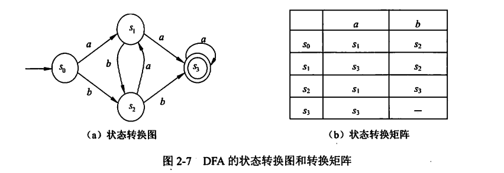

识别/接受/读出

对于$\sum$上的任何字符组成的字符串,如果存在一条从初态($s_0$)到某一终止状态$Q$($Q\in{Z}$).那这条路径上所有弧的标记(从$s_0$到$Q$输入的字符)顺序连接成的字符串可被此DFA所接收(识别/读出).如果这个DFA的初态节点本身也是终态节点($s_0\in{Z}$),那么空字符串也能被该DFA所接收(识别/读出).用公式表示该DFA所能识别的语言$L(M)$就是:
$$L(M)=\{\omega\mid\omega\text{是该DFA的初态到终态的路径上所有弧上的标记所形成的字符串}\}$$

$\Sigma$上的一个字符串的集合V是正规的,当且仅当存在$\Sigma$上的一个DFA M,且 V=L(M)

**2. 不确定的有限自动机**(Nondeterministic[不确定性的] Finite[有限的] Automata[自动机] NFA)**是确定的有限自动机(DFA)的特例**,也由5元组(S, $\sum$, f, $s_0$,Z)组成.基本和DFA相同,不同之处有2点:

1. $f$是${S}\times\Sigma\rightarrow2^{S}$上的**映射**,${f}({A},\alpha)={Q}$表示自动机当前的状态为A,当输入为$\alpha$的时候,返回的是一个**状态的集合**而是不是一个状态.即**当前状态的后继状态不是唯一的**.
2. 某些NFA的有向弧上的标记可以是$\epsilon$(即$f$的输入$\alpha$可以是空串)

**通俗的解释**一2者的区别:

先配图,上为DFA,下为NFA,S为开始状态,F为终态
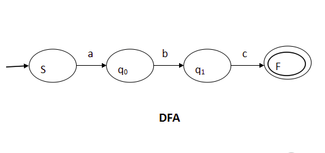
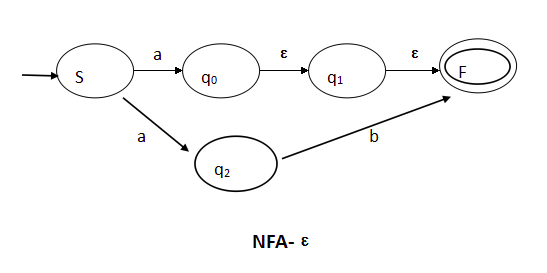

* 给定一个状态S和一个输入a,DFA会返回一个唯一的状态Q,而NFA会返回一个状态的集合$\{q_0,q_1,q_2,\dots\}$,注意看上图的$f(S,a)$,DFA返回了唯一的后继状态$q_0$,NFA返回了多个后继状态($f(S,a)$的直接后继就有$\{q_0,q_2\}$)
* NFA接受空串.注意看NFA的$q_0\rightarrow{q}_1,q_1\rightarrow{F}$的弧上的标记都是$\epsilon$,就是说,及时不输入任何字符(空串),状态仍然可以发生转换.用公式表达就是$f(S,a)=\{q_0,q_2,q_1,F\}$

举例说明

已知一个不确定的有限状态自动机(NFA)N
>$S=\{s_0,s_1,s_2,s_3\}$
>$\sum=\{a,b\}$
>$f=\{(s_0,a)\rightarrow{s}_0,(s_0,a)\rightarrow{s}_1,(s_0,b)\rightarrow{s}_0,(s_1,b)\rightarrow{s}_2,(s_2,b)\rightarrow{s}_3\}$
>$s_0$是开始状态
>$Z=\{s_3\}$
>$M1=(S,\sum,f,s_0,Z)$

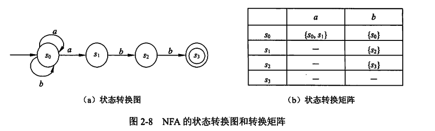

##### NFA到DFA的转换

如果两个自动机能识别的语言是一致的,那我们就说这两个自动机是等价的,任何一个非确定的优先状态自动机豆可以转换成确定的有限状态自动机.与某一NFA等价的DFA不是唯一的.

使用**子集法**把NFA转换成DFA的基本思路

>用DFA的一个状态去对应NFA的一组状态,用DFA的一个状态去记录在NFA读入一个输入后可能达到的状态的集合.

**转换之前**的准备工作.准备2个函数.

>1. <span style='color:red'>空串闭包函数</span>,用于给定一个状态集合,求出状态集中的状态,经历过任意长度的空串可能到达的状态的集合.
>2. <span style='color:red'>$\epsilon$弧转换函数</span>用于给定一个状态集合,在经历了一个$\alpha$的弧之后,所能到达的后继状态的集合

**1.空串闭包/$\epsilon$_闭包**: 用于记录NFA某一个状态经历任意个空串所能到达的状态的集合 

若I是NFA N的状态合集S的一个子集,定义$\epsilon$_CLOSURE(I)如下:

* 状态集I的$\epsilon$_CLOSURE(I)是一个状态集
* 状态集I的所有状态属于$\epsilon$_CLOSURE(I)
* 若$s\in{I}$,那么从s出发,经过任意条$\epsilon$弧到达的状态$s'$都属于$\epsilon$_CLOSURE(I)

通俗的说,**$\epsilon$_CLOSURE函数就是给定/输入一个状态集,求出/返回这些状态集通过任意条(可以是0条,这意味着包含他自己)$\epsilon$弧(空串)可以到达状态的集合.$\epsilon$_CLOSURE(A)**

**2.$\epsilon$弧转换**: 用于记录NFA某一个状态经历一个$\alpha$弧所能到达的状态的集合,通俗的说,就是**求一个状态集,在经历了一个$\alpha$的弧之后,所能到达的后继状态的集合move(A,$\alpha$)**

现假定I是NFA N的状态集S的一个子集, a是字母表$\Sigma$中的一个字符,定义:
$I_a=\epsilon$_CLOSURE$(j)$
其中,$j$是所有哪些可以从I中的某一状态节点出发,经过一条$\alpha$弧而到达的状态节点的全体.

在定义了$\epsilon$_CLOSURE(I)后,就可以使用**子集法**将一个NFA转换成一个DFA.

开始将**NFA转换成DFA**

设NFA N=($S,\Sigma,{f},s_0, Z$),与之等价的DFA M==($S',\Sigma,{f'},q_0,Z'$),转换步骤如下:

1. 求出DFA M的初态$q_0$,即令$q_0=\epsilon$_CLOSURE({$s_0$}),此时,$S'$仅含初态$q_0$,并且没有标记.(*这句话的意思是,把初态$s_0$输入$\epsilon$_闭包函数,生成的状态集合$S'$中只有一个元素,这个元素就是初态$q_0$*,由于接下来的while构造,不被标记只是给while一个启动的条件) **注意:** 如果NFA的开始状态就存在着空串弧,这个$q_0=\epsilon$_CLOSURE({$s_0$})就不止包含一个等价的开始状态了.
2. while循环开始,检查$S'$中是否有未被标记的状态?(因为第一步的初态$q_0$没有被标记,所以这里while循环一定会开始的).

>* 如果有有未标记的状态$q_i$,(这些状态实际上都是状态集,都是NFA某个输入对应的状态集,$q_i=\{s_{i1},s_{i2},s_{i3},\dots,s_{im}\}, s_{ij}\in{S}(j=1,2,3,\dots,m)$)就对他进行标记.说明该状态已被计算过.
>* 对于每个${a}\in\Sigma$(a是属于字母表$\Sigma$的字符).令$T=f(q_i, a), q_j=\epsilon$_CLOSURE($T$)
>* 如果$q_j$还不在$S'$中,那就把$q_j$不加标记的加入$S'$中.并把$f'(q_i,a)=q_j$添加到DFA M的转换函数集合中.

3. 重复while过程,跳转到2步骤继续,直到$S'$中的所有状态都已经被标记.
4. 令$Z'=\{{q}\mid{q}\in{S'} \text{且} {q}\bigcup{Z}\neq\emptyset\}$

举例说明:
下图是一个ab*a的NFA的状态转换图,请将它用子集法转换成DFA.
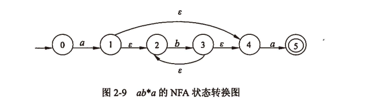

```python3

def zero_char(status_set: list)->list:
    """
    空串闭包函数
    给定一个状态的集合，求这个集合经过任意个空串到达的后继状态的集合（包括自己）
    """
    ....
    return result_list


def one_char(status_set: list, the_char: str)->list:
    """
    字串闭包函数
    给定一个状态的集合，求这个集合经过单个字串到达的后继状态的集合,也要包括经历空串滑到的状态
    """
    ....
    return zero_char(result_list)


def has_no_mark(a_set: set) -> (None, dict):
    """
    检查一个集合是否有未标记的状态？
    如果有，返回这个状态元素．如果没有，返回Ｎｏｎｅ
    """
    res = False
    for x in a_set:
        if x['marked']:
            res = x
            break
        else:
            pass
    return res


letter_table = {'a', 'b'}
S = {0, 1, 2, 3, 4, 5}
s0 = 0
Z = 5
N = (S, letter_table, f, s0, Z)  # NFA
q0 = zero_char(s0)  # 先求出初始状态集q0
# q0 = {0}            # 一个set（集合）
"""将初态加入状态集，并且不标记"""
S2.add({
    "set": q0,　　　　　　# 对应的NFA的状态集
    "status": "q0",　　　# DFA对应的状态
    "char": None,       # 接受的字符串．None表示空串
    "marked": False,    # 是否已标记？
    "is_end": False     # 是否是终态？
    })  

item = has_no_mark(S2)
count = 0
item['count'] = count
while item:
    """检查是否有未标记的状态元素？"""
    item['marked'] = True  # 标记当前状态元素
    for x in letter_table:
        status_set = one_char(item, x)
        if len(status_set) == 0:
            """空集合忽略"""
            pass
        else:
            old = None
            for x in S2:
                """检查当前的后继状态集是否重复"""
                if x['set'] == status_set:  # 重复
                    old = x
                    break
                else:
                pass
            if old:
                """找到重复的状态集了"""
                item['next'] = old['status']  # 标记当前item后继状态
            else:
                """新的状态集"""
                current_item = {
                    "set": status_set,
                    "marked": False,
                    "char": x
                    }
                if Z in status_set:
                    current_item['is_end] = True  # 标记终态
                else:
                    current_item['is_end] = False
                count += 1
                status = "q{}".format(count)
                current_item['status'] = status
                item['next'] = status  # 标记当前item后继状态
                current_item['count'] = count
                S2.add(current_item)　# 加入状态集
result = list(S2)
result.sort(key=lambda obj: obj['count'], reverse=False)
for x in result:
    """打印结果"""
    print(x['status'], x['char'], x['next'])
"""
q0 = zero_char({0}) = {0}　　　　　 　　　　　# DFA初态
q1 = one_char(q0, a) = {1, 2, 4}  　　　　　# q1　DFA状态
d1 = one_char(q0, b) = {} # 空集，放弃
q2 = one_char(q1, a) = {5}  　　　　　      # q2　DFA终态
q3 = one_char(q1, b) = {2, 3, 4}  　　　　　# q3　DFA状态
q２ = one_char(q3, a) = {5} 　　　　　 　　　# q2　DFA终态
ｑ3 = one_char(q3, b) = {2, 3, 4}         #  q3 DFA状态
"""
```

##### DFA最小化(化简)

如果２个状态接受的字符串相同(或者说，这２个状态出发的弧相同)，那么这２个状态就可以合并．

最小化的一般步骤如下:

#### 正规式和有限自动机的转换

##### 有限自动机转正规式

对于$\Sigma$上的NFA(非确定有限自动机) M,可以构造一个$\Sigma$上的正规式Ｒ，使得L(R)=L(M)，把NFA的状态转换图的进行扩展，把状态图的每一条弧都用一个正规式做标记．为$\Sigma$上的NFA M构造相应的正规式R:

1. 在M的状态转换图加2个节点, x和y.从x节点到NFA M的初态节点引一条弧并用$\epsilon$(空串)标记,然后再从NFA M的所有终态节点到y节点都引用一条$\epsilon$弧标记.形成一个与M等价的$M'$,$M'$只有一个初态x和一个终态y.
2. 按照下图的方法逐步消去$M'$中除了x和y的所有节点.并案子消除节点的过程中,用正规式来标记弧,最后节点x和y之间的弧上的标记就是所求的正规式.

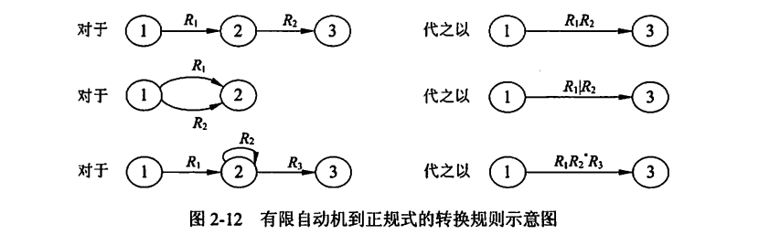

##### 正规式转有限自动机

对于字母表$\Sigma$上的每一个正规式R,可以构造一个$\Sigma$上的NFA(非确定有限自动机) M,使得 L(M) = L(R)

1. 对于每一个正规式R,构造一个只有初态x和终态y的状态转换图.所接受的字符$\omega=R$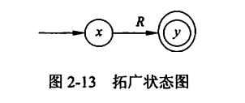
2. 通过对正规式R进行分裂并加入新的节点,逐步把状态图转变成每条弧上的标记都是字母表$\Sigma$上的一个字符或者$\omega$(空串),转换规则如下图:
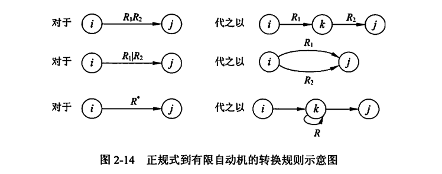

#### 词法分析器的构造

构造词法分析器的一般步骤:

1. 用正规式描述语言中的单词构成规则
2. 为每个正规式都构造一个NFA,这个NFA识别对应的正规式所表示的正规集
3. 将NFA转换为DFA
4. 对DFA进行化简,使其最小化
5. 从化简后的DFA构造词法分析器

#### 语法分析

语法分析的任务是根据语言的语法规则,**分析单词串**是否构成短语和句子.即是否构成**表达式,语句和程序等基本语言结构**.同时**检查和处理程序中的语法错误**.程序设计语言的绝大多数语法规则可以采用**上下文无关文法**(也就是2型文法)进行描述.语法分析有多种方法,**根据产生语法树的方向**,可以分为**自底向上和自顶向下**两类.

##### 1.上下文无关文法

上下文无关文法$G[S]=({V}_{N},{V}_{T},{P},{S})$,其产生式的形式都是$A\rightarrow\beta$ 其中 ${A}\in{V}_{N}, \beta\in({V}_{N}\bigcup{V}_{T})^{*}$

*约定*:

若不加特别的说明

>* 大写英文字母A,B,C等表示**非终结符**
>* 小写英文字母a,b,c等表示**终结符**
>* 小写希腊字母$\alpha,\beta,\gamma,\delta$等表示**终结符和非终结符混合**的文法**符号串**

由于一个**上下文无关的文法的核心部分是其产生式的集合**,所以文法可以简写为其**产生式集合**的描述形式

###### 规范推导/最右推导

* **最右推导**: 如果在拖到的任何一步$\alpha\Rightarrow\beta$($\alpha,\beta$是句型)都是对$\alpha$中最右的非终结符进行替换,则称这种推导为**最右推导**,也称为规范推导.
* **短语,直接短语,句柄**: 设$\alpha\delta\beta$是文法G的一个句型.S是文法的开始符号.即$S\Rightarrow^{*}\alpha\delta\beta$,而且满足$\alpha{A}\beta$ 和 $A\Rightarrow^{+}\delta$则称$\delta$是句型$\alpha\delta\beta$想对于非终结符A的**短语**.特别地,如果有A=$\delta$,则称$\delta$是句型$\alpha\delta\beta$想对于产生式$A\rightarrow\delta$的**直接短语**.一个句型的最左直接短语称为该句型的**句柄**
 
**使用语法树理解**相对比较简单:

* 一个开始符号可以有多个句型
* 每个句型对应一个语法树
* 语法树的根节点就是开始符号
* 句型是语法树的所有叶子节点从上到下,从左到右是一个合法的符号串,这个符号串就是一个**句型或句子**
* 语法树中**子树的叶子节点**从上到下,从左至右构成一个**短语**,这个短语被称为是关于子树的根节点的短语
* **高度为1的子树的直接叶子节点**从上到下,从左至右构成一个**直接短语**,直接短语是短语的子集
* **最左高度为1的子树的直接叶子节点**从上到下,从左至右构成一个**句柄**
* 一个句型可以有多个短语,直接短语,但只有一个句柄
* 句型本身也是关于开始符号的短语
* 短语、直接短语和句柄都是针对某一句型来说的，脱离句型来谈短语、直接短语和句柄是无意义的.

举例说明,下面是一颗语法树, 找出他的短语,直接短语和句柄.
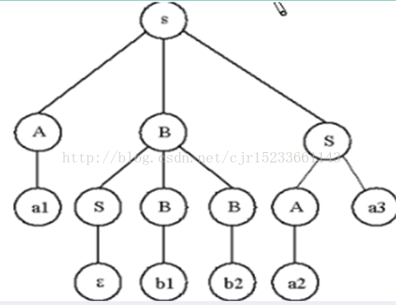
语法树的所有子树如下(红字):
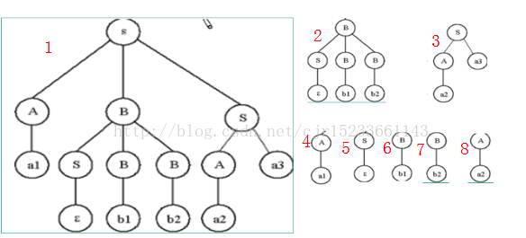
语法树对应的短语如下(*子树的叶子节点从上到下,从左至右构成一个短语*):

> 注意: 子树5,6,7是子树2的子树.子树8是子树3的子树

1. $a1\epsilon{b1b2a2a3}$  (*第一个子树就是语法树本身*)
2. $\epsilon{b1b2}$
3. $a2a3$
4. $a1$
5. $\epsilon$
6. $b1$
7. $b2$
8. $a2$

每一棵子树的直接短语如下:

1. 无直接叶子节点,无直接短语.
2. 同上
3. a2不是直接叶子节点.所以也无法组成直接短语
4. a1
5. $\epsilon$
6. b1
7. b2
8. a2
   
句柄(*最左边最靠上的的直接短语就是句柄*): 

* a1

#### 2.自顶向下分析法

对于给定的字符串$\omega$,从文法的开始符号S进行最左推导,直到得到一个合法的句子或者一个非法的结构.自上而下,自左到右,的为输入串$\omega$建立语法树.整个分析过程就是一个试探的过程,是反复使用产生式某修与输入序列匹配的过程.

分析中可能出现的问题:

* **回溯:**,若文法中存在形如$A\rightarrow\alpha\beta\mid\alpha\delta$这样的产生式,即A的产生式中,有多于一个的候选式的前缀相同(即左公因子,简称左因子)则可能导致分析过程中的回溯处理.
* **左递归**: 若文法的存在形如$A\rightarrow{A}\alpha$这样的产生式,由于采用了最左推导,所以可能会造成分析过程中陷入死循环的情况,产生式的这种形式成为左递归.

对于以上两种情况需要对文法进行改造: 对于左递归,需要引入新的产生式和符号,把左递归改造成右递归.对于回溯,需要提取左因子,避免回溯.

##### 消除直接左递归 

消除左递归的本质是把左递归转换成右递归,需要引入新的符号和产生式
产生式 $A\rightarrow{A}\alpha\mid\beta$ 而且$\alpha$不等于$\epsilon$,$\beta$不以A开头

* 由于A可以推导出来A$\alpha$ $A\Rightarrow{A}\alpha$
* 递归的把$A\Rightarrow{A}\alpha$中的左侧地一个A替换成A$\alpha$
* 得到一个以A开头的$\alpha\dots$的串, $A\alpha\dots$
* 把$A\alpha\dots$用产生式$A\rightarrow{A}\alpha\mid\beta$ 中的第二个候选式$\beta$替换,结果是$\beta\alpha\dots=\beta\alpha^{*}$
* 令$A^{1}=\alpha^{*}$,可以得到$A\rightarrow\beta{A}^{1}, {A}^{1}\rightarrow\alpha{A}^{1}\mid\epsilon$(第二个产生式是因为克林闭包的特性得来的)
* 使用产生式${A}^{1}\rightarrow\alpha{A}^{1}\mid\epsilon$的第一个候选式对产生式${A}^{1}\rightarrow\alpha{A}^{1}$的右部的从右数第一个$A^1$进行递归的替换.$${A}^{1}\Rightarrow\alpha{A}^{1}$$$${A}^{1}\Rightarrow\alpha\alpha{A}^{1}$$$${A}^{1}\Rightarrow\alpha\alpha\alpha{A}^{1}$$$${A}^{1}\Rightarrow\alpha\dots{A}^{1}$$$$\dots$$
* 将${A}^{1}\Rightarrow\alpha\dots{A}^{1}$中的${A}^{1}$使用产生式${A}^{1}\rightarrow\alpha{A}^{1}\mid\epsilon$的第二个候选式进行替换,得到${A}^{1}\Rightarrow\alpha\dots=\alpha^{*}$
* 可以证明$A\rightarrow\beta{A}^{1}, {A}^{1}\rightarrow\alpha{A}^{1}\mid\epsilon$和$A\rightarrow{A}\alpha\mid\beta$是等价的,这样,引入了额外的符号$A^{1}$和2个产生式就消除了直接左递归(左递归转换成了右递归)
  
**消除直接左递归的一般形式**如下:

对于形如${A}\rightarrow{A}\alpha_{1}\mid{A}\alpha_{2}\mid{A}\alpha_{3}\mid\dots{A}\alpha_{n}\mid\beta_{1}\mid\beta_{2}\mid\beta_{3}\dots\mid\beta_{m}$的直接左递归,可以使用如下的2个产生式进行替换(引入了额外的符号$A^{1}$):
$${A}\rightarrow\beta_{1}{A}^{1}\mid\beta_{2}{A}^{1}\mid\beta_{3}{A}^{1}\dots\mid\beta_{m}{A}^{1}$$  $${A}^{1}\rightarrow\alpha_{1}{A}^{1}\mid\alpha_{2}{A}^{1}\mid\alpha_{3}{A}^{1}\mid\dots\mid\alpha_{n}{A}^{1}\mid\epsilon$$

##### 消除间接左递归 

消除间接左递归的方法是对产生式的右部进行代换,把间接左递归转换为直接左递归,然后使用消除直接左递归的方法进行消除.

##### 消除回溯(**提取公共左因子**)

通过改写产生式来推迟决定,直到读入了足够多的信息,再作出正确的选择.

举例说明:
文法G有如下的产生式$$S\rightarrow{aAd}\mid{aBe}$$ $${A}\rightarrow{c}$$ $$B\rightarrow{b}$$我们可以通过提取左公因子的方式,来改写文法的产生式,改造后的文法$G^{1}$有如下产生式 $$S\rightarrow{a}{S}^{1}, (\text{其中}\alpha\text{是提取的左公因子})$$ $${S}^{1}\rightarrow{Ad}\mid{Be}$$ $$A\rightarrow{c}$$ $$B\rightarrow{b}$$

##### LL(1)文法

为了方便定义LL(1)文法,先引入三个定义: **后继符号集,可选集**和**串首终结符集**

后继符号集**FOLLOW(A)集**:

定义: 可能在某个句型中,紧跟在非终结符A后面的终结符a的集合,记为FOLLOW(A)
约定: 如果A是某个句型的最右符号,那就把结束符$添加到FOLLOW(A)中

产生式的可选集**SELECT($A\rightarrow\beta$)集**:

定义: 产生式$A\rightarrow\beta$的可选集是指使用该产生式进行推导时,对应的输入符号的集合,记为SELECT($A\rightarrow\beta$)

* 如果一个产生式的右部以一个$a$终结符开头,那么这个产生式的可选集就是只包含此终结符$a$的集合.$SELECT(A\rightarrow{a}\beta) = \{{a}\}$
* 如果一个产生式的右部是空串$\epsilon$,那么此产生式的可选集就是产生式左部非终结符的后继符号集,$SELECT(A\rightarrow\epsilon) = FOLLOW(A)$

串首终结符集**FIRST($\alpha$)集**:

> 串首的第一个符号,并且是终结符.简称首终结符

定义: 可以从文法符号串$\alpha$推导出来的,所有的串首终结符构成的集合.记做FIRST($\alpha$)
约定: 如果$\alpha\Rightarrow^{*}\epsilon$,那么空串$\epsilon$也在FIRST($\alpha$)中.

* 如果$\alpha\Rightarrow^{*}\epsilon$,那么$\epsilon\in{FIRST}(\alpha)$ (*如果一个串能推导出来空串,那么空串就属于这个串的FIRST($\alpha$)集*)
* 对于$\forall\alpha\in({V}_{T}\bigcup{V}_{N})^{+}, FIRST(\alpha)=\{{a}\mid\alpha\Rightarrow^{*}{a}\beta,{a}\in{V}_{T},\beta\in({V}_{T}\bigcup{V}_{N})^{*} \};$ (*对于所有由终结符和非终结符的并集的克林闭包构成的串$\alpha$,它的串首终结符集FIRST($\alpha$)是串$\alpha$所能推导出来的,所有第一个符号是终结符的串的第一个符号组成的集合*)
* 如果$X\rightarrow{Y}_1{Y}_2{Y}_{3}\dots{Y}_{n}$(X,Y是非终结符),X的串首终结符集就是$Y_{1}$的串首终结符集;如果$Y_{1}$的串首终结符集包含空串$\epsilon$,那么就把$Y_{2}$的串首终结符集加入到,X的串首终结符集中.如果$Y_{2}$的串首终结符集包含空串$\epsilon$,那么就把$Y_{3}$的串首终结符集加入到,X的串首终结符集中....如此类推,直到如果$Y_{n}$的串首终结符集包含空串$\epsilon$,那么就把空串$\epsilon$终结符集加入到,X的串首终结符集中.
* 如果$A\rightarrow\epsilon$,那么就要把空串$\epsilon$终结符集加入到,A的串首终结符集中

对于非终结符${A}$, 串$\alpha$,产生式$A\rightarrow\alpha$来说:

* 如果$\epsilon\notin{FIRST}(\alpha)$,那么$SELECT(A\rightarrow\alpha)=FIRST(\alpha)$, (*如果空串不在串$\alpha$的串首终结符集内,那么能推导出此串的产生式的可选集就是此串的是串首终结符集*)
* 如果$\epsilon\in{FIRST}(\alpha)$,那么$SELECT(A\rightarrow\alpha)=(FIRST(\alpha)-\{\epsilon\})\bigcup{FOLLOW}(A)$.(*如果空串包含在串$\alpha$的串首终结符集内,那么能推导出此串的产生式的可选集就是此串的是串首终结符集去掉空串后和此产生式的左部A的后继符号集*)

LL(1)**文法定义**:
文法G的任意两个具有相同左部的产生式$A\rightarrow\alpha\mid\beta$必须满足以下3个条件:

* 如果$\alpha$和$\beta$都不能推导出$\epsilon$,则$FIRST(\alpha)\bigcap{FIRST}(\beta)=\emptyset$ (*如果2个产生式都不能推导出空串,那么这2个产生式的串首终结符集不相交*)
* $\alpha$和$\beta$只有有一个可以推导出$\epsilon$
* 如果$\beta\Rightarrow^{*}\epsilon$,那么$FIRST(\alpha)\bigcap{FOLLOW}(A)=\emptyset$
  如果$\alpha\Rightarrow^{*}\epsilon$,那么$FIRST(\beta)\bigcap{FOLLOW}(A)=\emptyset$
  (*如果一个产生式能推导出来空串,那么另一个产生式的串首终结符集就和产生式左部的非终结符集的后继符号集不相交*)
 
 > 简写解释:从左至右(L),使用最左推导(L)的,需要向前看一个输入符号(1)的文法,称为LL(1)文法 

总结:

* 串$ABCDEF\dots$中,非終結符A的后继符号集FOLLOW(A)依赖与它后面的非终结符B的串首终结符集FIRST(B),非終結符B的后继符号集FOLLOW(B)依赖与它后面的非终结符C的串首终结符集FIRST(C),以此类推....
* 如果某个非终结符是某个句型的最右符号,那么就把结束符$\$$加入到此非终结符的后继符号集中,文法的开始符号也一个句型,所以文法的开始符号的后继符号集包含$\$$
* 对于产生式$A\rightarrow{BC}$,由于C是左部最后一个符号,所以能跟在A后面的后继符号也能能在C后面$FOLLOW(A)\subset\text{FOLLOW}(C))$,如果C能推导出空串,那么跟在A后面的后继符号集也能出现在B的后面$FOLLOW(A)\subset\text{FOLLOW}(B))$.
  
