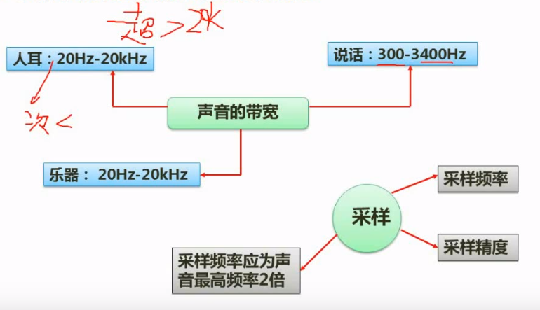
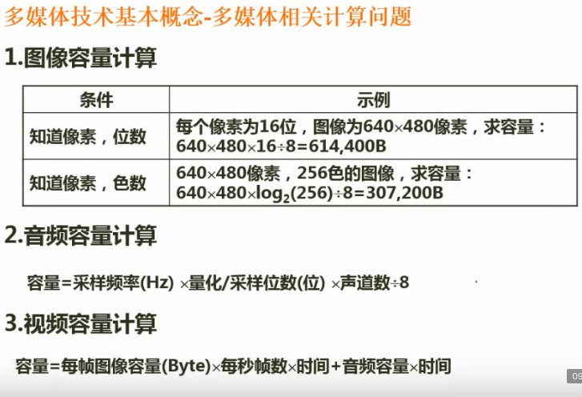
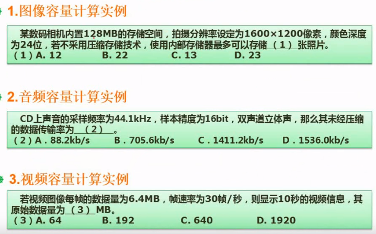

# 多媒体技术

##　音频

## 多媒体的计算

注意：＊多媒体计算时，除容量外Ｋ按照１０２４计算，ｋ按照１０００计算器＊

例题

解题:

1. 色深24位就是24/8=3byte, 1600*1200*3=5760000, 5760000/1024/1024=5.49M.128/5.49=23.3 向下取整,答案是可以找储存在23张图片.
2. 16*44.1*2=1411.2kb
3. 6.4*30*10=1920