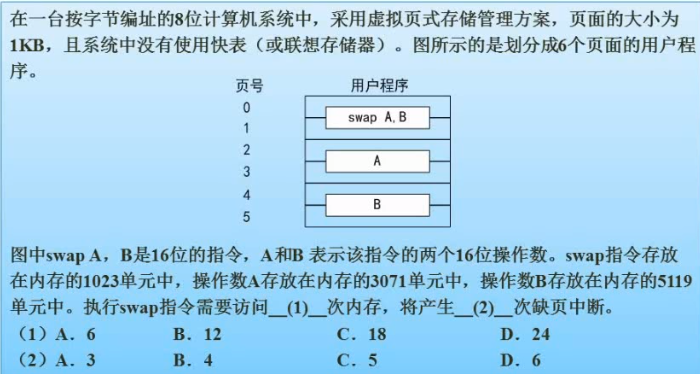

# 操作系统

## 基本概念

操作系统四大特征:**并发性,共享性,虚拟性,不确定性**
操作系统的功能可分为5大部分

1. **进程管理**: 实质上是对处理及的执行'时间'进行管理.包含**进程控制,进程同步,进程通讯和进程调度**
2. **文件管理**: 包括**存储空间管理,目录管理,文件的读写管理和存取管理**
3. **存储管理**: 就是对主存的"空间"进行管理,包括**存储分配和回收,存储保护,地址映射和变换,主存扩充**
4. **设备管理**: 对硬件设备的管理.包括**输入/输出设备的分配,启动,完成和回收**
5. **作业管理**: 包括**任务,界面管理,人际交互,图形界面,语音控制和虚拟现实**

### 操作系统的分类

通常,操作系统可分为

* **批处理操作系统**,
* **分时操作系统**,
* **实时操作系统**,
* **网络操作系统**
* **分布式操作系统**,
* **微机操作系统**
* **嵌入式操作系统**

## 进程管理

进程管理又称处理机管理.在多道程序批处理系统和分时系统中有多个并发执行的程序,因此引入进程概念用来描述系统中程序执行时的动态变化的过程.进程是资源分配和独立运行的基本单位.进程管理的重点是研究进程间并发性, 合作和资源竞争问题

程序的顺序执行的主要特征包括顺序行,封闭性和可再现性.
程序并发执行的特征:

1. 失去了程序的封闭行
2. 程序和机器的执行程序的活动不再一一对应.
3. 并发程序间的相互制约

进程是程序的一次执行.程序可以和其他程序并发的执行.进程通常是由**程序,数据,进程控制(Process Control Block PCB)**组成.

1. PCB是进程存在的唯一标示
2. 程序部分描述了进程需要完成的功能.假如一个程序能被多个进程同时共享执行,那么这一部分就应该以可在如码的形式编制,它是程序执行时不可修改的部分
3. 数据部分包含程序执行时所需的数据和工作区.该部分只能为一个进程所专用.是进程的可修改部分

### 进程的状态

1. **活跃就绪**是指程序存在与主存并且可被调度的状态
2. **静止就绪**是指就绪进程被置换到辅存的状态.此状态不能被直接调度,可被转换为活跃就绪状态
3. **活跃阻塞**是指进程在主存,一旦等待的事件发生就转入活跃就绪状态.可被挂起为静止阻塞状态
4. **静止阻塞**是指阻塞的进程被置换到辅存的状态.一旦等待的事情发生,就会转入静止就绪状态.可被激活为活跃阻塞状态
5. **运行**是指程序正在运行的状态.1.如果一个时间片到,程序未执行完毕.那就会转入活跃就绪状态等待下一个时间片的到来(CPU调度).2.如果运行时,必要的资源未就绪.程序会转入活跃阻塞状态等待资源.3. 运行状态也可以被人为挂起到静止就绪状态

5个状态之间的关系如下

提醒: *挂起是指程序从内存转移到外存.激活/恢复是指程序从外存进入到内存*

* 运行状态间的转换
>* 时间片到任务未完成,**运行转入活跃就绪**状态
>* 等待资源,**运行转入活跃阻塞**状态
>* 运行状态时被(人为)挂起,**运行转入静止就绪**状态
>* 活跃阻塞被(人为)挂起.**活跃阻塞转入静止阻塞**.
>* 活跃阻塞状态时,等待的资源满足.**活跃阻塞转入活跃就绪**.
>* 活跃就绪被被CPU调度.**活跃就绪转入运行**.
>* 活跃就绪被被(人为)挂起.**活跃就绪转入静止就绪**.
>* 静止阻塞被(人为)恢复或激活,**静止阻塞转入活跃阻塞**
>* 静止阻塞时等待的资源满足,**静止阻塞转入静止就绪**
>* 静止就绪被(人为)恢复或激活,**静止就绪转入活跃就绪**

### 进程的控制

内核是计算机系统硬件的首次延伸,是基于硬件的第一层软件扩充.为系统对进程进行控制和管理提供了环境.
进程的控制是由操作系统的内核中的原语实现的.
原语是由若干条机器指令组成.用于完成特定功能的程序段.原语执行时有原子特性.

### 进程间通讯

进程通讯是指各个进程交换信息的过程

#### 同步和互斥

##### 进程同步

进程间的同步是指系统中一些需要相互合作,协同工作的进程.这样的相互关系成为进程的同步.

##### 进程互斥

进程的互斥是指系统中多个进程因为争用临界资源而互相排斥执行.

##### 临界区管理

1. 有空则进
2. 无空则等
3. 有限等待
4. 让权等待

#### 信号量机制

信号量机制是一种有效的进程同步和互斥工具,主要有整形信号量,记录型信号量和信号量集机制.

整形信号量分为以下2类

1. 公用信号量 实现进程间的互斥.初始值为1或资源的数目
2. 私用信号量 实现进程间同步,初始值为0或者某个正数

信号量S

1. ${S}\ge{0}$时,S表示资源的可用数.
2. ${S}\lt{0}$时,S的绝对值表示阻塞队列中等待该资源的进程数

**PV操作**是实现进程同步与互斥的常用方法,P和V都是低级通讯原语.在执行期间不可分割.P操作表示申请一个资源,V操作表示释放一个资源.其定义如下

* **P操作** ${S}={S}-1$,若$S\ge0$,则P操作的进程继续执行,若$S\lt0$,则置该进程为阻塞状态.并将其插入阻塞队列.
* **V操作** ${S}={S}+1$,若$S\gt0$,则V操作的进程继续执行,若$S\le0$,则置从阻塞队列唤醒一个进程.并将其插入就绪队列.

**PV操作需要大量的例题来练习**!!!

### 管程

管程是一种同步机制.基本思路是集中管理进程提出的对资源的访问.管程提供了一种可以允许多进程安全,有效的共享抽象数据的机制.

### 进程调度

进程调度方式是指当有更高优先级的进程到来时如何分配CPU.调度方式分为可剥夺和不可剥夺两种.

#### 三级调度

* **高级调度** 高级调度又称长调度,作业调度或接纳调度.它决定处于输入池的那个后备作业可以调入主存做好运行的准备(禁止就绪).成为一个或者一组就绪状态的进程.一个作业只需要一次高级调度
* **中级调度** 中级调度又称中程调度或者对换调度.它决定处于交换区的那个就绪进程可以调入内存一边直接参与对CPU的竞争(静止就绪$\rightarrow$活跃就绪).同时,如果系统资源紧张,那些内存中处于阻塞状态的进程也会被移出至交换区(活跃阻塞$\rightarrow$静止阻塞),腾出空间.这相当与处于内存中的进程和处于磁盘交换区的进程对换了位置
* **低级调度** 又称短程调度或进程调度.它决定内存中的哪个就绪进程可以占用CPU(活跃就绪$\rightarrow$运行).低级调度最活跃,对系统的影响很大

#### 调度算法

* **先来先服务(First Coming  First Service FCFS)**: 按照作业提交或者进程就绪的先后顺序分配CPU,即总是将就绪队列头部的进程投入运行.特点是有利于长作业,不利于短作业;有利于CPU繁忙作业,不利于IO繁忙作业.主要用于宏观调度
* **时间片轮转**: 主要用于微观调度.目的是提高资源利用率.有固定时间片和可变时间片两种方式.
* **优先级调度**: 让每一个进程都拥有一个优先数.数值大的优先级高.分为静态优先级和动态优先级.
* **多级反馈调度**: 是时间片轮转算法和优先级算法的综合.优点是: 1.照顾了短进程以提高系统吞吐量,2.照顾了IO型进程获得了较好的IO设备利用率,3.不必估算进程的执行时间,动态调整优先级.

### 死锁

产生死锁的原因是因为资源竞争及进程推进顺序非法.

* 当系统中有多个进程所**共享的资源不足**以他们的需求时,将引起它们对资源的竞争导致死锁.
* 进程到推进的过程中**请求和释放资源的顺序不当**,也会导致进程死锁

产生死锁的四个条件是:**互斥条件,请求保持条件,不可剥夺条件和环路条件**

**计算进程并发所需的最小资源**的方法:

假设有n个进程,每个进程需要的资源数为S,问至少需要多少资源才能保证不发生死锁?

解题的方法就是把每个进程所需的最小资源数字减去1,然后相加,最后的结果再加1即可.用公式表示就是$$保证n个进程不发生死锁的最少资源数=(\sum_{i=1}^{n}({S}_{i}-1))+1$$

#### 死锁的处理

死锁的处理策略主要有4种: **鸵鸟策略,预防策略,避免策略,检测与解除死锁**

##### 死锁预防

采用某种策略限制并发进程对资源的请求,**破坏死锁产生的4个必须条件之一**.使系统在任何时刻都不满足死锁的必要条件.

1. **预先静态分配法**: 破坏不可剥夺条件,预先分配所需资源,保证不等待资源.缺点是降低了对资源的利用率,降低了进程的并发程度,有时可能无法预先知道如何分配所需资源
2. **资源有序分配法**: 破坏了环路条件.把资源分类按照顺序排列,保证不形成环路.缺点是限制了进程对资源的请求,对资源的排序增加了系统开销

##### 死锁避免

不像死锁预防那样严格限制产生死锁的必要条件.而是使用算法避免死锁.死锁避免算法需要很大的系统开销.最著名的死锁避免算法是银行家算法
**银行家算法**对进程发出的没一个系统可以满足的资源请求命令加以检测,如果发现分配资源后系统进入不安全状态,则不予分配.若分配资源后系统仍处于安全状态.则实施分配. 
和死锁预防策略比,死锁避免提高了资源的利用率,但分配资源的检测增加了系统的开销
**安全状态**是指对于进程$\{{P}_{1},{P}_{2},\dots,{P}_{n}\}$如果存在一个序列Q,系统按照Q指定的顺序来为每个进程分配资源.直到最大需求,使每个进程都可以顺序完成.则称Q为安全序列,否则称系统处于不安全状态

举例说明银行家算法

银行家算法的一个特点就是任何时候都要保证系统可用资源数大于等于0.在${T}_{0}$时刻.$R_{1},R_{2},R_{3}$三种资源已经分配了7,7,5个.那么在此时,剩余的资源数是$R_{1}=9-7=2,R_{2}=8-7=1,R_{3}=5-5=0$.现在开始解题:

* $R_3=0$意味着地一个进程不能消耗$R_3$资源.也就是说,第一个进程必须是$P_2$,答案在C和B选项之间.
* 第一个进程必须是$P_2$,那么系统先分配给$P_2$足够的资源,剩余资源状态是$R_1=2-1=1, R_2=1-1=0, R_3=0-0=0$.
* $P_2$运行完毕后,$P_2$资源会被释放,$R_1=1+2=3, R_2=0+2=2, R_3=0+1=1$
* 由于系统的剩余资源是$R_1=3, R_2=2, R_3=1$,所以无法满足$P_1$运行所需, 但能满足$P_4$运行所需,所欲选B.

##### 死锁检测

死锁检测方法对资源的分配不加限制,允许死锁的发生.但系统会定时运行一个死锁检测程序,判断是否发生了死锁,若检测到有死锁.,则设法加以解除.

##### 死锁解除

1. **资源剥夺法** 从一些进程那里强行剥夺足够数量的资源分配给死锁进程
2. **撤销进程法** 根据某种策略,逐个撤销死锁进程没,直至解除死锁为止

### 线程

传统进程的2个基本属性:

1. 可用有资源的独立单位
2. 可独立调度和分配的基本单位

由于进程在创建,测小和切换的过程中,系统需要较大的时空开销.所以导致系统中的进程不宜太多,进程的切换频率不宜太快,这就限制了并发程度的提高.引入线程后将传统进程的2个基本单位分开

* 线程作为调度和分配的基本单位
* 进程作为独立分配资源的单位
* 线程是进程中的一个实体,是被系统独立分配和调度的基本单位
* 线程和同属一个进程的其他线程共享进程拥有的全部资源

用户可以通过创建线程来完成任务,避免过大的时空开销.
线程也可称为轻型进程,传统进程称为重型进程.
线程可以创建另外一个线程,同一进程中的多个线程可以并发执行.
线程分为**用户级线程和内核支持线程**,用户级线程不依赖内核,其创建,撤销和切换都不利用系统调度来实现.内核支持线程存在与系统进程和用户进程中,依赖于内核,创建,撤销和切换都利用系统调度来实现.但无论是用户进程还是系统进程,其调度都是依赖于内核中的进程调度.

## 存储管理

### 基本概念

#### 存储器结构

存储管理的主要对象是主存/内存.常见的存储器结构是: 寄存器--[缓存]--主存--外存
存储管理的基本概念

* **虚拟地址**: 由于对于程序员来说,数据的存放地址是符号决定的,故称符号名地址或名地址.而把源程序的地址空间成为符号名地址空间或者名地址空间.虚拟地址是从0号单元开始编址,并顺序分配所有的符号名所对应的地址单元.虚拟地址不是主存中的实际地址,也称相对地址,程序地址,逻辑地址.
* **地址空间**: 程序中,由符号名组成的空间称为名空间.地址空间是以0为基址顺序进行编址的,相对地址组成的空间你成为逻辑空间,相对地址空间通过地址再定位机构转换到绝对地址空间,绝对地址空间也成为物理地址空间.
* **存储空间**: 逻辑地址空间简称地址空间,是逻辑地址的集合,物理地址空间简称存储空间,是物理地址的集合.

#### 地址重定向

地址重定向是指将逻辑地址变换成主存物理地址的过程.主要解决的是可执行文件中的地址和主存地址的对应关系,这个动作由系统的装入程序和地址重定位机构完成.地址重定位分为

1. **静态地址重定位**:是指在程序装入主存时已经完成了逻辑地址到物理地址的变换,在程序的执行期间不会再发生变化.早期采用此方法较多,优点是无需硬件地址变换机构的支持.缺点是必须给作业分配一个连续的存储区域,在作业执行期间不能扩充存储空间,也不能在主存中移动,多个作业的数据难以共享.
2. **动态地址重定位**:是指在程序运行期间完成逻辑地址到物理地址的变换.需要依赖硬件地址变换机构,比如基地址寄存器(BR).优点是 1.程序执行期间可以换出换入主存,以解决主存空间不足的问题; 2.可以在主存中移动,把主存中较小的碎片集中起来,充分利用空间; 3.不必给程序分配连续的主存空间,可以充分利用较小的主存块; 4.可以实现数据共享.

### 存储管理方案

#### 分区存储管理

把主存的用户区划分成若干个区域,每个区域给一个用户使用,并限定它们只能在自己的区域运行,这种主存分配方案就是分区存储管理方式.这种管理方式按照分区划分方式的不同分为**固定分区,可变分区和可重定位分区**.

* **固定分区**: 静态分区方式, 分区大小不可变,浪费严重.
* **可变分区**: 动态分区方式.主存划分的分区的个数和大小是可变的.可变风趣使用已分配表和未分配表记录分区的使用情况.可变分区有**最佳适应算法,最差适应算法,首次适应算法和循环首次适应算法**4种.无论任何一种算法,可变分区总是会导致主存中产生很多生成很多无法使用的小分区(外碎片).解决外碎片的方法就是定期向一个方向(比如低地址端)移动已分配的作业.使空闲的外碎片连成一片.但这势必导致所有的主存地址的重定向问题:

>1. **最佳适应算法**: 每次都寻找和当前需要的空间大小最接近的空闲分区切割一块出来分配.这样会导致快速的外碎片
>2. **最差适应算法**:每次都寻找最大的空白分区切割并装入作业,由于剩下的空白分区较大,所以不容易产生外碎片.
>3. **首次适应算法**: 每次都按照从主存的低地址到高地址的方向,使用地一个可以装入作业的空白空间进行切割.优点是由于地址的连续性,放作业完成后空间被释放时,更容易实现相邻空白空间的合并.
>4. **循环首次适应算法**: 按照从主存的低地址到高地址的方向,每次都从上一次刚分配的空间后的下一个空白分区开始寻找可以装入作业的空白分区.特点是避免总是使用(切割)同一个空白分区

* **可重定位分区**: 者某个作业的请求的空间得不到满足时,就会要求所有正在使用的分区"靠拢",让空白的空间连成一片.能有效的避免空间浪费.但需要额外的系统成本.并且会导致所有的地址冲定位问题

#### 分区保护

1. 采用上界/下界寄存器保护 上界寄存器放入作业的装入地址,下界寄存器放入的是作业的结束地址
2. 采用基址/限长寄存器保护 基址寄存器放入的是作业的装入地址,限长寄存器装入的是作业的长度

### 分页存储管理

分页存储是为了有效的利用小的空白内存.原理是将一个**进程的地址空间划分成**若干**大小相等**的区域,称为页(这时的进程保存在主存之外的位置,比如外存中).相应的,把主存的空间也划分成与页大小相同的物理块,称为块或者页框.在为进程分配内存时,将进程中的若干页分别装入多个不相邻的块中.由于进程中实现同一功能的内存页被分散到不同的贮存的物理块中.**难以内存共享**.页号和块号使用页表建立映射关系.页/块内的地址是连续的(偏移量相等)

系统为了保证能在主存中找到进程要访问的页面所对应的物理块.系统为每个进程建立了一张页面映射表.简称**页表**.每一个页在页表中占一个表项.该记录对应该页在主存中对应的物理块号.页表上的项是从0开始编址的.页表上的地址是连续的.

上图中:*逻辑页号为4,查表可得其对应的物理块号为15.与页内地址256拼接得到物理地址*.整个过程是从页号到物理块号的地址映射.

**页式存储管理**至少**需要2次主存**,其中:

1. 第一次是访问页表,得到的数据是**数据的物理地址**
2. 第二次是**访问数据**

为了提高速度,在地址映射机构中增加一个小容量的联想存储器,联想存储器由高速缓存器组成,称为**快表**,用来保存**当前访问频率高的少数活动页的页号**和相关信息.快表也有自己额淘汰算法.**对快表查询和对主存的查询是并行的**,一旦在快表中查询到相应的逻辑页号.对主存的查找就立刻中止了.

80386采用**二级页表**.将页表进行分页.每个页面的大小和主存物理块的大小相同.并为这些页面进行编号.可以离散的将各个页面分别存放在不同的物理块中.然后再为此建立一张页表:称为外层页表/页表目录.即: 第一级是页表目录,其存放额是某个页表的地址;第二级是页表,存放的是页的物理块号.

优点: 主存利用率高,碎片小,分配和管理简单.
缺点: 增加系统开销.难以共享内存. 可能产生抖动.

**习题**:

解题:

* 页面大小为4K,因为$4K=2^{12}$,所以可知数据位(页面)占12位,经由2进制到16进制的转换(4个2进制位对应一个16进制位)可知数据位在16进制中占据低位的3个位数.对于进程P要访问的16位逻辑地址5A29H来说.数据位就是A29,那么前面的5就是页号了.由此可知.这个地址在页号为5,页号地址为A29的项对应的空间.由图可知道.页号5对应额物理块(页帧号)为6,将物理块号6和块内偏移量(页内偏移量)拼接起来就是6A29H
* 根据页面淘汰算法.只有在主存中的0,1,2,5参与淘汰算法.根据访问位可知,0,2,5刚刚被访问过.因此淘汰在内存中的,最久不被访问的1号页面

### 分段式存储管理

分段式内存管理的方式,其目的之一就是要**实现内存共享**.所以它是按照逻辑功能把进程中的的地址进行划分的.(比如主程序段,子程序段,数据段等).每个段都有自己的名字.都是从0开始编址的一段连续的空间.分段式管理为每个段分配一个连续的分区.各个段之间是离散的.系统为每个进程建立一个段映射表.称为**段表**,每个段都在表中占一个项.这个项记录了该段在主存中的起始地址(基址)和段的长度.段表实现了**逻辑段到物理主存区的映射**

优点: 容易实现内存共享
缺点: 内存利用效率第,内存碎片浪费大

### 段页式存储管理

由于分页式的**不易共享**个分段式的**主存利用效率不高**的问题.出现了新的段页式存储管理系统.
段页式存储管理的原理是先将贮存划分为大小相同的存储块(页框),然后将用户程序按照程序的逻辑关系划分为若干段.给每个段赋予一个段名.然后再将每个段划分成若干页.以页框为单位离散分配.段页式系统的地址结构是 段名+段内页号+页内地址.段页式存储既有段表也有页表,其地址变换过程如下:

1. 根据段号S查询段表.得到页表的起始地址.
2. 根据页号P查询页表.得到物理块号b.
3. 将物理块号b和业内地址W拼接得到物理地址.

优点: 空间浪费小,容易共享.
缺点: 系统开销大,执行速度慢

### 虚拟存储管理

虚拟存储器是具有请求调入和置换功能,能仅把作业的一部分装入主存便可运行作业的存储系统,是能从逻辑上对主存容量进行扩充的一种虚拟的存储管理系统.其逻辑容量由**主存和外存之和**以及**CPU寻址范围**来决定.虚拟存储器的运行速度接近主存,成本低.其实现技术主要有3种:

1. **请求分页系统**: 是在在分页系统上增加了**请求调页和页面置换**功能的页式虚拟存储系统.置换时以页为单位
2. **请求分段系统**: 是在在分段系统上增加了**请求调段和分段置换**功能的段式虚拟存储系统.置换时以段为单位
3. **请求段页系统**: 是在在段页系统上增加了**请求调页和页面置换**功能的页式虚拟存储系统.

#### 页面置换算法

1. 最优算法
2. 先进先出算法(FIFO)
3. 最近最少未使用算法(LRU)
4. 最近未使用算法

习题1

解题: 略

注意: 刚开始的时候,所有的页都不在内存,因此无论哪种算法都会产生缺页.

习题2

解题:

* 由于没有使用快表.表示读取内存中的数据需要2次访问内存,1次是访问页表获得数据的物理地址.第二次是访问真实的数据.
* 由于计算机是8位的,指令和操作数是16位的,所以一个指令/操作数需要2个存储单元. 按照上述理论,2个操作数和一个指令共计需要3*2=6个存储单元,每个存储单元的访问需要2次访问内存才能读取到,那么整个过程需要6*2=12次内存访问
* 由于页面大小是1k=1024个单元.swap指令大小是16位,需要2个单元存储.现在swap保存在1023(从0开始)单元上.是一个页的最后一个单元.那么可以推断出来,swap的后半段在另一个页上.如果主存为空的话.这会发生2次缺页中断.
* 同理.操作数A保存在3071,一个页最多映射1024个存储单元,也就是第1023个存储单元.3071%1024=1023(3071除以页面大小的余数,就是操作数在某个页面中保存的块的是第几个单元)这里有个公式大家可以尝试一下$$A=\text{操作数在内存中的位置(xxx单元,注意,不是第xxx单元,前者+1=后者)}$$$$B=页面大小的KB数$$$$C=操作数在页面中的保存的单元索引(也就是xxx单元,从0开始)$$$$C = \frac{A}{B*1024}\text{的余数}$$或者你可以直接这样反推,如果$$A+1\text{可以被}{B*1024}\text{整除}$$表示操作数存储在页面的最后一个位置(可能会跨页面保存).

#### 工作集

目的: 为了保持一个合理的缺页率和减少抖动现象.
工作集就是某个时间间隔内.进程实际上要被访问的页面的集合.

## 设备管理

知识点:

* 磁盘的旋转调度算法

## 文件管理

文件索引题

解题:

* 根据题面可知5,6为一级间接索引.文件索引的**逻辑块块是以0开始顺序排列的**,也就是说0-4的直接索引中的物理块50,67,68,78,89分别对应的逻辑块是0.1.2.3.4.,第五个逻辑块就是一级间接索引指向的物理块58号. 由于索引项目是顺序摆放的,每个地址项(每个索引信息需要4个字节存储)有4个字节大小, 索引块和数据块大小1k. 那么一个索引块能存放的逻辑块数量就是1024/4=256个.这正好等于261-5的值,所以逻辑块361对应的物理块号就是索引6中的物理块91指向的一级索引中的物理块187指向的地址.
* 101号物理块存放的是二级地址索引表

位示图

解题

* 物理块号4195实际上是4196个物理块/系统字长32=131.125,也就是应该存放在第132字中描述.第132个字.
* 由于第132个字的0位置是4192, 32*0.125=4, 由于**位示图中第xx位置是从0开始的**(不是第几号位置,这点要注意), 由于只占用了前4个位置.所以本题应该选B

