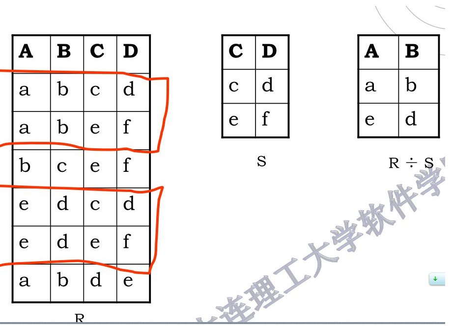
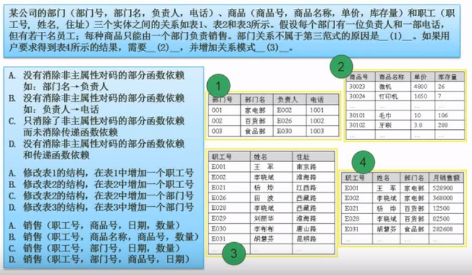
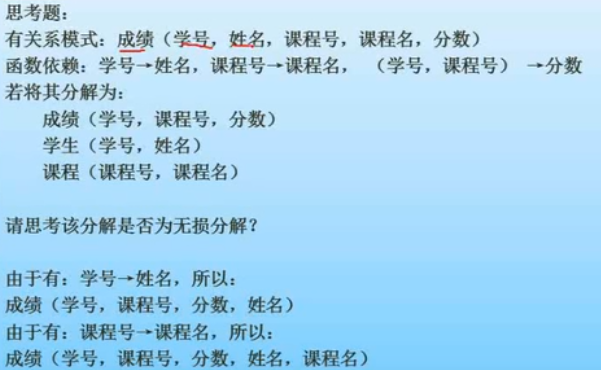

# 数据库技术基础

## 基本概念

### 数据库和数据库系统

一般来说,数据库系统是由 *数据库,硬件,软件和人员*组成的

### 数据库管理系统(DBMS)的功能

1. 数据定义. 使用数据定义语言(DDL)对数据库的结构进行描述.包括外模式,模式和内模式定义.完整性定义,安全和存取权限等.这些定义存储在数据字典中.是DBMS运行的基本依据
2. 数据操作, 使用数据操作语言(DML)实现对数据的增删改查索引等操作.DML分为宿主型和自含型
3. 数据库运行管理
4. 数据的组织,存储和管理.
5. 数据库的维护

### 数据库系统特征和分类

特点

1. 数据结构化切统一管理.
2. 拥有较高的数据独立性
3. 数据控制功能. 安全性,完整性,并发控制.故障恢复

分类

1. 关系型数据库.
2. 面向对象型数据库
3. 对象关系型数据库

### 数据库体系结构

1. 集中式数据库,数据和数据管理都是集中的
2. 客户端/服务器结构
    >* 事物服务器 也称查询服务器.
    >* 数据服务器
3. 并行数据库系统
    >* 共享内存式多处理器
    >* 无共享式并行体系
4. 分布式数据库系统

### 数据库的三级模式

三级模式指的是是巨款管理系统的内部结构: **内模式,模式和外模式**

* 内模式 存储模式. 关注的物理结构的存储.
* 模式也称概念模式.  关注的是数据的逻辑结构. 比如库,表,
* 外模式 对应的是数据库视图.关注的是用户对数据的操作.

两级映像

* 模式/内模式   可以看作数据的存储形式和表之间的关系
* 模式/外模式   可以看作是表和用户操作之间的关系

## 数据模型

数据模型是对现实世界数据特征的抽象.常见的有 概念数据模型(实体-联系模型)和基本数据模型(层次模型,网状模型,面向对象模型等)

### 数据模型三要素

1. 数据结构
2. 数据操作
3. 数据的约束条件

### E-R模型

在ER图中,实体用矩形表示,关系用菱形表示.属性用椭圆表示.

## 关系代数

* **$\bigcup\text{并}$**: 关系R和S**必须有相同的关系模式**,列/属性必须相同才能进行并运算.是记录的运算,结果去重.
* **$\bigcap\text{交}$**: 关系R和S**必须有相同的关系模式**,列/属性必须相同才能进行交运算..是记录的运算
* **$-\text{差}$**: 关系R和S**必须有相同的关系模式**, 差运算有方向,是记录的运算,.R-S就是在R中但是不在S中的记录.
* **$\times\text{笛卡尔积}$**: $C=A\times{B}$笛卡尔积的元组/记录,一半来自关系A,一半来自关系B.笛卡尔积的元数是原来两个关系的元数的和.笛卡尔积的基数是原来两个关系的基数的乘积.
* **$\pi\text{投影}$**: 从关系中选择列的操作,是关系的垂直操作,广义投影允许使用算术运算符进行扩充
* **$\sigma\text{选择}$**: 从关系中选择行的操作,是关系的水平操作.
* **$\bowtie\text{连接}$**: 从笛卡尔积的结果用以一定的条件进行筛选.连接有3种,$\theta$, 等值和自然连接:
  >1. $\bowtie_{x\theta{y}}$ $\theta$连接.,相当与 where x<>y
  >2. $\bowtie_{x={y}}$ 等值连接.相当与 where x=y
  >3. $\bowtie$ 自然连接.相当与把两个关系中相等的属性进行比较.并在结果中去掉重复的属性列.
* **外连接**: 为了保留因为连接而丢失的记录.还有三种外连接: 左外连接,右外连接和全外连接.
* **$\div\text{除}$**:  除是同时进行水平和垂直方向的操作.关系R(X,Y)和关系S(Y,Z)必须有相等的属性组解题方法是:
  >1. 先求关系S在Y上的投影,本例中,Y是C和D.那么关系S在Y上的投影就是(c,d)和(e,f)$\pi_{CD}=\{(c,d),(e,f)\}$
  >2. 再求关系组X的分量的象集.关系组X在本里中是A和B,X在R上分量x就是{(a,b), (b,c), (e, d)}.那他们的象集(象集是指x中的每一个元素在R关系模式下,对应的Y的部分).这些象集是:$CD_{(a,b)}=\{(c,d),(e,f),(d,e)\} ; CD_{(b,c)}=\{(e,f)\} ; CD_{(e,d)}=\{(c,d),(e,f)\}$,这三个象集中,包含(必须包含关系S在Y上的投影$\pi_{CD}$的全部元素)$\pi_{CD}=\{(c,d),(e,f)\}$有$\{(a,b),(e,d)\}$. 因此,$R\div{S}$的结果就是$\{(a,b),(e,d)\}$

**提醒**:

* **除常用来构建从表A中选择属性c等于m或者n的b和c属性这样的问题**.$\pi_{b,c}(A)\div\pi_{c}(\sigma_{c=m\vee{c}=n}(A))$,其中$\pi_{c}(\sigma_{c=m\vee{c}=n}(A))$是从A表中选择c等于m或者等于n的记录的c属性的列作为子查询(会吧c等于m或者n的记录全挑出去然后做c的投影).然后再从表中筛选c属于等于这个子查询结果的b和c的投影.

请仔细看教材课本.关系代数是必考,特别是关系代数和sql查询语句的对应关系

## 关系型数据库SQL

### 常用命令

#### 创建表

```mysql
create table table)name(
    column_name1 data)type limit...,
    ...
    PRIMARY KEY(column_name),  # 主键
    FOREIGN KEY (column_name) REFERENCES table_name2(column_name),  # 外键
)
```

#### 修改和删除表

```sql
alter talbe table_name add new_column_name data_type 约束条件;  # 添加列
alter talbe table_name drop column_name;  # 删除列
alter talbe table_name modify column_name data_type;  # 修改列
drop table table_name;
```

#### 求两个查询结果的交集 intersect	

## 关系型数据库的规范化

### 函数依赖

* 部分函数依赖, 对于$A\rightarrow{B}$如果存在A的一部分a,$a\rightarrow{B}$,则称存在部分函数依赖.通俗的来说,就是A能决定B,如果部分A也能决定B就是B部分依赖A
* 完全函数依赖. A能决定B,不存在部分A能决定B的情况就是B完全依赖A
* 传递函数一来  如果A能决定B,B能决定C,则称C对A有传递函数依赖

### 规范化

候选键要求能后唯一标识实体. 主键是从候选键里选出的
主属性是指在候选键里出现过的属性.

* **第一范式** 属性都是原子的,不可再分.(能决定唯一性的复合主键也是原子的)
* **第二范式**  非主属性对候选键没有部分函数依赖.
* **第三范式** 非主属性对候选键没有传递函数依赖.3NF是对字段冗余性的约束，即任何字段不能由其他字段派生出来，它要求字段没有冗余
* **BC范式**  存在任何字段对任一候选关键字的传递函数依赖则符合第三范式.BC范式既检查非主属性，又检查主属性。p判断的标准是这个关系模式的函数以来的决定因素(左边)必定包含关系模式的候选键.

规范化理论习题



解题

* 第一题, 由于属性都是单值的,所以满足第一范式.部门表(1)的主键是部门号.因而这个主键是单值属性.所以非主属性不存对主属性的部分函数依赖.满足第二范式.这样如果部门表不属于第三范式,那一定是有传递函数依赖(虽然我们不知道这个传递函数依赖是指什么).使用排除法.第一题选3
* 第二题.想得到部门名称,在职工表添加一个部门号即可.选c
* 第三题. 表4中缺少的是商品销售信息.那么需要添加的是和商品有关的信息.c被排除.由于职工信息里有部门号,d中的部门号是多余的,所以d也被排除.而b中的商品名称对商品号来说是冗余信息.所以b也被排除.选a.

### 模式分解

* 无损分解 分解具有无损连接特性.
* 保持函数依赖  分解要保持函数依赖关系
* 既要无损又要保持函数依赖.

模式分解例题



解题:

* 无损且保持函数依赖

### 并发控制

并发控制主要是封锁.基本的封锁手段有排他锁(X锁/写锁),和共享锁(S锁/读锁)