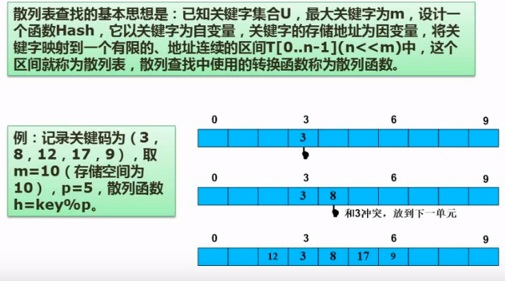
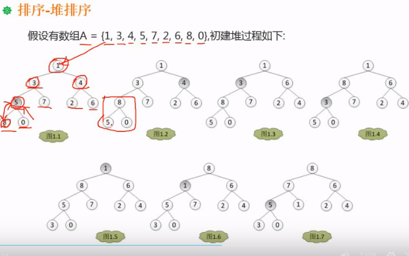

# 数据结构

数据逻辑结构分为线性结构和非线性结构,其中非线性结构最常见的是树和图

## 线性结构

### 线性表

* 按照存储方式分为顺序表和链表.其中链表分为 单链表,循环链表和双向链表
* 插入一个元素需要移动的元素个数是n/2个
* 删除一个元素需要移动的元素个数是(n-1)/2个

单链表中[a,b],将节点a后面插入新节点c.

1. 将节点指针p指向a,节点指针s指向c
2. 将p的next赋值给s的next
3. 将s赋值给p的next

单链表中[a,b,c],将节点b删除.

1. 将节点指针p指向a,节点指针q指向b
2. 将q的next的next赋值给p的next
3. 删除b节点

顺序存储和链式存储

考点

链表的基本操作的顺序(插入节点,删除节点)

### 栈和队列

栈和队列是逻辑概念.可以使用链式或者顺序结构来实现(比如数组).只要能实现先进后出或者先进先出即可.

栈是先进后出,队列是先进先出.
循环队列的最后一个位置不存数据.队尾指针指向的就是这个位置(最后一个数据保存位置的下一位),这个位置用于判断队列是否满?
循环队列的试题,注意队尾指针的位置是否是数据位置+1?这类题的验算可以使用代入法.

习题1
元素按照a,b,c的次序入栈,可能出栈顺序?

解题:
题只提到按照a,b,c的次序入栈,并没有说是要入完再出栈.因此可以是:

* a进a出,b进b出,c进c出.出栈是abc
* ab进,ba出,c进,c出.出栈顺序是bac
* a进a出,bc进,cb出,出栈顺序是acb

例题2

解题:
这道题是用栈和队列构建了一种新的数据类型.是考察栈和队列的基本知识.只要在管道中间能形成答案所描述的顺序即可.这里,我们把四个答案一一带入就能知道:

* A答案 左端入e1,e2,e3,e4. 然后出来顺序是e4,e3,e2,e1
* B答案 左端e1,e2,右端e3, 左端e4. 出来的顺序是e4,e2,e2,e3
* C答案 右端e1,e2,右端e3,e4. 出来的顺序e4,e3,e1,e2
* D答案 无法得到

### 串

串的匹配 KMP算法,尚未在考题中出现 [KMP算法参考](https://blog.csdn.net/FightLei/article/details/52712461)

## 数组,矩阵和广义表

### 数组

特点：

* 数据元素的数目固定
* 元素的类型相同
* 元素下标有序切有上下界限制

基本运算:

* 给定元素下表,存取相应的元素
* 给一组下表.修改数据.

数据存储

由于数组一般不做插入和删除运算,因此一旦定义了数组,则数据结构中的数据元素个数和元素之间的关系就不再发生改变,因此数组是和采用顺序存储.二维数组的存储结构可分为:

* 行为主序
* 列为主序

两种.设每个数据元素占据L个单元,m,n为数组的行和列数.$Loc(a_{11})$表示元素$a_{11}$的地址.那么.

* 行为主序的地址计算公式 $Loc(a_{ij})=Loc(A_{11})+((i-1)\times{n}+(j-1))\times{L}$
* 列为主序的地址计算公式 $Loc(a_{ij})=Loc(A_{11})+((j-1)\times{m}+(n-1))\times{L}$

分类：　一维数组数组，二维数组和多维数组．

主要问题是数组的存储地址的计算.或者行主序/列主序和页面淘汰算法结合起来.计算缺页次数.
注意,除非指明,否则这些**数组的下标都是从0开始的**.

例题１
已知５行５列的二维数组ａ中的各个元素占２个字节，求ａ[2][3]按行有限存储的存储地址？

解题
直接使用上面的计算公公式.结果就是a+

### 矩阵

矩阵的主要讨论的内容是如何在节省存储空间的情况下使矩阵的各种运算能高效的进行.

矩阵中值相同的元素或者0元素在矩阵中的分布有一定的规律,则称此类矩阵为**特殊矩阵**,否则称之为**稀疏矩阵**

#### 特殊矩阵

由于特殊矩阵的非零数值的分布有一定的规律性.所以可以将其压缩存储在一维数组中.常见的特殊矩阵有:*对称矩阵,三角矩阵和对角矩阵等*

#### 稀疏矩阵

矩阵常见的考题是计算矩阵的元素对应的存储数数组中的下表.

例题1

解题: 
由于矩阵的公式计算比较复杂,所以可以使用代入法对答案进行逐个验证.

* 代入A[0][0],和A[1][1],最后得结果是A

### 广义表

广义表是递归的

表的长度和深度的定义.

表头和表尾的定义

## 树

树和二叉树都有递归的特性

### 树和二叉树

#### 树的基本定义

* 节点的度 一个节点的子节点数目,上图中1号节点的度为2,3号节点的度为1,7号节点的度为0
* 树的度  度数最高的节点的值. 上图中节点自大的度就是2.也是树的度
* 叶子节点 度0的节点.也叫终端节点
* 分支节点 度不为0的非终端节点.
* 内部节点 去掉根节点的分支节点.
* 父节点
* 子节点
* 兄弟节点 有同一父节点的节点,彼此称为兄弟节点
* 节点的层次 根节点是第一层
* 树的高度 树的最大层数

#### 二叉树的定义

* 左右子树  二叉树即使只有一个子树,也要定义他是左子树还是右子树
* 满二叉树  没有缺失节点的树
* 完全二叉树 存在节点的编号和满二叉树一致(一般来说,这样的树只是缺失了底部叶子节点的右边部分)

二叉树性质

* 第n层上最多$2^{n-1}$个节点
* 高度为k的二叉树最多$2^{k}-1$个节点
* 具有n个节点的完全二叉树的深度为$\lfloor\log_{2}{n}\rfloor+1$

#### 二叉树的遍历

二叉树可以看成是根节点和左右子树组成的.根据对他们的遍历顺序可以分为前序,中序和后序遍历.另外再加上层次遍历一共四种主要的遍历方法

* 前序遍历 $\text{根节点}\rightarrow\text{左子树}\rightarrow\text{右子树}$.由于左右子树的嵌套特性,所以在每一个子树的时候,也是按照如此的原则.12457836
* 中序遍历 $\text{左子树}\rightarrow\text{根节点}\rightarrow\text{右子树}$.由于左右子树的嵌套特性,所以在每一个子树的时候,也是按照如此的原则.42785136
* 后序遍历 $\text{左子树}\rightarrow\text{右子树}\rightarrow\text{根节点}$.由于左右子树的嵌套特性,所以在每一个子树的时候,也是按照如此的原则.48752631
* 层次遍历 从根节点所在的1层开始,从上到下,从左到右的的一层一层的遍历所有节点. 12345678

例题:
反向构造二叉树,这种题的一般形式是: 给出2种遍历模式的顺序,求二叉树.

答案

#### 树和二叉树的转换

数转换成二叉树的要点

* 每一个节点子节点都会成为这个节点的左子树节点(选择最左边的那个子节点作为这个左子树的根节点)
* 每一个节点的兄弟节点都会成为这个节点的右子树节点(选择最左边的那个兄弟节点作为这个右子树的根节点)

连线法

* 从根节点出发进行连线.
* 如果遇到子节点,只在根节点和左边第一个子节点之间连线.
* 如果遇到兄弟节点.那就画一条水平线把它们连起来.
* 最后展开这个树

#### 最优二叉树(哈夫曼树)

是一种编码方式, 用来文本中记录字符出现的频度.用于信息编码的压缩.是一种无损压缩技术

特点

* 叶子节点是带权的(数值,表示字符出现的频度)
* 叶子节点的路径长度 (从根节点出发到达的节点需要的步数)
* 叶子节点的带权路径是指路径长度*权值

哈夫曼树不计算中间节点只计算叶子节点的带权路径长度.

构造哈夫曼树的方法
集合F$\{n_0,n_1, \dots,n{i}\}$(比如[3, 4, 7, 10, 45, 21, ....])构造一个哈夫曼树.

1. 挑选权值最小的两个元素a,b,作为左右节点.创建一个新元素,权值是这两个元素之和.作为根节点.组成一个二叉树$s_0$.同时从集合F中删除这a,b两个元素.
2. 从集合F中挑选一个权值最小的元素c.构建一个元素e,其权值是二叉树$s_0$的根节点d的权值和元素c的权值之和.然后使用$s_0$和元素c一起,作为左右子树.一起构成子树$s_1$,然后从集合F中删除元素c.很显然$s_0$是$s_1$的子树.
3. 重复2步骤.

#### 线索二叉树

为了遍历优化.分为前序线索二叉树,中序线索二叉树和后序线索二叉树

## 图

图由定点的集合和边的集合组成.分为有向图和无向图

### 图的存储

图的存储有邻接矩阵和邻接表

* 无向图的邻接矩阵是对称的

### 图的遍历

图的遍历方法有深度优先和广度优先两种

### 图的最小生成树

图和树的区别

* 树没有环路,图可能有环路

#### 普里姆算法

1. 从地一个顶点开始(b),寻找一个代价最小的边(c)
2. 再从原来的集合中寻找与1,2顶点相邻且代价最小的边加入(d)
3. 重复步骤2. 
4. 注意,不能形成环路(边=顶点数-1)

普里姆算法时间复杂度与边数目无关,适合求稠密的图的最小生成树

#### 克鲁斯卡尔算法

* 先取出所有的顶点按照原样排列好.
* 然后从图中选择代价最小的边,把顶点连接起来.
* 重复上一步.
* 注意,不能形成环路

克鲁斯卡尔算法时间复杂度与顶点数目无关,适合求稀疏的图的最小生成树

### 拓扑排序

#### AOV和AOE

* 以顶点表示活动,用有向边表示活动之间的优先关系.称这样的有向图是AOV网(Acitivity On Vertex network)*以顶点网络表示活动*.AOV网中不应该有环路.
* 以顶点表示事件.以有向边表示活动.有向边的的权值表示活动的持续时间.这样的图称为AOE网(Acitivity On Edge network)
* **长度最长的路径称为关键路径**.
* 关键路径上的所有活动都是关键活动.

## 查找

### 基本概念

* 查找表: 由同一类型的数据元素组成的集合.
* 查询: 查询某个特定的数据元素是否在查找表中
* 检索: 检索某个特定元素的各种属性
* 插入: 在查找表中插入一个元素
* 删除: 从查找表中删除一个元素
* 关键字: 关键字是数据元素的某个数据项的值.可以用来识别这个数据元素.
* 主关键字: 能够唯一标示一个数据元素的关键词.
* 次关键字: 能够标识多个数据元素的关键字.

### 平均查找长度

关键字和给定的值进行过比较的次数作为衡量查找算法的好坏的依据.这个比较次数的期望值就是查找算法在查找成功时的平均查找长度.

对于长度为n的表.其平均查找长度的公式是$$ASL=\sum_{i=1}^{n}{P}_{i}{C}_{i}$$.$P_i$是对表中第i个记录进行查找的概率一般认为$P_i=\frac{1}{n}$. $C_i$为找到对应记录是和给定的值已进行的比较的次数.

### 静态查找表的查找

通常只进行查询和检索的操作的查找表静态查找表

#### 顺序查找

顺序查找关键字.

* 查找长度: $\frac{(n+1)}{2}$
* 时间复杂度: $O(n)$

#### 折半/二分查找

前提是查找表是有序排列的

1. 根据上下标取中间位置$\lfloor\frac{(min+max)}{2}\rfloor$(从1开始的最小下标和最大下标的和除以2然后向下取整), 整个数组被分为A1=[1, 下标中间值],B1=[下标中间值+1, 下标最大值].
2. 如果关键字比下标中间值小.那就在A2=[1, 下标中间值-1]的区间中重新寻找下标中间值.如果关键字比下标中间值大.那就在B2=[下标中间值+2, 下标最大值]的区间中重新寻找下标中间值. 如此迭代下去.

* 查找长度: $\lfloor\log_{2}{n}\rfloor+1$
* 时间复杂度: $O(\log_{2}{n})$

#### 分块查找

又称索引顺序查找.是对顺序查找的改进, 查找效率介于顺序查找和二分查找之间

1. 先将表中的数据分块,块的内部不要求有序,但块和块之间要求有序.
2. 需要一个索引表,记录每一个块的内部元素的最大值和最小值.
3. 查找时,先根据索引表确定目标元素所在的块.然后在块内进行顺序查找.

* 查找长度: 长度为n,每块元素为s个的表.其查找长度为:$\frac{1}{2}(\frac{n}{s}+s)+1$

### 动态查找表的查找

需要进行插入和删除操作的查找表称为动态查找表

#### 查找二叉树(排序二叉树)

目的是为了提高排序,查询.比较的效率.特点

* 左子树节点都比根节点小.
* 右子树节点都比根节点大

查找二叉树的插入

>不重要,可以用验证法解题

* 若插入的节点值已存在.放弃
* 若被插入的是空树.则以新节点作为根节点
* 每一个插入的节点都和根节点进行比较,决定是插入其左子树还是右子树.如此迭代.

查找二叉树的删除

1. 若待删除节点是叶子节点.则直接删除
2. 若待删除节点是中间节点且只有一个子节点.则直接将这个子节点和待删除的节点的父节点直接相连.
3. 若待删除节点是中间节点且有两个子节点. 则在待删除节点的左子树中,寻找一个数值最大的节点s.用s节点替代待删除节点.同时删除s节点.然后然找上述1,2步骤.迭代的执行.

#### 平衡二叉树

平衡二叉树是为了解决查找二叉树不唯一,查找效率差异大的问题.其特点

* 任意节点的左右子树深度(到叶子节点的距离)相差不超过1.

平衡二叉树的插入和删除可以使用验证法解决

#### B树

B树的定义:

不重要

### 哈希(Hash)表

哈希表通过计算一个以记录的关键字为子变量的函数(哈希函数)来得到该记录的存储地址.
哈希表又称散列表,哈希表主要考虑的两个问题是: 如何构造哈希函数. 如何解决冲突.其中的哈希函数的用途就是制定保存数据的规则,用来生成数据保存的地址.冲突解决就是解决哈希函数生成的数据保存规则重复的问题.常见的冲突解决有线性探测法和伪随机数法

线性探测法
出现冲突时,在冲突的位置向后线性寻找第一个空单元保存

##　排序

每次考试**必考内容**

### 排序的基本概念

* 序列中2个相同值的元素a和b,如果在排序后2者的位置不变,称为稳定排序.
* 序列中2个相同值的元素a和b,如果在排序后2者的位置有可能改变,称为不稳定排序.
* 排序记录全部放在内存中的叫内部排序
* 排序过程中需要对外存进行访问的叫外部排序
* 排序需要进行的2个操作: 比较和移动元素

### 简单排序

#### 直接插入排序

是在插入时进行的排序.插入时,原来的序列是已经排序好的,将插入值和序列中的元素的值一一进行比较,从而找到插入的位置,插入位置后的元素依次向后移动

排序过程

* 初始化, 先将序列中前2个元素组成新序列0进行比较.若逆序,交换位置.
* 其他元素在加入数组得时候,依次和这2个元素进行比较排序.

* 稳定排序
* 时间复杂度$O(n^2)$
* 空间复杂度$O(1)$  *排序过程中只需要一个元素的辅助空间*

#### 冒泡排序

序列$A=\{a_1, a_2,\dots, a_{n}\}$.分别对应的的下标是[1,2,3,...n]

* 将A[1]与A[2]进行比较,若为逆序,交换这两个元素的值(交换$a_1,a_2$,这时候$A[2]=a_1$).若为顺序.则不交换.然后继续比较A[2]和A[3],若为逆序,交换他们的值,顺序不交换.接着比较A[3]和A[4],...重复上述过程一直比较到A[n-1]和A[n].
* 上述过程称为第一趟冒泡排序,结果是值最大的记录被交换到最右边A[n]的位置.
* 然后对前n-1个值进行第二趟冒泡排序[1, n-1].将值第二大的记录交换到A[n-1]的位置.如此循环.
* 如果某一趟冒泡排序过程中没有发现逆序的情况(没有进行相邻位置的值的交换).那么冒泡排序就可以介绍了.冒泡排序最多进行n-1趟冒泡排序.

* 稳定排序
* 时间复杂度$O(n^2)$
* 空间复杂度$O(1)$  *排序过程中只需要一个元素的辅助空间用于元素交换*

#### 简单/直接选择排序

序列A有n个元素,下标从1开始

* 从序列中选一个值最小得元素和A[1]进行交换.如果A[1]就是最小得,这一步略过.
* 这时,A[1]已经是序列中得最小值了.然后在剩余得序列中,选择一个最小值得元素.和A[2]比较(交换).循环这一步.直到剩余序列中只剩下一个.
* 冒泡排序的关键点是链式比较,就像2和3比较完后是3和4的比较.然后是4和5的比较.然后是5和6的比较....中间不能跳过.

* 不稳定排序
* 时间复杂度$O(n^2)$
* 空间复杂度$O(1)$  *排序过程中只需要一个元素的辅助空间用于数组元素值的交换*

### 希尔排序

又称缩小增量排序.是对直接插入排序的改进:
由于直接插入排序的时间复杂度$O(n^2)$.这在序列比较长的时候,效率会比较低下.希尔排序的目标就是要降低直接插入排序的规模来提高效率.采用多次,小规模序列的方式来替代直接插入排序的一次大规模的序列排序.下面举例说明:

序列A=[3, 5, 10, 7, 8, 1, 2, 6, 4, 9]

* 选择一个小于A的长度的数字作为第一次分组的增量d1=5. 依据这个增量,把所有下标(从1开始)和d1得取余运算等与0得放在一个组g0.然后是取余等于1得放一个组g1,一直到取余等与n-1(4)得放一个组g4为止,g0=[8, 9],g1=[3,1], g2=[5,2], g3=[10,6],g4=[7,4](注意,只是分成一组.但是这些元素仍就在序列中原来得位置上).然后对g1~g4分别在组内进行进行简单排序.分组排序后得结果A=[1, 2, 6, 4, 8, 3, 5, 10, 7, 9],你可以观察到数值已经开始按照大小开向2端移动了.
* 选择一个比d1小得增量.再按照取余得结果进行分组.g0=[6, 3, 7], g1=[1,4,5,9],g2=[2,8,10],分组排序后得结果A=[1, 2, 3, 4, 8, 6, 5, 10, 7, 9]
* 最后增量选择1,即所有元素在一组内进行简单插入排序.可以看到A[5]之前得都已经排序好了.在进行直接插入排序得时候,不会对A[5]之前元素进行比较.这样排序得规模就得到了降低

* 不稳定排序
* 时间复杂度$O(n^{1.3})$
* 空间复杂度$O(1)$  *排序过程中只需要一个元素的辅助空间用于元素交换*

### 快速排序

本质上是递归得分治法,通过递归得不断把序列切分成大小两部分.来进行排序.

* 不稳定排序
* 时间复杂度$O(n\log{n})$
* 空间复杂度$O(\log{n})$

### 堆排序

#### 堆的概念

* 所有的子节点都小于根节点称为大顶堆(根节点最大的堆叫大顶堆)
* 所有得子节点都大于根节点称为小顶堆(根节点最小得堆叫小顶堆)

#### 堆的建立过程

以建立大顶堆为例子说明

* 将序列中得元素,从左至右.构建一个完全二叉树.
* 从层级最大,最左得一个非叶子节d点开始,进行如下调整
* 把d和他得两个子节点进行比较.把值最大的节点调整为根节点.如果调整节点后,打破了下层的大顶堆得原则.那也要逐级进行调整.(小顶堆是把最小得调整为根节点)
* 从左至右,从下到上,依次在所有得非叶子节点进行上述调整.直到根节点.

#### 排序

堆排序得排序过程是对已建立的堆的打破和重建的过程.大顶堆还是小顶堆决定了排序的方向是正序还是逆序.下面还是以大顶堆为例进行排序过程的说明

1. 从堆顶取走根节点加入序列.
2. 把堆的最后一个节点移动到堆的根节点得位置.
3. 按照大顶堆的原则对新的根节点进行调整,直至堆中的所有子树都满足大顶堆的要求(根节点最大).
4. 重复1,2,3步骤,直到所有的节点都加入序列.

堆排序适合对大量的元素的TOP N排序.

* 不稳定排序
* 时间复杂度$O(n\log{n})$*不写底数是因为底数在这里并不重要,是多少对结果无影响*
* 空间复杂度$O(1)$  *排序过程中只需要一个元素的辅助空间用于记录大小*

### 归并排序

1. 先将序列中的元素按照一定得大小分组(分组大小>=2),每个分组内部按照从小到大排列.
2. 将分组两两(分组数据A和B)进行对比.对比的方式如下
3. A和B中从头开始进行对比i=1,j=1(下标从1开始).A[i]和B[j]比较大小.
4. 讲比较小的那个复制到新得序列R中.然后被复制的那个下标+1(这里我们假定是A)这时i=i+1.
5. 然后3,4的步骤重复进行比较.直到其中一个分组的元素都被复制到R中.然后再将另一个组的剩余元素复制到R中.
6. 对于2~5的步骤得到得多个R序列,再按照2~5的步骤进行两两的归并.
7. 循环执行2~6的步骤.直到分组被归并成一个序列.这时候,归并排序完成.

* 稳定排序
* 时间复杂度$O(n\log{n})$*不写底数是因为底数在这里并不重要,是多少对结果无影响*
* 空间复杂度$O(n)$  

### 基数排序

不重要,几乎不考

* 稳定排序
* 时间复杂度$O(d(n+rd))$*不写底数是因为底数在这里并不重要,是多少对结果无影响*
* 空间复杂度$O(rd)$  

### 排序得复杂度

必考内容

