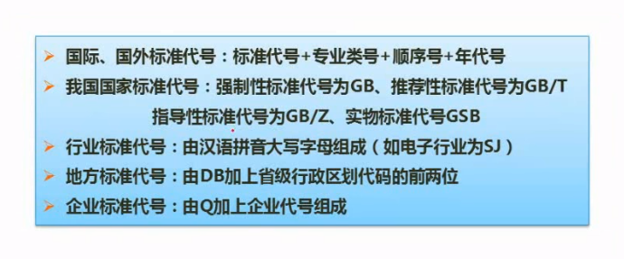
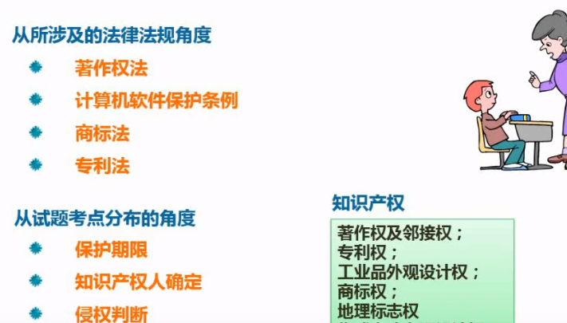
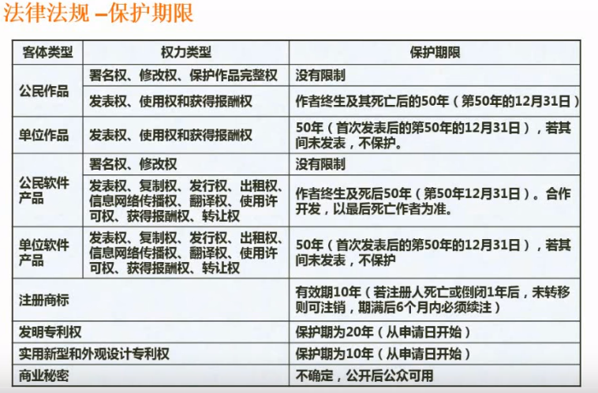
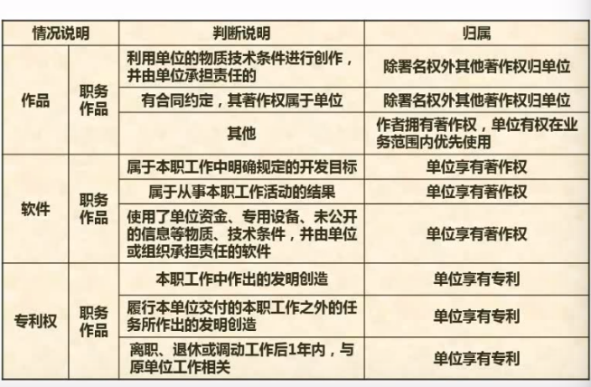
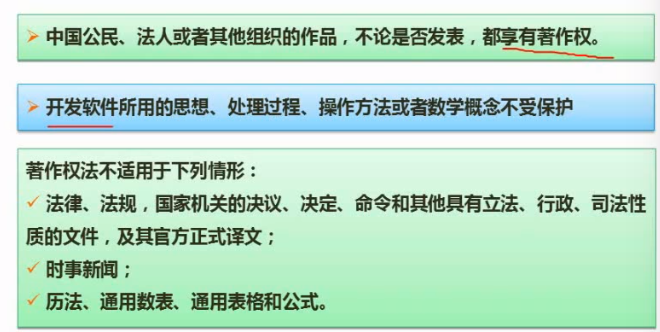
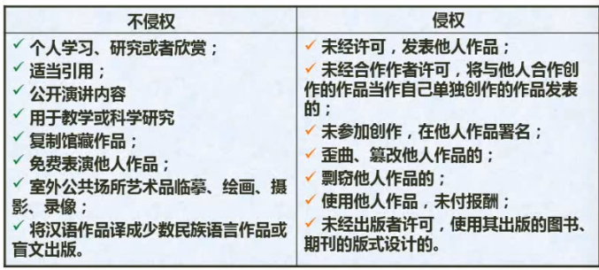

# 标准化和软件知识产权基础知识

## 标准化基础知识

### 基本概念

#### 标准分类

根据制订标准的机构和适用的范围

* 国际标准 ISO/国际标准化组织 IEC/国际点共委员会
* 国家标准 GB ,国家推荐GB/T, ANSI/美国, BS/英国 JIS/日本
* 区域标准 
* 行业标准 GJB/中国军标 MIT-S/美国军标 IEEE/美国电器电子工程师协会
* 企业标准
* 项目规范

根据标准得性质

* 技术标准
* 工作标准
* 管理标准

根据标准的对想和作用

* 基础标准
* 产品标准
* 方法标准
* 安全标准
* 卫生标准
* 环境保护标准
* 服务标准

根据法律的约束

* 强制性标准
* 推荐性标准

#### 标准的编号

## 知识产权

主要考察的是:

* 保护期限.
* 知识产权人判定
* 侵权判定

### 保护期限

保护的对象分为

* 公民作品
* 单位作品

### 知识产权人确定

公司和单位得情况

委托创作,商标和专利的产权人认定

### 侵权判定

* 开发软件所用的思想,处理过程,操作方法或者数学概念虽然不受著作权法的保护.但可以为此申请专利.
* A翻译了一篇法律,在未被官方认定为官方正式译文之前,受著作权法保护.一旦官方认可其为正式的译文,即失去著作权对他的保护
* 免费表演他人的作品,无论是否免费,都必须是别人已经表演过的