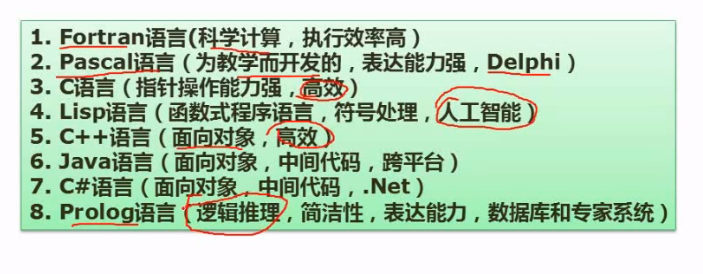
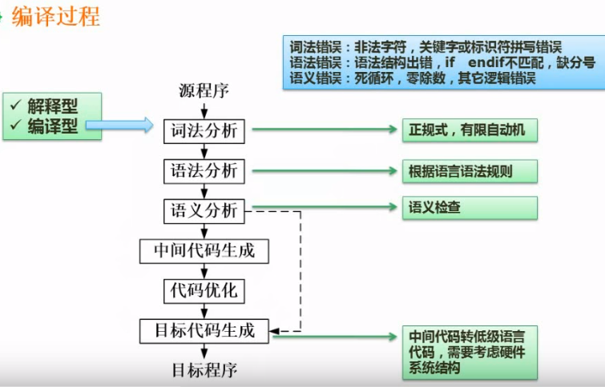
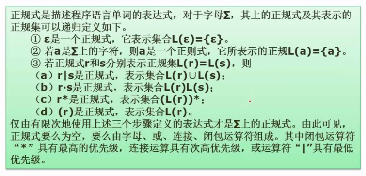
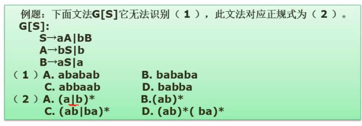
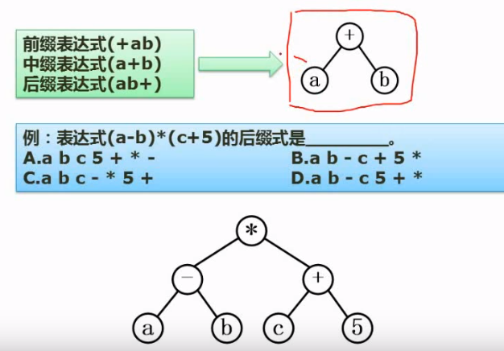

# 程序设计语言基础知识

考点优先级

* 正规式 必考
* 表达式
* 传值和传址

## 概述

* 计算机只能识别由0和1组成的**指令**序列．（机器指令的序列称为机器指令程序）
* 机器指令是最基本的语言
* 用助记符表示的指令称为汇编指令，汇编指令的集合称为汇编语言
* 如果某一种语言不依赖于计算机的硬件,则称为高级语言.
* 高级语言接近于人类语言

### 基本概念

#### 低级语言和高级语言

* 机器语言和汇编语言称为低级语言
* 除低级语言之外的，功能更强，抽象级别更高的语言，称为高级语言

#### 编译程序和解释程序

#### 程序设计语言的定义

一般来说程序设计语言的定义涉及**语法，语义**,**语用**,**语境**等多个方法

* **语法** 语言中的基本符号，关键词及相关的规则称为语法
* **语义**按照语法构成的句子和段落所表达的含义称为语义．语义分为　*静态语义*和*动态语义*
> * 编译时可确定的含义称为静态语义
> * 运行时才能确定的含义成为动态语义

* 语用表示特定语境(上下文中)符号和使用者之间的关系,包括符号的来源,使用的方式和真实意图.
* 语境是指语言的理解和实现的环境,包含编译环境和运行环境.

#### 程序设计语言的分类

程序设计语言有交流算法和计算机实现的双重目的.

* 如果某一种语言不依赖于计算机的硬件,则称为高级语言.
* 如果某一种语言能够用范围广泛的问题求解过程中,则称为**通用**程序设计语言

程序设计语言没有统一的分类标准,一般根据程序语言设计程序的方法把程序语言分为:

* **命令式程序设计语言/结构化程序设计语言**.典型代表:Fortran, Pascal, C等,在这种语言中:.计算被看成是动作的序列./结构化程序设计语言页属于命令式程序设计语言. 其结构化特性表现为: 
> * 自顶至下逐步精化的方法编程
> * 按模块组装的方法编程
> * 程序只包含顺序,判断和循环构造.而且每种构造只允许单入口和单出口.
> * 结构简单清晰,模块化强
* **面向对象的程序设计语言** (比命令式程序设计语言)抽象化机制更高的语言.典型代表:C++, Java,SmalTalk等.典型的面向对象的程序设计语言的技术包括: 数据隐藏,数据抽象, 用户定义类型, 类, 继承和多态等.
* **函数式程序设计语言** 以λ(lambda)演算为基础的语言.典型代表:LISP, Haskell等, 特点是对于表达式中出现的任何函数豆可以用其他函数来代替,只要这些函数调用产生相同的值.(比如LISP中,程序和数据是等价的:数据结构可以作为程序执行,程序也可以作为数据被修改,LISP中大量的使用递归)
* **逻辑型程序设计语言** 以形式逻辑为基础的语言.典型代表:Prolog.Prolog有很强的推理功能,适合数学自动定理证明,专家系统和自然语言理解等方面的程序.

#### 常见得高级语言



### 程序设计语言的基本成分

程序设计语言的基本成分包括: 数据,运算,控制和传输

#### 程序设计语言的数据

程序的数据成分表示了程序中值的组织形式,数据是程序的操作对象,具有**存储类别,类型,名称,作用域,生存期**等属性.使用时需要未它**分配内存空间**.

* **存储类别**说明数据在内存中的位置和生存期
* **类型**说明数据占用内存的大小和存放形式
* **名称**用于标识数据
* **作用域**说明了可以使用数据的代码范围
* **生存期**说明了数据占用内存的时间范围

常量和变量

* 程序运行时,数据的值能改变的叫变量,不能改变的叫常量
* 变量既有左值又有右值,常量只有右值.

全局变量和局部变量

按照作用域范围,数据可分为全局变量和局部变量,系统为全局变量分配的存储空间在程序运行中一般不改变,二为局部变量分配的存储单元是动态改变的.

数据按照组织形式可分为: **基本类型,用户定义类型,构造类型, 其他类型**

#### 程序设计语言的运算

程序的运算成分指明语言允许使用的运算符号和运算规则. 大多数语言的基本运算可以分为:**算术运算,关系运算,逻辑运算, 位运算**等. 运算符号的使用和**数据类型**密切相关, 为了明确运算结果,运算符号需要规定**优先级**和**结合性**,必要的时候使用圆括号.

#### 程序设计语言的控制

程序的控制成分指明语言允许表述的控制结构.程序员使用控制成分来构造程序中的控制逻辑.可计算问题的程序都可以用**顺序,选择,循环**这三种控制结构来描述.

#### 程序设计语言的传输

程序的传输成分指明语言允许的数据传输方式,比如**赋值处理,数据的输入和输出**等.

### 函数

C语言的程序由函数组成,每个函数都有自己的名字,有且仅有一个main函数作为程序运行的起点.函数是于端具有独立功能的程序. 函数的使用涉及三个概念:**函数定义,函数声明,函数调用**

#### 函数的定义

函数的定义包含:**函数首部**和**函数体**.函数的定义描述了函数做什么和怎么做.函数定义的一般格式如下:

```C
返回值的类型 函数名(形式参数的列表)   // 函数的首部
{
    函数体;
    ....
}
```

>C和C++的函数都必须独立定义,不允许嵌套定义函数

#### 函数的声明

函数应该先声明后引用.如果程序中,对一个函数的调用在该函数的定义之前,那么应该在调用之前对被调用的函数进行声明.函数原型用于声明函数.函数声明的一般形式:

```C
返回值的类型 函数名(参数类型列表);

```
> 使用函数原型的目的在于告诉编译器传递给函数的参数的个数,类型,以及函数本身返回值的类型.参数列表中仅需要一次列出函数定义是参数的类型.函数原型可以让编译器更彻底的检查源程序中对函数的调用是否正确

#### 形参和实参

* 定义函数时,写在函数定义的括号里面的是形参.
* 调用函数时,传递给函数的是实参.

#### 函数的调用

函数调用的一般形式为:

```C
函数名(实际参数列表);
```
> C和C++通过传值的方式将实际参数传递给形式参数.函数和调用者之间交换信息的主要方法有2种: 
> 1. **函数通过返回值把运行结果返回给调用者**
> 2. **函数把运行结果附加在参数之上,调用者通过参数取回运行结果**

*函数调用自己的过程称为递归调用*

##### 值调用和引用调用

**值调用**: 如果向函数传递的是参数的值(副本),这称为传值调用.这种方式下,实际参数无法带回函数运行的信息

**引用调用**: 如果向函数传递的是参数的引用(引用是C++的新类型.C语言定义函数的时候形参必须是指针)) 这种情况下, 形参实际上是实参的别名.函数对于形参的访问和修改实际上就是对这个形参对应的实参所做的访问和修改.举例说明:

```C
// C语言
# include <stdio.h>

// 函数定义: 定义一个函数,目的是交换x和y两个参数 *为指针类型
void swap(int *x, int *y)
{
    int temp;
    temp = *x;
    *x = *y;
    *y = temp;
}

// main函数
void main(){
    int X = 5;
    int Y = 6;
    printf("X is %d\n", X);
    printf("Y is %d\n", Y);
    swap(&X,&Y);    // &用于给指针赋值
    printf("X is %d\n", X);
    printf("Y is %d\n", Y);
}
```

## 语言处理程序基础

由于计算机只能识别机器指令序列，所以高级语言需要一个翻译．翻译语言的方式主要分为：

* 汇编
* 解释
* 编译

三种

在翻译的过程中，主要涉及以下几个概念：

* 源程序　*用某种高级语言书写的程序称为源程序，由于计算机只能识别机器指令序列，因此源程序无法直接执行*
* 汇编（这里指的是翻译方式而不是汇编语言）　*把汇编语言的源程序翻译成机器指令的过程称为汇编*
* 解释器　*把源程序翻译成机器指令的程序成为解释器，解释器有２种只要的工作方式：　１．翻译　２．编译*
* 编译　*解释器把源程序翻译成和源程序等价的可独立保存的目标程序，然后交由计算机执行．源程序和解释器<span style='color: red'>不参与程序的执行过程</span>*
* 翻译　*解释器把源程序一段一段翻译成等价的目标代码，然后交由计算机执行，程序运行的控制权在解释器，源程序和解释器<span style='color: red'>全程参与程序的执行过程</span>*

### 汇编程序的基本原理

#### 汇编语言

为特定的计算机或**特定计算机系统**设计的,**面向机器**的,**符号化**的程序设计语言.

#### 汇编程序

汇编程序用于把汇编语言**源程序**翻译成机器能直接执行的机器指令.由于汇编语言指令中形成操作数地址的部分可能出现后面才有定义的符号,所以汇编程序一般需要**两次**扫描源程序才能完成翻译过程.

### 编译程序基本原理



#### 编译过程概述

编译是把某种高级语言书写的源程序翻译成等价的目标程序(汇编/机器语言)的过程. 编译器的工作过程一般可以分为:**词法分析,语法分析,语义分析,中间代码生成,代码优化,目标代码生成**6个阶段

#### 文法和语言的形式描述

对于语言的产生式施加不同的限制,就形成了不同的文法,文法共: *0型,1型,2型,3型*四种.
四种文法从0到3型文法是一种特例化的趋势:

* 1是0型的施加一定限制后的特例,
* 2是在1型的基础上施加限制的特例
* 3是在2型文法基础上施加限制的特例
  
$$\text{3型文法}\subset\text{2型文法}\subset\text{1型文法}\subset\text{0型文法}$$

约定:

1. $\rightarrow$的意思为**定义为**,$\alpha\rightarrow\beta$是$\alpha$定义为$\beta$的意思
2. $\Rightarrow$的意思为**直接推导出**,$\alpha\Rightarrow\beta$是$\alpha$可以直接推导出$\beta$的意思

对于0型文法的限制

引用

>若文法${G}=({V}_{N}, {V}_{T}, {P}, {S})$的每个产生式$\alpha\rightarrow\beta$都有$\alpha\in({V}_{N}\bigcup{V}_{T})^*$,$\alpha$至少包含一个非终结符,且$\beta\in({V}_{N}\bigcup{V}_{T})^*$,则称G为0型文法.
>0型文法也称为短语文法,其能力相当于图灵机,任何0型语言都是递归可枚举的,反之.递归可枚举集也必定是一个0型语言.

限制的通俗解释

>1.产生式左部只要不全是终结符
>2.产生式的右部可以是任意长度字符串(包括空串) 

对于1型文法的限制是在0型文法的基础上

引用

>**除$S\rightarrow\epsilon$这条产生式外.其他的任何产生式,必须满足$\mid\alpha\mid\le\mid\beta\mid$的限制**,也就是说:**除了"开始字符能被替换成空字符"这条产生式外,其他的任何产生式,左部$\alpha$只能被替换成比自己长度大或者等于自己字符串长度的字符串,也就是$\beta$的长度不能小于$\alpha$的长度**
>为因为这类产生式一般的形式是$\alpha_{1}{A}\alpha_{2}\rightarrow\alpha_{1}\beta\alpha_{2}$这种形式.所以1型文法也称为上下文有关文法,非终结符替换要考虑上下文(A替换成$\beta$需要考虑上下文),并且一般不允许被替换成空串(那样会让$\beta$的长度小于$\alpha$的长度)

限制的通俗解释

>1.产生式左部只要不全是终结符
>2.产生式的右部的长度不能小于左部
>3.产生式不包含空串产生式

对于2型文法的限制是在1型文法的基础上

引用

>文法G的任何产生式的形式比如是**形如$A\rightarrow\beta$**,其中:**$A\in{V}_{N}, \: \beta\in({V}_{N}\bigcup{V}_{T})^*$**,也就是:**产生式左部必须是单个非终结符,右部没有限制**
>2型文法也称为上下文无关文法,非终结符替换无需考虑上下文

限制的通俗解释

>1.产生式左部只要不全是终结符
>2.产生式的右部可以是任意长度字符串(包括空串)
>3.产生式的右部的长度不能小于左部
>4.左部必须是单个字符,而且不能是终结符

对于3型文法的限制是在2型文法的基础上

引用

>文法G的任何产生式的形式比如是**形如$A\rightarrow\alpha$或$A\rightarrow\alpha{B}$或${A}\rightarrow{B}\alpha$,其中:$A,{B}\in{V}_{N}$,$\alpha\in{V}_{T} $**, 也就是:**产生式左部必须是单个非终结符,右部长度只能是2或者1,右部如果只有一个字符,那这个字符必须是终结符, 产生式两个字符的顺序是固定的,要么是所有产生式都是终结符在前,要么所有的产生式都是终结符在后,终结符+非终结符 称为右线性, 非终结符+终结符 称为左线性**
>3型文法等价于正规式,也称为正规文法或者线性文法

限制的通俗解释

>1.产生式左部只要不全是终结符
>2.产生式的右部可以是任意长度字符串(包括空串)
>3.产生式的右部的长度不能小于左部
>4.左部必须是单个字符,而且不能是终结符
>5.右部只能有1-2个字符,如果只有一个字符,那么这个字符必然是终结符
>6.所有产生式的右部2个字符的位置是固定的,要么是终结符+非终结符,要么是非终结符+终结符

由于文法之间的关系我们可知,3型文法是2型文法的一种,2型文法是1型文法的一种,所有的文法都属于0型文法,所以我们判断的时候是**以产生式的左边和右边符合的规则,从最复杂的3型进行判断，依次向下判断.**


#### 词法分析

对源程序进行从上到下,从左到右逐个字符进行扫描.依据语言的**词法规则**从中分析出'单词'符号.这些'单词'包括: **关键字/保留字,标识符,常数,运算符,分隔符, 修饰符**等基本语法单位.词法分析过程输出的'单词'常以二元组方式输出.包括'单词'的种类和其自身的值.例如:

 var x, y, z: real; 
 经过词法分析就是 var id1, id2, id3: real; 
 x:=y+z\*60就表示为了id1=id2 id3*60

#### 正规式和有限自动机之间的转换



例题1



解题:

* 第一问用代入法,当我们把babba带入文法时发现.$S\rightarrow{bB}\rightarrow{baS}\rightarrow{babB}\rightarrow$由于B推导不出b开头的串,所以D是文法G无法是别的
* 第二问,我们同样将答案一一进行验算: $(a\mid{b})^*$除了能表达第一问中的ABC之外,连D也能表达,所以和文法G不等价(对应); $(ab)^*$能表示的是ababab...这样得串,不能表示BCD;$(ab\mid{ba})^*$能表示得是ab和ba组合成的串.能表示ABC不能表示D;$(ab)^*(ba)^*$表示的是若干个ab串串联若干个ba串.基本上就是abab...bababa...这样的形式.如果(ba)的星号是0,那就是abab....这样的串.无法表示C描述的串.所以最终的答案是C

这种题解题的关键是一定记得运算符的优先顺序.不要想当然得增加正规式的项.(像$(ab)^*(ba)^*$这样的正规式和$(ab)^*(ba)^*(ab)^*$是不等价的)

#### 表达式

前缀表达式,中缀表达式和后缀表达式

例题



解题

* 括号决定了计算的顺序.由于是后缀表达式,所以运算符是在参与运算的数值的后面.最后答案选D

#### 词法分析器的构造

#### 语法分析

语法分析是**在词法分析的基础上**,根据语言的**语法规则**(各类语法单位的构成规则称为语法规则)将**单词符号序列**分解成各种类型的**语法单位**(例如:表达式,赋值语句等).

* 如果没有语法错误, 那就构造出**语法树**
* 如果有语法错误,那就指出语法错误并给出诊断信息.
  
*词法分析和语法分析都是对**源程序的结构**进行分析*

#### 语法制导翻译和中间代码生成

#### 中间代码优化和目标代码生成

### 解释程序基本原理

#### 解释程序的基本构造

#### 高级语言编译与解释方式的比较