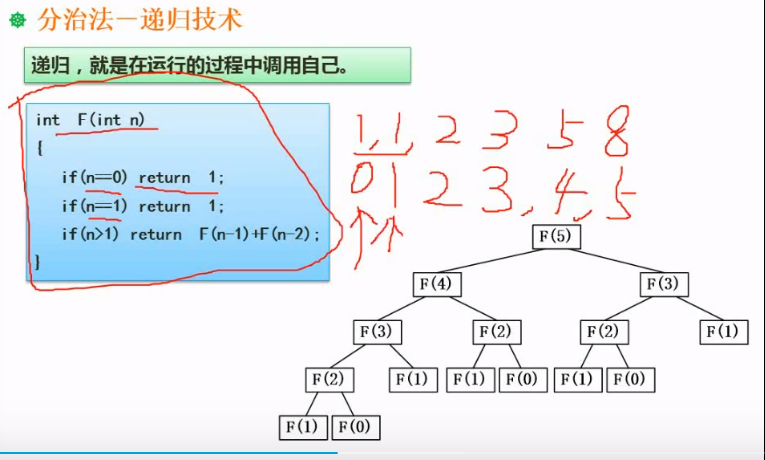
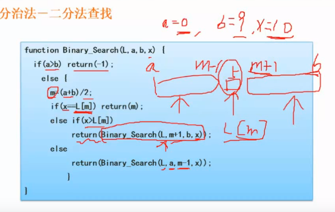
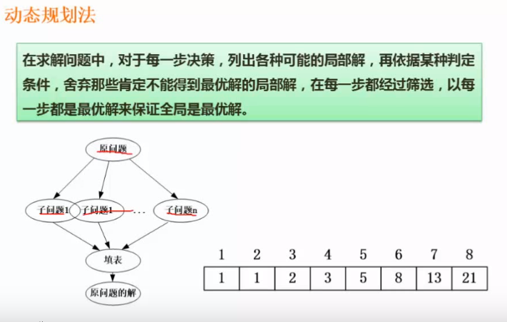

# 算法的设计和分析

## 基本概念

特征

* 有穷性
* 确定性
* 可行性
* 输入
* 输出

选择算法时,首先是算法的正确性,可靠性,简单性和易理解.其次是算法的时间复杂度和空间复杂度.

算法常用的表示方式

* 自然语言
* 流程图
* 程序设计语言
* 伪代码

## 算法分析基础

### 时间复杂度

算法执行了多少次计算(赋值,比较,都算计算操作), 一个算法的时间复杂度,取其中某一段的最高的时间复杂度为准.

有关$\log_{2}^{n}$的时间复杂度的理解.
假设有一个有n个节点的排序二叉树.进行比较.从二叉树的根节点开始,最坏的情况是一直比较到叶子节点才有结果.也就是二叉树最大的一层.根据二叉树的特性可知.二叉树的深度是$\lfloor\log_{2}{n}\rfloor+1$.所以在n个节点的排序二叉树中进行查找的最坏的情况是进行$\lfloor\log_{2}{n}\rfloor+1$次比较.忽略1和向下取整,这个算法的时间复杂度就是$\log_{2}{n}$

### 渐进符号

### 递归式

## 分治法

### 递归的概念

递归2个基本要素:

* 边界条件 即递归何时终止?也成为递归出口.
* 递归模式 即大问题是如何分解成小问题的.也称为递归体

### 分治法的基本思想

分治法一般步骤:

* 分解,
* 求解
* 合并

### 递归分治法实例

上图是一个求数列的函数,这个数列:

* 第一个值是1,(n从0开始的)
* 后面的值都是之前的2个值的和.

右下角的递归树演示了任务的拆分过程.

### 分治法在二分查找法中的运用

上图中:

* L是数组.a为数组下标下限(0),b为数组下标上限(-1,查到头了没有找到). x是待查找的值.

## 动态规划法

动态规划法基本思想也是将待求解的问题划分成若干自问题,先求解自问题.然后从自问题的解得到原问题的解.
动态规划法和分治法不同的是:

* 适合用动态规划法的问题,分解后的子问题往往不是独立的.这种情况,无法使用分治法.需要先把这些子问题的解先保存下来.在往后的运算中查表来使用这些子问题的解.
* 构造这个存储子问题结果的表,是动态规划法的关键

## 回溯法

俗称 通用解题法. 可以系统的搜索一个问题的所有解或者任一解.回溯法是一个既有系统性又带有跳跃性质的搜索算法.它在包含问题所有解的解空间树里,按照深度优先的策略,从根节点出发搜索解空间树.算法搜索至解空间树的任一节点时,总是线判断该节点是否肯定不包含问题的解?如果肯定不包含,则跳过以该节点为根节点的字数的搜索.逐层向其祖先节点回溯.否则进入该子数.继续按照深度优先的策略搜索.
如果求所有的解.必须回溯到根节点.且根节点的所有子树都已经搜索过了才结束.
如果求任一解.则只要搜索到一个问题的解就可以结束了.
回溯法适合解一些组合树较大的问题.

