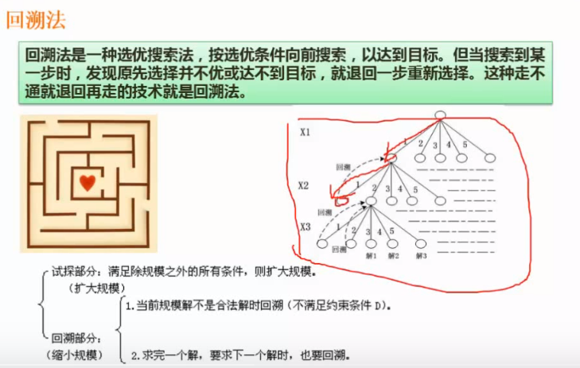
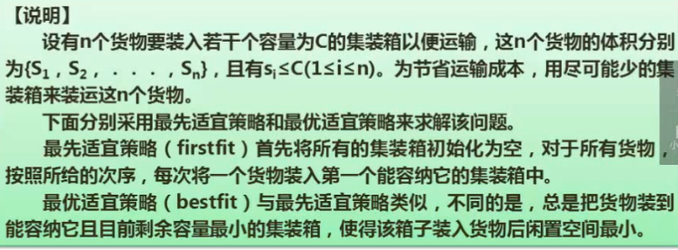
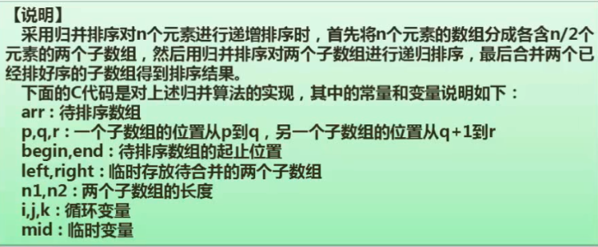

# 算法的设计和分析

## 基本概念

特征

* 有穷性
* 确定性
* 可行性
* 输入
* 输出

选择算法时,首先是算法的正确性,可靠性,简单性和易理解.其次是算法的时间复杂度和空间复杂度.

算法常用的表示方式

* 自然语言
* 流程图
* 程序设计语言
* 伪代码

## 算法分析基础

### 时间复杂度

算法执行了多少次计算(赋值,比较,都算计算操作), 一个算法的时间复杂度,取其中某一段的最高的时间复杂度为准.

有关$\log_{2}^{n}$的时间复杂度的理解.
假设有一个有n个节点的排序二叉树.进行比较.从二叉树的根节点开始,最坏的情况是一直比较到叶子节点才有结果.也就是二叉树最大的一层.根据二叉树的特性可知.二叉树的深度是$\lfloor\log_{2}{n}\rfloor+1$.所以在n个节点的排序二叉树中进行查找的最坏的情况是进行$\lfloor\log_{2}{n}\rfloor+1$次比较.忽略1和向下取整,这个算法的时间复杂度就是$\log_{2}{n}$


### 渐进符号

### 递归式

## 分治法

### 递归的概念

递归2个基本要素:

* 边界条件 即递归何时终止?也成为递归出口.
* 递归模式 即大问题是如何分解成小问题的.也称为递归体

### 分治法的基本思想

分治法一般步骤:

* 分解,
* 求解
* 合并

### 递归分治法实例


上图是一个求数列的函数,这个数列:

* 第一个值是1,(n从0开始的)
* 后面的值都是之前的2个值的和.

右下角的递归树演示了任务的拆分过程.

### 分治法在二分查找法中的运用


上图中:

* L是数组.a为数组下标下限(0),b为数组下标上限(-1,查到头了没有找到). x是待查找的值.

## 动态规划法

动态规划法基本思想也是将待求解的问题划分成若干自问题,先求解自问题.然后从自问题的解得到原问题的解.
动态规划法和分治法不同的是:

* 适合用动态规划法的问题,分解后的子问题往往不是独立的.这种情况,无法使用分治法递归解决.而是需要先把这些子问题的解先保存下来.在往后的运算中查表来使用这些子问题的解.
* 构造这个存储子问题结果的表,是动态规划法的关键.
* 动态规划法和分治法最大的区别就是动态规划法会使用大量的代码来建表和查表


## 贪心法

贪心法的特点就是一般无法获得全局最优解(只能是在某种程度上令人满意的解).
贪心法最常用的是解决背包问题


## 回溯法

俗称 通用解题法. 可以系统的搜索一个问题的所有解或者任一解.回溯法是一个既有系统性又带有跳跃性质的搜索算法.它在包含问题所有解的解空间树里,按照深度优先的策略,从根节点出发搜索解空间树.算法搜索至解空间树的任一节点时,总是线判断该节点是否肯定不包含问题的解?如果肯定不包含,则跳过以该节点为根节点的字数的搜索.逐层向其祖先节点回溯.否则进入该子数.继续按照深度优先的策略搜索.
如果求所有的解.必须回溯到根节点.且根节点的所有子树都已经搜索过了才结束.
如果求任一解.则只要搜索到一个问题的解就可以结束了.
回溯法本质上就是深度优先的试探,适适合解一些组合树较大的问题.比如迷宫问题.



## 例题

###集装箱问题




分析题干

注意,原题代码中temp>0有误,实际应该是temp>=0

* 问题3的9和10可以使用代入法求得.最后的结果分别是5和4.


* 题中提到了最先和最优两种算法.可以注意这2种算法都是在基于每一次考虑最先或者适合.因此这种基于局部最优的算法是贪心法.贪心法的特点就是无法获取全局最优解.所以第三问11选择否.
* 第二问的5和6都是贪心法.7和8是计算时间复杂度.需要看待码实现.2种实现的代码的for和while的最大嵌套都是2层,而且2层的嵌套都和变量n相关(题干直到集装箱有n个).所以时间复杂度都是$O(n^2)$
* 第一问.根据题干中说明的代码逻辑.1是把j初始化,j=0(k是已使用的集装箱索引的下标). 让while循环在b(待装入的集装箱序列)中寻找一个能装下当前货物的集装箱.2是b[j]=b[j]+s[i]. 算法2的内部循环是循环b.3是当发现有集装箱可以放下当前货物时,就更新当前的最小值min并记录下当前集装箱.min=temp(temp是当前集装箱装完当前货物所剩余的空间). 当内层循环本轮循环结束后.m的值就是当前用来存储当前货物s[i]的集装箱b[m]=b[m]+s[i]. 接下来是用python实现的最佳匹配算法,用于理解.

```python
n = 10
C = 10
s = [4, 2, 7, 3, 5, 4, 2, 3, 6, 2]


def test():
    k = 0
    """初始化一个全为0的长度为n的数组.用来可能需要用到集装箱序列"""
    b = [0 for i in range(n)]
    for i in range(n):
        """
        变量mi用于内层循环比较每个集装箱装完货物后的剩余空间
        min是关键字,用mi替代 
        """
        mi = C
        m = k + 1  # 当前用到了第几个集装箱?
        """循环已用的(包含当前的)集装箱序列,k+1是当所有已用的箱子都放不下时.新开一个箱子"""
        for j in range(k + 1):
            temp = C - b[j] - s[i]  # 当前集装箱装入货物后剩下的容量
            if 0 <= temp < mi:
                """
                如果当前集装箱的剩余空间装的下货物:
                temp > 0 就是集装箱的剩余空间足够.
                由于mi的初始值是最大10,所以只要装的下货物的集装箱.装完后的剩余空间
                每次和mi比较,比mi小的话就给mi赋值.否则就忽略.这样就保证了
                0 <= temp < mi 条件满足的,总是已知mi最小(且为正数)的情况.
                就是最小的(最佳匹配)
                temp < mi 每次赋值其实就是在比较哪个集装箱是装完货物后最小的
                """
                mi = temp
                m = j
            else:
                """
                这里是装不下货物的temp<0和装完后剩余空间不是最小的tem>mi情况.
                注意: 这个mi是上一次内循环被赋值的,如果j=0,那么这个mi就是在
                外层循环中被初始化的
                """
                pass
        b[m] = b[m] + s[i]
        k = k if k > (m + 1) else (m + 1)
    return k
```

### 规并排序问题




解题

第二问　递归式 T(n)=2T(n/2)+O(n) 时间复杂度是$O(n\log_2^n)$
