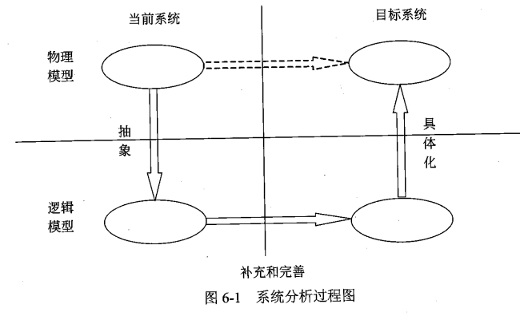

# 结构化开发方法

结构化开发方法由结构化分析,结构化设计和结构化程序设计构成.是一种鸟面向数据流的开发方法.
结构化开发的指导思想是自顶向下,逐层分解.
结构化开发的基本原则是分解与抽象.
结构化开发特别适合数据处理领域的开发.但是不适合大规模的,特别复杂的项目.
结构化开发的难以适应需求的变化.

* 结构化分析 根据分解与抽象的语言则,按照系统中数据处理的流程.用数据流图来建立系统的功能模型.从而完成需求分析工作.
* 结构化设计 根据模块独立性准则,软件结构优化准则将数据流图转换成软件的体系结构.使用软件结构图来建立系统的物理模型.实现系统的概要设计.
* 结构化程序设计 使用顺序,选择和重复三种基本的控制结构构造.

## 系统分析与设计概述

### 系统分析的目的和任务

系统分析阶段的主要工作: 

1. 对当前系统进行调查,收集信息.
2. 建立当前系统的逻辑模型.
3. 对现状进行分析,提出改进意见和新系统应该达到的目标.
4. 建立新系统的逻辑模型.
5. 编写系统方案说明书

### 系统设计的基本原理

#### 抽象

抽象是一种设计技术,用来将复杂的现象简化.抽象有多个层次. 抽象的最底层就是程序代码

#### 模块化

将软件分解成若干个小的简单部分---模块.每个模块可以独立的开发,测试.最后把这些模块组装成完整的程序.
模块化的目的是让程序结构清晰,容易阅读,理解,测试和修改.

#### 信息隐蔽

定义模块的时候,尽可能的少暴露其内部的处理.在划分模块时,将一个可能变化的因素隐蔽在某个模块的内部.使其他模块和这个因素无关. 当这个因素发生变化时,只需要修改包含这个因素的模块即可.
信息隐蔽的原则可以提高软件的可修改性,可测试性和可移植性

#### 模块独立

每个模块完成一个相对独立的特定子功能并与其他模块之间联系简单.衡量模块独立程度的两个标准: 耦合性和内聚性. 
在划分模块时,尽量做到高内聚,低耦合.以提高模块的独立性.

##### 耦合

1. 无直接耦合 互相之间没有消息传递
2. 数据耦合  模块之间使用简单的传值传递数据
3. 标记耦合 模块之间使用数据结构传递数据
4. 控制耦合 模块之间使用传递的是控制变量.也就直接调用对方模块的方法和类
5. 外部耦合
6. 公共耦合
7. 内容耦合  一个模块直接使用另一个模块内部的数据.最高级别的耦合

##### 内聚

1. 偶然内聚 模块内的元素没有任何联系.只是放在一个模块内部了而已.最低级别的内聚
2. 逻辑内聚 模块内部聚集的是若干个逻辑相似的功能.
3. 时间内聚 需要同时执行的侗族组合在一起的模块称为时间内聚模块.
4. 过程内聚 把按照指定的过程执行的多个任务放在一个模块内称为过程内聚