# 结构化开发方法

结构化开发方法由结构化分析,结构化设计和结构化程序设计构成.是一种鸟面向数据流的开发方法.
结构化开发的指导思想是自顶向下,逐层分解.
结构化开发的基本原则是分解与抽象.
结构化开发特别适合数据处理领域的开发.但是不适合大规模的,特别复杂的项目.
结构化开发的难以适应需求的变化.

* 结构化分析 根据分解与抽象的语言则,按照系统中数据处理的流程.用数据流图来建立系统的功能模型.从而完成需求分析工作.
* 结构化设计 根据模块独立性准则,软件结构优化准则将数据流图转换成软件的体系结构.使用软件结构图来建立系统的物理模型.实现系统的概要设计.
* 结构化程序设计 使用顺序,选择和重复三种基本的控制结构构造.

## 系统分析与设计概述

### 系统分析的目的和任务

系统分析阶段的主要工作:

1. 对当前系统进行调查,收集信息.
2. 建立当前系统的逻辑模型.
3. 对现状进行分析,提出改进意见和新系统应该达到的目标.
4. 建立新系统的逻辑模型.
5. 编写系统方案说明书

### 系统设计的基本原理

#### 抽象

抽象是一种设计技术,用来将复杂的现象简化.抽象有多个层次. 抽象的最底层就是程序代码

#### 模块化

将软件分解成若干个小的简单部分---模块.每个模块可以独立的开发,测试.最后把这些模块组装成完整的程序.
模块化的目的是让程序结构清晰,容易阅读,理解,测试和修改.

#### 信息隐蔽

定义模块的时候,尽可能的少暴露其内部的处理.在划分模块时,将一个可能变化的因素隐蔽在某个模块的内部.使其他模块和这个因素无关. 当这个因素发生变化时,只需要修改包含这个因素的模块即可.
信息隐蔽的原则可以提高软件的可修改性,可测试性和可移植性

#### 模块独立

每个模块完成一个相对独立的特定子功能并与其他模块之间联系简单.衡量模块独立程度的两个标准: 耦合性和内聚性.
在划分模块时,尽量做到高内聚,低耦合.以提高模块的独立性.

##### 耦合

1. 无直接耦合 互相之间没有消息传递
2. 数据耦合  模块之间使用简单的传值传递数据
3. 标记耦合 模块之间使用数据结构传递数据
4. 控制耦合 模块之间使用传递的是控制变量.也就直接调用对方模块的方法和类
5. 外部耦合
6. 公共耦合
7. 内容耦合  一个模块直接使用另一个模块内部的数据.最高级别的耦合

##### 内聚

1. 偶然内聚 模块内的元素没有任何联系.只是放在一个模块内部了而已.最低级别的内聚
2. 逻辑内聚 模块内部聚集的是若干个逻辑相似的功能.
3. 时间内聚 需要同时执行的侗族组合在一起的模块称为时间内聚模块.
4. 过程内聚 把按照指定的过程执行的多个任务放在一个模块内称为过程内聚
5. 通信内聚 模块内所有的处理元素都在同一个数据结构上操作.或者使用相同的输入或者产生相同的输出
6. 顺序内聚 模块内的各个元素都与同一功能相关且必须顺序执行.
7. 功能内聚 最强内聚.所有元素都共同完成同一功能,缺一不可.

### 系统总体设计

#### 系统设计原则

* 分解-协调原则
* 自顶向下原则
* 信息隐蔽,抽象的原则
* 一致性原则 设计过程要有统一的规范,统一的标准和同一的文件模式
* 明确性原则 每个模块必须功能明确,接口明确,消除多余,重复的无用接口
* 模块的扇入和扇出系数要合理 扇出通常是3,4不超过.菜单型扇入扇出可以大一些.共用模块的扇出扇入系统可以大一些.
* 模块的规模要适当 过大的模块表示系统分解的不充分.过小的模块有可能降低模块的独立性.提高系统接口的复杂度.

#### 子系统划分

子系统划分的原则

* 子系统要相对独立
* 子系统之间的数据依赖尽量小
* 子系统划分的结果应该使应该数据冗余较小.
* 子系统的设置应该考虑今后管理发展的需要
* 子系统的划分应当便于系统分阶段实现
* 子系统的划分应该考虑到各类资源的充分利用 搭配各种资源的使用.减少对某一种资源的过分依赖,减少输入输出和通讯压力.

子系统结构设计

子系统结构设计的任务是确定划分后的子系统模块结构.画出模块结构图.
需要考虑的问题是:

* 每个子系统如何划分成多个模块
* 如果确定子系统之间的数据传递和调用关系
* 如何评价并改进模块结构的质量
* 如何从数据流图导出模块结构图

#### 系统模块结构设计

模块4要素

* 输入和输出 模块的输入和输出都是同一个调用者
* 处理功能 
* 内部数据
* 程序代码

结构化设计阶段,只考虑模块的外部特性,也就是输入和输出,和处理功能

模块结构图的设计原则

* 划分的模块的内聚性要强,模块之间的联系要少,即模块具有较强的独立性
* 模块之间的连接只能存在上下级的调用关系,不能有同级之间的横向联系.(结构化设计中,同级之间不互相依赖)
* 整个系统呈现树状结构,不允许网状或者交叉调用关系存在
* 所有模块斗必须严格分类编码存档

模块结构图主要关心模块模块的外部树属性.不关心模块的内部.
模块结构由:*模块,调用,数据,控制信息和转接符号*5种基本符号构成.

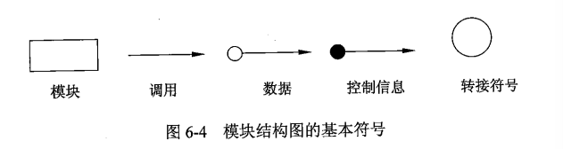

其中的调用又存在 (普通)调用,判断调用和循环调用(菱形代表判断,弧形箭头表示循环)

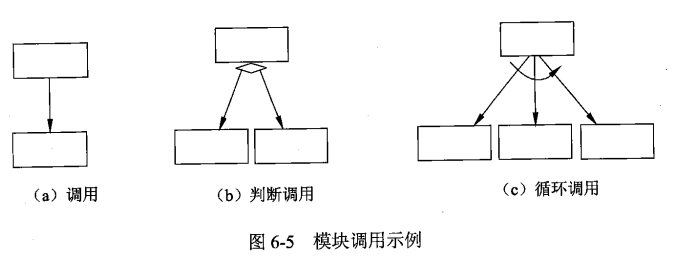

#### 数据存储设计

* 数据资源分布
* 数据的安全保密

### 系统文档

* 用户与系统分析人员在系统规划和系统分析阶段通过文档进行沟通.相关文档是: 可行性报告,总体规划报告,系统开发合同和系统方案说明书
* 系统开发人员与项目管理人员在项目期内进行沟通.相关文档 系统开发计划,系统开发月报,系统开发总结等
* 测试和开发人员.
* 开发和维护人员
* 开发和用户
* 维护人员和用户

## 结构化分析

结构化方法分三大部分

* 结构化分析(Structured Analysis, SA)
* 结构化设计(Structured Design, SD)
* 结构化程序设计(Structured Programming Design SPD)

### 结构化分析方法概述

抽象和分解是处理复杂问题的两个基本手段
结构化方法的分析结果:

* 一套分层的数据流图
* 一本数据字典
* 一组加工逻辑说明
* 补充材料

### 数据流图(DFD)

#### 数据流图的基本元素包括

* 数据流 
* 加工 至少有一个输出和输入
* 数据存储 数据流入表示写操作,流出表示读操作,双箭头表示修改
* 外部实体 软件系统外的人员或者组织

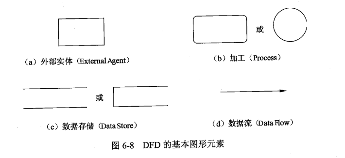

描述数据流之间的扩展符号:

* 星号$*$ 表示数据流之间存在与的关系.如果是输入流表示全部输入流到达后才能开始加工.如果是输出流表示加工结束后将同时生成所有的输出流.
* 加号$+$ 表示或的关系. 如果是输入溜,表示任何一个输入流到达后加工就可以开始了.如果是输出流表示加工至少能产生其中一个输出流.
* 异或$\oplus$ 表示互斥关系.如果是输入流表示当且仅当其中一个输入流到达后才能开始加工.如果是输出流表示加工的结果只能产生这些输出流中的一个.

#### 数据流的层次结构

顶层图通常只有一个加工,也就是待开发的软件本身.
顶层图的数据流就是系统的输入输出数据流.
顶层图通常没有数据存储

典型的数据流图

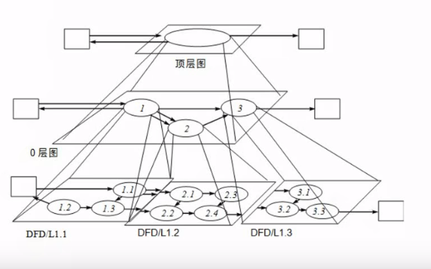

数据字典说明

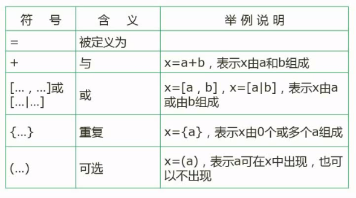

#### 数据平衡的原则

* **父图和子图之间的平衡** 父图中有的数据流,子图中不能缺失. 在子图中进行检查时,既要检查数据流的有无,又要检查数据流的方向.
* **子图内部的平衡** 对于加工而言,数据流既要有流入,又要有流出.

#### 数据流图答题技巧

* 详细阅读文字描述
* 严格遵守数据平衡原则

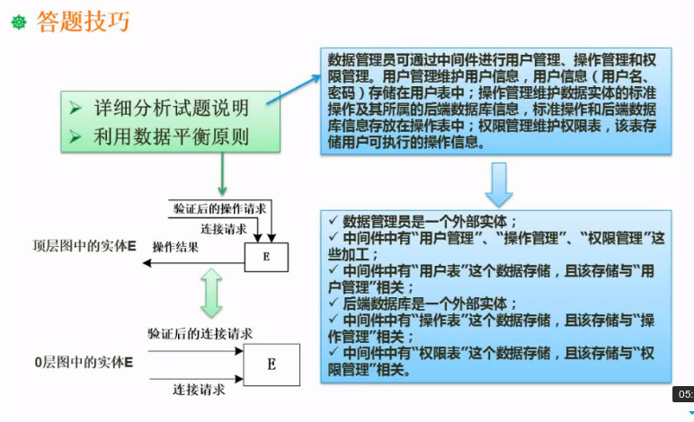

把题干的文字描述拆成子句子(一般利用分号或者句号分割),你会发现他们所描述所的内容(中间件是我们开发的系统的名称):

* *"数据库管理员可以通过中间件进行用户管理,操作管理和权限管理,用户管理维护用户信息,用户信息(用户名,密码)存储在用户表中;"*: "数据库管理员可以通过中间件进行..."说明数据库管理员是外部实体."..进行**用户管理,操作管理**和**权限管理**.."说明用户管理,操作管理,和权限管理是加工. "用户信息(用户名,密码)存储在用户表中"说明用户信息是一个数据存储.至少包含用户名和密码两个字段.
* *"操作管理维护数据实体的标准操作及其所属的后端数据库信息, 标准操作和后端数据库信息存放在操作表中;"*.由于我们开发的是数据库中间件,所以后端数据库是一个外部实体.操作管理这个加工会有一个数据流叫标准操作,其保存在操作表中,操作表是一个数据存储.其流入的数据流有2个,除了标准操作外,还有后端的数据库信息.
* *"权限管理维护权限表,该表存储用户可执行的操作信息."*.加工权限管理有一个数据流操作信息,流入数据存储权限表

##### 例题1

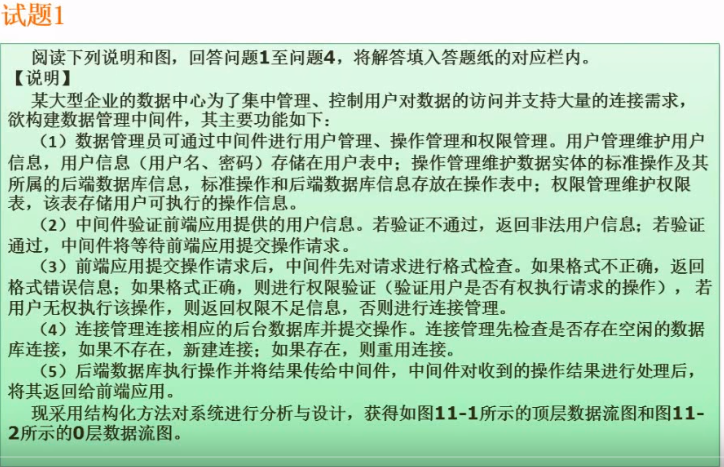
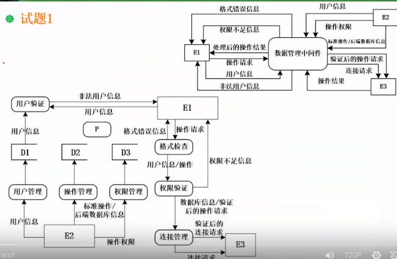
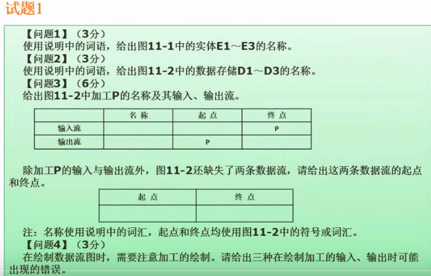

解题:
通过题干干和数据流图的分析,我们可以得知:

* 数据库管理员是外部实体.
* 数据库管理员可以操作的加工是: 用户管理,操作管理和权限管理.
* 用户管理对应的数据存储叫用户表.用户表至少有用户名和密码两个字段.
* 后端数据库是外部实体
* 操作管理(加工)维护的标准操作保存在一个叫操作表的数据存储里.
* 权限管理对应的数据存储叫权限表,权限表维护用户权限
* 后端数据也有数据流流入操作表,操作表维护的是标准操作(用户可以执行具体操作)
* 前端应用是外部实体
* 前端应用有一条流入中间件的数据流是用户信息.中间件对应前端流入的用户信息数据流的加工是用户验证.验证失败会返回非法用户信息的数据流.
* 前端应用有一条操作请求的数据流流入中间件.流入后会首先经过一个叫格式检查的加工.格式检查不通过,会返回一条叫格式错误的数据流.格式正确的话,下一个加工是权限验证(检查用户权限和所执行的操作).权限验证失败的,会返回一个权限不足的数据流.成功则下一个加工是连接管理.
* 连接管理连接外部实体后端数据库.
* 后端数据库执行操作管理送来操作后会将结果返回中间件.中间件会将结果返回前端应用.

第一问 : E1是前端应用,E2是数据库管理员,E3是后端应用
第二问: D1是用户表,D2是操作表,D3是权限表
第三问: 检查顶层图会发现0层图少了一个E3(后端数据库)到数据库中间件的*操作结果*数据流,同时,也少了一条数据库中间件到前端应用的*处理后的操作结果*数据流.因此,输入流是名称是操作结果,起点后端数据库,终点是P, 输出流的名称处理后的操作结果,起点是P重点是前端应用;在中间件检查完用户操作格式后,有一个权限验证的问题.这个需要用到用户权限表检查权限和具体可执行的操作.因此缺失的数据流是 D3权限表到权限检查和D2操作表到权限检查
第四问: 数据流不平衡. 有数据流流入但是没有流出, 有数据流流出没有数据流流入. 数据流重复或者错误.或者数据流方向数据.

##### 例题2

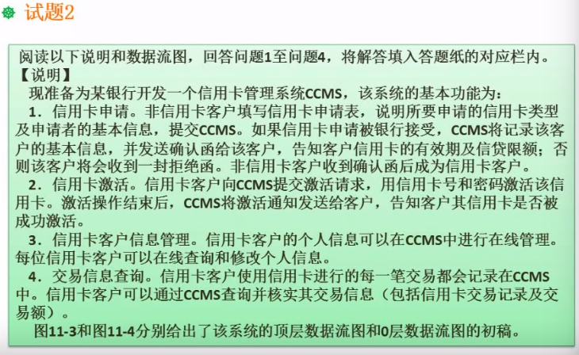
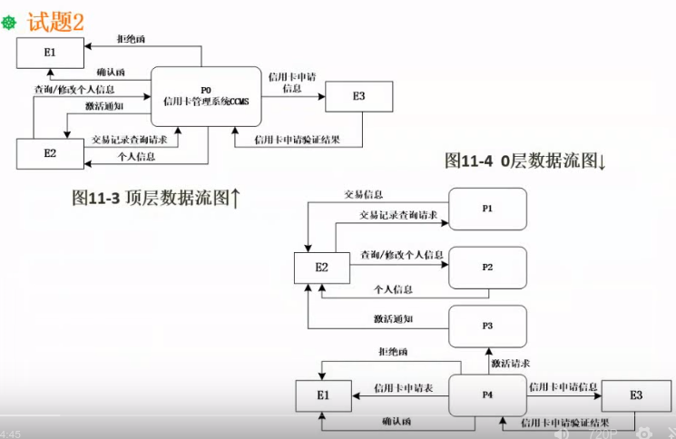
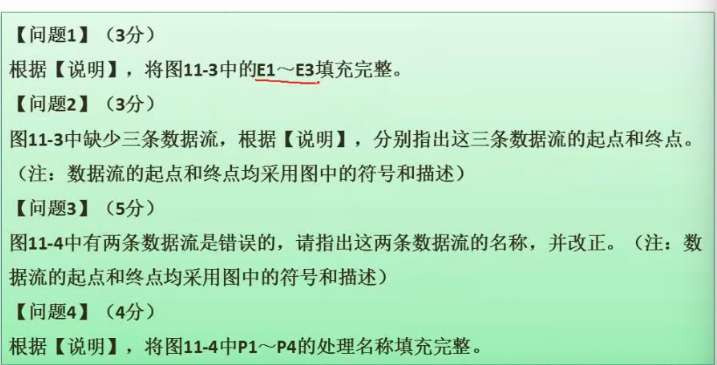

解题:
通过对题干和数据流图的分析我们可以得知:

* 我们开发的这个系统叫CCMS,是一个信用卡管理系统
* 信用卡申请流程: 非信用卡是外部实体. 有个叫信用卡申请表的数据流,从非信用卡用户流向CCMS.CCMS有一个记录申请信息的加工.如果被申请如果被银行受理.并返回一个叫确认函的数据流给非信用卡用户.或者返回一个叫拒绝函的数据流.
* 银行是外部实体
* 信用卡激活流程: 信用卡用户有一个激活请求的数据流流向CCMS.CCMS有一个激活通知流向信用卡用户
* 信用卡用户有一条在线管理的数据流流向CCMS.数据流包含在线查询和修改个人信息
* 信用卡用户有一条查询交易信息的数据流流向CCMS

第一问: E1是非信用卡用户.E2是信用卡用户.E3是银行
第二问: 逐句阅读题干,按照业务逻辑一步步检查: 在信用卡申请流程中,在顶层图缺失了信用卡申请数据流.从E1,到P0; 在性用卡激活流程中,顶层图缺少了一个信用卡激活申请.从E2到P0.在交易信息查询中.少了查询交易信息的返回数据.叫交易信息,从P0到E2.
第三问: 错误的数据流可能是名称不对,起点终点不对.方向不对.检查错误的数据流必须在第二问回答正确的基础之上: 0层图中,信用卡申请表数据流方向错误.应该是E1到P4; 0层图中的激活请求与顶层图中不符.应该是从E2到P0. 激活请求的起点错误.也就是从E1到P3.
第三问: P4是信用卡申请. P3是信用卡激活.P2客户信息管理,P1是交易信息查询