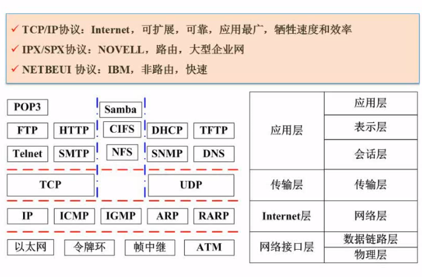

# 网络和信息安全

## 网络概述

### ISO/OSI模型

* **应用层**: 具体功能的实现
* **表示层**: 数据的格式与表达,加密/解密,压缩
* **会话层**: 报文. 建立和终止会话
* **传输层**: 报文. 端到端连接  TCP.UDP
* **网络层**: 包, 分组传输和路由选择 ,三层交换机.路由器. ARP/RARP, IP, ICMP,IGMP
* **数据链路层**: 帧, 传输以帧为单位的信息  网卡,交换机,网桥. PPTP,L2TP,SLIP,PPP
* **物理层**: 比特, 二进制传输. 中继器,集线器

#### 网络协议

#### ip地址分类

#### 子网划分

例题1

将B类地址168.195.0.0 划分成27个子网,子网掩码是多少?

解题

* 划分子网的问题,考虑的是网络位从主机位借多少的问题?
* $2^4<27<2^5$.也就是网络号从主机号借5位就行了. 原本B类掩码是16,+5后是21位. 11111111 11111111 11111000 00000000 转成10进制是(255-7) = 248(*二进制的111就是10进制的7*),最终的子网掩码就是255.255.248.0

例题2

将B类地址168.192划分成若干子网,每个子网内有主机700台,则子网掩码为多少?

解题

* 这类问题是考察主机位从网络位借多少的问题?
* 子网要求700台主机. 由于8位主机位能容纳254台主机,不够,向上借一位是256*2-2=512-510.不够.再借一位256*4-2=1022,够了,主机位就是10位,向网络位借了2位.那网络掩码就是24-2=22, 22位子网掩码是11111111 11111111 11111100 00000000 转成10进制是(255-3) = 252.(*二进制的11就是10进制的3*)最终的子网掩码就是255.255.252.0

例题2

分配给某公司的地址块是210.115.192.0/20,该网络可以被划分为多少个c类的子网?

解题

* c类的子网,掩码是24. 24-20=4, $2^4=16$,答案就是16个子网(虽然有全0和全1的2个不可用,但仍然是子网)

#### 特殊含义ip地址

## 网络安全

### 加密技术

#### 对称加密技术

#### 非对称加密技术

例题

解题

* 邮件内容的大小很大,说明正文需要对称加密技术.
* 而对称加密技术需要发送密钥.密钥尺寸小,可以采用非对称加密技术提高安全性.使用数字信封技术.这时**发送时采用接收放的公钥进行加密,接收方用自己的私钥解密**
* 为了防止正文被修改,生成了系统摘要.为了保证发送者不可抵赖,采用了数字签名技术.**发送者使用自己的死要加密,接收方使用发送方的公钥解密**.保证了不可抵赖的特性.

### 不同网络层次的安全问题

### 常见网络威胁

注意各种威胁的关键词.这是考试中的考点.比如业务流分析和窃听的长期

### 防火墙技术

