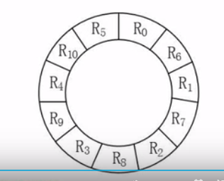

# 计算机组成和体系结构

内容包括

* 数据的表示
* 计算机结构
* 计算机分类方法
* CISC和RISC
* 流水线技术
* 存储系统
* 总线系统
* 计算机可靠性
* 校验码

## 数据的表示

10进制,2进制,8进制和16进制

### 进制转换

#### 任意进制转10进制

任意进制转10进制使用**按权展开法**

> 把一个R进制的数值A,依次把每一位数值表示成$A=a*R^k, (其中a就是这一位的数值)$的形式,然后依次相加.比如:$$\text{2进制例子 } 10010=1*2^{4}+0*2^{3}+0*2^{2}+1*2^{1}+0*2^{0}=18$$$$\text{2进制例子 } 1001.01=1*2^{3}+0*2^{2}+0*2^{1}+1*2^{0}+0*2^{-1}+1*2^{-2}=9.25$$ $$\text{16进制例子 } FE24=15*16^{3}+14*16^{2}+2*16^{1}+4*16^{0}=65060$$

#### 10进制转任意进制

10进制转任意进制一般采用**短除法**

把短除最后的尾数和每一步短除的余数逆序相加.得到最后的值


比如按照上图258的8进制表示为402

#### 2进制, 8进制和16进制之间的转换

由于这3个进制特别常用所以特别拿出来讲一下

1. **2进制和8进制**

    2进制转8进制:由右至左,把**2进制的值每3个分为1组,分别转为8进制的值**,然后由左至右串联起来.比如2进制的1001001的8进制表示:$1001001= 1 + 001 + 001 = 111 $
    8进制转2进制:由右至左,把**8进制的值每1个分别转为3位2进制的值**(不够3位前面补0),然后由左至右串联起来.比如8进制的312的2进制表示:$312= 011 + 001 + 010 = 11001010 $

2. **2进制和16进制**

    2进制转16进制:由右至左,把**2进制的值每4个分为一组,分别转为16进制的值**,然后由左至右串联起来.比如2进制的1001001的16进制表示:$1001001= 0100+1001=49 $
    16进制转2进制:由右至左,把**16进制的值每1个分别转为4位2进制的值**(不够4位前面补0),然后由左至右串联起来.比如16进制的312的2进制表示:$312= 0011 + 0001 + 0010 = 1100010010 $

3. **8进制和16进制**
   
   8进制和16进制之间的转换借助2进制作为桥梁,先把其中的一种进制转为2进制,然后再从2禁止转为目标进制.


## 1.2.1 数据和奇偶校验
### 1 原码，反码，补码和移码

##### 1. 原码
最高位符号位，0代表正，1代表负。
正负数值都是除符号位之外的绝对值
0有两种表示方法+0=00000000, -0=10000000
乘除简单，不方便加减。
大小范围 $-(2^{k-1}-1)<{x}<(2^{k-1}-1),如果是8位的话,那就是-127<{x}<127$

##### 2. 反码
最高位符号位，0代表正，1代表负。
正数同原码，负数在原码的基础上,除符号位外,按位取反。
0有两种表示方法+0=00000000, -0=11111111
大小范围 $-(2^{k-1}-1)<{x}<(2^{k-1}-1),如果是8位的话,那就是-127<{x}<127$


##### 3. 补码
最高位符号位，0代表正，1代表负。
正数同原码，负数在反码的基础上+1。
0有一种表示方法0=00000000
大小范围 $-2^{k-1}<{x}<(2^{k-1}-1),如果是8位的话,那就是-128<{x}<127$
范围比原码和反码多一位是因为只有一个0

##### 4. 移码
常用来表示浮点数中的阶码，偏移量一般为字长n的2^(n-1)
纯整数 x=2^(n-1）+x (-2^(n-1)<=x<2^(n-1))
纯小数 x= 1+x
实际中符号位与补码取反即可
0有一种表示方法0=10000000
大小范围 $-2^{k-1}<{x}<(2^{k-1}-1),如果是8位的话,那就是-128<{x}<127$
范围比原码和反码多一位是因为只有一个0

#### 2.定点数和浮点数

##### 1.定点数
纯整数小数点在最低有效数值位之后
纯小数小数点在最高有效数值位之前

##### 2.浮点数
小数点位置不固定。更大的表示范围。由阶符(+-)，阶码(E)，数符(+-)和尾数(M)组成。下面的R称为基数。
浮点数=-MR^(-E)
工业标准iEEE 754表示法：
（-1)^S2^E(b0b1b2...bn)
S为0表示正数，1表示负数。
E为指数，也就是阶码。使用移码表示。
b0b1b2...bn为尾数，长度为n+1，原码表示。
浮点数的运算需要先对阶,一般是把阶数比较低的转为阶数比较高的.
浮点数的计算结果还需要格式化,格式化的结果一般是尾数的整数部分保持在1<=x<10比如$1.27*10^{5}$

### 校验码

**码距** 就是一个编码系统中任意两个码字之间的最小距离,也就是说,一个有效的信息(码)改成另外一个有效的信息(码)至少需要改动几位? 

举例说明,假设一个编码系统只包含AB两个字符,以下有三种码距的编码系统

1. A=1,B=0,采用1位长度的2进制编码.那么在A只需要改变1位就能变成B,这样的码距是1
2. A=11, B=00 , 采用2位长度的2进制编码.A需要改变2位才能变成B,这样的码距就是2
3. A=111, B=000 , 采用3位长度的2进制编码.A需要改变2位才能变成B,这样的码距就是

#### 循环校验码CRC

由左部的信息码+右边的校验码组成,校验码由信息码经模2运算获得,校验码越长,检错能力就越强.又称(n,k)码.一般认为,CRC只有检错功能,没有纠错功能.

#### 海明码

海明码是贝尔实验室设计的一种利用奇偶性来检验和纠错的校验方法,海明码是在n位数据的特定位置插入k个校验码,通过扩大码距来实现检错和纠错.
数据位n和校验位k之间的必须满足的关系是:$$2^k-1\geq{n}+k$$

设k个校验位$P_{k}P_{k-1}\dots{P}_{1}$, n个数据位$D_{n}D_{n-1}\dots{D}_{1}{D}_{0}$,对应的海明码$H_{n+k}H_{n+k-1}\dots{H}_{1}$

注意:**海明码和校验码序列的下标以1开始,数据位序列的下标以0开始**

1. 先看校验位,校验位序列中的校验位${P}_{i}$对于位于海明码中校验位$H_{j}$,即$P_{i}=H_{j}$,i和j之间的关系是$j=2^{i-1}$,填充完校验位后,数据为则从左至右(或者说从低到高)占据海明码H中剩下的位置.举例说明:

>由公式可知,8位的数据至少需要4位校验码.那么这共计12位的海明码
准备12位空的位序列:$$[12],[11],[10],[9],[8],[7],[6],[5],[4],[3],[2],[1]$$
根据${P}_{i}={H}_{j}, j=2^{i-1}$依次填入校验位
$$[12],[11],[10],[9],[8],[7],[6],[5],[4],[3],[2],{P}_{1}$$
$$[12],[11],[10],[9],[8],[7],[6],[5],[4],[3],{P}_{2},{P}_{1}$$
$$[12],[11],[10],[9],[8],[7],[6],[5],{P}_{3},[3],{P}_{2},{P}_{1}$$
$$[12],[11],[10],[9],{P}_{4},[7],[6],[5],{P}_{3},[3],{P}_{2},{P}_{1}$$
最后把数据位从左至右依次填入:
$${D}_{7},{D}_{6},{D}_{5},{D}_{4},{P}_{4},{D}_{3},{D}_{2},{D}_{1},{P}_{3},{D}_{0},{P}_{2},{P}_{1}$$

2. 海明码中的任意一位数据(包含校验位和数据位)都是由若干个校验位来校验的.其对应关系如下:1.校验位由自身校验.被校验的数据位的在海明码里的下标等于所有参与校验该位的校验位的海明码下标之和.用上题举例,各数据位的校验位如下

>$下标为1的海明位{H}_{1}是校验位{P}_{1},由{P}_{1}校验$
$下标为2的海明位{H}_{2}是校验位{P}_{2},由{P}_{2}校验$
$下标为3的海明位{H}_{3}是数据位{D}_{0},由{P}_{1},{P}_{2}校验(3=1+2)$
$下标为4的海明位{H}_{4}是校验位{P}_{3},由{P}_{3}校验$
$下标为5的海明位{H}_{5}是数据位{D}_{1},由{P}_{1},{P}_{3}校验(5=1+4)$
$下标为6的海明位{H}_{6}是数据位{D}_{2},由{P}_{2},{P}_{3}校验(6=2+4)$
$下标为7的海明位{H}_{7}是数据位{D}_{3},由{P}_{1},{P}_{2},{P}_{3}校验(7=(3=1+2)+4)$
$\dots$

如何计算海明码**校验位**的值?

海明码$P_x$校验位的值由他参与校验的数据位$\{D_{m},{D}_{n},\dots\}$的值(1或者0)依次做异或运算获得.

比如在上例中,各校验位的值的计算方式如下:

>${P}_{1}({H}_{1})={D}_{6}\oplus{D}_{4}\oplus{D}_{3}\oplus{D}_{1}\oplus{D}_{0}$
${P}_{2}({H}_{2})={D}_{6}\oplus{D}_{5}\oplus{D}_{3}\oplus{D}_{2}\oplus{D}_{0}$
${P}_{3}({H}_{4})={D}_{7}\oplus{D}_{3}\oplus{D}_{2}\oplus{D}_{1}$
${P}_{4}({H}_{8})={D}_{7}\oplus{D}_{6}\oplus{D}_{5}\oplus{D}_{4}$

海明码的**校验方式**
海明码的校验方式分为奇校验和偶校验,以数据序列10011010为例.${D}_{7}=1,{D}_{6}=0,{D}_{5}=0,{D}_{4}=1,{D}_{3}=1,{D}_{2}=0,{D}_{1}=1,{D}_{0}=0$计算出来的校验序列是$${P}_{1}={0}\oplus{1}\oplus{1}\oplus{1}\oplus{0}=1$$$${P}_{2}={0}\oplus{0}\oplus{1}\oplus{0}\oplus{0}=1$$$${P}_{3}={1}\oplus{1}\oplus{0}\oplus{1}=1$$$${P}_{4}={1}\oplus{0}\oplus{0}\oplus{1}=0$$

最后生成的实际海明码应该是
$$1,0,0,1,0,1,0,1,1,0,1,1$$

**检查错误**的思维如下:
因为校验码的值是由他校验的数据位的值做异或组成的,所以只需要将校验码的值和生成他的那些数据位的值做异或运算,如果结果为0(两个值一致))就是正确,否则就是出错了.
>${G}_{1}={P}_{1}\oplus{D}_{0}\oplus{D}_{1}\oplus{D}_{3}\oplus{D}_{4}\oplus{D}_{6}={1}\oplus{0}\oplus{1}\oplus{1}\oplus{1}\oplus{0}=0$
${G}_{2}={P}_{2}\oplus{D}_{0}\oplus{D}_{2}\oplus{D}_{3}\oplus{D}_{5}\oplus{D}_{6}={1}\oplus{0}\oplus{0}\oplus{1}\oplus{0}\oplus{0}=0$
${G}_{3}={P}_{3}\oplus{D}_{7}\oplus{D}_{3}\oplus{D}_{2}\oplus{D}_{1}={1}\oplus{1}\oplus{1}\oplus{0}\oplus{1}=0$
${G}_{4}={P}_{4}\oplus{D}_{7}\oplus{D}_{6}\oplus{D}_{5}\oplus{D}_{4}={0}\oplus{1}\oplus{0}\oplus{0}\oplus{1}=0$

**纠正错误**的方法:

如果$G_{4}{G}_{3}\dots{G}_{1}$不全是0(偶校验).那就是出错了.出错的位置的海明码下标就是$G_{4}{G}_{3}\dots{G}_{1}$的值的(二进制)序列转成10进制的值.下面使用上例说明.

正常情况下,正确的海明码是 100101011011
假设我们现在收到的海明码是 100101011111,已知海明码排序方式是${D}_{7},{D}_{6},{D}_{5},{D}_{4},{P}_{4},{D}_{3},{D}_{2},{D}_{1},{P}_{3},{D}_{0},{P}_{2},{P}_{1}$,推导出来

>0. $D_{0}=1$
>1. $D_{1}=1$
>2. $D_{2}=0$
>3. $D_{3}=1$
>4. $D_{4}=1$
>5. $D_{5}=0$
>6. $D_{6}=0$
>7. $D_{7}=1$

>1. $P_{1}=1$
>2. $P_{2}=0$
>3. $P_{3}=1$
>4. $P_{4}=0$

根据上面G的计算公式进行计算
>${G}_{1}={P}_{1}\oplus{D}_{0}\oplus{D}_{1}\oplus{D}_{3}\oplus{D}_{4}\oplus{D}_{6}={1}\oplus{1}\oplus{1}\oplus{1}\oplus{1}\oplus{0}=1$
${G}_{2}={P}_{2}\oplus{D}_{0}\oplus{D}_{2}\oplus{D}_{3}\oplus{D}_{5}\oplus{D}_{6}={1}\oplus{1}\oplus{0}\oplus{1}\oplus{0}\oplus{0}=1$
${G}_{3}={P}_{3}\oplus{D}_{7}\oplus{D}_{3}\oplus{D}_{2}\oplus{D}_{1}={1}\oplus{1}\oplus{1}\oplus{0}\oplus{1}=0$
${G}_{4}={P}_{4}\oplus{D}_{7}\oplus{D}_{6}\oplus{D}_{5}\oplus{D}_{4}={0}\oplus{1}\oplus{0}\oplus{0}\oplus{1}=0$

结果不全为0,证明出错了.我们把G的值按照下标打从小到大的顺序从右至左排列,得到0011,转成10进制为3,也就是${H}_3({D}_{0})$出错了.把${D}_{0}$取反${D}_{0}=0$即可.

## 计算机组成

### 主机的组成


```python3
# CPU的组成
CPU = {
    "运算器":
            [
                "算术逻辑单元(ALU)",
                "累加寄存器(AC)",
                "数据缓冲寄存器(DR)",
                "状态条件寄存器(PSW)"
            ],
    "控制器":
            [
                "指令寄存器(IR)",
                "指令译码器(ID)"
                "程序计数器(PC)",
                "地址寄存器(AR)",
                "时序控制逻辑",
                "总线控制逻辑",
                "中断控制逻辑"
            ]
}
```

### 计算机体系


### RISC(精简指令集计算机)和CISC(复杂指令集计算机)


#### CISC

本意是增强计算机指令功能,用指令取代软件程序,软件硬化.CISC出现较早

#### RISC

通过减少指令总数,简化指令来降低硬件复杂程度(降低成本),通过优化编译提高指令执行速度.RISC出现较晚

### 流水线技术


#### 流水线的周期的计算


* 流水线周期为一条指令的被拆分的每个阶段的执行时间中,最长的那个.本例中,一条指令被分为 取指,分析和执行三部分,执行时间分别是2ns,2ns,1ns那么流水线周期就是2ns
* 流水线执行n个指令时间的计算公式是 执行总时间 = 第一条指令的执行时间 + (n-1)x流水线周期  由于流水线需要一个建立的时间,这个建立的时间就是第一条指令的执行时间,流水线建立后,剩下的执行时间就很规律了,都是只需要一个流水线周期就可以产出了,所以是(n-1)x流水线周期.
* 偶尔试题中按照上述公式会找不到答案,那么可以按照一个实践经验的公式进行计算 执行总时间=(阶段数+指令数-1)x流水周期.以上面的图片为例.执行总时间=(3+100-1)*2=204ns

#### 流水线吞吐率计算


* 上图中的$\Delta{t}$指的是流水线周期,k指阶数,n指指令数

#### 流水线的效率


### 层次化存储


#### Cache


#### 局部性原理

CPU访问存储器时，无论是存取指令还是存取数据，所访问的存储单元都趋于聚集在一个较小的连续区域中
三种不同类型的局部性:

* 时间局部性（Temporal Locality）：如果一个信息项正在被访问，那么在近期它很可能还会被再次访问。程序循环、堆栈等是产生时间局部性的原因
* 空间局部性（Spatial Locality）：在最近的将来将用到的信息很可能与现在正在使用的信息在空间地址上是临近的.
* 顺序局部性（Order Locality）：在典型程序中，除转移类指令外，大部分指令是顺序进行的。顺序执行和非顺序执行的比例大致是5:1。此外，对大型数组访问也是顺序的。指令的顺序执行、数组的连续存放等是产生顺序局部性的原因。

常见的局部性原理的体现: 循环,迭代,递归,数组的处理等.

#### 主存

##### 随机存取存储器(RAM)

工作中技能读取也能写入数据的存储器

* DRAM 动态存取存储器
* SRAM 静态存取存储器

##### 只读存储器(ROM)

工作过程中只能读取的存储器

* MROM (Mask ROM) 掩膜式ROM
* PROM(Programmable ROM) 可编程只读存储器
* EPROM(Erasable Programmable ROM) 可擦除(光照)可编程只读存储器
* 闪存(Flash Memory) 可以使用电信号进行擦出

##### 编址


解题方式

* 求有多少k个地址单元: 用高位地址减去低位地址再+1(地址的末尾的H表示这是16进制),$$C7FFF-AC000+1=(12*16^{4}+7*16^{3}+15*16^2+15*16^1+15*16^0)-(10*16^4+12*16^3)+1=(819199-704512)+1=114688$$或者可以先把1和高位地址相加,得到C8000,然后进行16位的减法(注意16进制的借位是+16)$$C8000-AC000=1C000=114688$$最后把结果114688除以1024.得到结果
* 第二个问题,求每个存储单元存储几位? 那么内存按16位地址编码,需要的空间x=112k*16,这个空间由28片存储芯片构成,那么每个芯片需要存储(112k*16)/28的空间.每个芯片上有16k个存储单元,每个存储单元存储的大小是y位,那么$$y=(112k*16)/(28*16k)=4$$ 每个存储单元存储4位数据

### 总线结构

数据总线,地址总线和控制总线

* 总线上所有设备共享
* 数据总线 用于交换数据.是双向的
* 地址总线 用于传送CPU发出的地址信息.是单向的.地址总线的宽度决定了CPU最大寻址能力,32位总线的最大寻址能力是$2^{32}=4294967296=4G$
* 控制总线 用来传送控制信号,状态和时序信号等.

### 外部存储器 

磁表面存储器 光存储器 固态硬盘等

磁盘的非格式化容量 = (磁道数/面) x 内周长 x 最大位密度
格式化容量 = (磁道数/面) x (扇区数/道) * (字节数/扇区)
光盘存储器制造成本低,记录密度高,容量大,对机械的精度要求不高,存取时间较长.
固态硬盘由主控芯片和闪存构成,价格贵,容量低,损坏后,数据较难恢复

#### 磁盘


* **盘片**: 一个硬盘可有多个盘片组成.
* **磁头**: 每个盘片都有一个独立的磁头,
* **磁臂**: 所有的磁头都安装在同一个磁臂上,所以同一时刻,只有一个磁头在读写.把数据存放在不同盘片的相同磁道上会读取的更快.或者说把数据存放在同一柱面会读取的更快
* **磁道**: 从外向内的同心圆,最外为0磁道.
* **柱面**: 不同盘片上相同序号的磁道构成一个柱面
* **扇区**:磁道按照圆周等分成若干段,每一段都是一个扇区.扇区存放固定长度的数据块,比如512B,每个磁道上的扇区数目相同.
* **存取时间**: =寻道时间(磁头沿径向里外运动寻找磁道的时间)+等待时间(旋转盘片把数据存储的扇区对准磁头的时间)
浮点数的运算需要先对阶,一般是把阶数比较低的转为阶数比较高的.
浮点数的计算结果还需要格式化,格式化的结果一般是尾数的整数部分保持在1<=x<10比如$1.27*10^{5}$

#### 3.校验码
水平奇偶校验码，垂直奇偶校验码，水平垂直奇偶校验码

难点：
逻辑运算，
与: 全部为真则真，一个为假则假
或: 一个为真则真，全部为假则假
同或: 全部相同为真，否则为假则假
异或: 全部相同为假，否则为真

海明码 

内存地址的大小计算 十六位转十进制

寻址方式： 直接寻址，立即寻址，寄存器寻址，相对寻址，寄存器间寻址 弄清楚概念和用处
操作数作为指令的一部分而且在指令中的，这种操作数叫立即数，这种寻址方式叫立即寻址。立即数不能作为指令中的第二操作数。
指令所要的操作数已存储在某寄存器中，或把目标操作数存入寄存器。称为寄存器寻址
指令所要的操作数存放在内存中，在指令中直接给出该操作数的有效地址，这种寻址方式为直接寻址方式。
立即寻址方式和直接寻址方式的书写格式的不同，直接寻址的地址要写在括号“[”，“]”内。
操作数在存储器中，操作数的有效地址用SI、DI、BX和BP等四个寄存器之一来指定，称这种寻址方式为寄存器间接寻址

计算机的可靠性，是效率，平均无故障时间，平均维修时间，可用性。
计算机可靠性模型：

算术表达式转后缀式： 根据算数表达式优先级，忽略括号，建立表达式树，然后以后根遍历

## 计算机组成

### 主机的组成


```python3
# CPU的组成
CPU = {
    "运算器":
            [
                "算术逻辑单元(ALU)",
                "累加寄存器(AC)",
                "数据缓冲寄存器(DR)",
                "状态条件寄存器(PSW)"
            ],
    "控制器":
            [
                "指令寄存器(IR)",
                "指令译码器(ID)"
                "程序计数器(PC)",
                "地址寄存器(AR)",
                "时序控制逻辑",
                "总线控制逻辑",
                "中断控制逻辑"
            ]
}
```

### 计算机体系


### RISC(精简指令集计算机)和CISC(复杂指令集计算机)


#### CISC

本意是增强计算机指令功能,用指令取代软件程序,软件硬化.CISC出现较早

#### RISC

通过减少指令总数,简化指令来降低硬件复杂程度(降低成本),通过优化编译提高指令执行速度.RISC出现较晚

### 流水线技术


#### 流水线的周期的计算


* 流水线周期为一条指令的被拆分的每个阶段的执行时间中,最长的那个.本例中,一条指令被分为 取指,分析和执行三部分,执行时间分别是2ns,2ns,1ns那么流水线周期就是2ns
* 流水线执行n个指令时间的计算公式是 执行总时间 = 第一条指令的执行时间 + (n-1)x流水线周期  由于流水线需要一个建立的时间,这个建立的时间就是第一条指令的执行时间,流水线建立后,剩下的执行时间就很规律了,都是只需要一个流水线周期就可以产出了,所以是(n-1)x流水线周期.
* 偶尔试题中按照上述公式会找不到答案,那么可以按照一个实践经验的公式进行计算 执行总时间=(阶段数+指令数-1)x流水周期.以上面的图片为例.执行总时间=(3+100-1)*2=204ns

#### 流水线吞吐率计算


* 上图中的$\Delta{t}$指的是流水线周期,k指阶数,n指指令数

#### 流水线的效率


### 层次化存储


#### Cache


#### 局部性原理

CPU访问存储器时，无论是存取指令还是存取数据，所访问的存储单元都趋于聚集在一个较小的连续区域中
三种不同类型的局部性:

* 时间局部性（Temporal Locality）：如果一个信息项正在被访问，那么在近期它很可能还会被再次访问。程序循环、堆栈等是产生时间局部性的原因
* 空间局部性（Spatial Locality）：在最近的将来将用到的信息很可能与现在正在使用的信息在空间地址上是临近的.
* 顺序局部性（Order Locality）：在典型程序中，除转移类指令外，大部分指令是顺序进行的。顺序执行和非顺序执行的比例大致是5:1。此外，对大型数组访问也是顺序的。指令的顺序执行、数组的连续存放等是产生顺序局部性的原因。

常见的局部性原理的体现: 循环,迭代,递归,数组的处理等.

#### 主存

##### 随机存取存储器(RAM)

工作中技能读取也能写入数据的存储器

* DRAM 动态存取存储器
* SRAM 镜头存取存储器

##### 只读存储器(ROM)

工作过程中只能读取的存储器

* MROM (Mask ROM) 掩膜式ROM
* PROM(Programmable ROM) 可编程只读存储器
* EPROM(Erasable Programmable ROM) 可擦除(光照)可编程只读存储器
* 闪存(Flash Memory) 可以使用电信号进行擦出

##### 编址


解题方式

* 求有多少k个地址单元: 用高位地址减去低位地址再+1(地址的末尾的H表示这是16进制),$$C7FFF-AC000+1=(12*16^{4}+7*16^{3}+15*16^2+15*16^1+15*16^0)-(10*16^4+12*16^3)+1=(819199-704512)+1=114688$$或者可以先把1和高位地址相加,得到C8000,然后进行16位的减法(注意16进制的借位是+16)$$C8000-AC000=1C000=114688$$最后把结果114688除以1024.得到结果
* 第二个问题,求每个存储单元存储几位? 那么内存按16位地址编码,需要的空间x=112k*16,这个空间由28片存储芯片构成,那么每个芯片需要存储(112k*16)/28的空间.每个芯片上有16k个存储单元,每个存储单元存储的大小是y位,那么$$y=(112k*16)/(28*16k)=4$$ 每个存储单元存储4位数据

### 总线结构

数据总线,地址总线和控制总线

* 总线上所有设备共享
* 数据总线 用于交换数据.是双向的
* 地址总线 用于传送CPU发出的地址信息.是单向的.地址总线的宽度决定了CPU最大寻址能力,32位总线的最大寻址能力是$2^{32}=4294967296=4G$
* 控制总线 用来传送控制信号,状态和时序信号等.

### 外部存储器 

磁表面存储器 光存储器 固态硬盘等

磁盘的非格式化容量 = (磁道数/面) x 内周长 x 最大位密度
格式化容量 = (磁道数/面) x (扇区数/道) * (字节数/扇区)
光盘存储器制造成本低,记录密度高,容量打,对机械的精度要求不高,存取时间较长.
固态硬盘由主控芯片和闪存构成,价格贵,容量低,损坏后,数据较难恢复

#### 磁盘


* **盘片**: 一个硬盘可有多个盘片组成.
* **磁头**: 每个盘片都有一个独立的磁头,
* **磁臂**: 所有的磁头都安装在同一个磁臂上,所以同一时刻,只有一个磁头在读写.把数据存放在不同盘片的相同磁道上会读取的更快.或者说把数据存放在同一住面会读取的更快
* **磁道**: 从外向内的同心圆,最外为0磁道.
* **柱面**: 不同盘片上相同序号的磁道构成一个柱面
* **扇区**:磁道按照圆周等分成若干段,每一段都是一个山区.山区存放固定长度的数据块,比如512B,每个磁道上的扇区数目相同.
* **存取时间**: =寻道时间(磁头沿径向里外运动寻找磁道的时间)+等待时间(旋转盘片把数据存储的扇区对准磁头的时间)

##### 存取时间的计算


* 求最长的处理时间: 
  
> * 磁盘旋转一圈是33ms,11个物理块.每一个物理块的读取时间是33/11=3ms.
> * 单缓冲区的意味是物理块的数据读取后只能挨个处理. 
> * 当磁盘读取完第一个物理块(3ms)后,开始读取第二个物理块.同时第一个物理块的数据交由缓冲区处理,第二个物理块读取结束后需要3ms,而这是缓冲区内刚处理完第一物理块的数据(3ms),无法放入(这一段请画两条时间轴来理解)).因为读取完第一个物理块后,并不能直接进入到下一个块的读取过程,而是要往前继续转一周(33ms),去读取第二个物理块.也就是说,由于单缓冲区的存在,导致一个块的读取过程是1. 读取数据, 2.写入缓冲区, 3. 写入缓冲区的同时开始旋转并持续一周. 因此第一个物理块的读取时间是3ms(读取时间)+33ms(转一周的时间).
> * 注意,最后一个数据读取完毕后,不需要再旋转一周了,因此最后一个数据块的处理时间是3ms(读取时间)+3ms(处理时间),整个11个物理块的处理时间是36*10+6=366ms

求最少时间

>* 将磁道环划分为11个区域.由于在当一个数据块的数据从缓冲区移除的之后,磁头已转动到第三个数据库的开始位置,因次只需要将第二个数据块放在磁道的第三个区域即可.如此类推.全部排满,形成如下的形式
>* 由于每次读取,处理(3ms+3ms)完一个块的数据后,就能直接处理下一个块的数据,因此,整个11块的数据的处理时间就是6*11=66ms

#### 磁盘阵列

* raid-0: 不容错,磁盘容量加倍,数据传输加倍
* raid-1: 镜像容错.
* raid-2: 海明码校验的磁盘
* raid-3: 为提高容量优化的阵列,一般只使用一个检测盘
* raid-4: 可独立的对阵列中的不同的磁盘进行读写的技术.一个检测盘
* raid-5: raid-4改进型.无专门检测盘.校验信息和数据混写.
* raid-6: 两级数据冗余.2个磁盘故障时仍然可以工作.写入时分别进行两个独立的校验运算.

#### 存储域网络

* 解决了对存储容量的需求.使多个服务器之间共享了文件系统和存储空间.
* 实现了分布式存储的集中管理.降低了管理成本,提高了管理效率.

### 计算机可靠性

计算机可靠性呈现浴盆曲线状态.应保证计算机使用的元件处于第二阶段.在第一阶段对元件进行老化筛选,第三阶段应该淘汰该计算机.

**计算机系统可靠性**是指从哦你他开始运行$t_0$到某时刻$t_n$这段时间内,能正常运行的概率.用$R(t)$表示.
**失效率**是指单位时间内失效的元件个数与元件总数的比例.一般用$\lambda$表示.如果$\lambda$为常数,那么可靠性和失效率时间的关系就是$R(t)=e^{-\lambda{t}}$
**平均无故障时间**简称MTBF,$MTBF=1/\lambda$
**平均修复时间**简称MTRF.用来表示计算机的可维修行,即计算机的维修效率.指从故障发送到修复平均所需要的时间
**可用性**是指计算机的使用效率,他以计算机在任意时刻能够正常工作的概率A来表示.$A=\frac{MTBF}{MTBF+MTRF}$
**RAS** 是指计算机的可靠性(R),可用性(A)和可维修行(S)这三个指标来衡量计算机系统.

#### 计算可靠性

计算机可靠性模型分为

1. 串联系统: 当所有子系统都能正常工作时整个系统才工作的系统成为串联系统.计算机的总体可靠性R是各子系统的可靠性乘积.$$R=R_1{R}_{2}{R}_{3}\dots{R}_{n}$$,总体失效率$\lambda$可以近似的认为是各子系统失效率之和.$$\lambda=\lambda_{1}+\lambda_{2}+\lambda_{3}+\dots+\lambda_{n}$$
2. 并联系统: 只要有一个子系统能正常工作,整个系统就能工作的模型叫并联模型.并联模型可靠性R的计算公式是$$R=1-(1-{R}_{1})*(1-{R}_{2})*(1-{R}_{3})*\dots*(1-{R}_{n})$$,整体失效率$\nu$和单个子系统是效率$\lambda$之间的计算公式$$\nu=\frac{1}{\frac{1}{\lambda}\sum_{j=1}^{n}\frac{1}{j}}$$由于这个公式过于复杂,一般都是使用$1-可靠性$来计算并联模型的失效率
3. N模冗余系统: 系统有个(N是奇数,且不等于1)相同的子系统和一个表决器.表决器把子系统中占多数的结果输出作为系统的输出.

习题: 一个系统有3个相同的子系统构造,其可靠性为0.9,平均无故障时间是10000小时,求系统的可靠性和平均无故障时间.

解题:

* 系统可靠性 $1-(1-0.9)^{3}=0.999$
* 平均无故障时间: $$\frac{1}{\frac{1}{\lambda}\sum_{j=1}^{n}\frac{1}{j}}=\frac{1}{\frac{1}{10000}*(1/1+1/2+1/3)}=\lambda*(11/6)=18333$$

改善计算机可靠性的措施

* 提高元件质量,改进加工公寓和结构,完善电路设计.
* 发展容错技术

### 计算机系统的性能评价

性能评价的方法

1. 时钟频率: 频率越高,速度越快.但不同体系的计算机之间比较时不能单纯用绝对的时钟频率来衡量
2. 指令执行速度: 一秒中执行多少次加法指令, KIPS(每秒多少千指令), MIPS(每秒多少百万指令)
3. 等效指令速度法: 
4. 数据v处理速度法:
5. 核心程序法:

