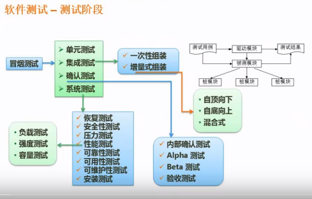

# 软件工程师基础知识

## 软件工程概述

软件工程这个名词是1968年,在德国召开的北大西洋公约组织会议上首次提出的
软件工程是指应用计算机科学,数学及管理科学等原理,以工程化的原则和方法来解决软件问题的工程.其目的是为了提高软件生产率,提高软件质量,降低软件成本.

### 计算机软件分类

* 系统软件 是一类服务于其他程序的程序.特点是和计算机硬件大量交互,多用户等.
* 应用软件 解决特定业务需求的独立应用程序.
* 工程/科学软件 这类软件通常到有"数值计算"的特征.
* 嵌入式软件 微波炉, 汽车的燃油控制, 刹车系统的电子功能等
* 产品线软件 为不同用户提供特定的功能.关注特定的专业市场(例如库存管理)或者大众消费品市场(娱乐,数据库,多媒体管理等)
* WEB应用 是一类以网络为中心的软件.具备网络密集性,并发性,无法预知的负载量,性能,可用性和数据驱动属性.
* 人工智能软件 利用非数值计算算法解决计算和直接分析无法解决的复杂问题.
* 开放计算
* 网络资源
* 开源软件

### 软件工程基本原理

1. 用分阶段的生命周期计划严格管理  
2. 坚持进行阶段评审
3. 实现严格的产品控制
4. 采用现代程序设计技术
5. 结果应能清楚地审查
6. 开发小组的人员应少而精
7. 承认不断改进软件工程实践的必要性

### 软件生命周期

#### 可行性分析与项目开发计划

主要确定软件的开发目标及可行性.
参与人员: 用户,项目负责人,系统分析师
产出物: 可行性分析报告和项目开发计划

#### 需求分析

准确的确定软件需要做什么,确定软件的功能,性能,数据和界面等要求.从而确定系统的逻辑模型.
参与人员: 用户,项目负责人,系统分析师
产出物: 软件需求说明书

#### 概要设计

设计软件的结构,明确软件由哪些模块组成.模块之间的层次结构和调用关系.每个模块的功能.同时还需要设计总体的数据结构和数据库结构.(要存储的数据,数据的结构,数据之间的关系)
参与人员: 软件设计师,系统分析师
产出物: 概要设计说明书

#### 详细设计

对每个模块完成的功能进行具体的描述.把功能描述转变成明确的,结构化的描述.(描述模块内容的具体的逻辑判断)
参与人员: 软件设计师. 程序员
产出物: 详细设计文档

#### 编码

把详细设计中的,对模块功能的结构化的描述转变成计算机可接受的程序代码.
参与人员: 程序员
产出物: 源程序

#### 测试

在设计测试用例的基础上检查软件的哥哥组成部分.是保证软件质量的重要手段.
参与人员: 另一部门/单位的软件设计师/系统分析师
产出物: 软件测试计划,测试用例,软件测试报告

#### 维护

维护是软件生命周期中最长的扎阶段.
参与人员: 程序员 运维人员

### 软件过程

软件开发过程中所遵循的一系列可预测的步骤(即线路图)称为软件过程.

#### 软件成熟度模型(CMM)

软件成熟度模型将软件过程分为以下五个有序的成熟度级别:

1. **初级的** 特点是杂乱无章,没有明确定义的步骤,项目完成依赖个人努力和核心人物.
2. **可重复级** 建立了基本的项目管理过程和实践来跟踪项目费用,进度和功能特性.有必要的过程准则来重复以前在同类项目中的成功.
3. **已定义级** 管理和工程方面的软件过程都已经文档化,标准化.并已综合成整个软件开发组织的标准软件过程.
4. **已管理级** 制定了软件过程和产品质量的详细度量标准.软件过程的产品品质都被开发组织的成员所理解和控制.
5. **优化级** 加强了定量分析,通过来自过程质量反馈和来自新观念,新技术的反馈使得过程不断持续改进.

#### 能力成熟度模型集成(CMMI)

CMMI提供2中表示方法: 阶段式模型和连续式模型

* 所有未定义的级别都是混乱的.
* 已管理级 是属于项目级别 专属项目经理 配置管理 需求管理,项目计划是关键词
* 已定义级 属于公司级别  其他项目经理可以分享  文档化,标准化 是关键词
* 定量管理级  量化管理是关键词
* 优化级  持续优化

考题类型主要是给你一些特征,问你是属于哪个阶段?

## 软件过程模型

软件过程也称为软件开发模型.是软件开发全部过程,活动和任务的结构框架.

### 瀑布模型

将软件生存周期中的各个活动规定为依线性顺序连接的若干阶段的模型.包括需求分析,设计,编码,测试,运行于维护.规定了由前至后,互相衔接的固定顺序.
适合需求明确的模型

特点:

* 结构化方法模型
* 强调每一阶段的评审

缺点:

* 直到项目完成之前,都不能演示系统能力.需求设计中的错误往往只有到了最后才能被发现.
* 对于项目风险控制能力弱

瀑布模型的一个变体是**V模型**.v模型是一种将验证确认活动应用于早期软件工程中的方法.是一种强调测试的模型.v模型提前和细化了测试的重要性和参与度. 目的是提早发现问题.

### 增量模型

瀑布模型的变体
将需求切分为小的部分(增量).每一个增量可分别开发.模型采用随着日程进展而交错的线性序列.每一个线性序列产生软件的一个可发布的"增量".
增量模型的第一个增量一般是核心的产品
用户对每个增量的评估都做为下一个增量发布的新特和功能.
增量模型的每一个增量都发布一个可操作的产品.

特点:

* 第一个可交付版本很小,风险不高.

缺点:

* 初始增量的设计非常重要.初始增量设计不当会导致后继增量最终无法完成设计需求

### 演化模型

先做一个基础的原型,然后在这个原型的基础上不断迭代,逐步开发出更完成的软件版本.
适用于需求不明确的情况

#### 原型模型

适用于需求不明确的中小型项目或者项目开发的需求设计阶段.
原型是预期系统的一个可执行版本,是预期系统的一个子集.其目标是快速,低成本的构建原型,然后征求用户的修改意见.再对原型进行修改,如此迭代,直到满足用户需求.
原型分为: 探索型原型,实验型原型和演化型原型

* 探索型原型 弄清楚用户需求,并探讨方案的可行性.
* 实验型原型 验证方案和算法的合理性
* 演化型原型 最终目标的一部分,通过对其的迭代来完成最终系统

#### 螺旋模型

适合庞大,复杂,高风险的系统.
原型模型的增强版(使用多个原型).螺旋模型将开发过程分为多个螺旋周期.每个周期使用不同的原型.每个周期分为:

* 制定计划
* 风险分析
* 实施工程
* 用户评估

四个阶段.用户模型最大的特点是在每一个螺旋循环中,加入了**风险分析**

缺点:

* 过多的迭代可能会增加开发成本,延迟提交时间

### 喷泉模型

**面向对象**开发方法/模型
以用户需求为动力,以对象作为驱动. 克服了瀑布模型不支持软件重用和多项开发活动集成的局限性.喷泉模型具有**迭代性和无间隙性**

* 迭代性 指开发活动经常要重复多次.在迭代的过程中不断完善软件系统.
* 无间歇性 指开发活动(分析,设计,编码)之间不存在明显的边界.不要求固定的前后顺序(不要求分析结束后才设计,设计结束后才编码,而是可以交叉的,迭代的进行.)

喷泉模型的各个阶段没有明显的界限.开发人员可以同步进行.

优点:

* 开发人员可以同步进行.效率高,节省时间

缺点:

* 各个开发阶段重叠,需要的开发人员多,项目管理难度大
* 由于模型要求文档管理严格.使得审核的难度加大.

### CBDM(基于构件的开发模型)

基于构件的开发是指利用预先包装好的构件来构造系统. 本质上是演化模型,需要以迭代的方式构建软件.
构件可以是组织内部的构件,也可以是商品化的构件.

Delphi,VB和Visual Studio是最常见的CBDM

### 形式化方法模型(FMM)

是一种建立在严格的数学基础上的软件开发方法,其重要活动是生成计算机软件形式化的数学规格说明.
用严格数学语言进行规约.通过对数学的分析和推导,易于发现需求的歧义,不完整性和不一致性.

### 统一过程(UP)模型

用例和风险驱动,以架构为中心,迭代且增量的开发过程.由UML方法和工具支持.

### 敏捷方法

尽可能的,持续的队友价值的软件的交付.通过在过程中加入灵活性.使得用户能在开发的后期增加或者变更需求.
敏捷方法不适合开发大型项目

#### 极限编程(XP)

轻量级,高效,低风险,柔性,可预测的科学的软件开发过程.由价值观,原则,实践和行为4个部分组成.

4大**价值观**: 沟通,保持简单,反馈(和客户间的反馈,开发人员之间的反馈)和勇气(用于改变和接受改变).
5个**原则**: 快速反馈,简单性假设,逐步修改,提倡更改和优质工作(高效,短时间)
12个**最佳实践**: 计划游戏(快速制定计划,然后不断的完善计划).小型发布, 隐喻(找到合适的比喻传达信息),简单设计(只处理当前需求,设计保持简单).测试先行(先写测试代码,再写程序),重构.结队编程,代码集体所有.持续集成(每日提供可运行版本),每周40小时工作,现场客户和编码标准.

#### 水晶法

强调开发人员之间的交流.

#### 并列争求法

使用迭代的方法. 按照需求优先级来实现产品.

#### 自适应软件开发(ASD)

#### 敏捷统一过程(AUP)

### 开发模型总结

结构化开发方法最大的问题在于无法应对需求的变更.

## 需求分析

### 软件需求

软件需求是指用户对目标软件系统在功能,行为,性能,设计约束等方面的期望. 这些需求包括:

* 功能需求
* 性能需求
* 用户或人的因素  用户的类型,操作对计算机的熟练程度等
* 环境要求  包括硬件设备的需求,数据库,网络,操作系统,地点,分布,湿度,电磁环境等
* 界面需求
* 文档需求
* 数据需求 数据的输入输出格式.流量,频率等.
* 资源使用需求 系统运行时所需的资源.
* 安全保密需求
* 可靠性要求
* 软件成本消耗与开发进度要求
* 其他的非功能性要求 如采用何种开发模式,质量控制和验收标准等

### 需求分析原则

* 必须能够表示和理解问题的信息域
* 必须能够定义软件将完成的任务
* 必须能够表示软件的行为
* 必须划分描述数据,功能和行为的模型.从而可以分层次的揭示细节
* 分析过程应该从要素信息移向细节信息.

### 需求工程

是一个不断重复需求定义,文档记录,需求演进的过程,最终在验证的基础上冻结需求.大致分为:

* 需求获取
* 需求分析与协商
* 系统建模
* 需求规约
* 需求验证
* 需求管理

## 系统设计

常用的开发方法是:

* 面向数据流的结构化设计方法(SD)
* 面向对象的分析方法(OOD)

### 概要设计

#### 设计软件系统总体结构

系统分哪些模块,确定每个模块的功能和模块之间的调用关系.确定模块之间的接口即模块之间传递消息的方式.系统总体设计直接影响到详细设计与编码工作

#### 数据结构及数据库设计

* 数据结构的设计 使用抽象的数据类型对在需求分析阶段生成的数据字典,操作约束和数据之间的关系进行细化设计.
* 数据库的设计
  
  >1. 概念设计 使用E-R模型.采用从底向上方法从用户角度进行视图设计.
  >2. 逻辑设计. 结合数据来设计E-R模型
  >3. 物理设计 设计数据模式的一些物理细节,如存储要求,存取方法和索引等

* 编写概要设计文档
* 评审 对设计部分是否完整地实现了需求中规定的功能,性能等要求,设计的可行性,关键任务的处理,接口定义定义的正确性,各个部分之间的一致性一一进行评审

### 详细设计

 * 每个模块进行详细的算法设计,用图形,表格和语言等工具将每个模块的详细算法描述出来.
 * 对模块的内的数据结构进行设计.
 * 确定数据库的物理结构
 * 代码设计.
 * 输入输入格式,
 * 用户界面
 * 编写详细的设计说明书
 * 评审 对一系列的设计文件进行评审

## 系统测试

每年考试**必考部分**,主要出现在上午,少量出现在下午

包括软件测试,硬件测试和网络测试. 我们主要讲的是软件测试

### 系统测试与调试

#### 测试的意义,目的和原则

* **尽早测试,持续测试** 错误早发现早纠正,消除隐患
* **不要让开发者测试**  避免开发者测试自己程序时思维上的局限性.应由专门的测试人员来进行测试
* **选择不同的数据** 既要选择有效的,合理的数据,也要选择无效的,不合理的数据
* **检查系统是否做了不该做的事情** 系统额外的工作会带来副作用.影响效率甚至会带来潜在的危害.
* **按照计划测试**  避免测试的随意性.严格的按照测试计划进行.
* **妥善保存测试计划,用例**  测试计划和用例作为文档的组成部分保存.
  
#### 测试过程

* 制订测试计划 测试内容,近段派,环境条件等
* 编制测试大纲 测试大纲是测试的一句.记录了每一项功能所需的测试的项目和完成标准
* 根据测试大纲生成测试用例,测试设计说明文档
* 实施测试
* 生成测试报告 

### 传统软件的测试策略

是有计划的安排软件测试用例的过程.一般包含测试计划,测试用例设计,测试执行和结果收集/评估.

#### 单元测试

单元测试也称模块测试.在模块编写完成后即可进行.侧重于模块内部的处理逻辑和数据结构.如果使用机器测试.一般用白盒测试法.
  
##### 单元测试的内容包括

  >1. 模块接口 保证数据正确的流入流出: 需要检查参数个数,属性,单位,顺序,各模块参数定义的一致性等.
  >2. 局部数据结构 变量是否被正确的赋值和初始化,变量名称是否正确等.
  >3. 重要的执行路径 需要精心设计测试用例来检查
  >4. 出错处理
  >5. 便捷条件

##### 单元测试的过程

模块不是独立运行的.测试的时候,额外需要

* 驱动模块 相当于一个主程序.将数据送入测试模块输出测试结果.
* 桩模块 用来在测试中替代测试模块所调用子模块.

#### 集成测试

按照系统设计说明书的要求把模块组合起来进行测试.
集成测试由两种方法:

* **非增量集成** 分别测试不同的模块.然后再把这些模块组合起来进行整体测试.
* **增量集成** 以小增量的方式逐步进行构造和测试.

其中,增量集成的策略:

* 自顶向下集成策略 从主模块开始,沿着控制层次逐步向下.以深度优先或者广度优先的方式,将从属于主模块的模块逐步集成到结构中. 主控模块作为驱动模块.需要桩模块支持.
* 自底向上集成策略 从程序结构最低构件开始进行构造和测试.这种方式不需要使用桩模块. 但需要驱动模块
* 回归测试  每一个新模块加入作为集成测试的一部分时.软件发生变更.可能出现新的IO以及调用新的逻辑.这是需要重新执行已测试过的某些子集以确保变更没有传播不期望的副作用. 回归测试比较全面也比较耗时.
* 冒烟测试 冒烟测试是常用的集成测试方法,是事件关键项目的决定性机制,它让软件团队频繁的对项目进行评估.一般的做法是设计一系列测试以暴露影响构建正确完成其功能的错误.目的是为了发现可能问题.相对回归测试,冒烟测试比较简单.

#### 确认测试

集成测试完成后.软件已经组成成完整的软件包.确认测试是通过一系列表明与软件需求相符合的测试而获得.
确认测试用于确保满足所有的功能需求.达到了所有的性能要求,文档是正确的且满足其他方面的需求.

验收测试最终是由用户而不是工程师进行的.
$\alpha$测试是由代表性的最终用户在开发者的场所进行的,$\alpha$测试是在受控环境下进行的
$\beta$测试是由用户在用户场所进行的.通常工程师不在场.$\beta$测试是在不受控的环境下进行的.$\beta$测试的变体称为客户验收测试. 验收测试可能是非正式的.

#### 系统测试

将已确认的软件和计算机硬件,外设,网络等其他因素结合一起进行的测试.称为系统测试.其目的是通过与系统的需求的比较,发展所开发的系统与用户需求不符或者矛盾的抵达那该.

* 恢复测试 测试系统从错误中恢复的能力.
* 安全性测试 测试系统的保护及之能否保护系统不受非法入侵
* 压力测试 以非正常的数量,频率或者容量等方式运行系统.压力测试的一个变体称为敏感性测试.
* 性能测试 测试系统在集成环境中的运行性能.一般常和压力测试一起进行.性能测试一般需要硬件和软件工具.
* 部署测试 测试软件在不同平台/操作系统中运行的情况.

### 测试面向对象软件

#### 单元测试

面向对象的软件中,单元的概念发生了变化.封装导出了类的定义.单元测试就是对类的测试.
面向对象软件的类测试是由封装在该类重的操作和类的状态行为驱动的

#### 集成测试

面向对象的软件没有明显的层次控制结构.难以使用传统的集成测试方式.面向对象的软件的集成测试有2种策略:

* 基于线程的测试 每个线程单独地集成和测试.并搭配回归测试确保没有副作用
* 基于使用的测试 

### 测试Web应用

webApp位于网络之上.其质量存在多种维度.

#### Web应用的质量维度

* 内容
* 功能
* 结构
* 可用性
* 导航性
* 性能
* 兼容性
* 安全性

#### Web应用的测试策略

* 对内容模型进行评审,以发现错误.
* 对接口模型评审.保证适合所有的用例
* 对设计模型进行评审,发现导航错误.
* 对用户界面进行测试.发现表现机制或者导航机制中的错误
* 对功能构件进行单元测试
* 在不同的环境下使用Web应用,测试兼容性
* 进行安全性测试.试图攻击Web应用所处环境的弱点.
* 进行性能测试.
* 通过可监控的最终用户群对系统的交互进行全面的评估.

### 测试方法

软件测试方法分为静态方法和动态方法.

静态测试

* 静态检测
* 人工检测
* 计算机辅助静态分析

动态测试

* 黑盒测试
* 白盒测试

#### 黑盒测试

黑盒测试也称功能测试.是在完全不考虑软件的内部结构和特性的情况下.测试软件的外部特性.
黑盒测试常用测试技术:

* 等价类划分  使用符合定义的特征值进行测试
* 边界值分析
* 错误推测 凭借经验和直接推测程序中可能存在的错误,从而有针对性的测试.
* 因果图

#### 白盒测试

白盒测试也称为结构测试.根据程序的内部结构和逻辑来设计测试用例.对程序的路径和过程进行测试.检查是否满足设计需求.
白盒设计常用的技术是逻辑覆盖,循环覆盖和基本路径测试

* 逻辑覆盖 考察用测试数据运行被测程序是对程序逻辑的覆盖程度.主要的逻辑覆盖标准有:
  
  >* 语句覆盖 所有的语句都保证执行到.
  >* 判定覆盖 所有的if else 至少获得一次true和false
  >* 条件覆盖 判定语句中的每一个逻辑条件都枚举过(if可能由多个条件组合)
  >* 条件组合覆盖 使用足够的测试用例.使得每个判定种条件的各种值的组合都出现一次.
  >* 路径覆盖 测试覆盖程序中的所有可能的路径

* 循环覆盖  每个循环种的每个条件都得到验证.
* 基本路径测试 根据程序控制流程图导出基本可执行路径集合.从而设计测试用例.设计出的用例要保证在测试过程中的每一条独立路径都执行过.

### 调试

调试发生在测试之后.是根据测试时发现的错误找出原因和具体的位置,进行改正.
调试由开发人员进行: 谁开发的程序就由谁来调试.

#### 调试过程

调试过程通常得到下面2种结果: 发现问题原因并修正；未能找到问题的原因.
在后者的情况下,调试人员可以假设原因,设计一个或者多个测试用例来验证假设,重复此过程直到找到原因改正错误.

#### 调试方法

* 试探法 效率低,适合结构简单的程序
* 回溯法 从错误发现的地方验证控制流程逆向跟踪代码,直到找出问题.适合小程序.大程序的分支太多,会导致工作量太大无法操作.
* 对分查找法 主要用来缩小错误范围.
* 归纳法 从错误出发收集正确或者不正确的数据,分析关联,提出错误假设.用shug证明或者反证,从而查处问题原因.
* 演绎法 根据测试结果,列出所有可能的原因.分析已有的数据.排除不可能和彼此矛盾的原因. 对于剩下的原因.选择可能性最大的,利用已有数聚完善假设,使假设更具体.然后使用假设来解释所有的测试结果.成功则找出错误原因.否则要么重新分析,要么提出新的假设,直到发现错误为止.

## 运行和维护知识

### 系统转换

系统开发后,最好的检验和测试是让他实际运行一段时间.
系统转换是指新旧系统之间的互相转换. 常见的有3种:

#### 直接转换

确认新系统无误后立刻启用新系统,同时旧系统停运. 最节省资源.适用过程处理简单,数据不重要的场合.

#### 并行转换

新旧系统并行的工作一段时间,经过这一段时间的考研后,新系统正式替代旧系统.它提供了一个与旧系统进行比较的机会.可以对新旧两个系统的工作效率给予公正的评价. 特点是安全,可靠.但费时,工作量大.

#### 分段转换

在新系统全部正式运行之前,一部分一部分的代替旧系统. 这种方法既保证了可靠性,费用也比并行转换低.但要求系统的子系统之间有一定的独立性.对系统的设计和实现都由一定的要求.

### 系统维护概述

维护是软件生命周期的最后一个阶段.本阶段不属于系统开发过程.

#### 系统的可维护性概念

系统的可维护性概念定义为维护人员理解,改动,改正和改进这个软件的难易程度.

系统可维护性的评价指标包括

* 可理解性 理解系统的难度.模块化,详细文档,结构化设计,高级语言编程有助于提高可理解性
* 可测试性 诊断和测试的难度取决于易理解性. 另外开发人员在系统设计和编程阶段就应该把程序设计的容易测试和诊断.
* 可修改性 与系统设计的原则由直接关系.模块的内聚,耦合,作用范围等都对可修改性有影响.

文档是软件可维护性的关键.文档分为:

* 用户文档 描述系统功能和使用方法
* 系统文档 描述系统设计,实现和测试等个方面的内容

维护工作不应该只修改程序的代码,也要反映在设计文档和用户手册中.

#### 系统维护的内容和类型

系统维护包含硬件维护,软件维护和数据维护. 其中,软件维护包括

* 正确性维护 主要改正系统开发阶段发生的错误.
* 适应性维护 为了适应技术变化和管理需求变化进行的修改
* 完善性维护 为扩充功能和改善性能而进行的修改.是维护工作的绝大部分.

#### 系统维护的管理和步骤

系统的维护应该有计划,有步骤的统筹安排.一般系统维护的步骤如下:

* 提出维护或者修改要求. 这种要求一般是操作人员或者业务领导用书面的形式向系统维护主管提出而不是向程序员提出.
* 领导审查,恢复 系统主管人员进行调查后,决定是否作出修改.根据优先级别不同,列入系统维护计划.维护计划包括:工作范围,所需资源,确认的需求,维护费用,维护进度安排,验收标准等.
* 维护主管分配工作,维护人员执行修改
* 验收维护成果并登记修改信息  系统维护主管组织技术人员对修改部分进行测试和验收.验收通过后,维护人员登记所做的修改,更新相关文档.并通报用户和操作人员,指出功能上的修改.

### 系统评价

系统评价分为广义和狭义两种.
广义的信息系统评价是指从系统开打的一开始到结束的每一个阶段都进行评价.
狭义的信息系统评价是指在系统建成并投入运行之后进行的全面的,综合的评价.

按照所处的阶段不同,可以把广义评价分为:

* 立项评价 分析当前开发新系统的条件是否具备,明确新系统的目标实现,包括经济,管理和技术上的可行性,开发环境等.立项评价由于使用的参数大多是不确定的,所以评价的结论具有一定的风险.
* 中期评价  2个含义: 1.项目在实施过程种因外部环境的重大变化(市场需求, 新技术出现,原始设计发现重大缺陷等)需要对项目方案进行重新评估.以决定继续还是终止方案.2.正常开发情况下的阶段性评估.这种中期评估也称为里程碑式评价
* 结项评价 一般是在信息系统投入正式运行后,为了了解系统是否达到预期的目的和设计需求而对系统运行的实际效果进行的综合评价. 结项评价也是狭义的信息系统评价.

评价考核时的要点

* 保证采集数据的准确性. 这在很大程度上由管理层的管理力度决定.
* 系统不是万能的 

#### 系统评价的指标

可以从多个方面综合考虑,建立起一套指标体系理论框架

* 从信息系统组成出发: 1.运行效果和用户需求. 2. 系统质量和技术条件 这2条线索构建指标.
* 从系统的评价对象出发: 1. 开发方关心的系统质量和技术水平 2.用户关心的用户需求和运行质量. 
* 从经济角度 按照 系统成本,系统效益,财务指标3条线索建立指标

## 软件项目管理

项目管理1-2分, 主要考察时间管理和风险管理,时间管理的主要考点是**考察Gantt图和Pert图**

软件项目成功率低的主要原因是项目管理能力太弱.
软件项目管理是指软件生存周期中软件管理者为了使系统或软件产品按照原定的计划和质量要求如期的完成.在一定的时间和预算的范围内,有效的利用人力,资源,技术和工具所进行的一系列活动.

### 软件项目管理设计的范围

软件项目管理集中在4个P上.

* 人员 Person
* 产品 Product
* 过程 Procedure
* 项目 Project

### 软件项目估算

软件项目很难在项目完成前准确地估算开发所需的成本,持续时间和工作量.
估算常用的方法:

* 基于已完成的类似的项目进行估算
* 基于分解技术进行估算.
* 基于经验估算模型进行估算

不同的估算方法何以组合使用,以提高估算的精度.

#### 成本估算方法

**自顶向下估算**方法
参照以前完成项目所耗费的总成本/工作量来推算将来开发的软件的总成本/工作量.特点是**对系统及工作的重视**,不会遗漏集成,配置管理之类的系统级事务.缺点是**不清楚低级别上的技术性困难**,而这些困难容易使成本上升.

**自底向上**方法
先将待估算的软件细分,分别估算每一个子系统的开发工作量,然后加起来.优点是**每一部分的估算都交给该部分的负责人来做,估算较准确**.缺点是**缺少子任务之间联系所需的工作量和系统级工作量,估算容易偏低**

**差别估算**法
将待开发的项目和一个或者多个已完成的类似项目进行比较.分别比较相似的部分,并计算差异对成本的影响,导出待开发项目的总成本.该方法的优点是**可以提高估算的精度**,缺点是**差异不容易明确**

**专家估算**法
依赖一个或者多个专家对项目作出估算.

**类推估算**法

**算式估算**法

#### COCOMO估算模型

精确的,易用的成本估算模型,分为基本COCOMO模型, 中级COCOMO模型和详细COCOMO模型
COCOMO模型是静态单变量模型.主要由代码行数决定
COCOMOII模型
Puynam模型是一种动态多变量模型

### 进度管理

#### 进度管理基本原则

* 划分 项目被划分成活动和任务.产品和过程都需要分解
* 相互依赖性 划分后的各个活动或者任务之间的相互依赖关系必须是明确的.
* 时间分配 必须为每个任务分配一定数量的工作单位
* 工作量确认 在进行时间分配时,必须确保在任意时间段,分配的人员数量不会超出总人数.
* 确认责任 每个任务都制定特定的团队成员来负责
* 明确输出结果 每个任务都要有一个明确的输出结果
* 确定里程碑 每个任务或者任务组都应该与一个里程碑相关.

#### 进度安排

##### 甘特图(Gantt图)

甘特图是一种水平条形图.以日历为基准描述项目任务.
甘特图不能反映任务之间的关系.不能确认整个项目的关键所在.也不能反映计划中有潜力的部分.

##### PERT图

有向图.
用箭头表示任务,箭头上的数字是完成该任务所需的时间.
节点也称事件,表示流入该节点的任务结束.只有当流入该节点的任务都结束的时候,该节点的事件才会出现.这时,流出节点的任务才可以开始.
最迟时刻 表示从该事件出发的任务必须在此刻之前开始,否则整个工程不能如期完成.
松弛时间 表示在不影响工期的情况下.完成该任务有多少机动余地.
PERE图允许空任务,用虚线表示.
PERE图的缺点是不能表现出来任务之间的并行关系

### 软件项目的组织

* 尽早落实任务
* 减少交流接口
* 责权均衡

### 软件配置管理

### 风险管理

风险的两个特性: 不确定性和损失.
风险主要分为:

* 项目风险
* 技术分线
* 商业风险

## 软件质量

### 软件质量特性

* 功能性
* 可靠性
* 易用性
* 效率
* 可维护性
* 可移植性

### 软件的质量保证

* 软件必须满足客户规定的需求.与客户需求不一致的软件无质量可言.
* 软件必须遵循规定标准所定义的一系列开发准则.
* 软件还必须满足某些隐含的需求,如可理解性,可维护性等

### 软件的评审

### 软件的容错技术

* 结构冗余

  >* 静态冗余 通过表决和比较来确定最终结果.比如三模冗余和多模冗余
  >* 动态冗余 多重模块待机储备. 在检测到故障时,启用备用模块替代.比如冷备份和热备份系统. 热备份中,备份模块在待机过程中的失效率为0
  >* 混合冗余

* 信息冗余 为了检测或者纠正错误而在信息传输的过程中额外的加上了一些信息.这些额外的信息增加了计算量和空间占用,例如奇偶校验码,循环码
* 时间冗余 对疑似错误的指令重复执行或者回滚程序.比如数据库事务操作中的回滚.
* 冗余附加技术

## 软件度量

### 软件度量的分类

* 面向规模,功能和人的度量
* 生产率,质量和技术上的度量

### 软件复杂度

必考**McCabe度量法**