# 面向对象技术

## 面向对象基础

### 面向对象基本概念

* 对象
* 消息
* 类
* 继承
* 多态
* 动态绑定

### 面向对象分析(OOA)

面向对象分析包含:

* 认定对象
* 组织对象
* 确认对象间的相互作用
* 基于对象的操作

### 面向对象设计(OOD Object-Oriented Design)

面向对象遵循的设计准则

* 抽象
* 信息隐蔽
* 功能独立
* 模块化

面向对象设计的原则

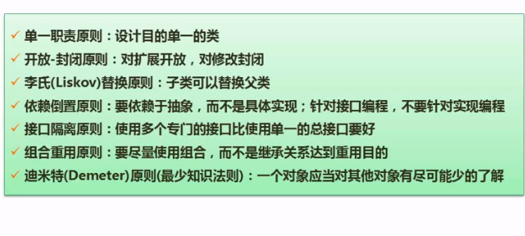

### 面向对象程序设计(OOP Objected-oriented Programming)

## UML

考察频度很高, 考点是**UML中的关系和图**.其中,用例图考察比例最高

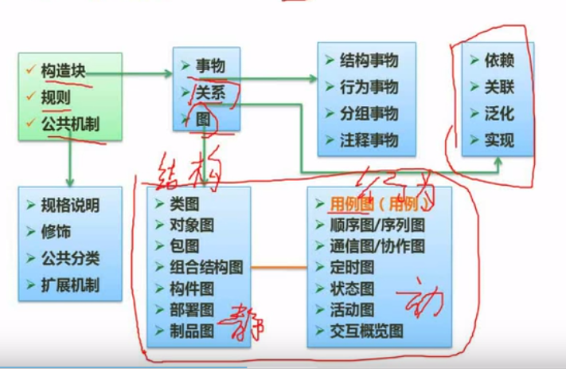

### 事务

* 结构事物 UML模型的静态部分,描绘概念或者物理元素,接口,用例,类等都属于结构事物
* 行为事物 UML模型的动态部分 状态,动作,消息.
* 分组事物 UML模型的组织部分.主要是包
* 注释事物 UML模型的注释部分

### 关系

* 依赖 箭头指向被依赖者 
* 关联和聚集 关联一般是类和类之间的,比如雇主和雇员的关系.雇主是0到1个,雇员是0到*个.聚集是群体和个体的关系.这个个体属于群体,比如孩子和家庭的关系.菱形在群体侧. 实心的菱形则是组合.
* 范化 可以考虑是父类和子类的关系,箭头由子类指向父类
* 实现 可以想象是方法实现了接口,箭头由方法指向了接口

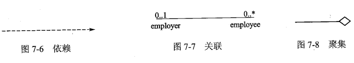
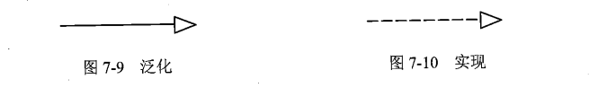

### 图

图是一组元素的图形表示.一般都是顶点(代表事物)和弧(代表关系)的连通图.
UML2.0提供了13种图:

* 类图 静态 展示一组对象,接口,协作和它们之间的关系.
* 对象图 静态 描述某一时刻一组对象之间的关系
* 用例图 静态
* 序列图 动态 场景的图形化标识
* 通信图 动态 也称为协作图 
* 状态图 动态
* 活动图 动态 本质上是一种特殊的状态图
* 构件图 静态 展示了构件之间的组织和依赖关系
* 组合结构图 静态
* 部署图 静态
* 包图 静态
* 交互概览图 动态
* 计时图 动态 适合实时和嵌入式系统

其中 序列图,通信图,交互概览图和计时图被称为交互图(对系统的动态方面进行建模的图称为交互图)

#### 用例图

主要考察内容:

* 根据题干确认用例名称
* 用例之间的关系 extend/范化 include/包含

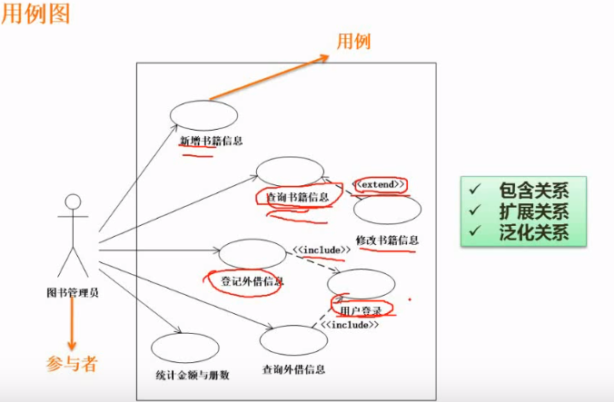

#### 类图

主要考察类名,多重度.关系.类属性和方法

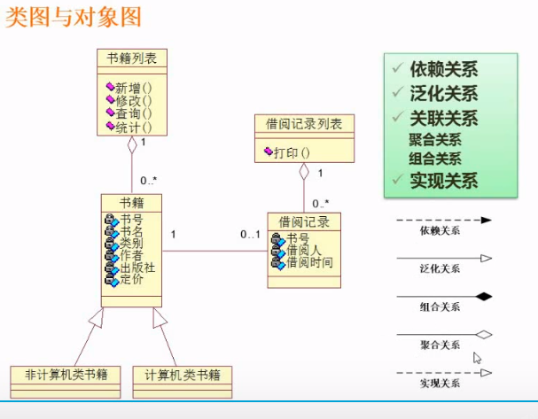
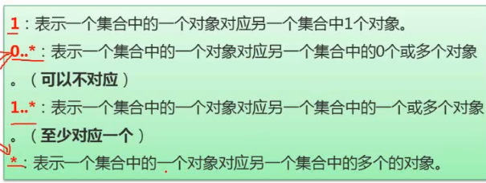

#### 顺序图

顺序图一般写在顶端,每一个对象引出一个生命线,用虚线表示.
序列图中用瘦高的矩形代表控制焦点.表示一个对象执行一个动作所需经历的时间段.它既可以是直接执行.也可以是通过下级程序执行.矩形的顶点表示动作的开始,底部表示动作的结束.
一般按照从上到下,从左至右(发起交互的对象在左边,下级对象放右边).按照箭头来执行.
箭头对应的是消息.
顺序图表达处理事务的时候的时间顺序.

顺序图主要考察的是消息.根据处理流程填上消息的名称.

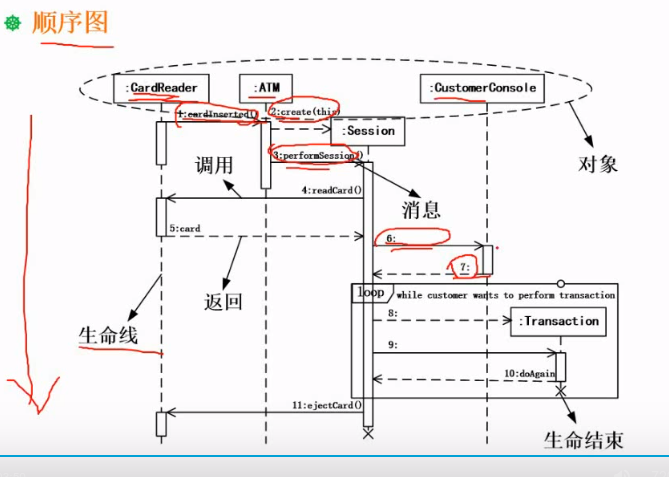

#### 状态图

状态图展现了一个状态机.由状态,转换,事件和活动组成.
箭头线表述状态. 主要查看对象为状态变迁的事件.
状态图强调行为的事件顺序

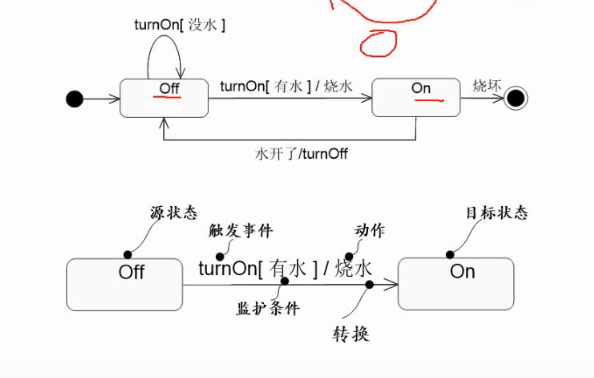

#### 活动图

箭头表示的是消息.

活动图是特殊的状态图,展现的是一个活动到另一个活动的流程.
活动图专注于系统的动态试图.强调对象间的控制流程.

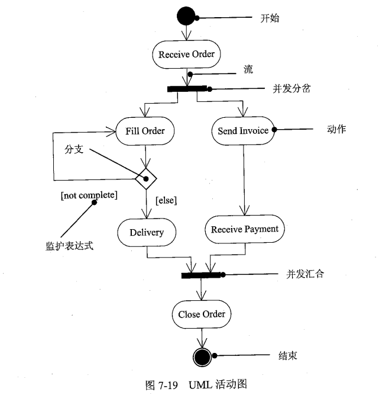

#### 通信图

也叫协作图.强调收发消息的对象的结构组织.顶点是参加交互的对象.传递的是消息.
通信图和序列图/顺序图是同构的,可以互相转换.

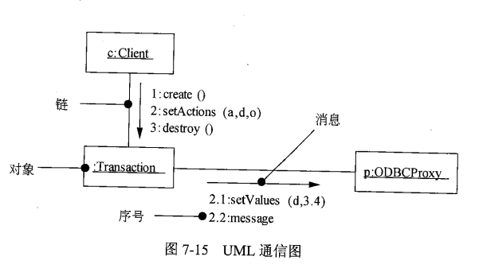

### 例题

例题1

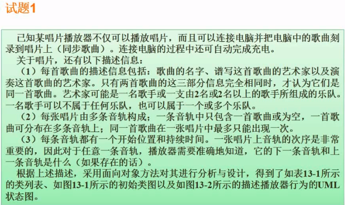
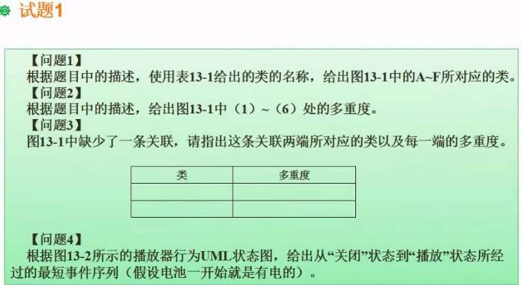

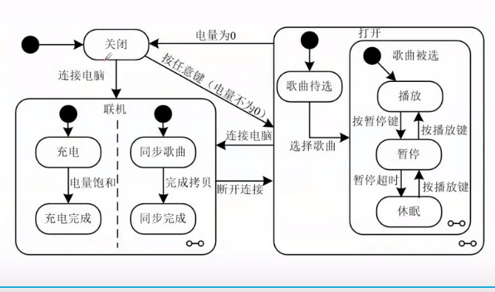

解题

*通过题干,我们可知的类包括:

* 歌曲(联合主键 名字,作曲和演奏).
* 艺术家, 歌手,艺术家和歌手是多对一的关系.歌手组成乐队,艺术家可以是歌手也可以是乐队.
* 唱片和音轨是一对多. 音轨和歌曲是多对一. 唱片和歌曲是一对多.
* 音轨后开始时间和持续时间,有指向上一个音轨和下一个音轨的指针

  注意图中的继承/范化,聚合和组合关系.进行分析

第一问

* A和B之间有1对多的编写和演奏的关系.可以肯定A为艺术家.B为歌曲.
* C和D是A的子类.C是D的聚合.我们通过题干分析可以知道.艺术家可以是歌手也可以是乐队.者说明歌手和乐队和艺术家有着范化的关系.艺术家是父类.歌手和乐队是子类.又因为乐队是歌手组成.是聚合关系.那么C就是乐队,D就是歌手.
* B和E有聚合关系,根据一首歌可以分布在多条音轨上,说明E是音轨.E和F有组合关系,说明F是唱片.

第二问

多重度的计算是站在对方的角度看待自己.计算B的多重度的时候就一个A对应几个B(是对应关系,不是一个A由几个B组成!)

* 由算计C的多重度.因为一个歌手对应0到n个乐队,所以1的值是0..*, 计算D的多重度,因为一个乐队至少需要2个歌手组成,歌手可以属于多个乐队.所以D的多重度(2)就是2..*
* 因为一个歌曲分布在多个音轨上.所以E的多重度(4)就是1..*,由于一个音轨最多保存一个歌曲或者空.所以B的多重度(3)的值是0..1
* 由于一个唱片对应多个音轨(至少一个音轨),所以5的值是1..*, 6的值是1.

第三问

题干3的部分没有在图中描述. 音轨有对应上一条和上一条(最少1条音轨).所以这条关键的类就是音轨.多重度就是0,1.

第四问 关闭,按任意键,选择歌曲,播放.

这类题的描述都是不完整的.做这类题的时候注意不要较真.模棱两可的事情假设成立,往简单的地方想.

## 设计模式

设计模式4要素:

* 模式名称 助记
* 问题 描述了在何时使用此模式
* 解决方案 描述了设计模式的组成,内部关系.协作和职责.
* 效果 描述了模式应用的结果.

设计模式分为 **创建型,结构型和行为型**三大类

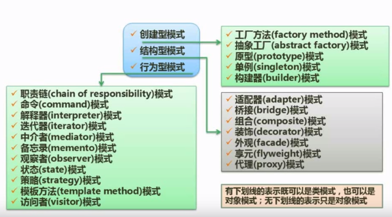

**看教材书仔细了解不同的设计模式的特点**

### 创建型设计模式

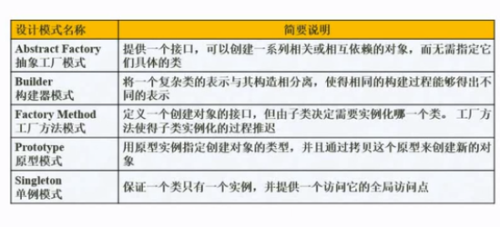

### 结构型设计模式

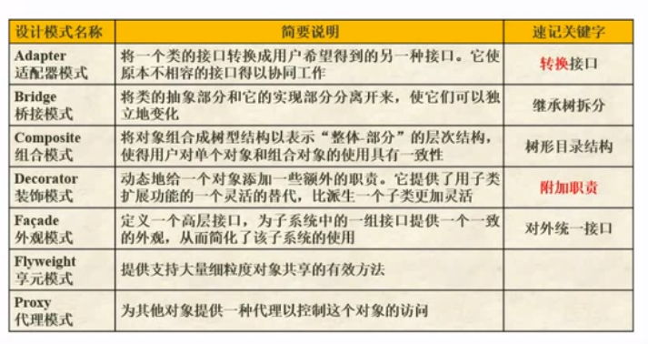

### 行为型设计模式

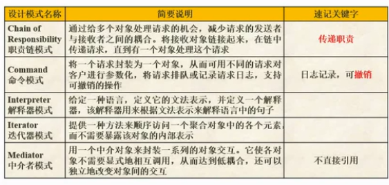
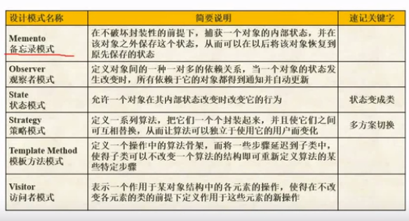

## 面向对象之Java

知识点和简单填空题

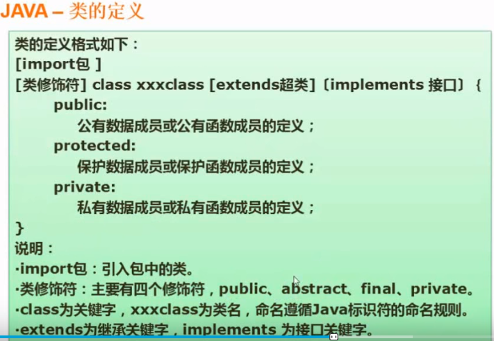
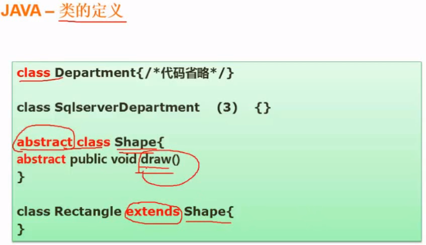
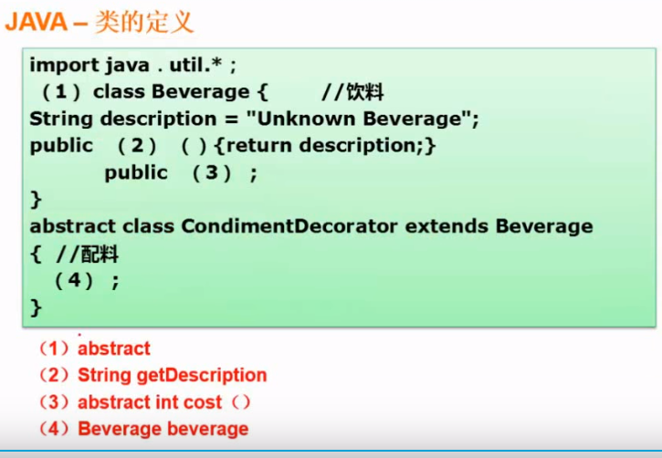

### 基本定义方法

#### 定义接口

* 接口是隐式抽象的，当声明一个接口的时候，不必使用abstract关键字。
* 接口中每一个方法也是隐式抽象的，声明时同样不需要abstract关键字。
* 接口中的方法都是公有的.

#### 类实现接口

* 类中实现接口时，方法的名字、返回值类型、参数的个数及类型必须与接口中的完全一致.
* 一个类,如果实现了某个接口,必须要实现接口中的所有方法

#### 抽象类

* 声明抽象类只需在声明类的时候在关键字class前面加上abstract即可 public abstract class User{....}. 包含抽象的方法不是必须的.
* 反之如果一个类包含抽象方法，那么该类必须是抽象类。也就是必须在class前面加上abstract
* 子类必须实现父类的所有抽象方法，或者声明自身为抽象类。
* 抽象方法只是声明，不包含方法体，就是不给出方法的具体实现也就是方法的具体功能。
* 构造方法，类方法（用static修饰的方法）不能声明为抽象方法。

```java
interface Int1(){
    /*
    接口中的方法默认是public的,接口中的方法都是abstract的.
    也就是说实际上是 public abstract viod method1();
    public和abstract可以省略
    */
    void method1();
    int method2(float num);
}

class MyClass implements Int1{
    /*
    一个类,如果实现了某个接口,必须要实现接口中的所有方法,
    类中实现接口时，方法的名字、返回值类型、参数的个数及类型必须与接口中的完全一致
    */
    private String name;
    private int age;
    public MyClass(String name, int age){
        /*类构造器*/
        this.name = name;
        this.age = age;
    }
    public void method1(){
        System.out.println("ok");
    }
    public int method2(float num){
        return Integer(num);
    }
}

public abstract class Parent{
    /*包含抽象方法的抽象类*/
    abstract String say();
}

public class Children extends Parent{
    /*实现父类方法*/
    public String say(){
        return "hello world!";
    }
}

/*父类子类和main方法的示范*/

abstract class Parent{
    public String name;
    public int age;

    public Parent(String name, int age){
        this.name = name;
        this.age = age;
    }

    abstract public void say();
    public abstract void speak();
}

class Children extends Parent{
    public Children(String name, int age){
        super(name,age);
    }
    public void say(){
        System.out.println("ok");
    }
    public void speak(){
        System.out.println("hello");
    }
}

public class Family{
    public static void main(String[] args){
        Children child = new Children("Jack", 12);
        child.say();
        child.speak();
    }
}

```

### 面向对象应用题

#### 试题1

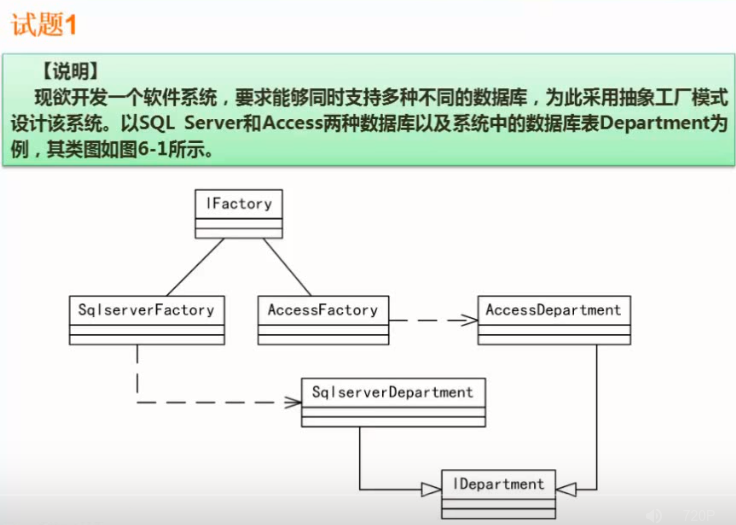
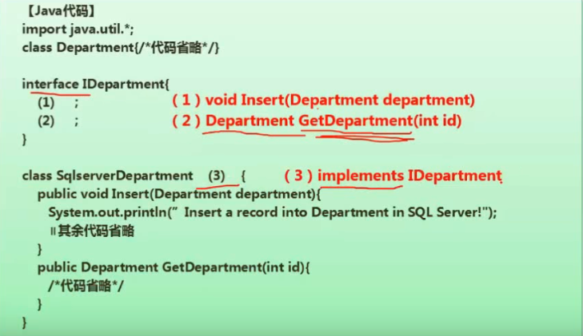
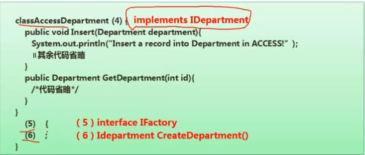
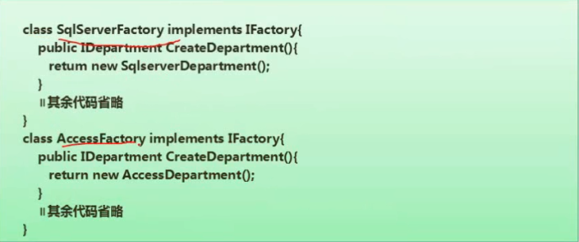

#### 试题2

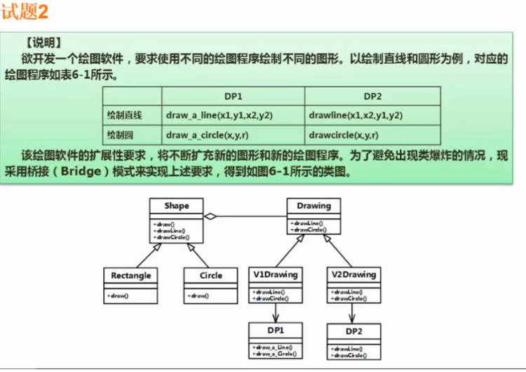
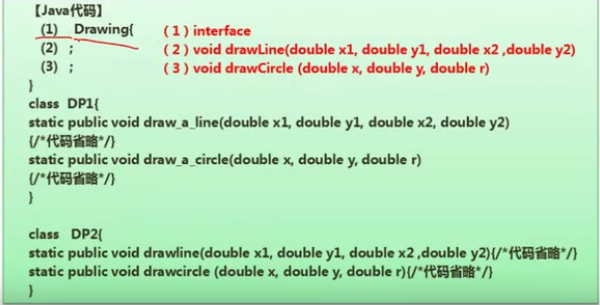
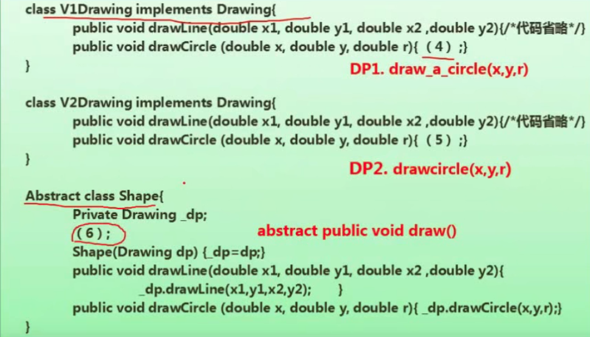
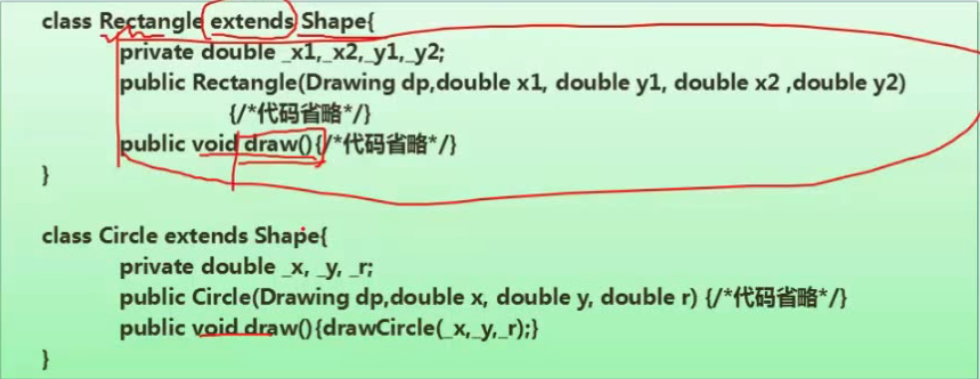

应用题一般不会让你真的写代码.记得查看其他的代码和UML的类图.