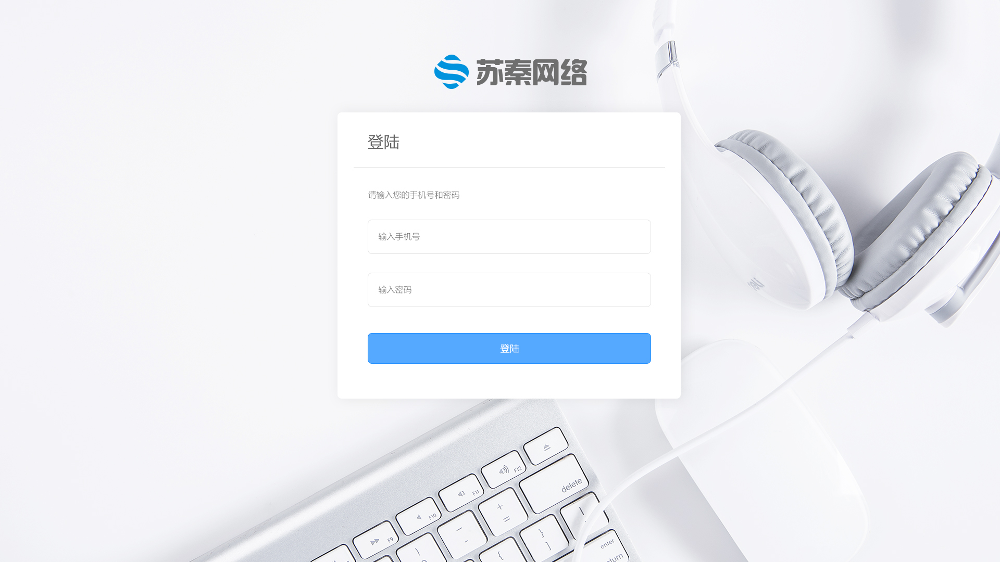

### 项目说明

这是一个项目管理的项目.
* 采用前后端分离式设计.
* 前端html+css+js/jquery
* 后端flask
* 身份验证jwt


### 约定
* 返回消息的格式为json格式:
```
response = {"message": "success", "data": data};
/*
* 说明:
* response['message'] 代表是否正确返回? 如果正确,返回success字符串,否则返回错误原因.
* response['data']  代表返回的数据.根据事情需要,可能是字典或者数组形式.
*/
```
* 本文档中出现的ajax的url都是相对地址,主机指向后端服务器.


### 页面讲解
* 登录页面

>讲解
输入用户名/手机号和密码.点击登录按钮. 提交用户名和密码的md5值到 /check_login 
正确返回{"message": "success"}
错误返回{"message": "错误原因"}