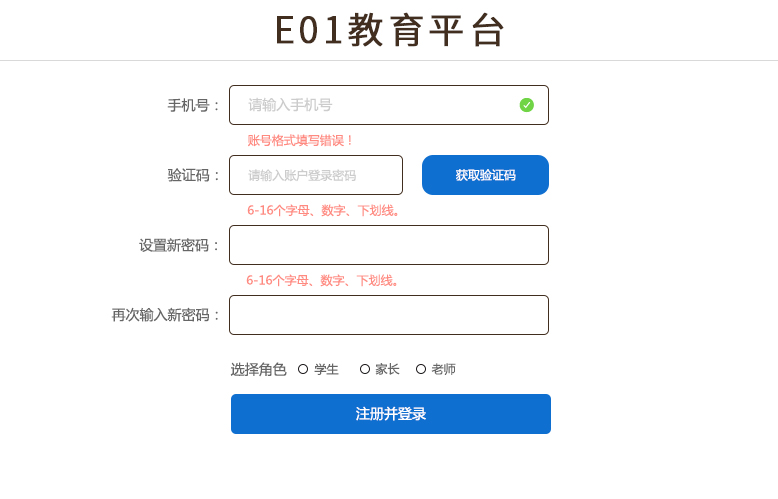
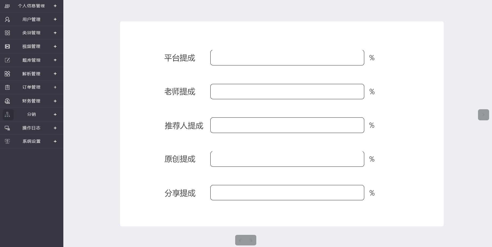
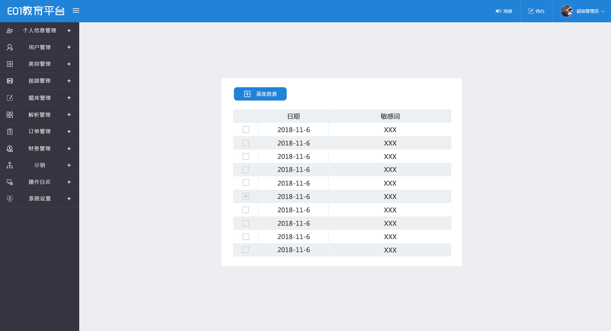

# E01教育平台设计草案

## 用户

### 注册

老师,家长和学生的注册页面是同一个.只是在注册成功后跳转到的页面不同(依据注册页面选择的角色).
老师的身份需要审核

* 使用短信验证码验证用户手机的有效性.
* 注册成功后会绑定手机号码. 用户中心会提供重新绑定手机号的功能以备用户修改绑定的手机.
* 注册成功后转到相应的页面完善信息.

### 完善账户信息

用户信息中的一部分称为基本信息.如果此部分信息不完善.系统会定期的提醒用户完善这些基本信息.
完善的用户信息至少包含:姓名,性别, 头像, 联系地址, 学校名称, 就读班级, 手机, 邮箱, 微信, qq等等.
需要有包含实名认证信息的部分.

完善个人信息中的学校和班级部分时:

* 如果当前用户是学生账户.则会自动向对应的班级的所有老师发送**师生关系绑定**请求
* 如果当前用户是老师账户.则自动和此班级的所有学生进行**师生关系绑定**

有关**师生关系绑定**的约定如下:

* 用于确认属班级中的老师和学生的对应关系
* 原则上同一班级的老师和该班级的学生才有师生关系的绑定

注意: 老师角色和家长角色有可能出现重叠的现象.在设计上可以考虑老师为家长的子集.即老师是部分特殊化的家长.拥有更多的功能.

老师的个人页面有一个申请*特聘老师*的按钮 (特聘老师是可以审核用户提交的资源)

### 我的圈子

用户的朋友圈信息.单独作为一页.顶部搜索栏共享.可以使用手机号码或者姓名进行搜索.搜索到的结果可以加为好友或者不同的**群组**.

有关**群组**的信息

* 用户可以自己定义一些用于标识好友的标签.用户可以使用这些标签给自己的好友分组.这些好友的分组称为**群组**
* 有三个预置的标签/群组: 老师/学生, 亲属, 朋友.
* 同一用户可以出现在不同的群组中. 比如谁自己的家长(亲属组)也可能会是自己的老师(老师组)

### 我的资源

### 登录

用户一旦登录成功后.系统会缓存用户的登录信息.此后的一段时间内,用户都可以在当前设备上直接登录

## 财务管理

### 设置提成比例

超级管理员操作模块

系统管理员可以在后台设置商品的提成比例.

* 商品分多种: 原创的, 整理/修改的, 其他创作方式的等.
* 不同种类的商品可以有不同的人参与分成. 这些不同身份的参与者所占的提成比例可以在后台设置

### 财务统计

系统管理员/财务人员操作模块

#### 财务信息统计页

显示系统当前财务统计情况.使用表格和图表(柱状图)的形式表示:

* 收入总数
* 不同收入来源(原创/分享/推荐等)的收入统计
* 不同群体(老师/学生/家长)的收入统计和排行

#### 财务信息列表页

以列表形式显示系统所有用户的收入概况.

* 可以使用搜索条件缩小显示范围.
* 数量多时显示分页
* 点击单条记录可以跳转到财务详情页

#### 财务信息详情页面

使用表格和图表(柱状图)的形式表示某个用户的收支情况

* 用户财务的统计信息. 收支走势图.
* 用户财务的历史查询.(以时间或者其他条件为筛选查找)
* 查询收支明细

#### 交易明细页

显示具体每一条收支交易的明细信息.用于查询具体的收支情况.会显示收支行为涉及的日期, 产品,事件.交易各方账户等.

## 敏感词过滤

管理员可以在后台设置系统敏感词.含有敏感词的内容无法被保存.更不能传输.

修改意见

> 敏感字段需要有搜索敏感词, 添加敏感词
> 敏感词可以采用罗列显示.只显示敏感词自身即可.其他字段无需显示.
> 填上几个具体的敏感词而不是 xxx, 比如法x功, 新唐人电视台等
