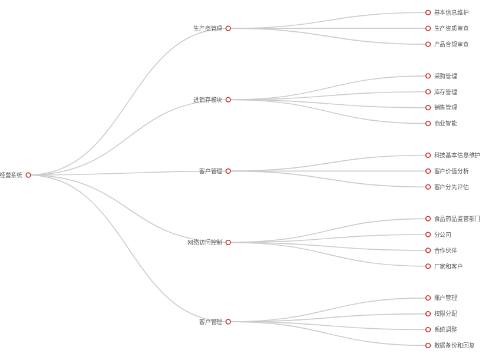

# 客户需求理解概述

具备网络访问功能的, 医疗器材经营相关的信息管理系统.
系统大致可分成以下几个模块

* 生产商/生产企业信息模块
* 进销存模块
* 客户/购货者管理模块
* 网络接口模块
* 系统管理模块

## 生产商/生产企业模块

记录生产厂家的相关信息, 除厂家名称,地址, 营业执照号码, 经营范围等**基本信息**之外.还应等级产品注册证、生产许可证效期和范围、经营许可证效期和范围等**资质信息**. 同时,也会记录生产厂家所生产的**产品名录**.用户在此模块可以:

* **基本信息管理**: 添加,修改,查询生产厂家信息.也可以使用条件过滤缩小查询的结果范围.
* **生产资质审查** 生产厂商如果营业执照,生产许可证等资质证书超期的话,系统会给出提示.
* **产品合规审查** 查看当前厂家生产的产品名录.如果产品名录中有与当前厂家的资质中范围不符的产品,系统会给出警示记录.
* 跳转到**采购管理模块**查看从当前厂家购进物品的记录.
* 跳转到**库存管理模块**查看仓库中当前厂家生产的产品库存情况.
* 跳转到**销售管理模块**查看从当前厂家购进物品的销售记录.
* 跳转到**客户管理模块理**查看从当前厂家购进物品的购买者信息.

## 进销存模块

进销存模块主要由采购,库存, 销售三个子模块和BI子模块组成

### 采购管理

管理公司的进货记录,模块记录每一次采购药品/器械名称,生产厂家.购买数量.采购人员等相关信息. 用户可以在此添加,查询和修改进货记录. 采购记录有唯一性编码.采购记录和库存管理中的入库记录有对应关系.
根据需要,采购管理模块有时候也会包含绩效管理的功能,用于自动计算采购人员的工作业绩.

### 库存管理

管理公司的仓储部门的入库和出库记录

* 入库记录记录入库物品的相关信息.入库记录有唯一性编码.**入库记录**和采购管理里**采购记录**中的有对应关系.
* 出库记录记录出库物品的相关信息.出库记录有唯一性编码.**出库记录**和销售管理里**销售记录**中的有对应关系.

### 销售管理

管理公司的销售记录,模块记录每一次采销售的药品/器械名称,购买者id.购买数量.销售人员等相关信息. 用户可以在此添加,查询和修改进货记录. 销售记录有唯一性编码.销售记录和库存管理中的出库记录有对应关系.
依赖大数据技术,对销售技术进行统计和预测计算.给商业决策提供帮助.
根据需要,销售管理模块有时候也会包含绩效管理的功能,用于自动计算销售人员的销售业绩.

### BI

BI（Business Intelligence）即商务智能模块，用来将企业中现有的数据进行有效的整合，其主要的功能是根据公司的业务特点, 按照设定的算法,使用数据可视化技术,直观的,快速准确地提供报表并提出决策依据，帮助企业做出明智的业务经营决策。

## 客户管理

记录客户/购买者的相关信息. 包括公司名称,地址,联系人,联系方式. 相关资质.维护此客户的销售人员等.用户在此模块可以:

* **维护基本信息**: 添加,修改,查询客户信息.也可以使用条件过滤缩小查询的结果范围.
* 查看/统计当前客户的**购买记录**.
* 依赖大数据技术,对客户的购买行为作出分析,以对客户的重要性和潜在风险作出评估.

## 网络接口模块

网接口模块用于向有关管理部门, 兄弟单位, 分公司, 合作伙伴, 厂家和客户等提供可控的基于身份的数据访问服务.其具体提供的功能和访问权限需要逐一协商,确认.由系统管理员统一授权管理.

## 系统管理模块

系统管理模块是整个系统的基本模块.是对整个系统的及其用户进行管理的模块.一般只有管理人员操作.其提供的基本功能包括:

* 用户账户的添加,修改.删除,停用启用等.
* 用户权限的赋予,收回.
* 系统的参数和关键阈值的调整.
* 网络接口的权限和功能设置
* 系统数据的备份和恢复.

## 结束

以上只是依据客户需求文档和过往相关案例给出的大致的需求理解概述. 其中偏差和谬误不可避免.还望能获得进一步的指正,特别是系统的很多具体功能和实现细节是由使用者(公司)实际的管理方法和业务模式决定的. 所以还需获得更多的信息以作出正确的方案.