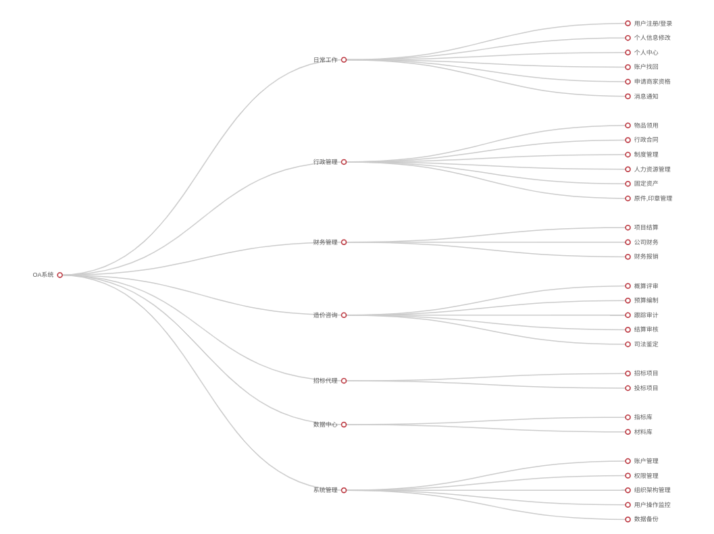

# 南京OA系统概要设计方案

app主要的功能是提醒, 通知和审核功能.

## 功能和模块

系统共分为以下几大模块

* 日常工作
* 行政管理
* 财务管理
* 造价咨询
* 招标代理
* 数据中心
* 系统管理

用户的权限控制采用基于权限组的访问控制
用对对每个模块的操作都需要收访问权限的控制
访问权限的控制可由系统管理员设定

系统**架构图**

### 账户体系

* 账户分配
* 分公司,架构管理
* 用户100以内

### 日常工作

#### 公告通知

系统公告的发布和修改.发布的公告除了会在系统的醒目位置展示外,也会第一时间推送到用户的App上. 用户也可以查看公告的历史信息.发布修改和删除工作需要特殊的权限.

* 会议通知, 重要事件

#### 需要整理的信息

* 使用者有哪些？分别都是哪些权限？
* 公告有哪些类型？这些类型的公告的格式如何（有哪些必要的字段），是否包含图片或者其他信息？
* 公告的发布是否需要审核？

#### 知识库

知识库体系记录了和公司业务相关的技术文档.以便员工在必要的时候学习和参阅.

* 内部员工都可以学习相关的知识.
* 涉及商业机密的技术文档的检索和查看需要**相关人员授权**
* 任何人都可以**上传技术**文档.但**需要**知识库管理人员的**审核**
* **知识库管理员**除了可以操作自己提交的提交技术文档之外,还可以对其他人员提交的技术文档进行审核, 修改,删除,合并和发布等

#### 需要整理的信息

* 知识库有哪些分类？分类是否需要动态维护？知识库的格式是否固定？
* 知识库的维护人员? 全体?指定人员? 
* 知识库的提交是否需要审核?
* 知识库是全体员工可以浏览的?

#### 考勤管理

本模块暂时移除

用户可以在在App上直接打卡签到.当然.考勤部分也会和传统的考勤设备连接(门禁机, 卡式/指纹式/人脸识别考勤机等).用户无论是在传统的考勤设备还是App上的签到,效果是一样的(签到记录会进行同步)
人员的外出同样可以在App上进行操作.系统可以记录外出人员的外出时间, 行程, 预计返回时间等信息.
请假的操作也可以在App上进行.和签到和外出不同的是, 请假的操作需要审核. 请假的种类(事假, 病假, 婚嫁等)和请假时间的长短不同.需要提交的材料也不同.比如: 病假需要拍照上传一张病例卡,婚假需要提交结婚证照片等.另外,根据请假日期的长短不同.审核的流程也不同.这个要根据企业的规章制度进行定制(比如请假3日内部门经理可批,超过3日需要上一级领导批准等)

#### 需要整理的信息

* 考勤需要和哪些设备同步数据?这些设备是否有同步设备的功能?如果没有,那又以何种方式同步数据?
* 考勤管理的数据是否可以编辑?导出?导入? 这些操作由哪些人完成?
* 考勤管理的附加功能? 漏打卡提醒? 何时, 何种方式, 提醒哪些人?
* 考勤模块的权限分配.

#### 待办事宜

* 分配工作(工作概况, 什么时间完成)
* 需要处理的工作的提醒
* 会议通知
* 超期限提醒

待办事宜类似系统消息+提醒.
用户可以在这里创建自己的工作计划,具体的信息可以包含计划事件的标题, 地点, 时间和内容等.系统会在事件将要到来之前,推送一条提醒的消息到用户的App端.超期未履行的计划.会标记出来.同时.员工的工作计划也可以由他的领导查看.以方便领导了解下属的工作进度安排.

#### 我的业绩

业绩放入个人中心模块(新增).

业绩以表格形式展示,以年度展示

#### 沟通平台

取消

### 行政管理

行政管理主要处理一些日常的行政事务.

* 物品领用
* 行政合同(非项目合同)
* 人力资源管理

* 人力资源职称管理制度固化

所有元件都有打印功能(审批通过后才能打印, 打印期限3天,过期不能打印).
员工的证书公司统一保管.
证书的选择 选择建筑师->名字列表->选择, 过滤器
合同  合同类别->单位-->选择  合同金额筛选  时间区间

#### 物品领用

* 办公用品  软件狗  烟酒

#### 行政合同

标题, 备注 ,文件(doc/png) 审批  提交人  

行政合同有审批过程  有批复/审批意见
审核流程

#### 制度管理

这里主要由行政人员编写, 修改,发布公司的行政,人事,管理等个方面的制度.**制度只有发布后才可以**被用户**浏览**,在此之前,只有行政人员才能查看和修改.
每次的制度的发布,系统都会自动生成一条公告信息推送到用户的手机端

#### 需要整理的信息

* 制度的一般格式.
* 操作权限问题
* 制度的审核过程?
* 制度管理的一般流程(添加, 审核,发布)

#### 人力资源管理

人力资源管理主要是对人才信息和员工档案方面的管理.人力资源除了会详细记录用户的姓名, 年龄,联系方式等基本信息之外,还会记录学历, 职称, 职业技能资格, 获奖或者处罚记录, 在职/离职状况, 过往的背景调查记录.

#### 需要整理的信息

* 人力资源管理的一般流程和关键信息要点(关键字段)
* 操作权限
* 特殊事件和注意事项

#### 固定资产

固定产品的档案管理

这一部分的功能主要是就是固定资产的档案管理. 固定资产的档案包括: 固定资产编号, 固定资产的基本信息, 使用部门/人, 保管人,责任人, 已使用时间, 使用年限, 折旧情况等.管理人员可以分类的查看固定资产的档案.进行相应的操作.

#### 原件,印章管理

企业在业务运作的过程中,经常会发生.需要借阅/借用原件或者印章的情况.而原件/印章往往都是独此一件.在频繁的借用和流转的过程中.如果进行跟踪和管理是本部分的核心任务.
用户可以在页面/App上提出对原件/印章的借用申请.在操作的时候,用户可以查看到物品是否已被借出,对于未被借出的物品.用户在填写借用目的, 预计借出日期和预计归还日期后即可提交借出申请了;
对于已被借出的物品,系统则会显示最早的预计归还时间.以便用户评估是排队申请还是选择其他办法.
管理员人可以查看,评估借用申请.决定是同意借出或是拒绝借出.根据公司实际的业务情况.管理人员也可以调整物品借用的优先级以满足业务需要.
物品必须归还后方可继续借出.不得在借用人之间流转.

### 财务管理

面向公司财务人员提供的一系列功能.这一系列功能与公司的管理制度,业务流程关系密切. 需要向相关专业人员咨询详细的需求后作出规划设计

* 项目结算 对外结算,对内结算
* 公司财务(财务流水记账模式, 开票, 申请开票的流程)
* 财务报销(去掉)
* 审核权限

#### 项目结算

查询项目 查询条件,过滤条件,
分单项目结算表和多项汇总表(针对某公司)
针对单个项目, 针对公司, 全部
项目收费标准会在项目登记步骤中注明,
收费标准也可以后来补上.
收费标准可以手动填写和依赖公式生成.
项目结算必须有已收回款项的数额.

#### 对内结算

对内结算就是计算员工提成.
结算的相关信息会反映在个人业绩中.
结算完毕后由财务备注已结算.

#### 开票流程

* 开票完毕后,财务上传开票图片.
* 开票和项目关联
* 有备注部分.
* 开票金额精确到分

### 造价咨询

办公室先登记

参与项目的人可以查看

需向相关专业人员询详细的需求后作出规划设计

项目登记表

* 概算评审
* 预算编制 和招标项目 可以选择关联
* 跟踪审计
* 结算审核
* 司法鉴定
* 其他

### 招标代理

办公室先登记

需向相关专业人员询详细的需求后作出规划设计

* 招标项目 和预算编制可以选择关联
* 投标项目 和原件管理关联(投标需要原件和其他的投标文件)
* (投标的)方案模板.
* 投标和招标都需要过程控制,状态.总结

### 数据中心

需向相关专业人员询详细的需求后作出规划设计

* 指标库 比对项目的结果是否符合规范
* 材料库

#### 指标库

* 从历史的造价咨询项目中生成
* 手动添加指标
* 关键指标预警设置

#### 材料库

材料的价格有政府发布的指导价和市场价格之分,需要标明
办公室录入
其他员工日读

### 系统管理

系统管理模块.系统管理模块为系统机基础功能提供技术支持.并提供优对系统用户和权限的管理功能

* 用户体系 为用户的登录,操作提供基础支撑
* 部门架构 管理系统的部门结构.调整部门上下级关系.设定部门经理/管理者等
* 权限管理 为不同岗位的用户创建不同的权限组.并设定这些用户访问权限
* 账户管理 对系统的账户信息进行 添加/修改/删除,账户的停用启用等操作.
* 系统监控 对平台的硬件系统进行监控. 包括CPU使用率, 硬盘空间, 内存空间,带宽占用等. 在硬件需要升级和更换之前,及时提醒管理员注意.
* 系统日志 方便管理员查询用户的操作和系统的运行记录,辅助管理员定位问题和排除故障.

## 开发计划和前期准备

在双方确认委托开发事宜(开始开发项目)后,即可确认开发需求中业务上的一些细节问题 

需要优先确认的业务细节:

* 行政管理中的行政合同部分
* 财务管理模块
* 造价咨询模块
* 招标代理模块
* 数据中心模块

当然,其他的业务流程也需要确认一下. 处于沟通效率起见,最好能够面谈.
另外,用户的人数.是否有分公司, 甚至近期的远景最好也能了解一下.因为用户人数和是否由分公司以及分公司之间的联系有可能影响软件的设计架构,硬件和网络服务的规模.所以也似非常重要的.
当以上的需求全部确认后.有乙方出具一份开发计划书.计划书是中的内容:

* 各个模块详细的业务流程,业务逻辑.相关规范和注意事项.
* 开发计划的步骤和和计划.
* 甲方需要准备的资料, 设备和其他资源.

开发计划书经双方认可后.开发工作即可正式开始.

## 团队介绍

**上海敏迭网络技术有限公司**是一家新兴的软件开发服务企业. 主要从事各类信息系统的定制开发业务和技术服务.公司的核心成员曾长期供职于国内知名的企业,尤其集中在金融, 医疗行业. 尤其擅长数据采集和分析技术. 是国内第一批数据自动化采集分析的先行者,在python(爬虫,数据采集, 数据分析)和mongodb(大数据存储, 聚合, map-reduce, 集群化部署)方面处于行业领先梯队.

公司的软件设计人员是通过国家人事局软件设计师(中级)职称认证的资深软件设计师.拥有20多年的软件开发和设计经验.实力雄厚.

公司倡导技术与服务并重, 在满足客户软件开发需求的同时,提供专业的技术支持服务.

> * 我们是对创造力充满热情的大梦想家,通过创新和颠覆来热切追求新的机遇和市场。
> * 我们有开拓精神, 不走寻常路.不循规蹈矩.随时准备开辟新的道路并承担明智的风险。
> * 我们是优秀的倾听者，始终保持清晰和尊重。永远把客户的需求放在第一位.
> * 我们拥抱现实。运用非凡的的设计和严谨工作.在信念中保持勇气，不因困难和迷惑而放弃.