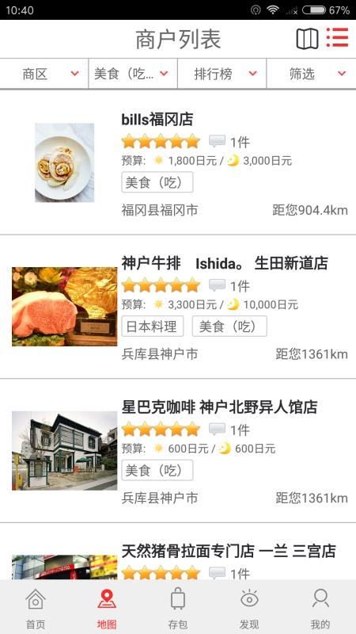

# 综合应用App简要设计方案

## 系统架构图

## 模块和功能

App的功能主要分四大模块:

* 人才招聘
* 外卖点餐
* 企业服务
* 办公设备租赁

四个模块的共用一个账户系统.再加上系统管理部分.整个系统一共是6个模块. 下面分别介绍各个模块的功能

### 账户体系

账户体系是系统身份验证系统.主要提供以下功能

* 注册和登录
* 个人信息的修改
* 账户密码找回
* 实名认证
* 消息通知

其中,实名认证包含个人实名认证和企业实名认证.

1. 响应国家相关法律法规的有相关网络实名制的规定.
2. 在某些场景下(比如发布),如要核实操作者身份的场景下使用(比如发布岗位的时候,需要确认公司信息)

### 人才招聘

人才招聘模块主要提供岗位发布和投递应聘简历的功能.

* **岗位发布**.包含岗位名称, 招聘人数,任职资格, 福利待遇等
* **岗位浏览** 已发布的岗位会在人才招聘模块显示(需要设计显示样式),用户可以点击查看岗位详情.
* **简历投递** App的注册用户都可以创建自己的简历. 看到自己心仪的岗位可以一键投递
* **简历浏览** 企业发布岗位信息后,除了等待应聘人员投递简历以外,也可以主动浏览系统的**人才库**.看到自己心仪的人才简历, 可以主动联系对方(一般的招聘站点,查看简历需要少量付费)
* **消息通知** 用户投递简历后. 用人单位的反馈信息可以通过消息系统第一时间推送到投递者的App上.

### 外卖点餐

外卖点餐模块分商家身份和用户身份.

* 用户身份可以点餐.商家身份除了可以点餐(食客)外,还可以接受别人的点餐(店家)
* 用户身份是默认的.商家身份需要申请(相当于店家入驻).一般都需要一定的审核手续(营业执照,卫生许可证等,这个由甲方自定决定)

外卖点餐模块提供的功能如下

* **菜品上架** 卖家在通过资格审核后,就可以上传自己的菜品信息. 上传的菜品信息审核通过后,就可以显示在App的外卖频道了.
* **活动举办** 卖家可以通过举办活动的形式进行促销(满30减10, 买一送一等等)
* **竞价推广**  卖家还可以通过付费的方式,让自己的店铺在外卖频道置顶显示.以增加曝光率.
* **订餐** 订餐是外卖模块的基本功能. 一般都是按照店铺来浏览.可以**自定义排序**方式,比如按照好频率, 平均消费等.可以使用**条件筛选**, 比如3公里内等. 当然.**定时派送, 浏览评论**这样的功能都是配套提供的.

### 企业服务

企业服务模块主要是面对企业用户,提供诸如代理记账, IT外包, 人力派遣等之类的面向企业的服务.

* **分类浏览** 企业服务模块会内置一些服务的分类(比如代理记账, IT外包, 人力派遣等),用户可以按照分类进行查看. 当然,也可以自定义条件进行查询和筛选.
* **预约服务** 用户也可以预约商家在指定的时间上门服务.也可以和客户签订服务协议进行长期合作.
* **留言和评论** 用户可以留言对商家的提供的服务进行咨询. 在消费过商家的提供的服务之后,还可以对商家的服务进行打分和评论.

### 办公设备租赁

本模块的主要功能是提供一些办公设备的比如打印机, 复印机, 电脑桌, 茶几等办公设备的租赁

* **分类浏览** 办公设备租赁模块会内置一些物品的分类(比如桌椅, 打印机/复印机, 电脑等),用户可以按照分类进行查看. 当然,也可以自定义条件进行查询和筛选. 和企业服务模块不同,这里会有较多的图片展示.以方便用户对需要租赁的设备有个直观的认识.
* **设备租赁** 用户可以选中自己中意的办公设备.选择租赁方式和时长,就可以提交订单了. 商家在确认用户的租赁订单代表租赁合同生效.同时会有成功的消息发送到用户的App上.(如果需要在线支付的话,需要增加一个在线支付的功能)
* **留言和评论** 用户可以留言对商家的提供的租赁服务进行咨询. 发生过消费行为的,还可以对商家的服务进行打分和评论.

### 系统管理

系统管理是App的后台管理模块.主要提供的是一些管理方面的功能

* **数据统计**  注册用户人数, 在线率, 日活人数, 各个模块的使用频率等一些统计信息.用于对App的整体运营情况有一个直观的了解.
* **用户管理** 账户信息查询, 启用/禁用. 操作行为统计等
* **信息审核/管理**  对用户发布的信息进行审核和管理. 
* **数据备份**  自动系统备份数据

## 团队介绍

**上海敏迭网络技术有限公司**是一家新兴的软件开发服务企业. 主要从事各类信息系统的定制开发业务和技术服务.公司的核心成员曾长期供职于国内知名的企业,尤其集中在金融, 医疗行业. 尤其擅长数据采集和分析技术. 是国内第一批数据自动化采集分析的先行者,在python(爬虫,数据采集, 数据分析)和mongodb(大数据存储, 聚合, map-reduce, 集群化部署)方面处于行业领先梯队.

公司的软件设计人员是通过国家人事局软件设计师(中级)职称认证的资深软件设计师.拥有20多年的软件开发和设计经验.实力雄厚.

公司倡导技术与服务并重, 在满足客户软件开发需求的同时,提供专业的技术支持服务.

> * 我们是对创造力充满热情的大梦想家,通过创新和颠覆来热切追求新的机遇和市场。
> * 我们有开拓精神, 不走寻常路.不循规蹈矩.随时准备开辟新的道路并承担明智的风险。
> * 我们是优秀的倾听者，始终保持清晰和尊重。永远把客户的需求放在第一位.
> * 我们拥抱现实。运用非凡的的设计和严谨工作.在信念中保持勇气，不因困难和迷惑而放弃.

## 案例介绍

软件版权归甲方项目,无法提供截图.有保密协议的用户,也隐去了客户名称.敬请谅解.

### APP项目

特别选择近期的为某旅游公司定制的APP作为展示.

#### 旅游出行APP

##### 首页

##### 给旅游人士提供存包指南

##### 免税店地图

##### 美食指南

##### 商城部分的商品详情

### 系统项目经验

#### XX生产管理系统

行业: 工业生产
2018/10-2018/11
软件环境：liunux python mongodb
项目描述:

是一个为上海某外商医药企业定制的轻型的MES系统.用于对生产线上的条码进行管理.系统业务逻辑比较简单.使用mongodb数据库的原因是为了提供更快的查询速度.同时,由于生产线环境多嵌入式设备.所以系统本身有很多和嵌入式设备通讯的接口.是真正意义上的多语言编程环境.这也是本系统的特点之一.

#### XX人力资源管理系统

行业: 通讯
2017/2-2018/8
软件环境：liunux python mongodb rabbitmq celery redis android ios
项目描述:

一个针对物流车司机的人力资源管理系统. 为顺丰和德邦定制的.人力资源信息可以依赖: 1.人事专员输入 2. 劳务中介 3. 司机推荐 4. 微信公众号 多条路径录入.  系统本身的会依赖一些规则,对这些人力资源进行分配和评估.根据其特点,推送给对口的企业用户. 公司系统也会跟踪人才的就职和离职信息.对人才的评估形成一个完整的闭环. 系统本身mongodb的数据库.python的应用开发. 由app,网页端和微信端. 中介和企业内部员工各自有自己登录界面.系统附带KPI功能.

#### 驾驶安全管理系统 App项目

行业: 通讯
2017/10-2018/4
软件环境：liunux python mongodb rabbitmq celery redis android ios
项目描述:

一个对驾驶员进行安全管理和风险评估/预测的系统.为顺丰和德邦定制的.其主要的工作原理是: 通过app软件,依赖手机/穿戴设备上的传感器,收集用户的驾驶行为数据.进行分析和预测.属于一种主动的驾驶安全管理系统.相关涉及的技术主要是数据的采集.分析和趋势预测. 系统采用moogodb数据库. 12个节点的副本集+分片架构. 由于数据量较多,使用ElasticSearch做的搜索引擎. 应用服务使用python开发. nameko做的微服物框架.消息中间层用的是rabbitmq.客户端除了anroid和ios之外,也包括定制的穿戴设备. 管理端基于高德地图开发.

#### 交易平台爬虫系统

行业: 金融
2016/8-2016/10
软件环境： 软件环境：linux python Redis mongodb selenium
硬件环境：阿里云主机
开发工具： pycharm

项目描述：

爬虫项目,为浦东的XX金融集团定制. 替代内勤人员每日在交易网后台上查询信息的功能.由于交易平台的安全性非常强,常规的爬虫手段直接被404,经过思考后,采用selenium框架来完成. 完美解决问题.系统可以: 1.定时爬取资料. 2. 推送关键消息给对应员工 3. 对数据进行共计分类,可视化呈现.等.

#### 金融直播室

行业: 金融
2016/3-2016/6
所属公司： 日辉集团
软件环境： 软件环境：linux python Redis mysql rabbitMQ tornado flask celery mysql
硬件环境：阿里云主机
开发工具： pycharm

项目描述：

为陆家嘴的日辉石油集团定制的视频直播室项目. 使用了全双工的实时通讯协议(websocket).

#### CRM 系统二次开发

行业: 通讯
2014/8-2015/5
软件环境：windows javascript jquery python mssql

项目描述:

此CRM系统为二次开发项目.为和源通讯股份有限公司定制.是在一家北京的叫"八百客"的CRM基础上进行的开发.原因是由于服务商提供的产品无法满足当时企业发展需求.而且北京的服务商自己没有定制的服务.所以在原有的CRM基础上进行的二次开发.前后经历了大半年时间.完全满足了当时的业务需求.