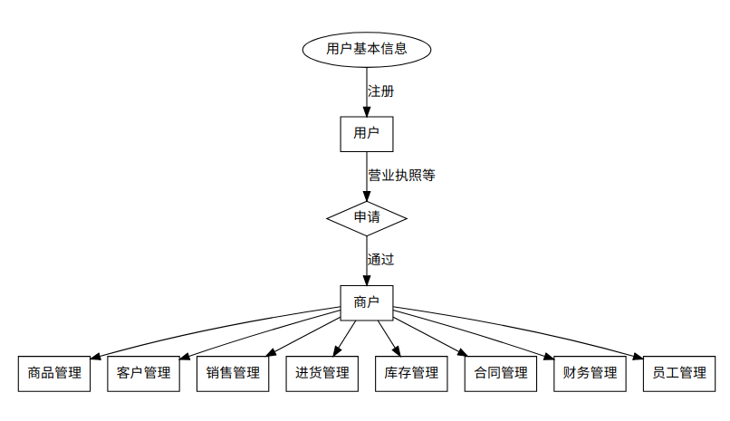

# 在线综合销售管理解决方案

### 会员管理

数据流程图

#### 用户会员

**基本信息**包含但不限于:

* id   唯一,可以系统中确认唯一的用户
* 真实姓名
* 昵称     
* 绑定手机
* 收货地址 可以添加多个地址.但只能有一个地址被设为默认地址
* 性别
* 家庭地址
* 身份证号码
* 其他基本信息

只需基本的信息即可注册(手机号码,姓名,等)成为用户. 登录后可以进行如下
**基本操作**

* **发布信息** 发布的信息可以是供求信息, 招聘, 求职, 招租, 二手买卖信息等多种.需要预置相关的信息模板.

#### 商户会员

用户会员在提交了必要的审核信息后,经系统审核可以成为商户会员

**商户信息**一般包含:

* 商户id  唯一,可以在系统中确认唯一的商户
* 商户名 用于显示在店铺
* 经营范围
* 商户级别
* 口碑积分
* 创建时间
* 营业执照等证照相关信息
* 其他商户的信息
