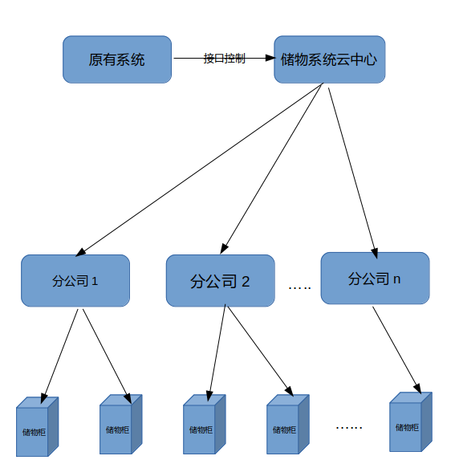

# 复兴储物柜系统报价

## 系统概述

分布式方案的储物柜统一管理系统.

简要的**控制流程图**如下

## 开发计划和报价

整个开发过程包括

* 储物柜控制系统开发
* 储物柜云中心开发

2个阶段.

储物柜控制系统开发阶段,需要甲方提供:

* 储物柜锁头控制组建
* 储物动作柜控制板
* 储物柜控制板通讯协议

作为储物柜控制系统开发的必要条件.

储物柜云中心开发阶段,需要甲方提供一台云服务器,作为储物系统云中心的部署载体.并要求直通互联网.(甲方可以选择阿里云ECS等虚拟服务商),硬件要求以目前的客户容量(2核心4G内存60G硬盘2M贷款即可满足)

项目开发周期预订为30个工作日
项目整体报价为人民币5万元人民币

## 团队介绍

**上海敏迭网络技术有限公司**是一家新兴的软件开发服务企业. 主要从事各类信息系统的定制开发业务和技术服务.公司的核心成员曾长期供职于国内知名的企业,尤其集中在金融, 医疗行业. 尤其擅长数据采集和分析技术. 是国内第一批数据自动化采集分析的先行者,在python(爬虫,数据采集, 数据分析)和mongodb(大数据存储, 聚合, map-reduce, 集群化部署)方面处于行业领先梯队.

公司的软件设计人员是通过国家人事局软件设计师(中级)职称认证的资深软件设计师.拥有20多年的软件开发和设计经验.实力雄厚.

公司倡导技术与服务并重, 在满足客户软件开发需求的同时,提供专业的技术支持服务.

> * 我们是对创造力充满热情的大梦想家,通过创新和颠覆来热切追求新的机遇和市场。
> * 我们有开拓精神, 不走寻常路.不循规蹈矩.随时准备开辟新的道路并承担明智的风险。
> * 我们是优秀的倾听者，始终保持清晰和尊重。永远把客户的需求放在第一位.
> * 我们拥抱现实。运用非凡的的设计和严谨工作.在信念中保持勇气，不因困难和迷惑而放弃.