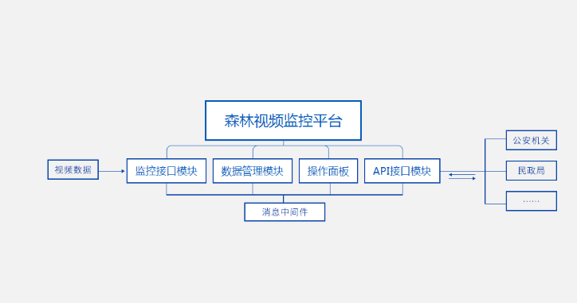

# 森林视频监控平台

使用视频设备和图像分析技术对指定的林区进行监控，拍摄/记录：

## 平台组成

本系统为BS模式,客户端无需部署,直接使用浏览器操作.支持浏览器,微信,App多种终端接入.部署平台为Linux,提供系统及别的稳定性保障.平台本身由Python编写,配合MongoDB4+数据库.开发团队经验丰富: 有过数十个Python+MongoDB的项目开发经验. 总结出一套自有的开发模式,并为此开发了专用的开发工具.

### 系统示意图

### 设计特点

* **模块化设计** 任一模块内部发生的故障都会被禁锢在模块内部不会传播到其他模块，更不会引发系统连锁反应而导致宕机。配合备份系统，可以最大限度的保证系统的健壮性。
* **松耦合** 模块和模块之间的设计采用松耦合设计,通讯由消息的架构支配.模块之间互不关心对方的实现和机制.模块之间的依赖性被降到最低.对于单个功能模块的添加,删除,修改,重置等作业都不会影响到其他模块.对系统升级改造非常灵活和方便,系统的灵活性,扩展性和稳定性都很高.
* **Python语言** 平台以python语言开发.鉴于python语言在人工智能领域的绝对领导地位 , 在未来,可以很方便的嵌入人工智能插件而无需太多的改动. 为将来在人工智能领域的扩展做好准备. 同时,由于python语言可以很方便的调用其他语言的程序(python也被称为胶水语言,就是因为python可以很简单的把不同语言书写的代码结合在一起运行),所以将来如果因为某些原因需要使用其他语言(比如把对速度敏感的代码部分用C/C++重写),也能让系统的改动将到最低,极大的降低的维护成本,保障系统的可用性.
* **MongoDB数据库** 平台选用MongoDB作为数据库保存数据.和传统的关系型数据库相比,MongoDB除了具备关系数据库的所有功能之后,还有以下优点:
  
>1. **更快**的数据读取/写入.
>2. **更多的数据类型**支持.无论是GEO(地理位置数据),还是复杂的多重嵌套的字典和数组.都能不做类型转换的完美保存(不会像sql数据库那样随意转换数据类型,在强类型语言中,这个问题很容易导致莫名其妙的类型错误).
>3. **更容易扩展**到大规模的集群.传统的数据库集群要么收费昂贵,要么结构复杂,要么需要额外的框架/中间件支持.MongoDB自带的副本集和分片机制.可以无需额外成本的无限制的提升数据库容量(副本集群)和读写性能(分片机制).并且这个过程完全不用停机.
>4. **完美备份**,副本集中每一个副本都是数据库的备份. 你可以让数据库一边工作一边备份.这个备份工作完全是透明的,多个备份也不会给系统造成负担,并且这个过程无需人工干预的.无需额外的备份设备.数据备份成本低.安全可靠.
>5. **事务支持** 2018年,MongoDB4+版本已支持跨副本集(群)的事务.这本来是MongoDB的弱项.现在短板也被补齐.以前使用sql+MongoDB工作环境,现在单一的MongoDB数据库就已经完全可以应付了.
>5. **数据聚合** MongoDB4+自带强大的数据聚合和分析功能.强大的aggregate和map-reduce查询完全可以满足一般的数据聚合和分析的需求.

* **消息中间件** 平台包含一个消息服务器.功能是在各个客户端和服务器之间实时的传递消息.消息的传递机制和规则可以完全由客户定制.可将关键信息(比如疑似火险的提醒)第一时间传递到相关人员的设备(手机/pc)上.并且可定制多种提醒方式: App,微信, 短信, 语音电话等.即使没有接入互联网,也能在局域网内部实现实时的消息传输.
* **多种接入** 默认情况下,用户可以使用浏览器登录平台进行操作.根据用户的需求,也可以开发使用App,微信的对平台进行访问功能.

* **

### 模块和功能

系统大致分为: **监控接口, API接口, 数据管理, 消息传递和操作面板**5大模块

#### 监控接口模块

此模块负责和视频监控系统进行通讯,所提供的功能包括:

1. 接收视频监控系统推送过来的视频流数据的接口.
2. 接收视频监控系统推送过来的图片数据的接口.
3. 接收视频监控系统推送过来的文本数据的接口.
4. 接收视频监控系统推送过来的加密信息的接口
5. 向视频监控系统推送信息(需视频监控系统提供相应的接口)
6. 其他按需定制的功能

#### API接口模块

API接口模块负责和外网系统(比如公安部门系统,民政部门系统等)进行通讯.出于信息的安全性,此模块提供可定制的加密功能,可以使用256-512位的多种加密技术对信息进行加密(支持HS256,HS512,RS512,ES384...等数十种主流的加密技术).所提供的功能包括:

1. 可加密的提供查询接口.
2. 定制的向指定外网系统查询数据的功能.
3. 记录查询动作的日志系统.得利于MongoDB,可以方便的进行一般的统计/聚合等高级定制查询.

#### 数据管理模块

数据管理模块基于**自主知识产权数据持久化套件**研发,包含2大部分, 数据持久化部分和数据存储部分.

1. 数据持久化部分封装了复杂的数据库的连接,写入,修改和各种复杂的查询技术.对外提供了简单的操作接口.方便其他模块对系统进行操作.
2. 数据存储部分 基于MongoDB的副本集技术提供存储服务.在工作中,即使主数据库硬盘损坏/宕机,数据存储的副本集能自动侦测到这种问题并无缝的切换到备份盘工作.在你修复好主数据库后,系统也可以侦测到主数据库的恢复,自动切换回来.这一切都是自动进行的,无需客户干预.
   
#### 消息传递模块

消息传递模块就是系统中的消息中间件的具体体现.由RabbitMQ为基础开发,客户也可以根据自己的需求,指定ZeroMQ,NanoMQ等其他的低层中间件进行定制.

#### 操作面板

操作面板是用户的主要操作界面, 用户的主要操作都是在此进行.提供的功能包括:

1. 用户管理  对用户的增加,修改,删除,权限的赋予和收回.
2. 实时视频查看  把监控摄像头的画面,采用分屏显示的方式显示在屏幕上.用户可以选择任一摄像头的画面放大查看.
3. 事件管理列表模式  对视频监控系统推送过来的可疑事件(火险,非法进入,盗伐等)进行 列表显示, 条件查询, 高亮提醒(提醒条件可定制). 事件判定, 发送警告(警告方式可定制)等. 可以切换到地图显示模式
4. 事件管理地图模式  以电子地图的方式显示视频监控系统推送过来的可疑事件,会显示事件的简要信息.悬停显示详情.可以切换到列表显示模式
5. 信息统计  借助数据库的聚合查询功能,对系统的各种信息(比如事件类型,数量,集中发生的地区)进行统计,统计的结果可以用表格和图标(柱状图,线图,热力图,树状图等)显示. 可以让用户对各种事件发生的区域,种类,频繁程度,易发区域等有一个视觉直观的认识.

