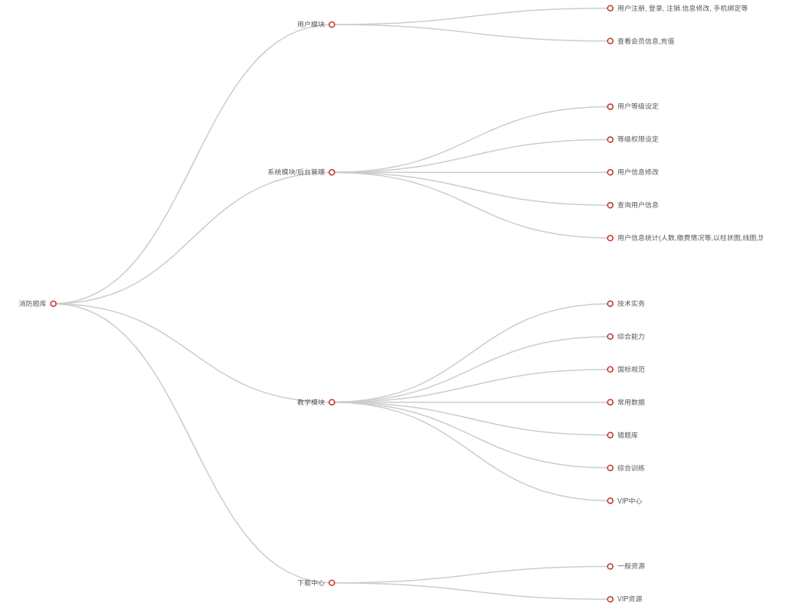
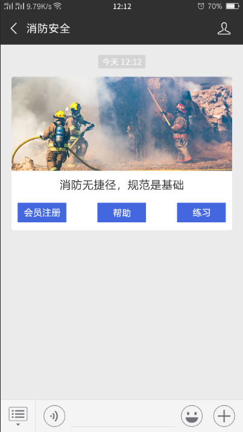

# 消防工程题库概要设计

本项目为微信公众号项目,公众号及相关硬件资源由甲方提供

公众号名称: 消防规范宝

## 设计概要

系统具备的主要功能

* 注册功能 包括用户身份记录.状态管理,缴费管理等
* 在线支付功能  此功能和缴费管理有关联
* 自定义的权限设置功能(非固化权限系统)

使用WeUI for Work框架开发,以保证用户获得最原生的微信公众号体验

## 模块划分

系统按照功能进行模块划分

* 系统模块 也就是后台模块,负责设置用户的基本权限,查看,统计用户信息,题库维护等
* 题库系统 负责教学系统的题库支撑.对操作者透明.是系统的基础模块.
* 用户模块 对用户的基本功能进行支持,
* 教学模块 核心功能,实现用户的和题库的互动.

##　相关页面简要说明

### 欢迎页

**会员注册按钮**:
绑定微信号注册,要求:
后台能看到会员的名称.加入人数,权限状态,微信号(这个是看不到的,微信任何时候都不向第三方透露微信用户的微信号,如果你只是想向客户推送消息,那么使用openid即可.), 注册时间,登陆次数,评分, 缴费时间.权限状态,会员剩余时间(图表展示)

会员注册后可免费使用半个月的功能.到期后只能使用(后台可以修改各个模块的免费访问时间)
1.建筑设计防火规范下的 模块3 模块5 .缴费后能自动授权继续使用.
目前会员只有基础会员(100元/年)和开发中的高级会员

**练习按钮**:
跳转到题库

**帮助按钮**:
"通过本题库联系,评测学院对规范的掌握程度,从而巩固学院的规范知识,轻松通过消防考试,微信号: xxx,qq号: "

### 首页

用户注册后/登录后, 跳转来此处,本页面相当于一个导航站,在此导航站下,有如下导航链接:

* 技术实务 跳转到相关的题库
* 综合能力 跳转到相关题库
* **GB常用规范训练** 跳转到相关的题库 这是考试重点,要着重体现
* 各类常用数据训练 跳转到相关的题库
* 错题集 跳转到相关的题库 只有登录用户才有,并且会随着训练的过程变换,比如被移除或者添加
* 直播课程 跳转到相关的题库  初期暂缓
* VIP中心  暂时用意不明
* 综合练习训练  可以当作综合能力的一个模拟考试.用于做模拟考训练.一般是60分钟120题.分值是如何评估???其中,每题多少分一定要明确,或者是平均计算.
* 相关下载  其实命名为下载中心更贴切,因为相关你不清楚相关的对象
* 

### 技术事务页面

仿慧题库

### GB常用规范训练页面

如果没有注册的话,正确率不会统计的正确的
maoi本页有一个GB常用规范的不同方面的习题的正确率的统计列表,列表包括

* 建筑设计防火规范  正确率 100%
* 消防给税及消火栓系统技术规范
* 自动喷水灭火系统施工设计规范
* 火灾自动报警系统设计规范
* 建筑防烟,拍烟系统技术标准
* 气体灭火系统设计规范
* 建筑咩过期配置设计规范
* 建筑内部装修设计防火规范
* 汽车库,修车库,停车场设计防火规范
* 自动喷水灭火系统设计及验收规范
* 消防法律法规
* 消防设施维护周期

### 建筑防火设计规范页面

这里,设计者注明了所有注册人员斗可以使用.那么.这项准则是上面提到的"页面的访问权限可以自行设定"这一条规则可覆盖的呢还是不可覆盖的呢?

* 厂房和仓库
* 甲乙丙丁类液体气体储罐(区)和可燃材料堆场.
* 民用建筑
* 建筑构造
* 灭火救援
* 消防设施的设置
* 供暖,通风和空气调节
* 电气
* 木结构建筑
* 城市交通隧道
* 其他

### 常用数据训练页面

同上页面的说明

* 生产火灾危险性分类
* 储存火灾危险性分类
* 建筑构件耐火极限要求
* 自动喷水灭火系统设计场所危险等级分类
* 民用建筑灭火器配置场所危险等级分类
* 工业建筑灭火器配置场所危险等级分类
* 建筑装修材料燃烧性能分类
* 建筑室内外消火栓设计流量
* 消防安全重点单位标准
* 厂房,汽车库,民用建筑防火分区面积
* 仓库占地面积和防火分区面积
* 疏散距离
* 各类消防设置试验方法和要求
* 消防设计维护周期
* 相关法律

