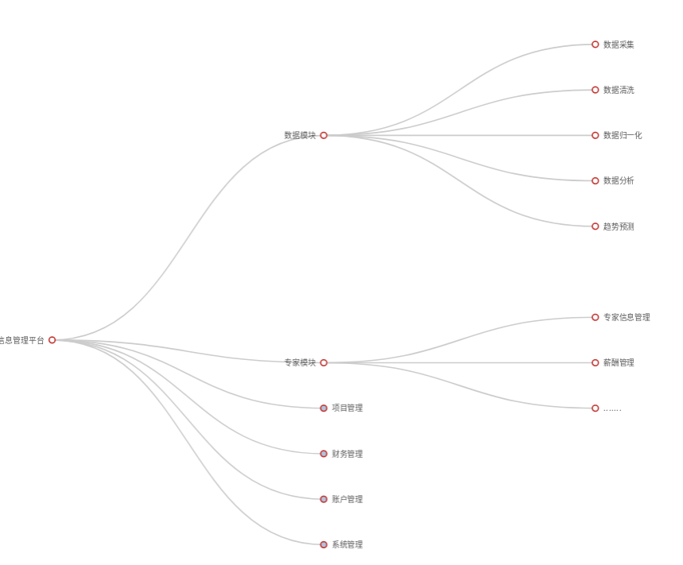
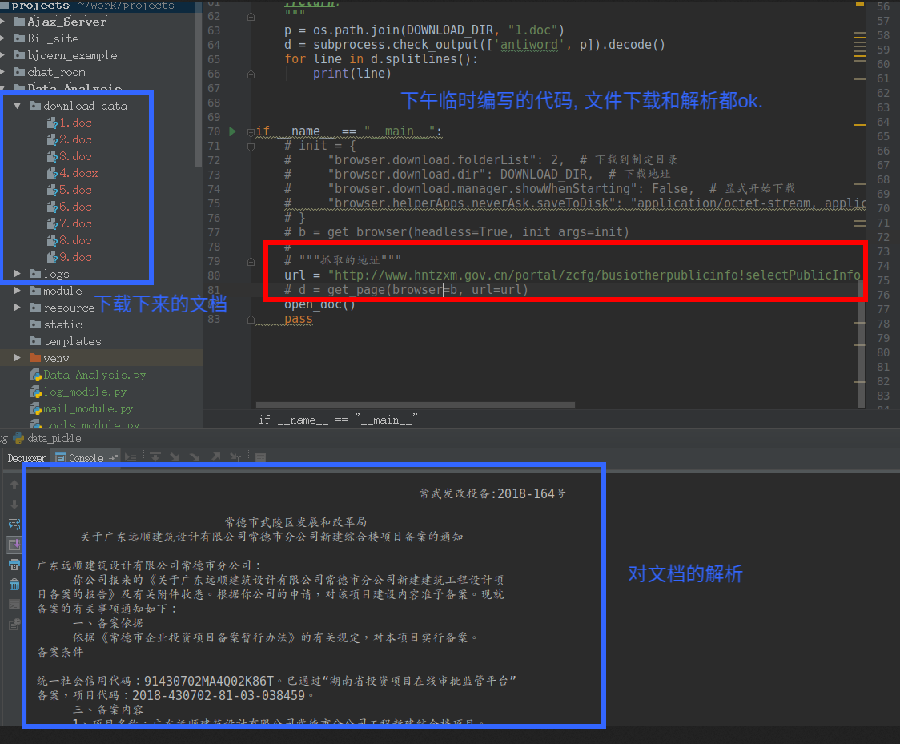

# 信息管理平台系统设计简述

## 团队介绍

**上海必弘信息技术有限公司**是一家新兴的软件开发服务企业. 公司的核心成员曾长期供职于国内知名的企业,尤其集中在金融, 医疗行业. 尤其擅长数据采集和分析技术. 是国内第一批数据自动化采集分析的先行者,在python(爬虫,数据采集, 数据分析)和mongodb(大数据存储, 聚合, map-reduce, 集群化部署)方面处于行业领先梯队.

## 系统简介

自动采集,分析企业的相关信息.并进行结构化存储.采用现有的数据分析, 决策辅助和商业只能技术, 辅助相关专家作出评估,分析,决策.

## 设计模式

系统设计采用高内聚, 松耦合, 模块化设计, 系统之间使用Restful接口通讯模式.扁平集群模式. 系统的每个模块都可以实现水平扩展.在业务规模扩展时,系统升级的成本低,改动小.

## 开发模式

由于平台构架较为复杂, 涉及到的人员和资源众多且分散,很难一次性集中到位.而且就需求的细节落实上.恐怕也难以在短时间内整理出详尽的结果.并且随着时间的推移,业务需求也会有细微的变化.
所以推荐的就是整个系统分多次迭代达到最终形态. 这中间可能会经历多次需求的变化和修改.但系统的基本功能变化不大(数据分析, 专家管理, 合同管理, 财务管理, 账户体系, 系统管理, 基础支持等).建议化整为零,将大的平台拆分成较小的子系统, 分别进行开发调试,然后在组合在一起. 这样即降低了开发的复杂程序, 而且子系统项目较小,容易进行风险控制和时间管理. 而且由于系统是一部分一部分完成的,先前设计中隐藏的问题也会在一步步的开发过程中暴露出来.方便设计者及时对设计方案作出调整.

1. 子系统拆分
2. 子系统构建
3. 子系统开发和调试
4. 平台组装
5. 平台调试
6. 平台测试和验收

**子系统/模块示意图**:

### 子系统拆分

子系统拆分考虑的是功能的内聚性. 子系统应当能:

* 子系统独立的调试和运行
* 子系统的功能紧密相连
* 子系统应该能把故障封闭在子系统内部,避免故障的链式传播,这对于平台的健壮性至关重要.
* 系统应当便于维护

### 子系统开发

子系统的开发并非是一步到位的, 而是采用迭代原型开发方法,这种开发方法特别适合系统和业务复杂, 初期不能完全明确需求的的情况. 一般的做法是:

* 首先根据设计方案实现子系统的核心功能.作出一个可独立运行的子系统的原型.
* 邀请用户试用原型,听取用户的意见对原型进行修正.
* 重复上一步骤,直至完成设计方案中的全部需求

每一个子系统重复以上步骤.直至所有的子系统开发完成.然后进入平台组装阶段

### 平台组装

子系统由开发人员组成系统平台并正确运行起来后.首先由开发团队进行**白盒测试**.消除设计和代码层面的逻辑问题.然后邀请用户一起进行**黑盒测试**,并对测试中发现的不足和问题进行修正.只至消除黑盒测试阶段发现的全部问题.平台进入**系统试用**阶段. 在有开发人员监控的基础上,配合平台自身的调试和监控工具,让平台在调试模式运行一段时间(比如1-2个月甚至更久).确认系统正常后,由甲方进行第一**阶段验收**工作. 验收后,平台进入**运行维护**阶段.

## 生命周期管理

由于整个项目开发周期长, 系统运行的过程中涉及到的需求变更不可避免(包括业务变化和市场变化导致的需求变更). 当变更的内容累计超过一定程度后,势必会量变导致质变: 产生了新的开发需求.所以建议开发商深入在整个软件运行维护期间,和甲方保持密切的联系, 甚至参与系统维护工作当中.随时听取客户意见. 由开发方给出可行性方案,预算和工期. 在甲方确认之后,再行进行变更开发.

在整个软件生命周期内,开发商会提供完成技术文档, 操作规范,用户手册和培训计划.对于系统的技术支持应贯穿整个软件从开发到停止使用的整个周期

## 系统实现

系统采用java和python语言(或者单独的python)语言书写. 能和数据采集, 数据分析,图像识别等系统进行无缝对接,无需转换语言.
数据库根据客户需求,采用mysql+mongodb或者单独的mongodb系统. 我们公司是mongodb系统的第一批用户,在mongodb(大数据存储)领域积累了其他公司无法比拟的经验. 如果想对mongodb和传统数据库之间的对比有个初步的了解.这里有我的一篇文章[MOngoDB4和MysSQL5.7的读/写和事务处理速度简单对比](https://www.jianshu.com/p/d37705f24fbe)或许可以打消你的疑虑.
同时,使用mongodb也可以把数据维护成本将到最低(mongodb集群和分片扩展无容量限制, 自带容灾功能,自动切换故障节点,这些都是无需用户干预的),给用户节省大量的维护开支.

## 测试

下午根据提供的网址.临时书写了一段代码进行测试. 测试的结果 文档下载和解析的结果都很完美.效果如下图所示

