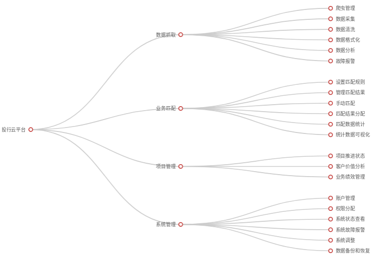
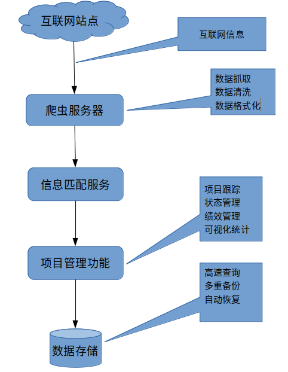

# 投行云设计方案

基于爬虫系统的投行项目信息管理平台

## 系统概述

本系统为BS模式,可扩展APP客户端.客户端和管理端都可以使用浏览器操作.与其他模块的通讯使用api接口进行,接口设计风格为Restful.可以和其他平台/模块进行网络通讯.部署的服务器平台为Ubuntu(和Windows).

### 架构图

### 数据流程图

## 设计和开发模式

系统采用**模块化设计**,多重**迭代开发**方法. 力求**快捷,低成本**.

整个系统在设计时就分为多个模块. 模块开发并非是一步到位的,而是先开发出一个原型.分多次迭代达到最终形态.  这种开发方法特别适合系统和业务复杂/不明确, 需求不完整的的情况. 一般的做法是:

* 首先根据设计方案实现子系统的核心功能.作出一个可独立运行的模块的**原型**.
* 邀请用户试用原型,听取用户的意见对原型进行**不断修正**.
* 重复上一步骤,直至完成设计方案中的**全部需求**

每个模块都按照上述的方式开发完成.再组装成信息平台.在经过完善的测试后,再交由甲方试用/验收.
  
## 功能设计

系统所包含的功能主要为四大模块组成.

* 数据抓取模块
* 业务匹配模块
* 项目管理模块
* 系统管理模块

### 数据模块

数据模块负责项目方和投资方信息的获取和预处理工作.具体的功能是:

* **收集数据** 用户可以设定数据抓取的网站.和收集何种类型的数据
* **自动监控抓取任务** 统计指定站点收集的信息.如果出现数据收集异常的情况.向相关管理人员的**推送错误消息**.
* **数据清洗** 对于收集到的信息,进行清洗,去掉无用,错误和重复的数据.
* **数据规范化** 对于清理后的数据,进行规划化处理,形成标准的格式,写入数据库.
* **数据可视化辅助分析** 定期对抓取的数据进行聚类,使用柱状图,热图,等数据可视化技术趁现数据变化的走势.给管理人员提供**分析的协助**.及时调整数据手记策略.
* **条件查询** 提供条件查询功能.管理员可以使用各种关键字或者关键字的组合作为查询条件进行筛选查询. 

### 业务匹配模块

业务匹配模块负责把数据模块抓取到的项目方和投资方的信息进行比对.把双方信息匹配的结果作为推送给业务人员

* **设定匹配规则** 用户可以在此设置匹配规则.系统会按照用户设定的规则自动对项目方和投资方进行匹配.
* **自动匹配** 系统会自动根据设定的匹配规则,对投资方和项目方的信息进行匹配,匹配成功的结果,推送给管理人员进行审核.
* **匹配审核** 匹配成功的投资方和项目方的业务信息. 由相关人员审核匹配信息的正确性:
  
  * 匹配正确的,进入信息分配环节
  * 如果审核人员觉得匹配有误,可以解除匹配状态重新匹配或者手动设定匹配信息.

* **自动分配** 经过审核的信息, 会按照设定的规则发给给相关的业务人员.信息分配规则可以由管理员或者经理设定. 当然,也可以关闭自动分配的功能,手动发送匹配的信息给指定的业务人员.
* **规范化存储** 已成功配对的信息会按照标准格式存储在数据库中. 同时提供条件查询和可视化统计功能.

### 项目管理模块

本模块的主要功能是对正在推进的项目的相关信息进行管理. 由于项目管理的具体需求的和贵司的部门架构,管理模式和业务流程息息相关.所以在未向专业的人员指教之前.下面列出的都是一些常见的功能. 最后需要实现的细节.需要和专业人员讨论后确定.

* **项目信息维护** 项目推进人员会在本模块维护正在推进的项目,可以对项目信息进行 添加/修改的操作.
* **里程碑管理** 项目推进的过程中,存在一些标志项目推进状态的关键性的事件. 称之为里程碑(事件). 系统会自动跟踪项目的推进状态.对即将到来的里程碑事件给予提醒.对于超期未完成的里程碑事件/项目.系统同样会给出醒目的标识以提醒相关人员注意.
* **数据可视化** 对公司的项目进行类聚, 分组和统计.使用数据可视化技术, 以图表(线图, 柱状图, 饼状图,热力图)等富有表现力的形式展示出来.同时提供报表和导出功能.以方便相关人员制作ppt和资料文档时采集素材用.

### 系统管理模块

系统管理模块.系统管理模块为系统机基础功能提供技术支持.并提供优对系统用户和权限的管理功能

* **用户体系** 为用户的登录,操作提供基础支撑
* **部门架构** 管理系统的部门结构.调整部门上下级关系.设定部门经理/管理者等
* **权限管理** 为不同岗位的用户创建不同的权限组.并设定这些用户访问权限
* **账户管理** 对系统的账户信息进行 添加/修改/删除,账户的停用启用等操作.
* **系统监控** 对平台的硬件系统进行监控. 包括CPU使用率, 硬盘空间, 内存空间,带宽占用等. 在硬件需要升级和更换之前,及时提醒管理员注意.
* **系统日志** 方便管理员查询用户的操作和系统的运行记录,辅助管理员定位问题和排除故障.

## 架构设计

本系统的技术实现的难点主要是爬虫技术。而爬虫技术难点是数据的获取。

### 爬虫面临的问题

比起网络蜘蛛(收录站点),网络爬虫(抓取数据)不是那么受网站安全人员的欢迎. 因为后者会给站点带来额外的访问压力.根据网站安全人员对于爬虫采取的安全措施(阿里云甚至有专门的反爬虫服务). 网站一般分以下几类:

* 无保护措施的站点 绝大多数中小型站点或者信息安全程度低的站点没有针对爬虫的安全措施. 任何爬虫都可以访问.
* 有保护措施的站点 一般来说,高价值数据,大型互联网公司/电商平台, 金融, 银行, 访问身份敏感度高的站点都会有保护措施.这些保护措施按照安全程度的高低,分为3个**安全防护级别**:

  * **Level 1** 使用浏览器头信息来识别爬虫. 开发者需要伪装浏览器头部信息来进行访问.
  * **Level 2** 在上一级的基础上,增加ip地址访问的规则限制. 把哪些频繁访问ip地址标记为爬虫进行屏蔽.
  * **Level 3** 在上一级的基础上,使用cookie, session,js代码和浏览器指纹技术来识别爬虫.绝大多数爬虫都会在这一级别被拒之门外. 知名站点基本上会都采用这种保护措施.

对于有保护的站点.一般的爬虫技术都会在Level 3级别失效. 我司在长期的爬虫系统开发工作中积累了大量的针对高防站点的爬取经验.拥有自主知识产权的爬取技术.可以完美的爬取所有安全级别的站点. 这也是**我司的技术优势**之一.

## 开发周期和报价

这一部分设计系统所需的硬件和软件,以及相关的开支报价.整个系统的费用开支分为**软件开发费用**和**运维费用**

* **开发费用**是指平台软件开发的费用.是**一次性支付**的费用,仅仅在开发软件阶段需要支付.
* **维护费用**是保证系统正常运行所需的网络资源,带宽/服务器租用和专家服务所需的**周期性支付**的费用

各个部分分别的费用报价如下:

### 各部分费用明细

#### 开发费用

系统的开发计划和相关的时间:

* 数据抓取模块(**爬虫和数据处理**), 20个工作日 10万
* 业务匹配模块 10个工作日  2万
* 项目管理模块(**项目管理**) 20个工作日 10万
* 系统管理模块  5个工作日 2万
* 集群部署  5个工作日 1万

开发团队人员组成:

* 软件设计师(1名)
* UI设计师(美工)(1名)
* 前端工程师(1名)
* 后端工程师(2名)

软件系统预计的**开发周期为60个工作日**.
本部分**报价为25万元人民币**

#### 设备费用

设备费用包含服务器,网络资源和服务的租用费用. 一般是按照周期付款的(可以月付/年付)

##### 服务器

标准设计至少需要4台服务器,用途如下:

* **代理服务器** 1台windows服务器,主要用作ip_proxy和数据分析.
* **爬虫服务器** 至少1台linux服务器. 用作数据抓取的主力.如果抓取的站点很多,服务器负载重,可以考虑增加服务器数量
* **应用服务器** 至少1台linux服务器. 提供本平台的所有服务. 视业务规模.可以增加应用服务器数量. 如果启用负载均衡,则至少需要2台服务器.
* **数据库服务器** 至少1台linux服务器. 保存本平台的所有数据,并提供查询服务.

##### 网络服务

* **负载均衡**  提供平台的负载均衡能力,以备在一台机器出现故障时.启用后备的服务器顶替.
* **DDOS防护** 对DDOS提供防护能力.如果是内部部署.无需本项.
* **Web防火墙** 对网络入侵行为提供预警和早期阻止能力. Python语言的Web安全性较高.非必须.

网络服务由云服务商提供,一般都是**按流量计费**的.

* 负载均衡的费用一月大概数百元的级别.
* ddos的费用相对较高. 选择较复杂.并且不是必需的.相关费用可以[点此查看](https://www.aliyun.com/price/product?spm=5176.7946143.1090650.ee6.28bb6d632GmTL7#/ddos/detail)
* Web防火墙的服务每月的根据选择的服务费用不等.非必须. 相关费用可以[点此查看](https://common-buy.aliyun.com/?spm=5176.2020520157.waf-buy.dnewbuy.7b321c642Usw6G&commodityCode=waf#/buy)

爬虫服务器建议配置

|CPU|内存|硬盘|带宽|费用(年)|
|:-:|:-:|:-:|:-:|:-:|
|4核|16G|500G|20M|¥19890|

应用/数据服务器建议配置

|CPU|内存|硬盘|带宽|费用(年)|
|:-:|:-:|:-:|:-:|:-:|
|8核|32G|500G|20M|¥24480|

爬虫服务器最低配置

|CPU|内存|硬盘|带宽|费用(年)|
|:-:|:-:|:-:|:-:|:-:|
|2核|16G|500G|20M|¥18234|

应用/数据服务器最低配置

|CPU|内存|硬盘|带宽|费用(年)|
|:-:|:-:|:-:|:-:|:-:|
|4核|16G|500G|20M|¥19890|

本部分的报价由方案决定.

#### 维护费用

维护费用包含资源服务费用和人力费用

##### 资源服务费用

本平台在开发和运行期间,所需的的资源服务主要是以下两种:

* **IP代理** IP代理是一种网络服务器,需要向服务提供商付费购买.一般单月的费用在500元人民币左右. 在开发期间,就需要使用.
* **负载均衡** 如果使用多台应用服务器时. 需要购买负载均衡服务.负载均衡服务费用按照20M计算,每月为4032元(点击这里可以查看阿里云提供的[计算方法](https://www.aliyun.com/price/product?spm=5176.7921785.762131.price4.674f4100wtdaCo#/slb/detail))

##### 技术服务费用

爬虫平台和普通的平台有一点不同: 普通的平台一旦开发完成后继代码的维护量很少.而爬虫平台由于要适应被爬取站点的页面结构.爬取的站点一旦页面结构有变(站点debug页面代码很常见的维护工作)或者改版,爬虫平台的爬取模块必须也作出响应的修改.所以爬虫平台的代码修改较频繁.维护工作较重.很多爬虫的深度用户公司,都是直接招聘爬虫工程师来进行维护的.

* **专家服务** 系统日常代码维护,技术支持, 应急事件处理等, 提供5*8小时服务 响应时间不大于1小时

专家服务费用为每月5000元

### 方案的报价

根据系统的硬件和服务的配置不同.分别提供三种组合的方案: 方案A,方案B和方案C.他们的差别主要在功能, 性能和TCO(总体拥有成本). 报价包含甲方的在本平台上的所有支出,包含**开发费用和运维费用**.

> 维护费用中的服务器,网络等各种服务由阿里云提供. 其最终报价以阿里云为准,可由用户按照配置清单直接向阿里云购买.也可委托开发方购买.

#### 方案A

全功能配置的方案

|组成|配置|类型|费用(单位:人民币)|
|:-:|:-:|:-:|:-:|
|平台开发|含开发和部署费用|一次性费用|25万|
|爬虫服务器(租用)|建议配置服务器*2|周期费用|约4万/年|
|应用服务器(租用)|建议配置服务器*2|周期费用|约4.9万/年|
|负载均衡|20M带宽|周期费用|1.35万/年|
|IP代理|企业版|周期费用|0.6万/年|
|技术服务|5*8小时 N+1|周期费用|6万/年|
|第一年费用共计|开发+服务器/网络资源租用+专家服务|--|约41.85万|
|以后每年运营费用|服务器/网络资源租用+专家服务|--|16.85万|

#### 方案B

经济配置的方案, 性价比高. **推荐**.

|组成|配置|类型|费用(单位:人民币)|
|:-:|:-:|:-:|:-:|
|平台开发|含开发和部署费用|一次性费用|25万|
|爬虫服务器(租用)|低配置服务器*2|周期费用|3.65万/年|
|应用服务器(租用)|低配置服务器*1|周期费用|1.99万/年|
|IP代理|企业版|周期费用|0.6万/年|
|技术服务|5*8小时 N+1|周期费用|6万/年|
|第一年费用共计|开发+服务器/网络资源租用+专家服务|--|37.24万|
|以后每年运营费用|服务器/网络资源租用+专家服务|--|12.24万|

#### 方案C

简化配置的方案,方案B的简化板.降低的成本的同时也牺牲了一些功能和性能.但仍然是一个强壮的系统.

|组成|配置|类型|费用(单位:人民币)|
|:-:|:-:|:-:|:-:|
|平台开发|含开发和部署费用|一次性费用|25万|
|爬虫服务器(租用)|低配置服务器*1|周期费用|1.8万/年|
|应用服务器(租用)|低配置服务器*1|周期费用|1.99万/年|
|IP代理|企业版|周期费用|0.6万/年|
|技术服务|5*8小时 N+1|周期费用|6万/年|
|第一年费用共计|开发+服务器/网络资源租用+专家服务|--|35.39万|
|以后每年运营费用|服务器/网络资源租用+专家服务|--|10.39万|

三种方案的**服务和功能的对比**如下

||说明|方案A|方案B|方案C|
|:-:|:-:|:-:|:-:|:-:|
|平台功能|云平台设计方案的全部功能|$\surd$|$\surd$|$\surd$|
|自动备份|实时的备份数据|$\surd$|$\surd$|$\surd$|
|专家服务|专业技术人员的有偿服务 5*8 N+1|$\surd$|$\surd$|$\surd$|
|自动容灾|数据库服务器宕机时,自动启用备用数据库|$\surd$|$\surd$|$\times$|
|系统冗余|额外的服务器作为备用|$\surd$|$\times$|$\times$|
|负载均衡|平衡应用服务器之间的负载|$\surd$|$\times$|$\times$|

### 方案实施

平台的开发采用分段式开发,大致分为2个阶段

* 爬虫功能实现阶段
* 业务功能实现阶段

#### 爬虫功能实现阶段

爬虫是本平台的基础功能.爬虫部分必须不折不扣的,100%达到预期设计功能.才能保障整个平台满足设计需求.因此.爬虫部分功能的实现是整个关键功能.应该尽早实现.

#### 业务功能实现阶段

业务功能是整个信息平台提供的主要服务.和贵司的部门架构, 管理模式, 业务流程息息相关.这一部分的开发工作需要贵司的多个部门的专业人员参与进来落实具体的需求细节.

### 付款方式

#### 软件开发

软件开发属于一次性费用.的常用付款方式是分段式支付, 针对开发过程中的一些节点事件(里程碑事件).软件开发项目的付款流程一般如下:

* **项目开始** 甲乙双方在签订开发合同后,由甲方向乙方支付总款项的30%或40%作为定金.标志着开发工作的正式开始.乙方应在收到此款项后尽早开始开发工作.
* **功能验收** 乙方在软件开发完成,并通过甲方验收后, 甲方向乙方支付总款项的60%或50%的项目款.标志着乙方的开发工作基本结束. 剩下总款项的10%作为尾款
* **开发结束** 在平台通过甲方验收后3个月,系统能够保证稳定的长时间运行.标志着软件开发满足了原始的设计需求.甲方向乙方支付剩余的总款项的10%.标志着开发工作告一段落. 同时,开发过程中的技术文档, 资料和源代码也会一并交由甲方.

#### 技术支持和设备租用

技术支持和设备租用属于周期性费用. 一般是根据项目本身的情况,由甲乙双方协商支付方式.常见的支付方式有:

* 月付
* 季付
* (半)年付

## 代码实现

数据平台本身由Python编写,配合MongoDB4+数据库. 由于很多人不太熟悉Python这门语言.所以特意花点篇幅介绍一下.
在国内.比起主流的C#, Java,Php这些语言,Python知名度较低. 但在全球范围内, Python语言的占有率一直是前列.并且还在金融，大数据和人工智能方面享有得天独厚的优势. 可以说是一门面向未来的语言, 同时Python在爬虫功能异常强大,工具琳琅满目.世界上绝大多数优秀的爬虫系统都是使用Python作为开发语言的. 下图是一个编程语言占有率的全球排行榜.可以看出来Python在国际上的流行程度很高.这中间很大一部分就是因为爬虫的应用.

### 为什么要选择**Python语言**的作为系统开发语言

* **Python爬虫方面很强,对症**, 众多的专用爬虫让Python语言在爬虫领域有得天独厚的优势.即使那些其他语言很难爬取的高防的站点,Python也能方便快捷的爬取. 在很大程度上,本项目选择Python语言也正是看中了这一点.(大型的爬虫站点几乎都是使用Python构建的)
* **Python语言开发速度快, 低成本**, Python语法很简洁, 和传统Java,C语言相比.开发和调试速度成倍提升.开发和维护周期短(节省开发时间就是节省开发成本)
* **面向未来**: Python语言在数据分析和人工智能上有巨大的优势.而大数据和人工智能又是未来发展的绝对主流. 使用python做开发,会让你的系统轻松迎接未来变革的挑战.大限度的为将来植入人工智能的模块打下环境支持的基础.
* **我们很专业**: 我司的开发团队在国内最早使用python做系统和数据处理,对这门语言的特性非常理解. 使用Python开发过大小数十个项目.经验非常丰富, 技术水平在国内处于领先位置.

### 我们为什么选择**MongoDB**作为数据库

我们公司是mongodb系统的深度用户,在mongodb(大数据存储)领域积累了其他公司无法比拟的经验. 和传统的mysql等数据库相比,mongodb是专门针对互联网应用的高数据读写要求的数据库.这里有我的一篇文章[MOngoDB4和MysSQL5.7的读/写和事务处理速度简单对比](https://www.jianshu.com/p/d37705f24fbe)可以对mongodb在速度方面的优势有一个初步的认识,总体来说,MongoDB带来的改变包括:

* **更快** 的数据读取/写入，写入和读取的速度是传统数据库的10倍左右.
* **可靠** 大量的互联网和金融公司每天使用mongodb记录数以亿万记的各种记录.
* **更多的类型** 支持.支持互联网时代各种新式的数据类型而无需转换。
* **更全面的功能** 支持使用函数, 聚合, 管道等各种技术进行查询.原生的类聚和map-reduce支持
* **易扩展**到大规模的集群.传统的数据库集群收费昂贵,技术复杂.MongoDB自带的副本集和分片机制.可以在不停机的情况下无限制的提升数据库容量(副本集群)和读写性能(分片机制).并且无需额外成本.
* **自动容灾** monodb 自带容灾机制,在一个服务器发生问题时,自动切换到备用服务器,无需人员干预.
* **自动备份**,自带自动备份机制.过程无需人工干预的.无需额外的设备.成本低.安全可靠.
* **完美事务支持** MongoDB4+版本已支持跨副本集(群)的事务.这在传统数据库集群上是依赖分段式提交的复杂问题,现在单一的MongoDB数据库就已经完全可以应付了.
* **自带数据聚合** MongoDB4+自带强大的数据聚合和分析功能.强大的aggregate和map-reduce查询完全可以满足一般的数据聚合和分析的需求.
* **专业**: 和Python语言同样,我司在Mongodb方面也是国内的先行者,并且积累了数年的项目经验. 我们的团队和方案值得你信赖.

### 缺点

* 用户案例少，相对于JAVA PHP C# 的老三样。python和没monodb常见案例比较少，知名的只有知乎，豆瓣，钉钉，虾米音乐和一些些互联网基础较好金融集团内部的项目。
* 国内人才少，国内python和mongodb人才主要集中在北上广一线城市。人才数量严重不足。不过近年随着大数据和人工智能的普及，这一局面会正在得以改变。

## 团队介绍

**上海必弘信息技术有限公司**是一家新兴的软件开发服务企业. 主要从事各类信息系统的定制开发业务.公司的核心成员曾长期供职于国内知名的企业,尤其集中在金融, 医疗行业. 尤其擅长数据采集和分析技术. 是国内第一批数据自动化采集分析的先行者,在python(爬虫,数据采集, 数据分析)和mongodb(大数据存储, 聚合, map-reduce, 集群化部署)方面处于行业领先梯队.

公司的软件设计人员是通过国家人事局软件设计师(中级)职称认证的资深软件设计师.拥有20多年的软件开发和设计经验.实力雄厚.

公司倡导技术与服务并重, 在满足客户软件开发需求的同时,提供专业的技术支持服务.

> * 我们是对创造力充满热情的大梦想家,通过创新和颠覆来热切追求新的机遇和市场。
> * 我们有开拓精神, 不走寻常路.不循规蹈矩.随时准备开辟新的道路并承担明智的风险。
> * 我们是优秀的倾听者，始终保持清晰和尊重。永远把客户的需求放在第一位.
> * 我们拥抱现实。运用非凡的的设计和严谨工作.在信念中保持勇气，不因困难和迷惑而放弃.

## 项目经验

由于开发过的项目太多.这里仅选择少量作为代表.下面的项目全部是使用Python语言开发的.版权原因,所有的项目都不提供截图.敬请谅解.

### XX生产管理系统

行业: 工业生产
2018/10-2018/11
软件环境：liunux python mongodb
项目描述:

是一个为客户定制的轻型的MES系统.用于对生产线上的条码进行管理.系统业务逻辑比较简单.使用mongodb数据库的原因是为了提供更快的查询速度.同时,由于生产线环境多嵌入式设备.所以系统本身有很多和嵌入式设备通讯的接口.是真正意义上的多语言编程环境.这也是本系统的特点之一.

### XX人力资源管理系统

行业: 通讯
2017/2-2018/8
软件环境：liunux python mongodb rabbitmq celery redis android ios
项目描述:

一个针对物流车司机的人力资源管理系统. 为顺丰和德邦定制的.人力资源信息可以依赖: 1.人事专员输入 2. 劳务中介 3. 司机推荐 4. 微信公众号 多条路径录入.  系统本身的会依赖一些规则,对这些人力资源进行分配和评估.根据其特点,推送给对口的企业用户. 公司系统也会跟踪人才的就职和离职信息.对人才的评估形成一个完整的闭环. 系统本身mongodb的数据库.python的应用开发. 由app,网页端和微信端. 中介和企业内部员工各自有自己登录界面.系统附带KPI功能.

### 驾驶安全管理系统

行业: 通讯
2017/10-2018/4
软件环境：liunux python mongodb rabbitmq celery redis android ios
项目描述:

一个对驾驶员进行安全管理和风险评估/预测的系统.为顺丰和德邦定制的.其主要的工作原理是: 通过app软件,依赖手机/穿戴设备上的传感器,收集用户的驾驶行为数据.进行分析和预测.属于一种主动的驾驶安全管理系统.相关涉及的技术主要是数据的采集.分析和趋势预测. 系统采用moogodb数据库. 12个节点的副本集+分片架构. 由于数据量较多,使用ElasticSearch做的搜索引擎. 应用服务使用python开发. nameko做的微服物框架.消息中间层用的是rabbitmq.客户端除了anroid和ios之外,也包括定制的穿戴设备. 管理端基于高德地图开发.

### 交易平台爬虫系统

行业: 金融
2016/8-2016/10
软件环境： 软件环境：linux python Redis mongodb selenium
硬件环境：阿里云主机
开发工具： pycharm

项目描述：

爬虫项目,为浦东的XX金融集团定制. 替代内勤人员每日在交易网后台上查询信息的功能.由于交易平台的安全性非常强,常规的爬虫手段直接被404,经过思考后,采用selenium框架来完成. 完美解决问题.系统可以: 1.定时爬取资料. 2. 推送关键消息给对应员工 3. 对数据进行共计分类,可视化呈现.等.

### 金融直播室

行业: 金融
2016/3-2016/6
所属公司： 日辉集团
软件环境： 软件环境：linux python Redis mysql rabbitMQ tornado flask celery mysql
硬件环境：阿里云主机
开发工具： pycharm

项目描述：

为陆家嘴的日辉石油集团定制的视频直播室项目. 使用了全双工的实时通讯协议(websocket).

### CRM 系统二次开发

行业: 通讯
2014/8-2015/5
软件环境：windows javascript jquery python mssql

项目描述:

此CRM系统为二次开发项目.为和源通讯股份有限公司定制.是在一家北京的叫"八百客"的CRM基础上进行的开发.原因是由于服务商提供的产品无法满足当时企业发展需求.而且北京的服务商自己没有定制的服务.所以在原有的CRM基础上进行的二次开发.前后经历了大半年时间.完全满足了当时的业务需求.