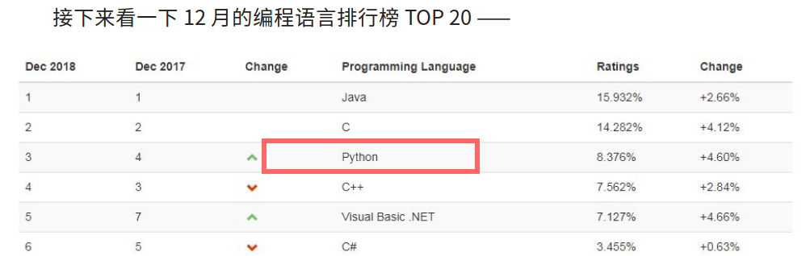

# 投行云设计方案

基于爬虫投行项目信息管理平台

## 系统概述

本系统为BS模式,可扩展APP客户端.客户端和管理端都可以使用浏览器操作.与其他模块的通讯使用api接口进行,接口设计风格为Restful.可以和其他平台/模块进行网络通讯.部署的服务器平台为Ubuntu(和Windows).

## 设计和开发模式

系统开发采用**模块化**,分布式的**迭代**开发方法. 力求**快捷,低成本**.

整个系统在设计时就分为多个模块. 模块开发并非是一步到位的,而是先开发出一个原型.分多次迭代达到最终形态.  这种开发方法特别适合系统和业务复杂/不明确, 需求不完整的的情况. 一般的做法是:

* 首先根据设计方案实现子系统的核心功能.作出一个可独立运行的模块的**原型**.
* 邀请用户试用原型,听取用户的意见对原型进行**不断修正**.
* 重复上一步骤,直至完成设计方案中的**全部需求**

每个模块都按照上述的方式开发完成.再组装成信息平台.在经过完善的测试后,再交由甲方试用/验收.
  
## 功能设计

系统所包含的功能主要为三大模块组成.

* 数据抓取模块
* 业务匹配模块
* 项目管理模块
* 系统管理模块

### 数据模块

数据模块负责项目方和投资方信息的获取和预处理工作.具体的功能是:

* **收集数据** 用户可以设定数据抓取的网站.和收集何种类型的数据
* **自动监控抓取任务** 统计指定站点收集的信息.如果出现数据收集异常的情况.向管理人员的手机**推送错误消息**.
* **数据清洗** 对于收集到的信息,进行清洗,去掉无用,错误和重复的数据.
* **数据规范化** 对于清理后的数据,进行规划化处理,形成标准的格式,写入数据库.
* **数据可视化辅助分析** 定期对抓取的数据进行聚类,使用柱状图,热图,等数据可视化技术趁现数据变化的走势.给管理人员提供**分析的协助**.及时调整数据手记策略.
* **条件查询** 提供条件查询功能.管理员可以使用各种关键字或者关键字的组合作为查询条件进行筛选查询. 

### 业务匹配模块

业务匹配模块负责把数据模块抓取到的项目方和投资方的信息进行比对.把双方信息匹配的结果作为推送给业务人员

* **设定匹配规则** 用户可以在此设置匹配规则.系统会按照用户设定的规则自动对项目方和投资方进行匹配.
* **匹配审核** 匹配成功的投资方和项目方的业务信息. 由相关人员审核匹配信息的正确性:
  
  * 匹配正确的,进入信息分配环节
  * 如果审核人员觉得匹配有误,可以解除匹配状态重新匹配或者手动设定匹配信息.

* **信息分配** 经过审核的信息, 会按照设定的规则发给给相关的业务人员.信息分配规则可以由管理员或者经理设定. 当然,也可以关闭自动分配的功能,手动发送匹配的信息给指定的业务人员.
* **数据规范化** 已成功配对的信息会按照标准格式存储在数据库中. 同时提供条件查询功能.

### 项目管理模块

本模块的主要功能是对正在推进的项目的相关信息进行管理. 由于项目管理业务关联性强. 又和管理模式/方法紧密相关.所以在未向专业的人员指教之前.下面列出的都是一些临时性的功能. 最后需要实现的细节.需要和专业人员讨论后确定.

* **项目信息维护** 项目推进人员会在本模块维护正在推进的项目,可以对项目信息进行 添加/修改的操作.
* **里程碑管理** 项目推进的过程中,存在一些标志项目推进状态的关键性的事件. 称之为里程碑(事件). 系统会自动跟踪项目的推进状态.对即将到来的里程碑事件给予提醒.对于超期未完成的里程碑事件/项目.系统同样会给出醒目的标识以提醒相关人员注意.
* **数据可视化** 对公司的项目进行类聚, 分组和统计.使用数据可视化技术, 以图表(线图, 柱状图, 饼状图,热力图)等富有表现力的形式展示出来.同时提供报表和导出功能.以方便相关人员制作ppt和资料文档时采集素材用.

### 系统管理模块

系统管理模块.系统管理模块为系统机基础功能提供技术支持.并提供优对系统用户和权限的管理功能

* **用户体系** 为用户的登录,操作提供基础支撑
* **部门架构** 管理系统的部门结构.调整部门上下级关系.设定部门经理/管理者等
* **权限管理** 为不同岗位的用户创建不同的权限组.并设定这些用户访问权限
* **账户管理** 对系统的账户信息进行 添加/修改/删除,账户的停用启用等操作.
* **系统监控** 对平台的硬件系统进行监控. 包括CPU使用率, 硬盘空间, 内存空间,带宽占用等. 在硬件需要升级和更换之前,及时提醒管理员注意.
* **系统日志** 方便管理员查询用户的操作和系统的运行记录,辅助管理员定位问题和排除故障.

## 系统实现

数据平台本身由Python编写,配合MongoDB4+数据库. 由于很多人不熟悉甚至没听说过Python这门语言.所以特意花点篇幅介绍一下.
在国内.比起主流的C#, Java,Php这些语言,Python知名度较低. 但在全球范围内, Python语言的占有率一直是前列.并且还在大数据和人工智能方面享有得天独厚的优势. 可以说是一门面向未来的语言(ps: Python并不年轻, 比我们常见的C#,Java,Php这些诞生的都要早,并且广泛的应用在从天文,金融到互联网,人工智能等各个领域.是一门久经考验的语言). 下图是一个编程语言流行度的全球排行榜.可以看出来Python在国际上的流行程度很高.

### 为什么要选择**Python语言**的作为系统开发语言

* **Python语言开发速度快**, Python语法很简洁, 和传统Java,C语言相比.开发速度成倍.在客户对需求不明确或者对于软件开发不熟悉的情况下,这是最解决成本的一种方式(节省开发时间就是节省开发成本)
* **Python语言在数据分析和人工智能上有巨大的优势**: 众所周知,国内最早关注Python就是因为在大数据时代到来时,Python在处理大数据时的灵活和便捷性. 在后来的人工智能时代到来后,Python又一次展示了自己在人工智能领域的霸主地位. 而大数据和人工智能又是未来发展的绝对主流. 使用python做开发,会让你的系统轻松迎接未来变革的挑战.大限度的为将来植入人工智能的模块打下环境支持的基础.
* **我们在Python这门语言上很专业**: 我司的开发团队属于国内最早使用python做系统和数据处理的那一批(2010年之前),对这门语言的特性非常理解. 使用Python开发过大小数十个项目.经验非常丰富, 技术在国内处于领先位置.

### 我们为什么选择**MongoDB**作为数据库

我们公司是mongodb系统的第一批用户,在mongodb(大数据存储)领域积累了其他公司无法比拟的经验. 和传统的mysql等数据库相比,mongodb最大的优势在于数据读写性能和水平扩展的便利性.如果想对mongodb和传统数据库之间的对比有个初步的了解.这里有我的一篇文章[MOngoDB4和MysSQL5.7的读/写和事务处理速度简单对比](https://www.jianshu.com/p/d37705f24fbe)或许可以打消你的疑虑.同时,使用mongodb也可以把数据维护成本将到最低(mongodb集群和分片扩展无容量限制, 自带容灾功能,自动切换故障节点,这些都是无需用户干预的),给用户节省大量的维护开支.和传统的关系型数据库相比,MongoDB带来的改变包括:

* **更快**的数据读取/写入.
* **更多的数据类型** 支持.无论是GEO(地理位置数据),还是复杂的多重嵌套的字典和数组.都能不做类型转换的完美保存(不会像sql数据库那样随意转换数据类型,在强类型语言中,这个问题很容易导致莫名其妙的类型错误)
* **更全面的功能** 支持使用函数, 聚合, 管道等各种技术进行查询.原生为大数据数据和数据分析做好了准备
* **更容易扩展**到大规模的集群.传统的数据库集群要么收费昂贵,要么结构复杂,要么需要额外的框架/中间件支持.MongoDB自带的副本集和分片机制.可以无需额外成本的无限制的提升数据库容量(副本集群)和读写性能(分片机制).并且这个过程完全不用停机.
* **完美备份**,副本集中每一个副本都是数据库的备份. 你可以让数据库一边工作一边备份.这个备份工作完全是透明的,多个备份也不会给系统造成负担,并且这个过程无需人工干预的.无需额外的备份设备.数据备份成本低.安全可靠.
* **完美事务支持** 2018年,MongoDB4+版本已支持跨副本集(群)的事务.这本来是MongoDB的弱项.现在短板也被补齐.以前使用sql+MongoDB工作环境,现在单一的MongoDB数据库就已经完全可以应付了.
* **数据聚合** MongoDB4+自带强大的数据聚合和分析功能.强大的aggregate和map-reduce查询完全可以满足一般的数据聚合和分析的需求.

## 团队介绍

**上海必弘信息技术有限公司**是一家新兴的软件开发服务企业. 主要从事各类信息系统的定制开发业务.公司的核心成员曾长期供职于国内知名的企业,尤其集中在金融, 医疗行业. 尤其擅长数据采集和分析技术. 是国内第一批数据自动化采集分析的先行者,在python(爬虫,数据采集, 数据分析)和mongodb(大数据存储, 聚合, map-reduce, 集群化部署)方面处于行业领先梯队.

公司的软件设计人员是通过国家人事局软件设计师(中级)职称认证的资深软件设计师.拥有20多年的软件开发和设计经验.实力雄厚.

## 项目经验

由于开发过的项目太多.这里仅选择少量作为代表.下面的项目全部是使用Python语言开发的.版权原因,所有的项目都不提供截图.敬请谅解.

### XX生产管理系统

行业: 工业生产
2018/10-2018/11
软件环境：liunux python mongodb
项目描述:

是一个为客户定制的轻型的MES系统.用于对生产线上的条码进行管理.系统业务逻辑比较简单.使用mongodb数据库的原因是为了提供更快的查询速度.同时,由于生产线环境多嵌入式设备.所以系统本身有很多和嵌入式设备通讯的接口.这也是本系统的特点之一吧.

### XX人力资源管理系统

行业: 通讯
2017/2-2018/8
软件环境：liunux python mongodb rabbitmq celery redis android ios
项目描述:

一个针对物流车司机的人力资源管理系统. 为顺丰和德邦定制的.人力资源信息可以依赖: 1.人事专员输入 2. 劳务中介 3. 司机推荐 4. 微信公众号 多条路径录入.  系统本身的会依赖一些规则,对这些人力资源进行分配和评估.根据其特点,推送给对口的企业用户. 公司系统也会跟踪人才的就职和离职信息.对人才的评估形成一个完整的闭环. 系统本身mongodb的数据库.python的应用开发. 由app,网页端和微信端. 中介和企业内部员工各自有自己登录界面.系统附带KPI功能.

### 驾驶安全管理系统

行业: 通讯
2017/10-2018/4
软件环境：liunux python mongodb rabbitmq celery redis android ios
项目描述:

一个对驾驶员进行安全管理和风险评估/预测的系统.为顺丰和德邦定制的.其主要的工作原理是: 通过app软件,依赖手机/穿戴设备上的传感器,收集用户的驾驶行为数据.进行分析和预测.属于一种主动的驾驶安全管理系统.相关涉及的技术主要是数据的采集.分析和趋势预测. 系统采用moogodb数据库. 12个节点的副本集+分片架构. 由于数据量较多,使用ElasticSearch做的搜索引擎. 应用服务使用python开发. nameko做的微服物框架.消息中间层用的是rabbitmq.客户端除了anroid和ios之外,也包括定制的穿戴设备. 管理端基于高德地图开发.

### 交易平台爬虫系统

行业: 金融
2016/8-2016/10
软件环境： 软件环境：linux python Redis mongodb selenium
硬件环境：阿里云主机
开发工具： pycharm

项目描述：

爬虫项目,为浦东的XX金融集团定制. 替代内勤人员每日在交易网后台上查询信息的功能.由于交易平台的安全性非常强,常规的爬虫手段直接被404,经过思考后,采用selenium框架来完成. 完美解决问题.系统可以: 1.定时爬取资料. 2. 推送关键消息给对应员工 3. 对数据进行共计分类,可视化呈现.等.

### vip客户直播室

行业: 金融
2016/3-2016/6
所属公司： 日辉集团
软件环境： 软件环境：linux python Redis mysql rabbitMQ tornado flask celery mysql
硬件环境：阿里云主机
开发工具： pycharm

项目描述：

为浦东的XX金融集团定制的视频直播室项目. 使用了全双工的实时通讯协议(websocket).

### CRM 系统二次开发

行业: 通讯
2014/8-2015/5
软件环境：windows javascript jquery python mssql

项目描述:

此CRM系统为二次开发项目.为和源通讯股份有限公司定制.是在一家北京的叫"八百客"的CRM基础上进行的开发.原因是由于服务商提供的产品无法满足当时企业发展需求.而且北京的服务商自己没有定制的服务.所以自行在原有的CRM基础上进行的二次开发.前后经历了大半年时间.完全满足了当时的业务需求.
