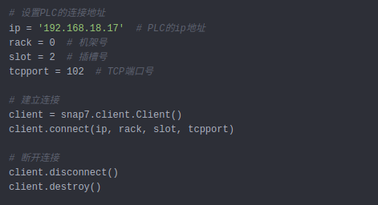

# 生产线信息管理系统

基于数据库对条码数据进行管理与产线配套 条码数据管理模系统 

本系统为BS模式,客户端无需部署,直接使用浏览器操作.提供通讯接口,可以和其他平台/模块进行网络通讯.部署的服务器平台为Ubuntu.平台本身由Python编写,配合MongoDB4+数据库.开发团队经验丰富: 有过数十个Python+MongoDB的项目开发经验. 总结出一套专用的开发模式,并为此开发了自主知识产权的数据库持久化套件(ORM).

为什么要选择**Python语言**的作为系统开发语言?

* **可以很方便的调用其他语言书写的代码**: Python语言被称为胶水语言.由于Python很容易的可以调用其他语言的代码/程序,所以可以使用Python语言把不同语言写的不同的代码段粘和起来运行.这个非常有用,比如可以在把代码种对性能要求比较高的地方用C/C++语言书写代码,把需要统计数据的模块用R语言书写,把做文本处理的功能用Perl语言书写.然后使用Python把这些代码段组装以来(基本上都是一两行代码就解决了).
* **Python语言有广泛的软硬件支持**: 无论是网络模块, 还是智能硬件, 树莓派, 甚至各种专用的工业设备,Python都可以很便捷的进行操作.下面是一个Python通过以太网获取PLC设备的数据的例子.
* 
 Python可以运行在Windows,Linux, Unix, Mac, Android,嵌入式等各种系统环境.并可对系统进行各种比如定时关机/重启,操作键盘/鼠标,打开/关闭某个功能,调整系统设备等自动化的操作.
 * **Python在人工智能领域处于领导地位**, 随着时代的发展,AI技术越来越深的渗入到人们的生活和企业的生产环境中.选择Python作为开发语言,可以最大限度的为将来植入人工智能的模块打下环境支持的基础.
 * **开发速度快**, Python语法很简洁, 这也代表着实现同样的功能.Python代码量少.开发速度快.面对需求的变更能够快速的作出修改.
 * **我们非常熟悉Python**,我们的团队的技术人员,对Python语言的接触属于最早的那一批.而且使用Python语言开发过大小60+个项目.Python开发经验非常丰富.

我们为什么选择**MongoDB**作为数据库?

和绝大多数开发团队一样,我们早期也是依赖于关系型数据库(MySQL/MSSQL等)进行开发.很多程序员使用MySQL的经验长达十多年.但随着时代的发展.数据量越来越大(上亿条记录的表很常见).数据类型越来越复杂(GEO类型,嵌套字典类型,纯对象类型等等),处理方式越来越多(各种聚合,分析算法层出不穷).为了满足不断变化的客户需求,从2012年,甲骨文开始一步一步将MySQL转向闭源开始,团队就开始尝试新的数据库.并在2014年开始选中MongoDB作为MySQl的补充.此后的项目,但凡涉及到需要保存大量数据或者快速查询的场合,都会使用MongoDB数据库.性能提升的非常明显.在2018年,MongoDB开始支持事务操作以后.在新的项目中,使用MongoDB担任全部数据的存储功能.和传统的关系型数据库相比,MongoDB带来的改变包括:

* **更快**的数据读取/写入.
* **更多的数据类型**支持.无论是GEO(地理位置数据),还是复杂的多重嵌套的字典和数组.都能不做类型转换的完美保存(不会像sql数据库那样随意转换数据类型,在强类型语言中,这个问题很容易导致莫名其妙的类型错误).
*. **更容易扩展**到大规模的集群.传统的数据库集群要么收费昂贵,要么结构复杂,要么需要额外的框架/中间件支持.MongoDB自带的副本集和分片机制.可以无需额外成本的无限制的提升数据库容量(副本集群)和读写性能(分片机制).并且这个过程完全不用停机.
* **完美备份**,副本集中每一个副本都是数据库的备份. 你可以让数据库一边工作一边备份.这个备份工作完全是透明的,多个备份也不会给系统造成负担,并且这个过程无需人工干预的.无需额外的备份设备.数据备份成本低.安全可靠.
* **完美事务支持** 2018年,MongoDB4+版本已支持跨副本集(群)的事务.这本来是MongoDB的弱项.现在短板也被补齐.以前使用sql+MongoDB工作环境,现在单一的MongoDB数据库就已经完全可以应付了.
* **数据聚合** MongoDB4+自带强大的数据聚合和分析功能.强大的aggregate和map-reduce查询完全可以满足一般的数据聚合和分析的需求.

### 基础信息管理

基础信息包含2类

* 企业的基本信息
* 产品的基本信息

#### 基础信息的录入

基础信息的录入可以支持多种方式包括:

1. 管理页面录入,