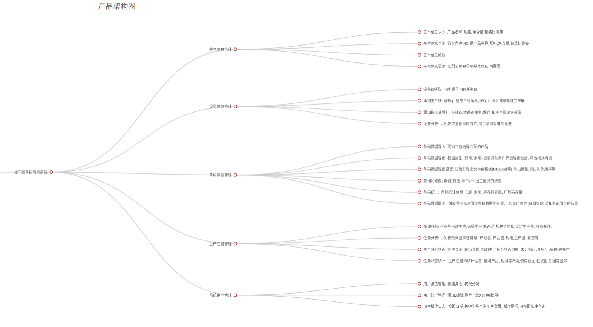

# 生产线条码管理系统

## 系统架构

本系统使用Python语言开发.使用MongoDB数据库.软件架构为BS模式.客户端理论上支持所有支持W3C标准的浏览器.但出于兼容性起见.推荐使用Chrome,Firefox浏览器. 服务器端工作环境为Ubuntu 16.04 Desktop或者Ubuntu 18.04 Desktop, 服务器端有桌面环境,会安装好Chrome和Firefox.可以直接作为客户端使用.

**系统架构示意图**如下图所示.



## 后台设计

管理页面共分为:

* 基本信息管理
* 设备信息管理
* 条码数据管理
* 生产任务管理
* 系统用户管理

5大部分,在导航栏处于一级导航. 每个部分的子功能.按照业务逻辑和功能聚合的原则.作为二级导航项面分别处于各个一级导航项之下.

### 基本信息管理 (一级导航)

基本信息管理模块的首页是基本信息列表页. 

#### 基本信息列表页 (二级导航)

* 列表页的上部是搜索栏,可以**按照条件查找**(产品的)基本信息. 查找时可选的条件包括: 产品id(显示最近的下拉菜单,可填写), 产品名称显示最近的下拉菜单,可填写), 规格(下拉可选), 净含量(下拉可选), 包装比例(下拉可选)等
* **列表**页的中间是一个表格.每一列显示一个产品的基本信息.列内容包括: 产品id, 产品名称, 产品规格, 净含量, 包装比例(40:1, 30:1, 20:1, 10:1).
* 点击产品表格的列名可以按照列**排序**(包含正序和倒序).
* 页面上有一醒目的**添加**按钮,用于添加产品的基本信息.可添加的内容包括:包括: 产品id, 产品名称, 产品规格, 净含量, 包装比例(40:1, 30:1, 20:1, 10:1). 记录会自动记录添加产品的操作者的账户和添加时间.
* 点击产品表格的**修改**按钮.页面会弹出修改该产品基本信息的窗口.可修改内容包括:包括: 产品id, 产品名称, 产品规格, 净含量, 包装比例(40:1, 30:1, 20:1, 10:1). 修改完毕后,点击保存按钮即可.系统记录会自动记录修改产品的操作者的账户和修改时间.
* 点击产品表格的**删除**按钮.页面会弹出确认删除修改的页面.要求用户确认删除操作.用户可以选择确认删除或者放弃操作.系统记录会自动记录删除产品的操作者的账户和删除时间.
* 由于一页可以显示的产品基本信息的条目数有限(10-30条),所以在页面底部留有翻页按钮.当一页不足以显示全部的产品基本信息的时候,可以利用翻页键进行翻页浏览.


### 设备信息管理 (一级导航)

设备信息管理模块的首页是设备信息拓扑图

#### 设备信息拓扑图 (二级导航)

设备信息拓扑图页面(以下会简称:"拓扑页")会以图示的方式显示在页面中.


拓扑页显示的当前局域网内的生产设备的拓扑图.如果某个设备出现网络故障会以颜色**标注故障设备**,提醒工作人员进行检查.

#### 设备列表页面 (二级导航)

设备列表页面是以列表的形式显示设备.分为"生产线"和"嵌入式"设备两种. 分别有不同的设备属性:
  
  * 生产线设备: 生产线id,生产线名称, 生产线IP地址, 生产线备注. 关联的嵌入式设备IP.
  * 嵌入式设备: 设备id,设备名称, 设备IP地址, 设备备注. 关联的生产线设备IP.

设备列表页面有**添加**按钮.可一选择是添加生产线还是嵌入式设备.添加的时候,可以从IP地址的下拉框选择对应的IP(系统会定时查询网络内部的活动IP),填写设备名称名称,备注.选择关联的设备.
设备列表页每一列都对应一个(生产线/嵌入式)设备.可以对他们进行**编辑**和**删除**操作.


### 条码数据管理 (一级导航)

条码数据管理模块的首页是条码统计页面

#### 条码统计页 (二级导航)

条码数据的统计页面会显示条码数据的统计信息包括:

* 总条码数目, 已印刷条码数目, 未印刷条码数目.已使用(比对完毕)的条码数目.
* 如果某个条码数目低于预警值,会以醒目的颜色标识(预警值可以预设,调整)


#### 条码数据导入页 (二级导航)

条码数据导入页面是管理平台获取条码数据的入口, 平台由此页面补充新的条码数据信息.

* 用户可以在此页面**选择需要导入的文件**.系统会根据文件的后缀名来判断文件的格式.并根据管理平台预置的文件格式(可定制)进行解析. 解析出来的结果会页面上显示内容和一些统计信息,比如共计多少个条码信息,其中多少个无效信息(需提供判断有效性的标准).
* 在正确识别了需要导入的条码数据以后,用户可以**选择产品信息**来进行匹配.在选择产品信息的时候,提供层级的方式来进行选择: $$\text{产品名称}\Rightarrow\text{产品规格}\Rightarrow\text{净含量}\Rightarrow\text{包装比例}$$ 层层联动.每层作为下一层显示的选择项的前提筛选条件以保证选择的正确性.

#### 条码数据导出页 (二级导航)

条码数据导出页面是从管理平台道出条码数据的出口, 这里导出的数据会被打印出来,通过设备粘贴在产品上.

* 导出数据可以看作是导入的逆过程.首先需要**选择导出的产品信息**.在这里和导入数据时选择产品信息一样:层层联动.每层作为下一层显示的选择项的前提筛选条件以保证选择的正确性.

* 在选择好导出的条码数据的产品信息后,我们还需要**设定**本次**导出的条码数量**.在设定数量时,系统会检测输入的数值是都超过库存的条码数量并给出响应的提示.最后.在导出条码数据成功完成后.系统会更新库存的条码数量.并记录下本次操作的账户,时间,等导出操作的信息.
  
* 在导出数据的时候, 用户可以**选择不同的导出格式**(text, xml, xls等), 这些导出格式已预置在系统中.用户也可以按照自己的需求定制导出格式.

#### 条码查询页面 (二级导航)

条码查询页面负责查询单个条码的状态信息.你可以在这里:

* 页面的上部有一个搜索框, 输入条码信息(支持扫描枪和键盘输入)就可以**查询条码**是否有效? 是否已使用?等. 你也可以只输入部分信息进行模糊匹配.
* **查询**的**结果**会**列表显示**在页面的中部, 如果是多条查询结果.会以列表的形式显示.如果查询的结果一页显示不下.页面的底部会有供翻页浏览的页码.对于查询出来的结果,用户可以进行替换, 编辑, 重置状态操作.
* 点击对应的**条码信息**行后部的**替换**按钮.会弹出一个输入信息框.用户可以输入一条条码信息对当前信息进行替换.在替换之前.系统会检查输入的条码系统是否已存在?如果不存在.操作允许.否则提示数据已存在.拒绝操作.
* 点击对应的**条码信息**行后部的**编辑**按钮.页面上会弹出条码信息的编辑框.用户可以在此进行信息编辑.同样,编辑的时候如果仅仅修改条码信息的使用状态,就等同于进行了**重置条码**的状态操作.这会把已使用的条码重置为未使用状态.同理,如果把条码至于无效的状态.这也等同于**删除条码**的操作. 
* 注意,如果你进行编辑的不是一级条码信息,这很可能会涉及一批条码状态的变更(比如你在对箱码的信息进行编辑).这种对高级条码信息的操作.系统会在操作时弹出警示信息.告知操作可能会影响的条码范围.
* 如果用户重置/删除/替换的是高级条码,那会引起批量的操作:
  >1. 如果用户重置或者删除一个高级条码信息.那么这个高级条码下面的所有条码信息都将被重置(弹出警示窗口确认).
  >2. 如果用户替换一个高级条码信息.那么这个高级条码下面的所有条码相关信息都将被更新(弹出警示窗口确认).

#### 数据同步页面 (二级导航)

数据同步页面本质上只是数据同步历史的列表页. 因为数据同步的工作实际上是由嵌入式设备向服务器端推送的. 

* 同步页面的上部有查询栏,可以按照条件**查询同步历史**,可以用来查询的条件包括: 时间区间, 同步状态/结果. 嵌入式设备名称/id, 生产线名/id.
* 同步页面的中部是列表显示区域.以列表的形式展示数据同步的信息. 会**显示同步任务**的一些信息:包含: 生产线名/id,嵌入式设备名称/id, 消耗条码数量. 同步状态/结果. 同步日期等. 列表以同步日期倒序排列,最近的同步历史在最上面显示.
* 页面底部是页码区域, 当同步历史一页显示不完的时候,额可以使用**翻页**键浏览.
* 数据进行同步的时候,会检查当前的生产任务是否存在.如果不存在会提醒操作者注意此问题.


### 生产任务管理 (一级导航)

生产任务管理用于新建,下发,编辑生产任务. 生产任务管理模块的首页是生产任务列表页面

#### 任务列表页 (二级导航)

任务列表页以列表的形式展示所有生产任务. 提供列表显示, 条件查询, 信息编辑, 状态调整等操作.

* 页面上部的搜索栏提供**条件搜索**功能: 用户可供筛选的条件包含: 产品名称, 规格, 净含量, 包装比例, 生产线. 生产批号, 下发时间区间. 搜索的结果会在页面中部的列表区域显示.
* 添加按钮在搜索栏的下面.点击会弹出**添加生产任务**的窗口.可供选填的内容如下: (任务名称自动生成), 选择产线名(下拉选择), 产品名称(下拉选择), 产品规格(联动下拉选择),净含量(联动下拉选择), 包装比例(联动下拉选择), 生产批号(输入), 生产数量(输入,仅数字).点击保存即可.
* 添加的生产任务都处于"停止"状态.如果要运行当前任务.只需要点击**下发**按钮即可.同时生产任务的状态变成"已下发". 已下发的任务,会在每次同步条码数据的同时,更新自己的"已生产数量"信息.
* 在当日的生产完成后,如果生产任务(数量)已经完成或者其他情况需要终/止任务的,请点击任务后面的**停止**按钮让任务转换到停止状态. 已停止的状态可以再次启动.
* 所有任务都在页面中部以**列表形式显示**. 一行记录一个任务的信息. 可显示的字段有: 任务id, 任务名, 产品名, 产品规格,产品净含量,产品的包装比例, 任务的生产数量(已生产/总数量), 任务的下发时间, 任务的状态. 每个任务都可以独立的编辑信息和修改运行状态.

#### 任务统计页 (二级导航)

任务统计页面提供的功能主要是对历史任务的信息进行聚合计算.然后按照不同的分类条件进行统计.最后以图表的形式展示出来. 其主要的目的是让用户累计的生产任务有一个直观的认识. 可能提供的形式可能包括:

* 以产品名称进行分组,显示不同产品所占生产比例的饼图
* 以日期(月/年)分组.不同时间区间的生产数量的组装图.

用户可在一定范围自行选择聚合范围和分组方式.以生成不同的图表.


## 系统用户管理 (一级导航)

系统用户管理用于管理登录系统的账户,口令和权限.分为 角色管理和账户管理 2个子页面. 账户管理是首页

### 角色管理 (二级导航)

角色管理就是对用户的权限组进行管理.系统有2个默认权限组:

**系统管理员组**(root)

* 此权限组无法被删除和修改.
* 此权限组只能容纳一个成员.
* 此权限组的成员无法被禁用,删除,但可以修改信息.
* 此权限组的成员拥有系统最高权限
* 此权限组的成员可以把自己的部分/全部权限赋予其他权限组.

**来宾组**(guest)

* 此权限组无法被删除和修改.
* 此权限组是新增用户的默认权限组.
* 此权限组的成员只有读的权限,不能修改除自己个人资料外的任何数据.

管理员可以创建新的权限组.按照自己的组合赋予权限.

### 账户管理 (二级导航)

用户可以在此添加用户账户.设置登录口令和用户权限.


## 条码比对工作机制

## 开发过程需要的协助

**需要提供的数据**如下:

1. 导入数据的格式(提供几种常用的格式)
2. 导出数据的格式(提供几种常用的格式)

**嵌入式设备需要增加/确认的功能**如下:

* **http查询请求**: 通过http协议,以post方法向服务器发出比对条码的请求.并接收/解析服务器返回的json数据.
* **扫描枪支持**: 插上扫描枪查询条码的功能.


### http查询请求

*使用http的好处*

http是应用层协议,本身是基于tcp协议做的高度封装.基本上能满足绝大多数业务需求.而且因为是在tcp基础上做的扩展.本身还具备以下优点

* 几乎是**一种标准**. HTTP 几乎已经快成为一种通用的 Web 标准，Web Services、REST、Open API、OAuth 等等都是基于 HTTP 协议的。通用性好.
* **易扩展**: 应用层协议.开发便捷. 工作量很小.
* **能满足多种需求**: 无论是实时通讯,还是流媒体技术,都是开箱即用.

#### 实现目的

使用http协议的post或者get方法向服务器发送检查条码的请求,并接受返回结果.

#### 条码查询接口

* **协议**  http 2.0/1.01
* **url**  /validate_code
* **method** post/get
* **encoding**: utf-8
* **args**:  
  >* 字段名: sn,  类型: 字符串. 含义: 待查询的条码信息 
* **return**: 返回值为json格式的键值对. 
  >一般的返回状态是 {"message": "success"} 表示请求成功.
  >如果查询的结果不正确.message的值就是错误的消息.会返回类似 {"message":"条码已使用"}, {"message":"条码不合法"},{"message":"非本系统条码"}等错误信息.注意需要解码方可正常显示.

* **example**:

```python

# 一个发送请求的例子
import requests

client = requests.Session()        # 获取一个客户端
sn = "待查询条码内容的字符串"
data = {"sn": sn}                  # sn作为查询参数名,
host = "服务器地址:服务器端口"
u = host + "/validate_code"        # 服务器接受查询的接口地址.
resp = client.get(u, data=data)    # 用get的方式向服务器发送请求
status = resp.status_code          # 获取服务器的相应状态
if status == 200:
  """服务器正确响应"""
  result = resp.json()              # 获取返回内容并使用json解码
  message = result['message']       # 查询结果标志位.等于success就代表正确
  if message == "success":
    """查询成功,条码是有效的"""
    do something.....
  else:
    """查询失败"""
    process error.....             # 处理错误的函数
```

### 扫描枪支持

#### 实现目的

让嵌入式设备可以插入扫描枪并使用扫描枪查询单个条码状态.

要求:

1. 正确识别扫描枪
2. 提供一个在嵌入式设备上查询条码状态的功能.用户可以使用扫描枪输入条码.

#### 查询的接口

查询的方法和接口就是上文**条码查询接口**文中所述.