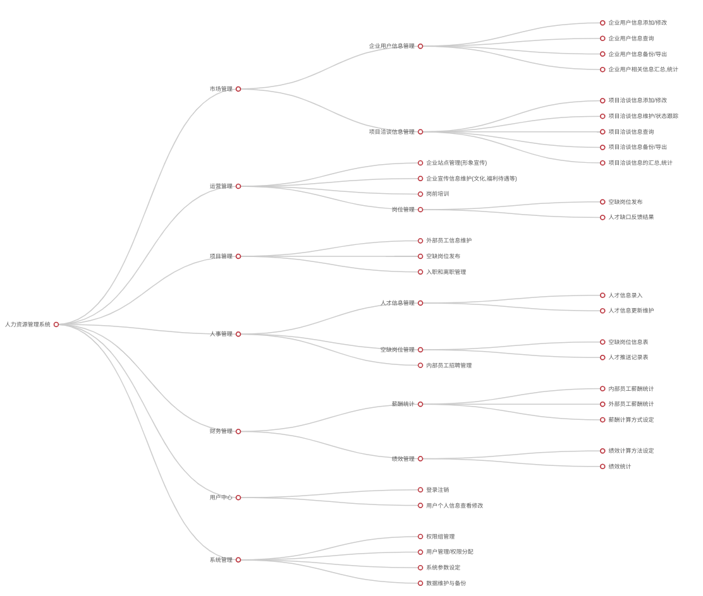

# 人力资源系统设计方案

## 设计目标

对公司人力资源实现有效的管理.

## 系统架构

本系统为BS模式,客户端无需部署,直接使用浏览器操作.与其他模块的通讯使用api接口进行,可以和其他平台/模块进行网络通讯.部署的服务器平台为Ubuntu.系统本身由Python编写,配合MongoDB4+数据库.开发团队经验丰富有自主知识产权的数据库持久化套件(ORM).客户端理论上支持所有支持W3C标准的浏览器.但出于兼容性起见.推荐使用Chrome,Firefox浏览器. 初期使用浏览器作为登录入口.但同时为将来增加 微信号, 小程序和App登录的方式留下接口.

**系统架构示意图**如下图所示.

## 模块说明

系统为方便功能上的扩展.采用了模块化的松耦合设计.同时使用在人工智能领域处于领导地位Python作为开发语言, 也保证了将来系统进行人工智能领域的功能扩展时可以和其他语言的模块无缝对接.

按照功能划分,系统主要分为以下几个模块

* 市场管理  *对应市场部人员*
* 运营管理  *对应运营部人员*
* 人事管理  *对应人事部人员*
* 财务管理  *对应财务部人员*
* 项目管理  *对应项目部人员*
* 系统管理  *对应系统管理员*
* 用户中心  *所有员工都可使用*

### 市场管理模块

市场管理模块面向的是市场部人员.主要提供以下功能:

* **企业客户信息**作为业务洽谈的对象.在此模块被**维护**(添加/修改).
* **管理业务洽谈**.业务洽谈的信息会被记录,包含: 浅谈的对象企业,我方人市场人员, 浅谈的主要内容,相关岗位信息(岗位要求,缺口人数),客户意向度, 跟进阶段, 目前状态, 下一步跟进计划等. 这些业务洽谈的信息和状态可以被市场部人员和领导随时查看. 根据洽谈的进度和状态,随时调整洽谈策略.
* **统计信息** 以列表, 线图,柱装图,饼图等作为工具.直观的表示用户最近一段时间的业务洽谈的汇总情况.协助用户对过往的业绩进行分析.同时.市场部的领导可以在这里横向和纵向的使用这些工具对过往业绩进行分析,及时发现问题,进行干预或者调整.

洽谈成功项目的转入项目部,由项目部负责推动项目.
洽谈失败的项目存档备案.用作案例和数据分析的资料.

### 运营管理模块

运营管理模块是面向运营部人员的, 目前功能为**暂定的功能**.

* **企业形象站点维护** 相关企业彩页文化、相关企业地址、相关企业岗位要求、相关企业员工福利、相关企业员工福利待遇、相关企业员工培训制度
* **发布岗位信息** 项目空缺的岗位信息发布.注意.项目部也有同样的发布空缺岗位信息的功能

### 项目管理模块

项目管理模块面向的是项目部人员,主要提供以下功能:

* **管理外部员工信息**  项目员工的信息的查询和修改. 星级评定. 项目负责人只可以查看自己本项目的员工和面试人员的个人信息.项目部长可以查看全部项目的员工信息.
* **发布空缺岗位信息** 项目负责人可以在此发布自己负责的项目的空缺岗位,空缺岗位的信息会提交到人事部门.同时人事部门反馈回来的推荐人员信息也会出现在空缺岗位信息下面的反馈区.项目负责人可以查看推荐人员的简历,确认邀请面试或者不邀请面试.不邀请时要选择/填写回绝的理由.
* **面试信息管理** 面试的结果,由项目负责人负责记录.同时系统自动更新面试人员的在职状态为面试成功.
* **入职人员管理** 面试合格的员工,由项目负责人安排岗位.并在记录新人的岗位相关信息(岗位名称, 入职日期等)
* **离职人员管理** 对于离职员工,由项目工作人员在此更新其工作状态,离职原因,离职垦谈记录等

### 人事管理模块

项目管理模块面向的是事部人员,主要提供以下功能:

* **员工信息管理** 人事专员在此对新进的员工信息进行查询,录入,修改. 新录入的员工信息,有3天的新员工保护期(或者说是此人事专员的优先安置权,可由系统管理员设定长短),保护期内,只有录入者对此新录入的员工信息享有分配权. 新员工保护期过后,所有的人事专员都可以对此员工信息进行分配. 
* **空缺岗位管理** 所有的项目负责人/运营部提交的空缺岗位信息,都会在此页面列表显示.人事专员可以点击查看空缺岗位的详情.点击空缺岗位详情页的搜索按钮,系统以当前岗位的要求为条件进行模糊查询. 人事专员在查询结果时,看到合适的员工信息后,点击此员工信息后面的"推荐"按钮即可推荐给对应的项目负责人.
* **推荐员工管理** 推荐的员工并非都能顺利的参加面试,对于被回绝的推荐人员.人事专员可以在此查看被回绝的原因.对于顺利参加面试的员工.这里也会实时更新员工的面试结果.
* **面试信息管理** 面试的结果返回给人事专员.
* **内部人员招聘** 

在以往的案例记录中,很多的人力资源公司使用二维码来管理员工信息.员工的面试,入职和离职,仅扫描一下二维码就完成了人员信息的登记和事务的办理.不仅降低了出错概率,而且能大大提高效率.可以考虑采用一下.

### 财务管理模块

财务管理模块面向的是财务部人员,主要提供以下功能:

* **薪酬统计** 包括外部员工和内部员工的薪酬统计. 在设定计算方式和计算周期后,系统会自动计算出结果.
* **绩效统计** 内部员工的绩效统计,同上,绩效的计算也会由系统自动完成.
* **设定薪酬和绩效计算方式** 系统提供有限度的自定义功能.让用户能在一定程度上重新设定薪酬和绩效的计算方式.

### 系统管理模块

财务管理模块面向的是系统管理员,主要提供以下功能:

* **权限组管理** 系统采用的是基于权限组的权限管理,用户可以自定义多个权限组,每个权限组设定不同的权限.然后只要把用户加入此权限组.用户就具备了此权限组的所有权限.这种权限管理方式比较灵活.用户可以不受限制的自定义权限.
* **用户管理** 用户信息的增,删, 改,查.权限的赋予和收回.
* **数据管理** 数据的备份, 导入和导出.
* **日志管理** 管理员在此可以根据条件查询用户操作的日志.比如查询 xx月xx日,某用户登录后进行了那些操作等

### 用户中心

用户中心任何用户都可以登录.主要是查看个人相关的一些基本信息、岗位信息、员工评级等等

## 结束

以上为设计方案的草案.具体实施时:

* 如果甲方有自己的UI设计的话,我们会按照甲方的Ui设计来开发.
* 如果甲方没有自己的UI设计的话,我们会提供UI设计.在获得甲方认可后,按照UI设计进行开发.

