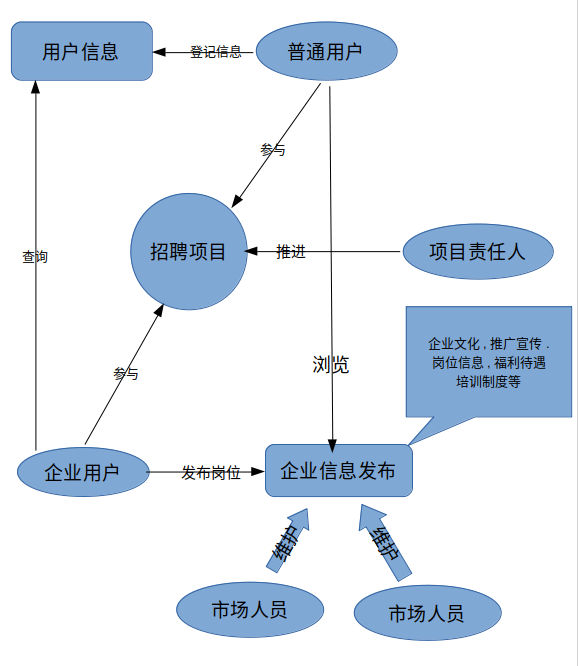

# 人力资源系统设计概要

## 设计目的

解决人力资源两侧供需问题.同时提供操作人员的权限和绩效管理功能.

## 设计方式

系统采用BS模式设计.登录方式可以考虑采用:

* 网页端
* 微信公众号
* 小程序
* 手机app

系统使用模块化松耦合设计.以保证最大的扩展灵活性.同时,使用松耦合设计降低了模块间依赖,增强系统的健壮性.

## 对象模型设计

系统中的数据模型主要包含以下4种

* 普通用户
* 企业用户
* 内部用户
* 招聘活动

除此之外,还需要一些辅助的对象模型来完成具体的功能.

### 普通用户

普通用户对应于<人力资源系统修改方案>中的员工版用户.是实际上的劳动力资源的供给方.普通用户具有以下行为和特征:

* 用作唯一性确认的普通用户id
* 可登录系统查看和维护自身的基本信息
* 系统对普通用户有一个综合性的**员工评级**,代表此员工的优秀程度.评级高的用户,会在同等的岗位和条件下获得优先的推荐.
* 可发布**求职信息**
* 可查看企业用户发布的**岗位信息**
* 有求职意愿属性.记录用户的是否有求职意愿,对职位有那些期望.
* 在职状态,表示用户是否处于被雇佣状态.并通过任职公司和**企业用户**建立关系
* 任职公司, 处于在职状态的普通用户才有此项属性.
* 处于求职状态的普通用户可参与**招聘活动**.
* 普通用户的任职状态的变更会有**任职状态表**记录.

### 企业用户

企业用户对应于<人力资源系统修改方案>中的企业版用户.是实际上的就业岗位的提供方.企业用户具有以下行为和特征:

* 用作唯一性确认的企业用户id
* 可发布**岗位信息**进行(委托)招聘
* 可查询普通用户信息. 并可以通过组合的条件进行筛选过滤.对于有意向的信息,可以添加到收藏夹或者提交到系统进行(委托)招聘
* 企业用户通过**招聘活动**和普通用户,内部用户建立关系

### 内部用户

内部用户对应于<人力资源系统修改方案>中的内部版用户.是本人力资源系统的操作者.内部用户分为多种角色:

* 项目相关人员 负责项目工作的实际推进工作.
  
  > 1. 项目的实际负责人,每个项目都对应一个项目负责人.一个项目负责人可能负责多个项目.项目负责人只对自己所管理的项目有操作的权限.
  > 2. 项目部长. 是项目推进活动的管理者.拥有项目相关的最高管理权.可以查看所有的项目信息.

* 人事相关人员 负责人力资源信息的相关工作

  > 1. 人事专员 负责人力资源信息的录入和维护工作.
  > 2. 人事部长 人事部门的管理者.

* 财务 内外部用户的薪酬和绩效计算,统计方面的工作

* 人事相关人员 负责人力资源信息的相关工作
* 市场和运营人员  企业的推广和宣传,岗位的发布.
* 行政方面管理人员
* 系统管理员

系统管理员的特殊权限

* 按照用户角色的不同,创建相应的权限组.使用权限组管理用户权限.可以在一定程度上灵活的定制权限.
* 访问系统的全部数据,必要的时候,对数据进行维护, 备份等工作.

### 招聘活动

招聘活动为人力资源供需的实际解决者.普通用户借此找到心仪的工作.企业用户则因此寻找到满意的员工. 项目负责人为招聘活动的实际负责人.招聘活动可以安排多次面试. 每次面试的时间,地点,应聘人员,招聘企业, 岗位信息, 和面试结果系统都会记录下来. 面试和招聘活动的状态和结果都可以分门别类的进行统计.以图表的形式进行呈现.必要时,可以导出存档.

## 开发模式

可以考虑分阶段开发模式.从功能上来讲, 系统可以粗略的划分为2大部分

* 业务部分  负责实现公司的业务流程
* 绩效部分  负责对公司内部员工进行绩效统计

2个部分虽然不是形式上的分离,但每个部分都是独立可运行的. 在数据上实现共享. 先从业务着手,让业务部分实现完整的业务流.将来即使业务的流程发生变化.对系统的修改只会在业务部分中进行.同理.对于绩效部分的修改也不会影响到业务部分.

### 开发模型

本次开发工作采用原型模式开发.从甲方需求出发.详细了解业务参与各方的特性特点,所参与的业务活动. 并据此建立详细的业务模型,并据此模型开发一个具备基本功能的简易系统给甲方试用. 在甲方试用的基础上.乙方不断听取甲方提出的改进意见,对系统进行修改,直至达到甲方需求.

## 结束语

本文档只是对<人力资源系统修改方案.docx>和<人力资源管理.xlsx>的粗略的理解上进行概要性的设计. 理解不当之处在所难免.还望指教.待我修正文档中的缪误之后. 会在此基础上给出一个详细的设计方案.届时还希望多多指教.