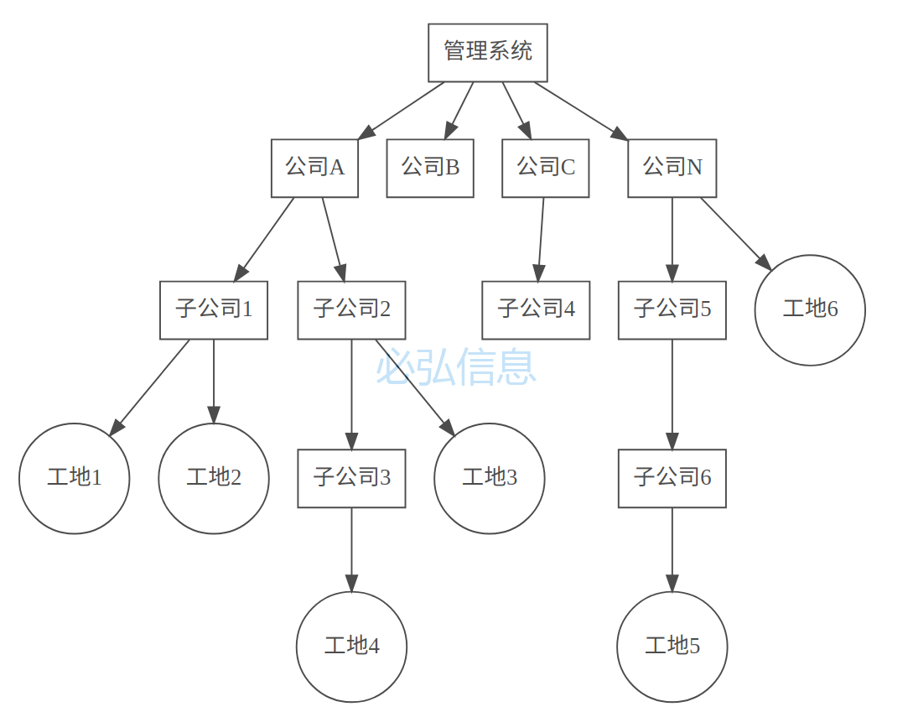
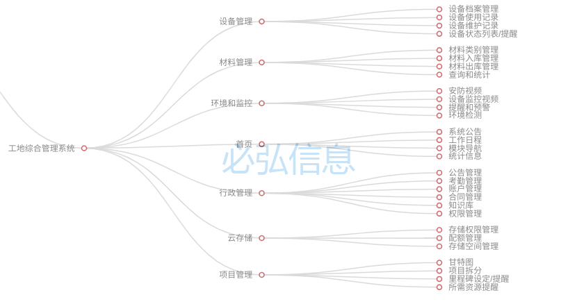
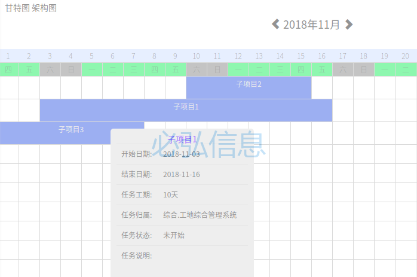

# 工地管理系统概要设计

## 描述

一个对工地进行 人员, 设备, 数据, 材料等各种资源进行综合管理的在线系统

## 设计要求

* 在线平台.支持网页, APP登录
* 用户使用账户登录.不同的账户可以指派不同的访问和操作权限.
* 可对人员,设备,材料,安防等数据进行管理
* 预留接口进行数据共享或数据接入.

## 概要设计

### 用户模型设计

系统管理员负责开设公司账户, 每个公司只有一个公司账户.

1. 公司账户可以创建工地.公司创建工地的数量没有限制
2. 公司账户可以创建子公司. 子公司的数量没有限制. 
3. 子公司可以创建工地.子公司创建工地的数量没有限制
4. 子公司同样可以创建下级子公司.下级子公司拥有和子公司一样的权限.
5. 子公司的创建是可递归的

### 系统模块设计

系统架构图

系统使用松耦合设计模式, 模块之间尽量使用消息机制进行通讯. 这种设计在系统升级或者增加功能模块的时候几乎不会对原有系统造成影响. 系统扩展简单. 故障会被限制在模块内部, 系统稳定性高.
用户可以使用网页或者APP登录系统. 
用户端的系统界面主要分6大部分

* 首页  
* 设备管理  施工现场所用到的塔机、龙门吊、施工电梯等各种设备的管理模块
* 材料管理  施工所用到的各种材料的管理模块
* 环境和监控  摄像头, 电子围栏, 烟感, 气体感应, 环境监测的传感器等的管理界面
* 行政管理  员工,部门, 考勤等行政事务的管理
* 云存储   云盘模块,保存数据.共享数据

#### 行政管理

* 管理员工信息  录入,修改, 删除员工信息
* 排班管理  安排员工的排排版. 排版信息变动会把消息推送到相关员工的APP端.员工可以在APP查看自己的排版安排.
* 考勤管理  系统利用排班信息结合考勤设备(卡式, 指纹式, 人脸识别式等) 自动进行考勤统计. 缺勤事件会给出提示并推送到员工的APP上
* 公告管理  发布和修改公告. 公告信息会同步显示在管理平台首页的系统公告栏目.同时公告信息会推送到员工APP上
* 合同管理 与工地项目有关的往来合同(电子版)的存档, 会建立索引,可以根据关键词查找相关合同.
* 知识库 记录了和项目有关的技术文档. 知识库在公司内部共享.
* 权限管理  管理本工地的员工对系统的访问权限(不同的职务/权限组对应不同的访问权限)

#### 设备管理

* 设备档案  详细记录了施工所用的设备(塔机、龙门吊等)的相关档案.(采购时间, 关联采购合同, 使用状态. 维护历史等).可以使用关键词查询指定的设备档案
* 使用记录  记录设备的使用情况. 可以使用关键词查询指定的设备使用记录.
* 维护记录  记录设备的维护情况. 可以使用关键词查询指定的设备维护记录.
* 设备列表  设备如果有关联的监控摄像机, 点击对应的设备打开响应的监控画面.设备如果超出使用寿命或者处于维护等不适合使用的状态时,会给出提醒.

#### 材料管理

* 类别管理  
* 入库管理  材料的入库记录记录,可使用材料名称, 采购人员, 出库日期等条件查询
* 出库管理  材料的出库记录记录,可使用材料名称, 领用人员, 出库日期等条件查询

#### 环境和监控

* 三维地图  以电子三维地图的形式,在页面上显示安防摄像机和环境传感器的位置.可以推拉缩放. 选择感兴趣的摄像头查看画面
* 安防视频 所有的安防摄像机的画面以九宫格的形式排列.
* 监控设备列表   以列表形式显示安防摄像头和环境传感器的工作状态.监控到故障或者危险状态时会发出警告. 
* 警告管理  这里是管理系统发现故障或者危险状态时如何发出警告的页面. 不同的级别警告会有不同的处置策略和处置方式. 警告的消息也会推送到相关责任员工的APP上

### 云存储

用于保存/分享数据

### 项目管理

一个项目会被拆分成很多小的子项目.每个子项目都有自己完成的认定标准.对于关键的子项目,可以设立里程碑用于标识项目的整体进度.

* 甘特图 这里会把子项目以甘特图的形式展示出来. 鼠标指在子项目上会显示子项目的简要信息. 包括责任人工期等.如果个子项目所需的资源不足.会给予颜色标识提醒.
* 项目的拆分, 子项目信息的输入 包括工期, 责任人, 先决条件, 所需材料等.

